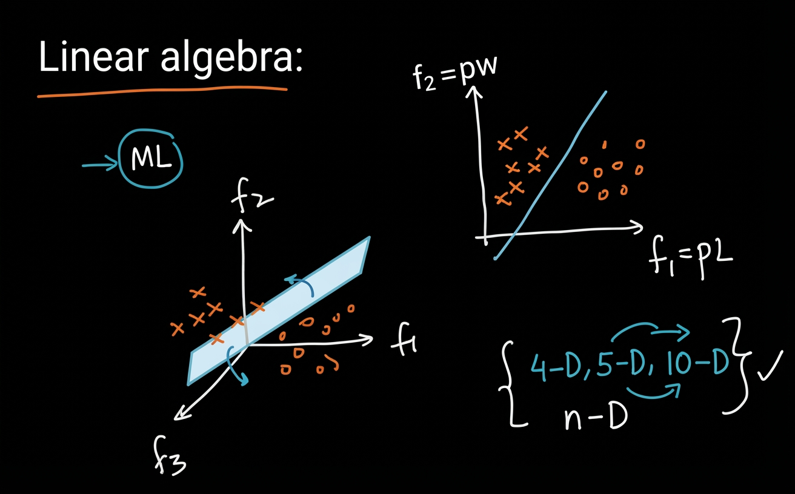
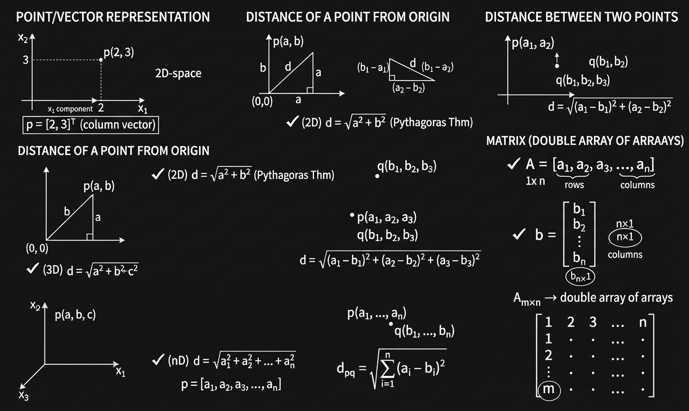
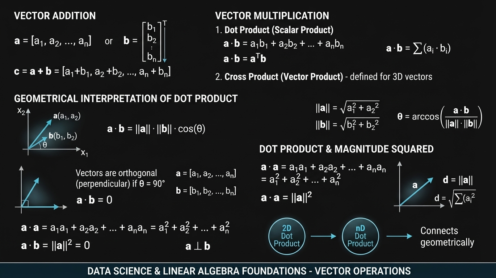
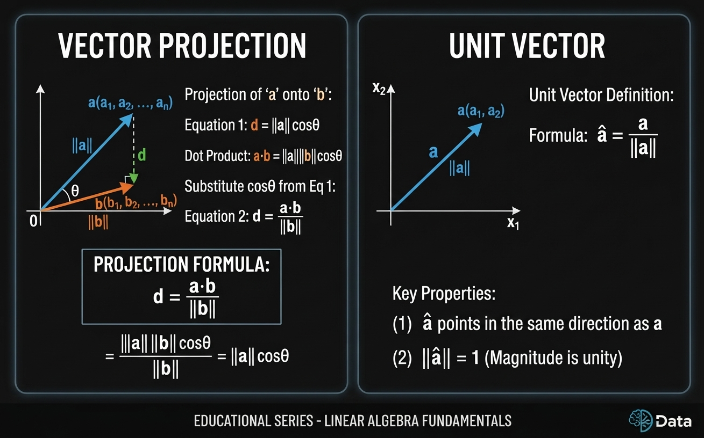
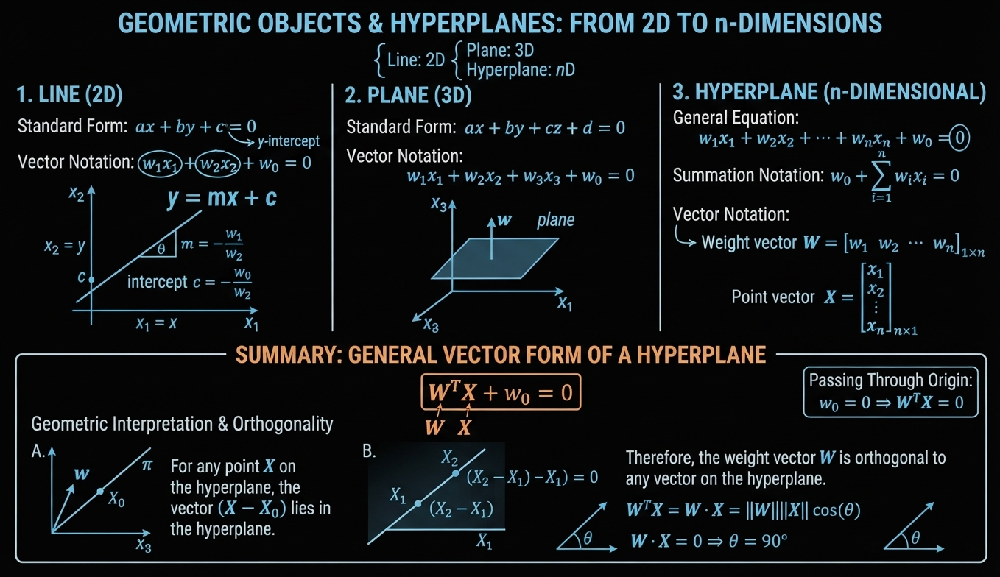
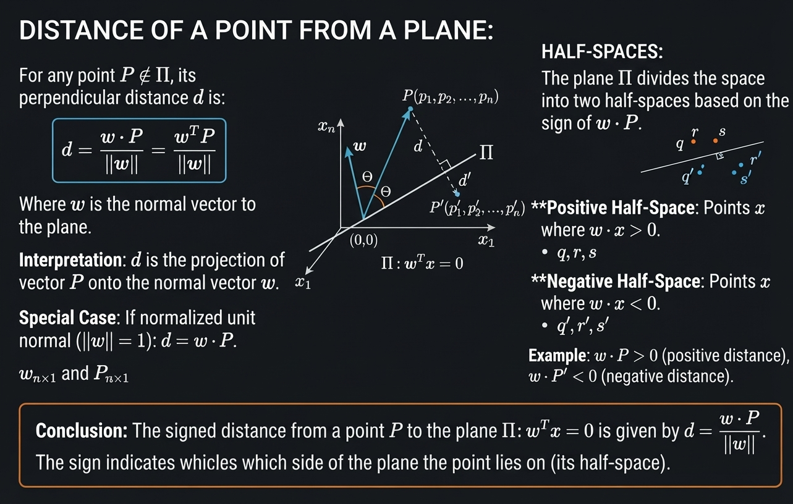
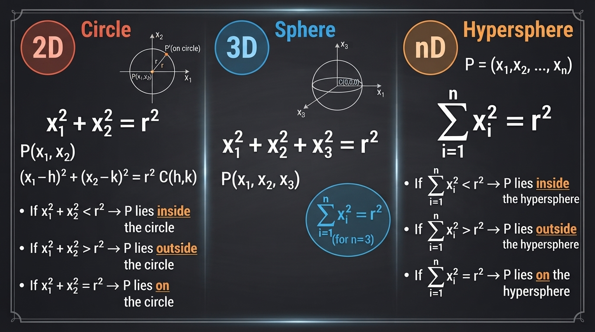
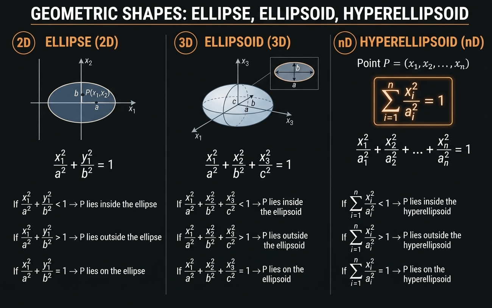
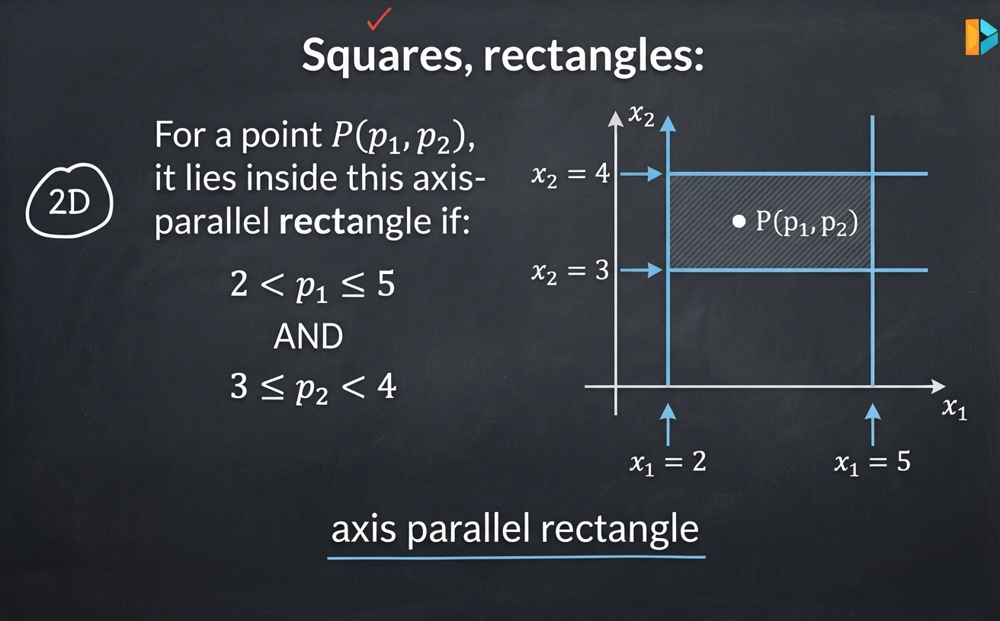
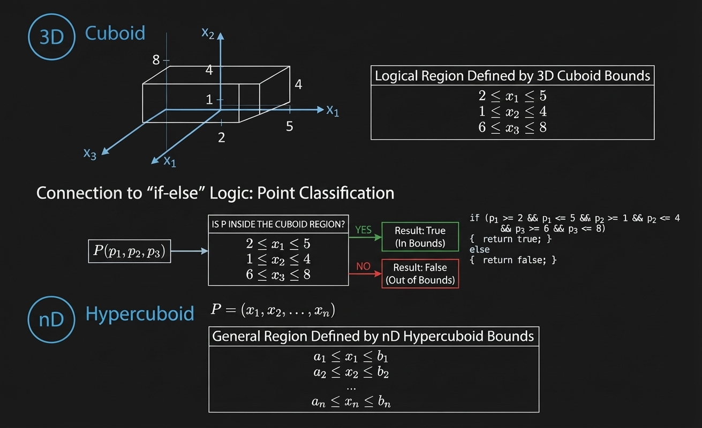

<style>
@import url('https://fonts.googleapis.com/css2?family=Play:wght@400;700&display=swap');
@import url('https://cdnjs.cloudflare.com/ajax/libs/latin-modern/1.1.0/css/latinmodern-math.min.css');

:root {
      --la-ink: #3f6386; 
      --la-teal: #3f6386;
      --la-teal-soft: #e8f6f7;
      --la-coral: #9333ea;
      --la-coral-soft: #fff1ed;
      --la-amber: #9a6b16;
      --la-amber-soft: #fff8e6;
      --la-line: #5b5c5c;
      --la-surface: #f7faf9;
      --la-text: #c9c9c9;
}

*,
*::before,
*::after {
      font-family: 'Play', sans-serif !important;
}

body,
.markdown-body,
p,
li {
      color: var(--la-text) !important;
}

h1 {
      color: var(--la-ink);
      border-bottom: 4px solid var(--la-teal);
      padding-bottom: 0.35em;
}

h2 {
      color: var(--la-teal);
      border-left: 6px solid var(--la-teal);
      padding-left: 0.55em;
      margin-top: 2em;
}

h3 {
      color: var(--la-coral);
}

.relationship-item {
      background: #00070e;
      border-left: 5px solid var(--la-teal);
      border-radius: 5px;
      color: var(--la-ink);
      margin: 0.65em 0;
      padding: 0.55em 0.85em;
}

.relationship-item strong {
      color: var(--la-coral);
      margin-right: 0.35em;
}

.revision-question {
      color: #c0392b;
}

blockquote {
      background: var(--la-amber-soft);
      border-left: 5px solid var(--la-teal) !important;
      color: var(--la-ink);
      padding: 0.75em 1em;
}

table {
      border: 1px solid var(--la-line);
      border-radius: 8px;
      overflow: hidden;
}

th {
      background: #00070e;
      color: #9e9d9d;
}

td {
      /* background: 3f6386; */
      color: #6080a0;
}

tr:nth-child(even) {
      background: var(--la-surface);
}

hr {
      border: 0;
      border-top: 2px solid var(--la-line);
      margin: 2.2em 0;
}

/* Keep displayed equations visually distinct without competing with the text. */
.katex-display,
.math,
.math-block {
      background: #00070e;
      border-left: 6px solid #2f005c;
      border-radius: 6px;
      padding: 0.6em 0.8em;
      overflow-x: auto;
      color: #c9c9c9 !important;
      font-family: 'Latin Modern Math', 'Cambria Math', 'STIX Two Math', serif !important;
}

.katex,
.katex * {
      color: #9b9a9a !important;
      font-family: 'Latin Modern Math', 'Cambria Math', 'STIX Two Math', serif !important;
}
</style>

# Linear Algebra

## Table of Contents

[01. Why Learn It](#01-why-learn-it)

[02. Introduction to Vectors (2-D, 3-D, n-D), Row Vector and Column Vector](#02-introduction-to-vectors-2-d-3-d-n-d-row-vector-and-column-vector)

[03. Dot Product and Angle Between 2 Vectors](#03-dot-product-and-angle-between-2-vectors)

[04. Projection and Unit Vector](#04-projection-and-unit-vector)

[05. Equation of a Line (2-D), Plane (3-D) and Hyperplane (n-D), Plane Passing](#05-equation-of-a-line-2-d-plane-3-d-and-hyperplane-n-d-plane-passing)

[06. Distance of a Point from a Plane/Hyperplane, Half-Spaces](#06-distance-of-a-point-from-a-planehyperplane-half-spaces)

[07. Equation of a Circle (2-D), Sphere (3-D) and Hypersphere (n-D)](#07-equation-of-a-circle-2-d-sphere-3-d-and-hypersphere-n-d)

[08. Equation of an Ellipse (2-D), Ellipsoid (3-D) and Hyperellipsoid (n-D)](#08-equation-of-an-ellipse-2-d-ellipsoid-3-d-and-hyperellipsoid-n-d)

[09. Square, Rectangle](#09-square-rectangle)

[10 - Hyper Cube, Hyper Cuboid](#10-hyper-cube-hyper-cuboid)

## 01. Why Learn It



### Overview

Linear Algebra is a foundational tool in Machine Learning.  
Most ML problems can be viewed geometrically in a **feature space**.

### Feature Space View

#### 2-Dimensional Feature Space

- Features:  
  - $ f_1 = $ length (pl)  
  - $ f_2 = $ width (pw)

- Data points of two classes:  
  - Class 1 → $\times$  
  - Class 0 → $\circ$

A **linear decision boundary** (a line) separates the two classes.

#### 3-Dimensional Feature Space

When we have three features ($f_1, f_2, f_3$), the decision boundary becomes a **plane**.

### Higher Dimensions

The same idea extends to any number of dimensions:

| Dimension | Decision Boundary |
|-----------|-------------------|
| 2-D       | Line              |
| 3-D       | Plane             |
| 4-D, 5-D, 10-D, … n-D | Hyperplane |

In general, for an $n$-dimensional feature space, a linear classifier learns an **$(n-1)$-dimensional hyperplane**.

### Key Takeaway

> Linear Algebra gives us the language to describe:
> - Points (data vectors)
> - Lines / Planes / Hyperplanes (decision boundaries)
> - Distances, projections, angles, etc.

This geometric view is extremely useful for understanding many ML algorithms (Linear Regression, Logistic Regression, SVMs, PCA, etc.).

## 02. Introduction to Vectors (2-D, 3-D, n-D), Row Vector and Column Vector



**(2-D, 3-D, n-D), Row Vector & Column Vector**

#### 1. Point / Vector
- **2D**: $ p = [2, 3] $
- **3D**: $ q = [2, 3, 5] $
- **nD**: $ x = [2, 3, 4, 1, 5, \dots] $

#### 2. Distance from Origin
- **2D**: $ d = \sqrt{a^2 + b^2} $
- **3D**: $ d = \sqrt{a^2 + b^2 + c^2} $
- **nD**: $ d = \sqrt{a_1^2 + a_2^2 + \dots + a_n^2} $

#### 3. Distance Between Two Points
- **General**: $ d_{pq} = \sqrt{\sum_{i=1}^{n} (a_i - b_i)^2} $

#### 4. Row Vector vs Column Vector
- **Row Vector**: $ A = [a_1, a_2, \dots, a_n] $ → shape $ 1 \times n $
- **Column Vector**: $ b = \begin{bmatrix} b_1 \\ b_2 \\ \vdots \\ b_n \end{bmatrix} $ → shape $ n \times 1 $
- **Matrix**: shape $ m \times n $

## 03. Dot Product and Angle Between 2 Vectors



## Vector Operations  
**Addition, Dot Product & Geometric Meaning**

### 1. Vector Addition

Given two vectors of the same dimension:

$$
\mathbf{a} = [a_1,\ a_2,\ \dots,\ a_n]
$$

$$
\mathbf{b} = [b_1,\ b_2,\ \dots,\ b_n]
$$

Their sum is:

$$
\mathbf{c} = \mathbf{a} + \mathbf{b} = [a_1 + b_1,\ a_2 + b_2,\ \dots,\ a_n + b_n]
$$

**Component-wise addition.**

### 2. Dot Product (Scalar Product)

#### Definition

$$
\mathbf{a} \cdot \mathbf{b} = a_1 b_1 + a_2 b_2 + \dots + a_n b_n = \sum_{i=1}^{n} a_i b_i
$$

In matrix notation:

$$
\mathbf{a} \cdot \mathbf{b} = \mathbf{a}^T \mathbf{b}
$$

where:
- $\mathbf{a}^T$ is a **row vector** ($1 \times n$)
- $\mathbf{b}$ is a **column vector** ($n \times 1$)

### 3. Geometric Interpretation of Dot Product

$$
\mathbf{a} \cdot \mathbf{b} = \|\mathbf{a}\| \|\mathbf{b}\| \cos\theta
$$

Where:
- $\|\mathbf{a}\|$ = length (norm) of $\mathbf{a}$
- $\|\mathbf{b}\|$ = length of $\mathbf{b}$
- $\theta$ = angle between $\mathbf{a}$ and $\mathbf{b}$

#### Length (Norm) of a Vector

$$
\|\mathbf{a}\| = \sqrt{a_1^2 + a_2^2 + \dots + a_n^2}
$$

(This is the same as the distance of the point from the origin.)

#### Finding the Angle

$$
\theta = \cos^{-1} \left( \frac{\mathbf{a} \cdot \mathbf{b}}{\|\mathbf{a}\| \|\mathbf{b}\|} \right)
$$

### 4. Special Case: Orthogonal Vectors

If two vectors are **perpendicular** (\(\theta = 90^\circ\)):

$$
\cos 90^\circ = 0 \quad \Rightarrow \quad \mathbf{a} \cdot \mathbf{b} = 0
$$

**Rule:**

$$
\mathbf{a} \cdot \mathbf{b} = 0 \quad \Longleftrightarrow \quad \mathbf{a} \perp \mathbf{b}
$$

This holds in any dimension (2D, 3D, … nD).

### 5. Dot Product of a Vector with Itself

$$
\mathbf{a} \cdot \mathbf{a} = a_1^2 + a_2^2 + \dots + a_n^2 = \|\mathbf{a}\|^2
$$

Therefore:

$$
\|\mathbf{a}\| = \sqrt{\mathbf{a} \cdot \mathbf{a}}
$$


### Summary Table

| Operation              | Formula                                      | Result Type |
|------------------------|----------------------------------------------|-------------|
| Addition               | $\mathbf{a} + \mathbf{b}$                  | Vector      |
| Dot Product            | $\sum a_i b_i = \|\mathbf{a}\|\|\mathbf{b}\|\cos\theta$ | Scalar |
| Norm (Length)          | $\|\mathbf{a}\| = \sqrt{\mathbf{a}\cdot\mathbf{a}}$ | Scalar |
| Angle between vectors  | $\theta = \cos^{-1}\left(\dfrac{\mathbf{a}\cdot\mathbf{b}}{\|\mathbf{a}\|\|\mathbf{b}\|}\right)$ | Angle |
| Orthogonality test     | $\mathbf{a}\cdot\mathbf{b} = 0$             | True/False  |

### Key Geometric Insights

- Dot product measures **how much two vectors point in the same direction**.
- Positive dot product → acute angle  
- Zero dot product → perpendicular  
- Negative dot product → obtuse angle  

These ideas work the same way in **2D, 3D, and n-D**.


## 04. Projection and Unit Vector



### 1. Projection of a Vector

**Projection of vector $\mathbf{a}$ onto vector $\mathbf{b}$** is the length of the shadow of $\mathbf{a}$ on the direction of $\mathbf{b}$.

#### Geometric Definition
$$
d = \|\mathbf{a}\| \cos\theta
$$

#### Using Dot Product
We know:
$$
\mathbf{a} \cdot \mathbf{b} = \|\mathbf{a}\| \|\mathbf{b}\| \cos\theta
$$

Therefore, the **scalar projection** of \(\mathbf{a}\) onto \(\mathbf{b}\) is:

$$
\text{proj}_{\mathbf{b}} \mathbf{a} = d = \dfrac{\mathbf{a} \cdot \mathbf{b}}{\|\mathbf{b}\|}
$$

Or equivalently:

$$
d = \dfrac{\mathbf{a} \cdot \mathbf{b}}{\|\mathbf{b}\|} = \|\mathbf{a}\| \cos\theta
$$

### 2. Unit Vector

A **unit vector** in the direction of \(\mathbf{a}\) is obtained by dividing the vector by its own length:

$$
\hat{\mathbf{a}} = \dfrac{\mathbf{a}}{\|\mathbf{a}\|}
$$

### Properties of Unit Vector

1. $\hat{\mathbf{a}}$ has the **same direction** as $\mathbf{a}$
2. $\|\hat{\mathbf{a}}\| = 1$ (its length is exactly 1)

```
        x₂
         ↑
         |     ↗ a (a₁, a₂)
         |   ↗  ||a||
         | ↗
         +--------→ x₁
        0
```

### Quick Summary

| Concept              | Formula                                      | Meaning                          |
|----------------------|----------------------------------------------|----------------------------------|
| Scalar Projection    | $\dfrac{\mathbf{a} \cdot \mathbf{b}}{\|\mathbf{b}\|}$ | Length of shadow of $\mathbf{a}$ on $\mathbf{b}$ |
| Unit Vector          | $\hat{\mathbf{a}} = \dfrac{\mathbf{a}}{\|\mathbf{a}\|}$ | Vector of length 1 in direction of $\mathbf{a}$ |

## 05. Equation of a Line (2-D), Plane (3-D) and Hyperplane (n-D), Plane Passing



### 1. Basic Idea

| Dimension | Geometric Object | Equation Form |
|-----------|------------------|---------------|
| 2D        | Line             | $ ax + by + c = 0 $ |
| 3D        | Plane            | $ ax + by + cz + d = 0 $ |
| nD        | Hyperplane       | $ w_0 + w_1 x_1 + \dots + w_n x_n = 0 $ |

### 2. Equation of a Line (2D)

**Slope-intercept form:**
$$
y = mx + c
$$

**General form:**
$$
ax + by + c = 0
$$

Can also be written as:
$$
w_1 x_1 + w_2 x_2 + w_0 = 0
$$

Solving for $ x_2 $:
$$
x_2 = -\frac{w_0}{w_2} - \frac{w_1}{w_2} x_1
$$

- Slope $ m = -\dfrac{w_1}{w_2} $
- Intercept $ c = -\dfrac{w_0}{w_2} $

### 3. Equation of a Plane (3D)

$$
ax + by + cz + d = 0
$$

or

$$
w_1 x_1 + w_2 x_2 + w_3 x_3 + w_0 = 0
$$

### 4. Hyperplane in n-Dimensions

**General equation:**
$$
w_0 + w_1 x_1 + w_2 x_2 + \dots + w_n x_n = 0
$$

**Compact forms:**

**Summation form:**
$$
w_0 + \sum_{i=1}^{n} w_i x_i = 0
$$

**Vector form:**
$$
w_0 + \mathbf{w}^T \mathbf{x} = 0
$$

where
$$
\mathbf{w} = \begin{bmatrix} w_1 \\ w_2 \\ \vdots \\ w_n \end{bmatrix}, \quad
\mathbf{x} = \begin{bmatrix} x_1 \\ x_2 \\ \vdots \\ x_n \end{bmatrix}
$$

### 5. Hyperplane Passing Through the Origin

When the hyperplane passes through the origin, the bias term is zero:

$$
\mathbf{w}^T \mathbf{x} = 0
$$

| Object       | Equation (through origin)      |
|--------------|--------------------------------|
| Line (2D)    | $ w_1 x_1 + w_2 x_2 = 0 $    |
| Plane (3D)   | $ w_1 x_1 + w_2 x_2 + w_3 x_3 = 0 $ |
| Hyperplane   | $ \mathbf{w}^T \mathbf{x} = 0 $ |

### 6. Geometric Meaning of $\mathbf{w}$

- $\mathbf{w}$ is the **normal vector** to the hyperplane $\pi$.
- For any point $\mathbf{x}$ lying on the hyperplane:
  $$
  \mathbf{w} \cdot \mathbf{x} = 0 \quad \Rightarrow \quad \mathbf{w} \perp \mathbf{x}
  $$

That is, the angle between $\mathbf{w}$ and any vector lying on the hyperplane is $ 90^\circ $.

**Unit normal vector:**
$$
\hat{\mathbf{w}} = \dfrac{\mathbf{w}}{\|\mathbf{w}\|}
$$

### Summary

- A **hyperplane** is the generalization of a line (2D) and a plane (3D) to higher dimensions.
- The most useful form in Machine Learning is:

$$
\boxed{w_0 + \mathbf{w}^T \mathbf{x} = 0}
$$

- When the hyperplane passes through the origin:

$$
\boxed{\mathbf{w}^T \mathbf{x} = 0}
$$

- $\mathbf{w}$ is always **perpendicular** to the hyperplane.

## 06. Distance of a Point from a Plane/Hyperplane, Half-Spaces



### 1. Distance of a Point from a Hyperplane

Consider a hyperplane passing through the origin:

$$
\mathbf{w}^T \mathbf{x} = 0
$$

For a point $\mathbf{p} = (p_1, p_2, \dots, p_n)$, the **signed distance** from the point to the hyperplane is:

$$
d = \dfrac{\mathbf{w}^T \mathbf{p}}{\|\mathbf{w}\|} = \dfrac{\mathbf{w} \cdot \mathbf{p}}{\|\mathbf{w}\|}
$$

#### Special Case (when $\mathbf{w}$ is a unit vector)

If $\|\mathbf{w}\| = 1$, then the formula simplifies to:

$$
d = \mathbf{w}^T \mathbf{p}
$$

### 2. Geometric Interpretation

- The vector $\mathbf{w}$ is **perpendicular** (normal) to the hyperplane $\pi$.
- The distance $d$ is the length of the perpendicular dropped from the point $\mathbf{p}$ onto the hyperplane.

```
              p
              •
              | d
              |
    ----------+----------  π  (hyperplane)
              ↑
              w (normal)
```

### 3. Signed Distance & Half-Spaces

The sign of the distance tells us **which side** of the hyperplane the point lies on:

| Distance | Meaning                        |
|----------|--------------------------------|
| $ d > 0 $ | Point lies on the same side as the direction of $\mathbf{w}$ |
| $ d < 0 $ | Point lies on the opposite side of $\mathbf{w}$ |
| $ d = 0 $ | Point lies **on** the hyperplane |

#### Example

$$
d = \dfrac{\mathbf{w} \cdot \mathbf{p}}{\|\mathbf{w}\|} = +ve
$$

$$
d' = \dfrac{\mathbf{w} \cdot \mathbf{p}'}{\|\mathbf{w}\|} = -ve
$$

- Points with **positive** signed distance → one half-space  
- Points with **negative** signed distance → the other half-space  

### 4. Half-Spaces

A hyperplane divides the entire space into **two half-spaces**:

- In **2D** → a line divides the plane into two half-planes  
- In **3D** → a plane divides the space into two half-spaces  
- In **nD** → a hyperplane divides $\mathbb{R}^n$ into two half-spaces  

### Summary

- **Distance formula**:
  $$
  d = \dfrac{\mathbf{w} \cdot \mathbf{p}}{\|\mathbf{w}\|}
  $$

- The **sign** of $d$ indicates which side of the hyperplane the point is on.
- This idea is extremely important in Machine Learning (e.g., SVM, Logistic Regression, Perceptron) for deciding class labels based on which side of the decision boundary a point lies.

## 07. Equation of a Circle (2-D), Sphere (3-D) and Hypersphere (n-D)



### 1. Circle (2D)

**Equation of a circle centered at the origin:**

$$
x^2 + y^2 = r^2
$$

or

$$
x_1^2 + x_2^2 = r^2
$$

**General circle** (center at $(h, k)$):

$$
(x - h)^2 + (y - k)^2 = r^2
$$

#### Position of a Point $ p(x_1, x_2) $

| Condition                  | Location of Point          |
|---------------------------|----------------------------|
| $ x_1^2 + x_2^2 < r^2 $ | Inside the circle          |
| $ x_1^2 + x_2^2 > r^2 $ | Outside the circle         |
| $ x_1^2 + x_2^2 = r^2 $ | On the circle              |

### 2. Sphere (3D)

**Equation of a sphere centered at the origin:**

$$
x_1^2 + x_2^2 + x_3^2 = r^2
$$

### 3. Hypersphere (n-D)

**Equation of a hypersphere centered at the origin:**

$$
x_1^2 + x_2^2 + \dots + x_n^2 = r^2
$$

or in summation form:

$$
\sum_{i=1}^{n} x_i^2 = r^2
$$

#### Position of a Point $ p = (x_1, x_2, \dots, x_n) $

| Condition                        | Location of Point              |
|----------------------------------|--------------------------------|
| $ \sum_{i=1}^{n} x_i^2 < r^2 $ | Inside the hypersphere         |
| $ \sum_{i=1}^{n} x_i^2 > r^2 $ | Outside the hypersphere        |
| $ \sum_{i=1}^{n} x_i^2 = r^2 $ | On the hypersphere             |

### Summary

| Dimension | Object       | Equation (centered at origin)      |
|-----------|--------------|------------------------------------|
| 2D        | Circle       | $ x_1^2 + x_2^2 = r^2 $          |
| 3D        | Sphere       | $ x_1^2 + x_2^2 + x_3^2 = r^2 $  |
| nD        | Hypersphere  | $ \sum_{i=1}^{n} x_i^2 = r^2 $   |

- The value of $ \sum x_i^2 $ compared to $ r^2 $ tells us whether a point lies **inside**, **outside**, or **on** the hypersphere.
- This idea is useful in Machine Learning (e.g., RBF kernels, anomaly detection, nearest neighbor methods, etc.).

## 08. Equation of an Ellipse (2-D), Ellipsoid (3-D) and Hyperellipsoid (n-D)



### 1. Ellipse (2D)

**Standard equation** (centered at origin, axes aligned with coordinate axes):

$$
\frac{x^2}{a^2} + \frac{y^2}{b^2} = 1
$$

or

$$
\frac{x_1^2}{a^2} + \frac{x_2^2}{b^2} = 1
$$

- $ a $ = semi-major / semi-minor axis along $ x_1 $
- $ b $ = semi-major / semi-minor axis along $ x_2 $

#### Position of a Point $ p(x_1, x_2) $

| Condition                              | Location of Point     |
|----------------------------------------|-----------------------|
| $ \dfrac{x_1^2}{a^2} + \dfrac{x_2^2}{b^2} < 1 $ | Inside the ellipse    |
| $ \dfrac{x_1^2}{a^2} + \dfrac{x_2^2}{b^2} > 1 $ | Outside the ellipse   |
| $ \dfrac{x_1^2}{a^2} + \dfrac{x_2^2}{b^2} = 1 $ | On the ellipse        |

### 2. Ellipsoid (3D)

**Standard equation** (centered at origin):

$$
\frac{x_1^2}{a^2} + \frac{x_2^2}{b^2} + \frac{x_3^2}{c^2} = 1
$$

- $ a, b, c $ are the semi-axes lengths along $ x_1, x_2, x_3 $ respectively.

### 3. Hyperellipsoid (n-D)

**General equation** (centered at origin, axes-aligned):

$$
\frac{x_1^2}{a_1^2} + \frac{x_2^2}{a_2^2} + \dots + \frac{x_n^2}{a_n^2} = 1
$$

#### Position of a Point

| Condition | Location |
|---------|----------|
| $ \sum_{i=1}^{n} \dfrac{x_i^2}{a_i^2} < 1 $ | Inside the hyperellipsoid |
| $ \sum_{i=1}^{n} \dfrac{x_i^2}{a_i^2} > 1 $ | Outside the hyperellipsoid |
| $ \sum_{i=1}^{n} \dfrac{x_i^2}{a_i^2} = 1 $ | On the hyperellipsoid |

### Summary

| Dimension | Object          | Equation (centered at origin) |
|-----------|-----------------|--------------------------------|
| 2D        | Ellipse         | $ \dfrac{x_1^2}{a^2} + \dfrac{x_2^2}{b^2} = 1 $ |
| 3D        | Ellipsoid       | $ \dfrac{x_1^2}{a^2} + \dfrac{x_2^2}{b^2} + \dfrac{x_3^2}{c^2} = 1 $ |
| nD        | Hyperellipsoid  | $ \sum_{i=1}^{n} \dfrac{x_i^2}{a_i^2} = 1 $ |

- When $ a = b $ (2D) or $ a = b = c $ (3D), the shape becomes a **circle** or **sphere**.
- Hyperellipsoids appear in Machine Learning in contexts such as Mahalanobis distance, Gaussian distributions, and certain kernel methods.

## 09. Square, Rectangle



### 1. Axis-Parallel Rectangle in 2D

An **axis-parallel rectangle** is defined by simple bounds on each coordinate.

#### Example

A rectangle defined by:

- $ 2 < x_1 < 5 $
- $ 3 < x_2 < 4 $

**Condition for a point $ p = (p_1, p_2) $ to lie inside the rectangle:**

$$
\begin{cases}
p_1 > 2 \quad \text{and} \quad p_1 < 5 \\
p_2 > 3 \quad \text{and} \quad p_2 < 4
\end{cases}
$$

Or written compactly:

$$
\text{if } (p_1 > 2 \land p_1 < 5) \land (p_2 > 3 \land p_2 < 4) \quad \Rightarrow \quad p \text{ lies inside the rectangle}
$$

### 2. Geometric View

```
x₂
      ↑
   4 |     ┌─────────────┐
       |     │                                        │
   3 |     └─────────────┘
       |         
       +----------------------------------→ x₁
            2           5
```

- The sides of the rectangle are parallel to the coordinate axes.
- Each side can be represented as a vertical or horizontal line (which is a special case of a linear equation $ w_0 + w_1 x_1 + w_2 x_2 = 0 $).

### 3. Representation using Linear Inequalities

Each boundary of the rectangle is a linear constraint:

| Boundary     | Equation          | Inequality side |
|--------------|-------------------|-----------------|
| Left side    | $ x_1 = 2 $     | $ x_1 > 2 $   |
| Right side   | $ x_1 = 5 $     | $ x_1 < 5 $   |
| Bottom side  | $ x_2 = 3 $     | $ x_2 > 3 $   |
| Top side     | $ x_2 = 4 $     | $ x_2 < 4 $   |

### Summary

- Axis-parallel rectangles (and squares) are defined by **independent range constraints** on each feature.
- Checking whether a point lies inside such a rectangle is very efficient (just a few comparisons).
- This idea is used in Machine Learning in:
  - Decision Trees / Decision Stumps
  - Range queries
  - Some forms of rule-based models
  - Axis-aligned bounding boxes

## 10. Hyper Cube, Hyper Cuboid



### 1. Cuboid (3D)

A **cuboid** (also called a rectangular box) is the 3-dimensional version of a rectangle.

It is defined by independent range constraints on each of the three coordinates.

**Example:**

$$
\begin{align*}
2 &< x_1 < 5 \\
1 &< x_2 < 4 \\
0 &< x_3 < 6
\end{align*}
$$

A point $ p = (p_1, p_2, p_3) $ lies **inside** the cuboid if it satisfies all three inequalities.

### 2. Hypercuboid (n-Dimensional)

A **hypercuboid** (also called a hyper-rectangle or axis-aligned bounding box) is the generalization of a rectangle/cuboid to $ n $ dimensions.

It is defined by a set of independent interval constraints:

$$
\begin{align*}
l_1 &< x_1 < u_1 \\
l_2 &< x_2 < u_2 \\
&\vdots \\
l_n &< x_n < u_n
\end{align*}
$$

where $ l_i $ and $ u_i $ are the lower and upper bounds for the $ i $-th dimension.

#### Checking Membership

To test whether a point lies inside a hypercuboid, we simply check whether **every** coordinate satisfies its corresponding range constraint (a series of `if-else` or logical AND conditions).

### Summary

| Dimension | Object       | Defined by                          |
|-----------|--------------|-------------------------------------|
| 2D        | Rectangle    | Two interval constraints            |
| 3D        | Cuboid       | Three interval constraints          |
| nD        | Hypercuboid  | $ n $ independent interval constraints |

- Hypercuboids are extremely common in Machine Learning and Data Science:
  - Decision Trees (axis-aligned splits)
  - Range search / filtering
  - Bounding boxes in computer vision
  - Feature scaling / normalization regions


# Linear Algebra

## Table of Contents

- [01. Why Learn Linear Algebra?](#01-why-learn-linear-algebra)
- [02. Scalars](#02-scalars)
- [03. Introduction to Vectors](#03-introduction-to-vectors)
  - [01. 2-D Vector](#01-2-d-vector)
  - [02. 3-D Vector](#02-3-d-vector)
  - [03. n-D Vector](#03-n-d-vector)
- [04. Row Vector and Column Vector](#04-row-vector-and-column-vector)
- [05. Vector Addition](#05-vector-addition)
- [06. Scalar Multiplication](#06-scalar-multiplication)
- [07. Magnitude / Norm of a Vector](#07-magnitude--norm-of-a-vector)
- [08. Dot Product](#08-dot-product)
- [09. Dot Product and Angle Between Two Vectors](#09-dot-product-and-angle-between-two-vectors)
- [10. Projection](#10-projection)
- [11. Unit Vector](#11-unit-vector)
- [12. Equation of a Line in 2-D](#12-equation-of-a-line-in-2-d)
- [13. Line in Standard Form](#13-line-in-standard-form)
- [14. Plane in 3-D](#14-plane-in-3-d)
- [15. Plane Passing Through the Origin](#15-plane-passing-through-the-origin)
- [16 Normal to a Plane](#16-normal-to-a-plane)
- [17. Hyperplane in n-D](#17-hyperplane-in-n-d)
- [18. Distance of a Point from a Plane / Hyperplane](#18-distance-of-a-point-from-a-plane--hyperplane)
- [19. Half-Spaces](#19-half-spaces)
- [20. Circle in 2-D](#20-circle-in-2-d)
- [21. Sphere in 3-D](#21-sphere-in-3-d)
- [22. Hypersphere in n-D](#22-hypersphere-in-n-d)
- [23. Circle / Sphere / Hypersphere](#23-circle--sphere--hypersphere)
- [24 Ellipse in 2-D](#24-ellipse-in-2-d)
- [25. Ellipsoid in 3-D](#25-ellipsoid-in-3-d)
- [26. Hyperellipsoid in n-D](#26-hyperellipsoid-in-n-d)
- [27. Circle vs Ellipse](#27-circle-vs-ellipse)
- [28. Square](#28-square)
- [29. Rectangle](#29-rectangle)
- [30. Hypercube](#30-hypercube)
- [31. Hypercuboid](#31-hypercuboid)
- [32. Important Geometric Relationships](#32-important-geometric-relationships)
- [33. Linear Algebra and Machine Learning](#33-linear-algebra-and-machine-learning)
- [34. Geometry of High-Dimensional Data](#34-geometry-of-high-dimensional-data)
- [35. Important Formula Summary](#35-important-formula-summary)
- [36 Revision Questions](#36-revision-questions)
- [37. Numerical Revision Questions](#37-numerical-revision-questions)
- [38. ML-Oriented Revision Questions](#38-ml-oriented-revision-questions)
- [39 Big Picture](#39-big-picture)

# Linear Algebra

> **A geometric and mathematical toolkit for Machine Learning**
>
> Linear algebra gives us a language for representing data, measuring relationships, and describing the spaces where ML models operate.

## At a Glance

| Idea       | Intuition                  | ML connection                               |
| ---------- | -------------------------- | ------------------------------------------- |
| **Scalar** | One number                 | A single value or parameter                 |
| **Vector** | An ordered list of values  | One observation or feature embedding        |
| **Matrix** | A table of values          | A dataset, transformation, or layer weights |
| **Tensor** | A higher-dimensional array | Images, batches, and deep-learning data     |

### The Core Progression

$$
\boxed{
\text{Scalar}
\rightarrow
\text{Vector}
\rightarrow
\text{Matrix}
\rightarrow
\text{Higher-Dimensional Space}
}
$$

### How to Read These Notes

1. **Build the objects:** scalars, vectors, matrices, and geometric shapes.
2. **Learn the operations:** norms, dot products, projections, and distances.
3. **Connect geometry to ML:** hyperplanes, decision boundaries, and feature spaces.
4. **Finish with practice:** formula summaries and revision questions.

> **Study tip:** For each formula, ask what it measures geometrically and where it appears in an ML model.

Linear Algebra is one of the fundamental mathematical foundations of **Machine Learning, Deep Learning, Computer Vision, Optimization, and Data Science**.

In Machine Learning, data is frequently represented using:

- **Scalars** → single numbers
- **Vectors** → lists of numbers
- **Matrices** → collections of vectors
- **Tensors** → higher-dimensional arrays

Many ML operations can ultimately be expressed using **vector and matrix operations**.


## 01 Why Learn Linear Algebra?

Linear Algebra allows us to represent and manipulate data mathematically.

For example, a person's features can be represented as:

$$
\mathbf{x} =
\begin{bmatrix}
\text{age}\\
\text{height}\\
\text{weight}\\
\text{income}
\end{bmatrix}
$$

A dataset containing many observations can then be represented as a matrix:

$$
X =
\begin{bmatrix}
x_{11} & x_{12} & x_{13} \\
x_{21} & x_{22} & x_{23} \\
\vdots & \vdots & \vdots \\
x_{n1} & x_{n2} & x_{n3}
\end{bmatrix}
$$

Linear Algebra is used throughout ML:

| ML Concept        | Linear Algebra                   |
| ----------------- | -------------------------------- |
| Dataset           | Matrix                           |
| Features          | Vectors / Matrix columns         |
| Linear Regression | Matrix operations                |
| Neural Networks   | Matrix multiplication            |
| PCA               | Eigenvectors / matrices          |
| Computer Vision   | Image matrices / tensors         |
| Embeddings        | High-dimensional vectors         |
| Optimization      | Vector calculus + linear algebra |
| Similarity        | Dot product / cosine similarity  |

The goal is therefore not simply to memorize formulas, but to understand **how geometric objects and data are represented mathematically**.

## 02 Scalars

A **scalar** is a single numerical value.

Examples:

$$
5,\quad -3,\quad 2.5,\quad 100
$$

A scalar has magnitude but no direction.

For example:

$$
x=5
$$

is a scalar.

## 03. Introduction to Vectors

A **vector** is an ordered collection of numbers.

For example:

$$
\mathbf{x}
=
\begin{bmatrix}
3\\
4
\end{bmatrix}
$$

This is a **2-dimensional vector**.

It can be interpreted geometrically as an arrow from the origin:

$$
(0,0)\rightarrow(3,4)
$$

### 01. 2-D Vector

A 2-D vector has two components:

$$
\mathbf{x}
=
\begin{bmatrix}
x_1\\
x_2
\end{bmatrix}
$$

Example:

$$
\mathbf{x}
=
\begin{bmatrix}
3\\
4
\end{bmatrix}
$$

### 02. 3-D Vector

A 3-D vector has three components:

$$
\mathbf{x}
=
\begin{bmatrix}
x_1\\
x_2\\
x_3
\end{bmatrix}
$$

Example:

$$
\mathbf{x}
=
\begin{bmatrix}
2\\
5\\
7
\end{bmatrix}
$$

It can be represented as a point or direction in 3-dimensional space.

### 03. n-D Vector

A vector can contain any number of dimensions:

$$
\mathbf{x}
=
\begin{bmatrix}
x_1\\
x_2\\
x_3\\
\vdots\\
x_n
\end{bmatrix}
$$

This is an **n-dimensional vector**.

In Machine Learning, high-dimensional vectors are extremely common.

For example, a dataset with 100 features can represent one observation as:

$$
\mathbf{x}\in\mathbb{R}^{100}
$$

## 04. Row Vector and Column Vector

A vector can be written as either a **row vector** or a **column vector**.

### Row Vector

$$
\mathbf{x}
=
\begin{bmatrix}
x_1 & x_2 & x_3
\end{bmatrix}
$$

Shape:

$$
1\times3
$$

Example:

$$
\mathbf{x}
=
\begin{bmatrix}
2 & 4 & 6
\end{bmatrix}
$$

### Column Vector

$$
\mathbf{x}
=
\begin{bmatrix}
x_1\\
x_2\\
x_3
\end{bmatrix}
$$

Shape:

$$
3\times1
$$

Example:

$$
\mathbf{x}
=
\begin{bmatrix}
2\\
4\\
6
\end{bmatrix}
$$

A row vector is the transpose of a column vector:

$$
\mathbf{x}^T
=
\begin{bmatrix}
x_1 & x_2 & x_3
\end{bmatrix}
$$

## 05. Vector Addition

Two vectors of the same dimension can be added component-wise.

Let:

$$
\mathbf{a}
=
\begin{bmatrix}
2\\
3
\end{bmatrix}
$$

and

$$
\mathbf{b}
=
\begin{bmatrix}
4\\
1
\end{bmatrix}
$$

Then:

$$
\mathbf{a}+\mathbf{b}
=
\begin{bmatrix}
2+4\\
3+1
\end{bmatrix}
=
\begin{bmatrix}
6\\
4
\end{bmatrix}
$$

## 06. Scalar Multiplication

A vector can be multiplied by a scalar.

If:

$$
\mathbf{x}
=
\begin{bmatrix}
2\\
3
\end{bmatrix}
$$

then:

$$
3\mathbf{x}
=
3
\begin{bmatrix}
2\\
3
\end{bmatrix}
=
\begin{bmatrix}
6\\
9
\end{bmatrix}
$$

Scalar multiplication changes the magnitude of the vector.

## 07. Magnitude / Norm of a Vector

The magnitude or length of a vector is called its **norm**.

For:

$$
\mathbf{x}
=
\begin{bmatrix}
x_1\\
x_2
\end{bmatrix}
$$

the Euclidean norm is:

$$
\boxed{
\|\mathbf{x}\|
=
\sqrt{x_1^2+x_2^2}
}
$$

For an n-dimensional vector:

$$
\boxed{
\|\mathbf{x}\|
=
\sqrt{
\sum_{i=1}^{n}x_i^2
}
}
$$

Example:

$$
\mathbf{x}
=
\begin{bmatrix}
3\\
4
\end{bmatrix}
$$

Therefore:

$$
\|\mathbf{x}\|
=
\sqrt{3^2+4^2}
=
5
$$

## 08. Dot Product

The **dot product** combines two vectors and produces a scalar.

For:

$$
\mathbf{a}
=
\begin{bmatrix}
a_1\\
a_2
\end{bmatrix}
$$

and

$$
\mathbf{b}
=
\begin{bmatrix}
b_1\\
b_2
\end{bmatrix}
$$

the dot product is:

$$
\boxed{
\mathbf{a}\cdot\mathbf{b}
=
a_1b_1+a_2b_2
}
$$

For n-dimensional vectors:

$$
\boxed{
\mathbf{a}\cdot\mathbf{b}
=
\sum_{i=1}^{n}a_ib_i
}
$$

### Example

$$
\mathbf{a}
=
\begin{bmatrix}
2\\
3
\end{bmatrix}
$$

$$
\mathbf{b}
=
\begin{bmatrix}
4\\
5
\end{bmatrix}
$$

Then:

$$
\mathbf{a}\cdot\mathbf{b}
=
2(4)+3(5)
=
8+15
=
23
$$

## 09. Dot Product and Angle Between Two Vectors

The dot product also tells us about the angle between two vectors.

The fundamental relationship is:

$$
\boxed{
\mathbf{a}\cdot\mathbf{b}
=
\|\mathbf{a}\|
\|\mathbf{b}\|
\cos\theta
}
$$

Therefore:

$$
\boxed{
\cos\theta
=
\frac{
\mathbf{a}\cdot\mathbf{b}
}{
\|\mathbf{a}\|\|\mathbf{b}\|
}
}
$$

and:

$$
\boxed{
\theta
=
\cos^{-1}
\left(
\frac{
\mathbf{a}\cdot\mathbf{b}
}{
\|\mathbf{a}\|\|\mathbf{b}\|
}
\right)
}
$$

This relationship is extremely important in Machine Learning.

### Interpretation

If:

$$
\mathbf{a}\cdot\mathbf{b}>0
$$

the angle is less than \(90^\circ\).

If:

$$
\mathbf{a}\cdot\mathbf{b}=0
$$

the vectors are perpendicular.

If:

$$
\mathbf{a}\cdot\mathbf{b}<0
$$

the angle is greater than \(90^\circ\).

## 10. Projection

Projection tells us how much of one vector lies in the direction of another vector.

The projection of \(\mathbf{a}\) onto \(\mathbf{b}\) is:

$$
\boxed{
\operatorname{proj}_{\mathbf b}\mathbf a
=
\frac{\mathbf a\cdot\mathbf b}
{\|\mathbf b\|^2}
\mathbf b
}
$$

The scalar projection is:

$$
\boxed{
\operatorname{comp}_{\mathbf b}\mathbf a
=
\frac{\mathbf a\cdot\mathbf b}
{\|\mathbf b\|}
}
$$

## 11. Unit Vector

A **unit vector** has magnitude equal to 1.

For a non-zero vector:

$$
\mathbf{x}
$$

its unit vector is:

$$
\boxed{
\hat{\mathbf{x}}
=
\frac{\mathbf{x}}
{\|\mathbf{x}\|}
}
$$

Example:

$$
\mathbf{x}
=
\begin{bmatrix}
3\\
4
\end{bmatrix}
$$

Since:

$$
\|\mathbf{x}\|=5
$$

the unit vector is:

$$
\hat{\mathbf{x}}
=
\begin{bmatrix}
3/5\\
4/5
\end{bmatrix}
$$

and:

$$
\|\hat{\mathbf{x}}\|=1
$$

## 12. Equation of a Line in 2-D

A line can be represented using a point and a direction vector.

Suppose the line passes through:

$$
\mathbf{p}
=
\begin{bmatrix}
x_0\\
y_0
\end{bmatrix}
$$

with direction vector:

$$
\mathbf{d}
=
\begin{bmatrix}
a\\
b
\end{bmatrix}
$$

Then the vector equation of the line is:

$$
\boxed{
\mathbf{x}
=
\mathbf{p}+t\mathbf{d}
}
$$

where:

$$
t\in\mathbb{R}
$$

Expanding:

$$
\begin{bmatrix}
x\\
y
\end{bmatrix}
=
\begin{bmatrix}
x_0\\
y_0
\end{bmatrix}
+
t
\begin{bmatrix}
a\\
b
\end{bmatrix}
$$

Therefore:

$$
x=x_0+at
$$

$$
y=y_0+bt
$$

## 13. Line in Standard Form

A 2-D line can also be represented as:

$$
\boxed{
ax+by+c=0
}
$$

The vector:

$$
\begin{bmatrix}
a\\
b
\end{bmatrix}
$$

is **normal (perpendicular) to the line**.

## 14. Plane in 3-D

A plane in 3-D can be represented as:

$$
\boxed{
ax+by+cz+d=0
}
$$

The vector:

$$
\mathbf{n}
=
\begin{bmatrix}
a\\
b\\
c
\end{bmatrix}
$$

is the **normal vector** of the plane.

Therefore:

$$
\boxed{
\mathbf n\cdot\mathbf x+d=0
}
$$

where:

$$
\mathbf x=
\begin{bmatrix}
x\\y\\z
\end{bmatrix}
$$

## 15. Plane Passing Through the Origin

If the plane passes through the origin:

$$
(0,0,0)
$$

then:

$$
d=0
$$

Therefore:

$$
\boxed{
ax+by+cz=0
}
$$

or:

$$
\boxed{
\mathbf n\cdot\mathbf x=0
}
$$

This means every vector lying in the plane is perpendicular to the normal vector.

## 16. Normal to a Plane

For the plane:

$$
ax+by+cz+d=0
$$

the normal vector is:

$$
\boxed{
\mathbf n=
\begin{bmatrix}
a\\
b\\
c
\end{bmatrix}
}
$$

Example:

$$
2x+3y-4z+7=0
$$

has normal:

$$
\mathbf n=
\begin{bmatrix}
2\\
3\\
-4
\end{bmatrix}
$$

## 17. Hyperplane in n-D

A **hyperplane** is the generalization of a line and plane to higher dimensions.

The equation is:

$$
\boxed{
w_1x_1+w_2x_2+\cdots+w_nx_n+b=0
}
$$

Using vector notation:

$$
\boxed{
\mathbf w^T\mathbf x+b=0
}
$$

where:

- \(\mathbf{x}\) = input vector
- \(\mathbf{w}\) = normal vector
- \(b\) = bias/intercept

This equation is fundamental to Machine Learning.

For example, a linear classifier can use:

$$
\mathbf w^T\mathbf x+b=0
$$

to separate two classes.

## 18. Distance of a Point from a Plane / Hyperplane

For a plane:

$$
ax+by+cz+d=0
$$

and point:

$$
P=(x_0,y_0,z_0)
$$

the perpendicular distance is:

$$
\boxed{
D=
\frac{
|ax_0+by_0+cz_0+d|
}{
\sqrt{a^2+b^2+c^2}
}
}
$$

### General n-D Formula

For a hyperplane:

$$
\mathbf w^T\mathbf x+b=0
$$

the distance from a point \(\mathbf{x}\_0\) is:

$$
\boxed{
D=
\frac{
|\mathbf w^T\mathbf x_0+b|
}{
\|\mathbf w\|
}
}
$$

This formula is particularly important in:

- Support Vector Machines
- Linear classification
- Decision boundaries
- Maximum-margin optimization

---

## 19. Half-Spaces

A hyperplane divides space into two regions called **half-spaces**.

Given:

$$
\mathbf w^T\mathbf x+b=0
$$

the two half-spaces are:

$$
\boxed{
\mathbf w^T\mathbf x+b>0
}
$$

and:

$$
\boxed{
\mathbf w^T\mathbf x+b<0
}
$$

The hyperplane itself is:

$$
\mathbf w^T\mathbf x+b=0
$$

This is the geometric foundation of many linear classification algorithms.

## 20. Circle in 2-D

A circle consists of all points at a fixed distance \(r\) from a center.

If the center is:

$$
(h,k)
$$

then:

$$
\boxed{
(x-h)^2+(y-k)^2=r^2
}
$$

For a circle centered at the origin:

$$
\boxed{
x^2+y^2=r^2
}
$$

## 21. Sphere in 3-D

A sphere is the 3-D equivalent of a circle.

For center:

$$
(h,k,l)
$$

and radius \(r\):

$$
\boxed{
(x-h)^2+(y-k)^2+(z-l)^2=r^2
}
$$

For a sphere centered at the origin:

$$
\boxed{
x^2+y^2+z^2=r^2
}
$$

## 22. Hypersphere in n-D

The n-dimensional generalization is:

$$
\boxed{
\sum_{i=1}^{n}(x_i-c_i)^2=r^2
}
$$

where:

$$
\mathbf c=
\begin{bmatrix}
c_1\\
c_2\\
\vdots\\
c_n
\end{bmatrix}
$$

is the center.

Equivalently:

$$
\boxed{
\|\mathbf{x}-\mathbf{c}\|^2=r^2
}
$$

A hypersphere is therefore the set of all points whose Euclidean distance from the center is exactly \(r\).

## 23. Circle / Sphere / Hypersphere

| Dimension | Shape       | Equation                           |
| --------: | ----------- | ---------------------------------- |
|       2-D | Circle      | \((x-h)^2+(y-k)^2=r^2\)            |
|       3-D | Sphere      | \((x-h)^2+(y-k)^2+(z-l)^2=r^2\)    |
|       n-D | Hypersphere | \(\sum\_{i=1}^{n}(x_i-c_i)^2=r^2\) |

The common idea is:

$$
\boxed{
\|\mathbf{x}-\mathbf{c}\|=r
}
$$

## 24. Ellipse in 2-D

An ellipse is a generalization of a circle where the radius can differ along different axes.

For an ellipse centered at \((h,k)\):

$$
\boxed{
\frac{(x-h)^2}{a^2}
+
\frac{(y-k)^2}{b^2}
=
1
}
$$

where:

- \(a\) = semi-major axis
- \(b\) = semi-minor axis

If:

$$
a=b
$$

the ellipse becomes a circle.

## 25. Ellipsoid in 3-D

The 3-D equivalent is an ellipsoid:

$$
\boxed{
\frac{(x-h)^2}{a^2}
+
\frac{(y-k)^2}{b^2}
+
\frac{(z-l)^2}{c^2}
=
1
}
$$

where \(a,b,c\) determine the lengths of the three principal axes.

## 26. Hyperellipsoid in n-D

The n-dimensional generalization is:

$$
\boxed{
\sum_{i=1}^{n}
\frac{(x_i-c_i)^2}{a_i^2}
=
1
}
$$

where:

- \(c_i\) = center coordinate
- \(a_i\) = semi-axis length in dimension \(i\)

A hyperellipsoid can be viewed as a stretched or compressed hypersphere.

## 27. Circle vs Ellipse

A circle has the same radius in every direction.

$$
x^2+y^2=r^2
$$

An ellipse can have different scales along different axes.

$$
\frac{x^2}{a^2}+
\frac{y^2}{b^2}=1
$$

If:

$$
a=b=r
$$

then:

$$
\frac{x^2}{r^2}+\frac{y^2}{r^2}=1
$$

which gives:

$$
x^2+y^2=r^2
$$

Therefore:

> **A circle is a special case of an ellipse.**

## 28. Square

A square is a 2-D geometric object with:

- 4 equal sides
- 4 right angles
- Equal diagonals

For a square with side length \(s\):

### Area

$$
\boxed{
A=s^2
}
$$

### Perimeter

$$
\boxed{
P=4s
}
$$

### Diagonal

$$
\boxed{
d=s\sqrt{2}
}
$$

## 29. Rectangle

A rectangle has:

- 4 right angles
- Opposite sides equal
- Two independent side lengths

Let the side lengths be \(a\) and \(b\).

### Area

$$
\boxed{
A=ab
}
$$

### Perimeter

$$
\boxed{
P=2(a+b)
}
$$

### Diagonal

$$
\boxed{
d=\sqrt{a^2+b^2}
}
$$

A square is a special case of a rectangle where:

$$
a=b
$$

## 30. Hypercube

A **hypercube** is the n-dimensional generalization of a square and cube.

| Dimension | Hypercube    |
| --------: | ------------ |
|       1-D | Line segment |
|       2-D | Square       |
|       3-D | Cube         |
|       4-D | Tesseract    |
|       n-D | Hypercube    |

For side length \(s\), an n-dimensional hypercube has:

$$
\boxed{
V_n=s^n
}
$$

where \(V_n\) represents the n-dimensional hypervolume.

### Examples

### 1-D

$$
V_1=s
$$

Line segment.

### 2-D

$$
V_2=s^2
$$

Square area.

### 3-D

$$
V_3=s^3
$$

Cube volume.

### 4-D

$$
V_4=s^4
$$

Tesseract hypervolume.

## 31. Hypercuboid

A **hypercuboid** is the n-dimensional generalization of a rectangle and cuboid.

Suppose the side lengths are:

$$
a_1,a_2,\ldots,a_n
$$

Then its n-dimensional hypervolume is:

$$
\boxed{
V=
\prod_{i=1}^{n}a_i
}
$$

or:

$$
\boxed{
V=a_1a_2\cdots a_n
}
$$

### Relationship

```text
1-D
Line segment
      ↓
2-D
Rectangle
      ↓
3-D
Cuboid
      ↓
n-D
Hypercuboid
```

A hypercube is a special case of a hypercuboid where:

$$
a_1=a_2=\cdots=a_n=s
$$

Therefore:

$$
V=s^n
$$

## 32. Important Geometric Relationships

Many of the objects studied above are dimensional generalizations of one another.

<div class="relationship-item"><strong>Line:</strong> 1-D linear object.</div>

<div class="relationship-item"><strong>Plane:</strong> 2-D flat object inside 3-D space.</div>

<div class="relationship-item"><strong>Hyperplane:</strong> \((n-1)\)-dimensional flat object inside n-dimensional space.</div>

<div class="relationship-item"><strong>Circle:</strong> 2-D constant-distance boundary.</div>

<div class="relationship-item"><strong>Sphere:</strong> 3-D constant-distance boundary.</div>

<div class="relationship-item"><strong>Hypersphere:</strong> n-D constant-distance boundary.</div>

<div class="relationship-item"><strong>Square:</strong> 2-D equal-sided hyperrectangle.</div>

<div class="relationship-item"><strong>Cube:</strong> 3-D equal-sided hyperrectangle.</div>

<div class="relationship-item"><strong>Hypercube:</strong> n-D equal-sided hyperrectangle.</div>

## 33. Linear Algebra and Machine Learning

The concepts above appear directly in ML algorithms.

### Feature Vector

A sample can be represented as:

$$
\mathbf{x}
=
\begin{bmatrix}
x_1\\
x_2\\
\vdots\\
x_n
\end{bmatrix}
$$

where each \(x_i\) represents a feature.

### Linear Model

A linear model can be represented as:

$$
\boxed{
\hat y=\mathbf w^T\mathbf x+b
}
$$

Expanding:

$$
\hat y
=
w_1x_1+w_2x_2+\cdots+w_nx_n+b
$$

### Decision Boundary

For a binary linear classifier:

$$
\boxed{
\mathbf w^T\mathbf x+b=0
}
$$

This creates a hyperplane separating regions of the feature space.

### Distance from Decision Boundary

$$
\boxed{
D=
\frac{
|\mathbf w^T\mathbf x+b|
}{
\|\mathbf w\|
}
}
$$

This becomes particularly important in **Support Vector Machines**.

## 34. Geometry of High-Dimensional Data

One of the most important ideas in Machine Learning is that data does not need to exist in only 2-D or 3-D.

Suppose each observation has:

$$
100
$$

features.

Then:

$$
\mathbf{x}\in\mathbb{R}^{100}
$$

We cannot directly visualize the 100-dimensional space, but the mathematical operations remain the same.

For example:

### Distance

$$
\|\mathbf{x}-\mathbf{y}\|
$$

### Similarity

$$
\mathbf{x}\cdot\mathbf{y}
$$

### Hyperplane

$$
\mathbf{w}^T\mathbf{x}+b=0
$$

### Hypersphere

$$
\|\mathbf{x}-\mathbf{c}\|=r
$$

This is why understanding 2-D and 3-D geometry provides intuition for higher-dimensional Machine Learning.

## 35. Important Formula Summary

### Vector Norm

$$
\boxed{
\|\mathbf{x}\|
=
\sqrt{\sum_{i=1}^{n}x_i^2}
}
$$

### Dot Product

$$
\boxed{
\mathbf a\cdot\mathbf b
=
\sum_{i=1}^{n}a_ib_i
}
$$

### Angle

$$
\boxed{
\cos\theta
=
\frac{\mathbf a\cdot\mathbf b}
{\|\mathbf a\|\|\mathbf b\|}
}
$$

### Unit Vector

$$
\boxed{
\hat{\mathbf x}
=
\frac{\mathbf x}{\|\mathbf x\|}
}
$$

### Projection

$$
\boxed{
\operatorname{proj}_{\mathbf b}\mathbf a
=
\frac{\mathbf a\cdot\mathbf b}
{\|\mathbf b\|^2}\mathbf b
}
$$

### Line

$$
\boxed{
\mathbf{x}
=
\mathbf{p}+t\mathbf{d}
}
$$

### Plane

$$
\boxed{
ax+by+cz+d=0
}
$$

### Hyperplane

$$
\boxed{
\mathbf w^T\mathbf x+b=0
}
$$

### Point-to-Hyperplane Distance

$$
\boxed{
D=
\frac{
|\mathbf w^T\mathbf x+b|
}{
\|\mathbf w\|
}
}
$$

### Circle

$$
\boxed{
(x-h)^2+(y-k)^2=r^2
}
$$

### Sphere

$$
\boxed{
(x-h)^2+(y-k)^2+(z-l)^2=r^2
}
$$

### Hypersphere

$$
\boxed{
\|\mathbf{x}-\mathbf{c}\|^2=r^2
}
$$

### Ellipse

$$
\boxed{
\frac{(x-h)^2}{a^2}
+
\frac{(y-k)^2}{b^2}
=1
}
$$

### Ellipsoid

$$
\boxed{
\frac{(x-h)^2}{a^2}
+
\frac{(y-k)^2}{b^2}
+
\frac{(z-l)^2}{c^2}
=1
}
$$

### Hyperellipsoid

$$
\boxed{
\sum_{i=1}^{n}
\frac{(x_i-c_i)^2}{a_i^2}
=1
}
$$

### Hypercube

$$
\boxed{
V=s^n
}
$$

### Hypercuboid

$$
\boxed{
V=\prod_{i=1}^{n}a_i
}
$$

## 36. Revision Questions

### Conceptual Questions

### <span class="revision-question">Q1. What is a vector?</span>

Explain the difference between a scalar and a vector.

### <span class="revision-question">Q2. What is the difference between a row vector and a column vector?</span>

Give their dimensions for a vector containing 5 elements.

### <span class="revision-question">Q3. What does the magnitude of a vector represent geometrically?</span>

### <span class="revision-question">Q4. What does the dot product of two vectors produce?</span>

### <span class="revision-question">Q5. What does it mean when $\mathbf a\cdot\mathbf b=0$ ?</span>

### <span class="revision-question">Q6. What is a unit vector?</span>

### <span class="revision-question">Q7. Why do we normalize vectors?</span>

### <span class="revision-question">Q8. What does vector projection represent geometrically?</span>

### <span class="revision-question">Q9. What is the difference between a line, plane, and hyperplane?</span>

### <span class="revision-question">Q10. What is the normal vector of a plane?</span>

### <span class="revision-question">Q11. What is a half-space?</span>

### <span class="revision-question">Q12. What is the difference between a circle and an ellipse?</span>

### <span class="revision-question">Q13. What is the difference between a sphere and a hypersphere?</span>

### <span class="revision-question">Q14. What is a hypercube?</span>

### <span class="revision-question">Q15. What is the difference between a hypercube and a hypercuboid?</span>


## 37. Numerical Revision Questions

### Q1. Vector Norm

Given:

$$
\mathbf{x}
=
\begin{bmatrix}
3\\
4
\end{bmatrix}
$$

calculate:

$$
\|\mathbf{x}\|
$$

---

### Q2. Dot Product

Given:

$$
\mathbf a=
\begin{bmatrix}
2\\
3
\end{bmatrix}
$$

and:

$$
\mathbf b=
\begin{bmatrix}
4\\
5
\end{bmatrix}
$$

calculate:

$$
\mathbf a\cdot\mathbf b
$$

### Q3. Angle Between Vectors

Given:

$$
\mathbf a=
\begin{bmatrix}
1\\
0
\end{bmatrix}
$$

and:

$$
\mathbf b=
\begin{bmatrix}
0\\
1
\end{bmatrix}
$$

find the angle between them.

### Q4. Unit Vector

Find the unit vector of:

$$
\mathbf{x}
=
\begin{bmatrix}
6\\
8
\end{bmatrix}
$$


### Q5. Projection

Find the projection of:

$$
\mathbf a=
\begin{bmatrix}
3\\
4
\end{bmatrix}
$$

onto:

$$
\mathbf b=
\begin{bmatrix}
1\\
0
\end{bmatrix}
$$

### Q6. Hyperplane

Given:

$$
2x+3y-4z+5=0
$$

identify its normal vector.

### Q7. Distance from Plane

Find the distance between:

$$
P=(1,2,3)
$$

and:

$$
2x+3y+6z-10=0
$$

### Q8. Circle

Find the center and radius of:

$$
(x-3)^2+(y+2)^2=25
$$

### Q9. Sphere

Find the center and radius of:

$$
(x-1)^2+(y-2)^2+(z+3)^2=16
$$

### Q10. Hypercube

What is the 5-dimensional hypervolume of a hypercube with side length:

$$
s=2
$$

?

## 38. ML-Oriented Revision Questions

### Q1.

Why can a dataset with 100 features be represented as vectors in:

$$
\mathbb R^{100}
$$

?

### Q2.

Explain why:

$$
\mathbf w^T\mathbf x+b=0
$$

represents a decision boundary.

### Q3.

Why is the vector \(\mathbf w\) normal to the hyperplane?

### Q4.

Why is the distance:

$$
\frac{|\mathbf w^T\mathbf x+b|}{\|\mathbf w\|}
$$

useful in classification?

### Q5.

What is the relationship between dot product and cosine similarity?

### Q6.

Why are vectors fundamental to neural networks?

### Q7.

How can an image be represented using matrices and vectors?

### Q8.

Why does increasing the number of features increase the dimensionality of the feature space?

## 39. Big Picture

The most important conceptual chain to remember is:

$$
\boxed{
\text{Scalar}
\rightarrow
\text{Vector}
\rightarrow
\text{Matrix}
\rightarrow
\text{Higher-Dimensional Space}
}
$$

Geometrically:

$$
\boxed{
\text{Line}
\rightarrow
\text{Plane}
\rightarrow
\text{Hyperplane}
}
$$

Shapes:

$$
\boxed{
\text{Circle}
\rightarrow
\text{Sphere}
\rightarrow
\text{Hypersphere}
}
$$

and:

$$
\boxed{
\text{Square}
\rightarrow
\text{Cube}
\rightarrow
\text{Hypercube}
}
$$

The central ML idea is:

$$
\boxed{
\text{Data}
\rightarrow
\text{Vectors}
\rightarrow
\text{Geometric Space}
\rightarrow
\text{Linear Algebra Operations}
\rightarrow
\text{ML Model}
}
$$

Once vectors, dot products, projections, norms, hyperplanes, and distances become intuitive, many Machine Learning algorithms become much easier to understand.
