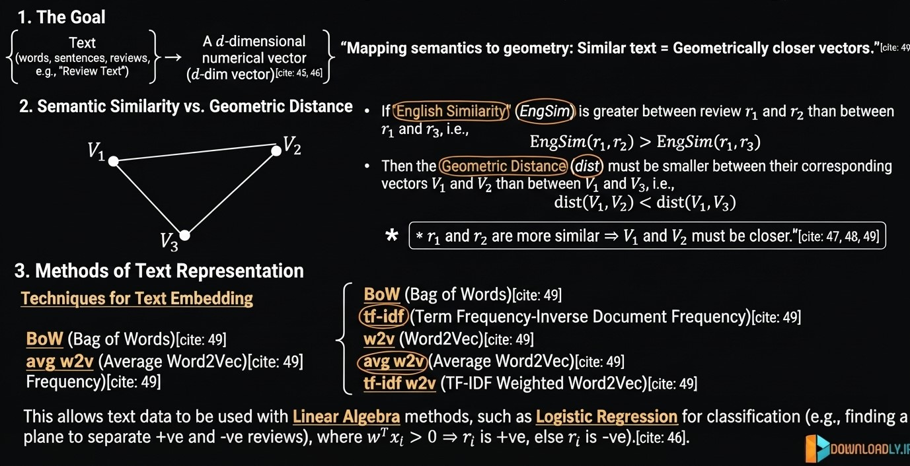
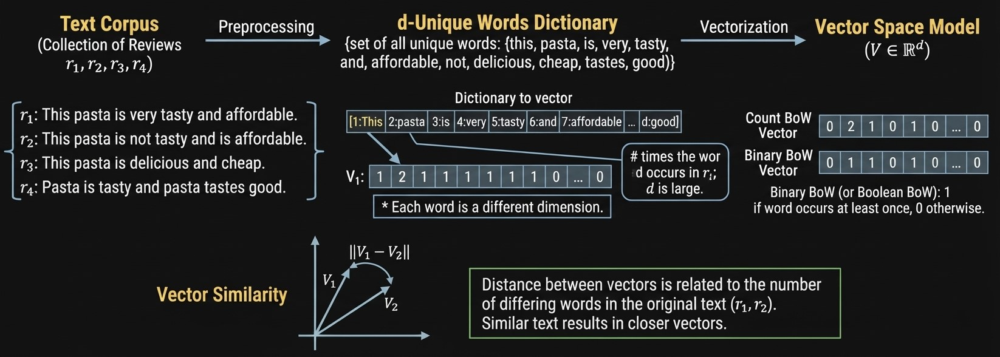
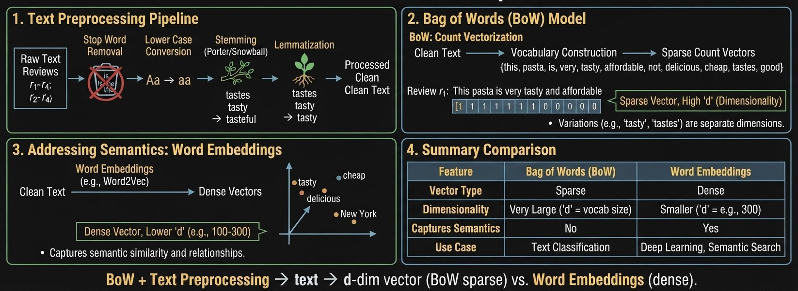
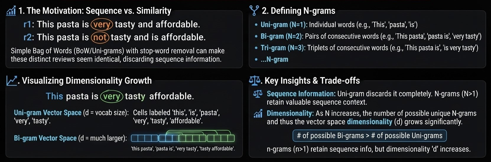
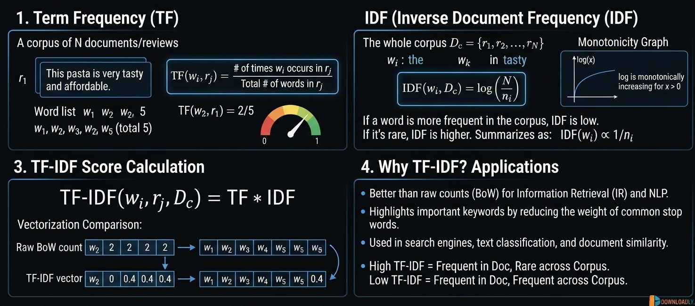
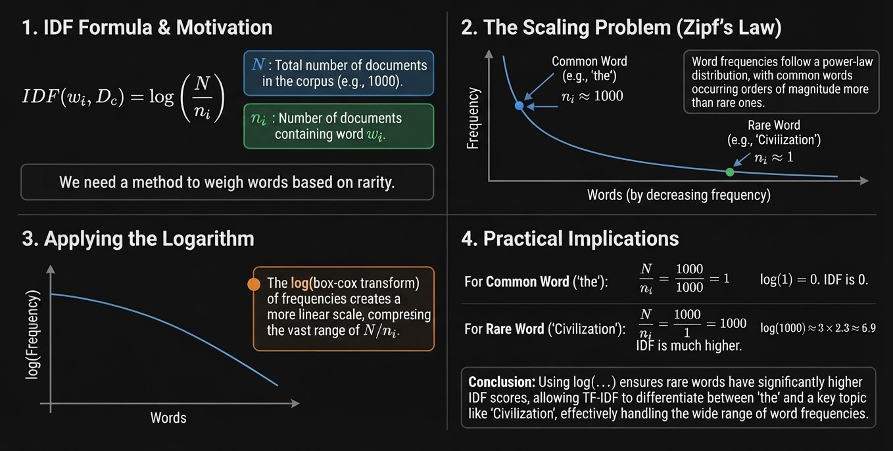
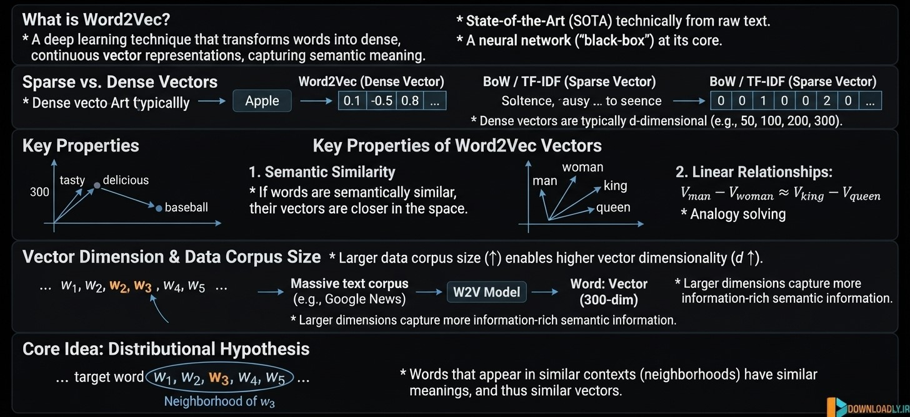
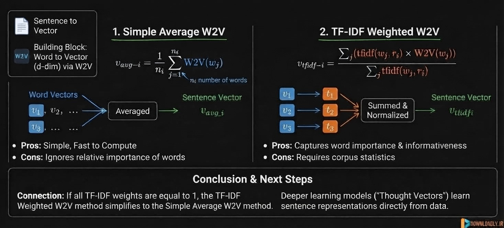
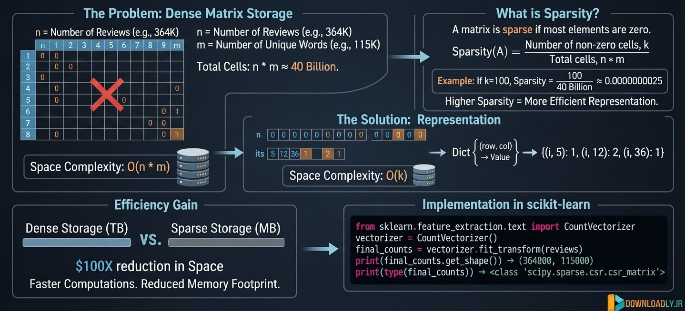

<style>
  @import url("https://fonts.googleapis.com/css2?family=Play:wght@400;700&display=swap");
  @import url("https://cdnjs.cloudflare.com/ajax/libs/latin-modern/1.1.0/css/latinmodern-math.min.css");

  :root {
    --la-ink: #3f6386;
    --la-teal: #3f6386;
    --la-teal-soft: #e8f6f7;
    --la-coral: #9333ea;
    --la-coral-soft: #fff1ed;
    --la-cdf: #17283a;
    --la-line: #5b5c5c;
    --la-surface: #f7faf9;
    --la-text: #c9c9c9;
    --la-panel: #00070e;
    --la-chip: #17283a;
    --la-amber: #9a6b16;
    --la-amber-soft: #fff8e6;
  }

  *,
  *::before,
  *::after {
    font-family: "Play", sans-serif !important;
  }

  pre,
  pre code {
    font-family: Consolas, "Courier New", monospace !important;
  }

  body,
  .markdown-body,
  p,
  li {
    color: var(--la-text) !important;
  }

  h1 {
    color: var(--la-ink);
    border-bottom: 4px solid var(--la-teal);
    padding-bottom: 0.35em;
  }

  h2 {
    color: var(--la-teal);
    border-left: 6px solid var(--la-teal);
    padding-left: 0.55em;
    margin-top: 2em;
  }

  h3,
  h4 {
    color: var(--la-coral);
  }

  a {
    color: var(--la-coral);
    text-decoration: none;
  }

  a:hover {
    text-decoration: underline;
  }

  blockquote {
    background: var(--la-panel);
    border-left: 5px solid var(--la-cdf) !important;
    border-radius: 6px;
    color: var(--la-text);
    padding: 0.75em 1em;
  }

  code {
    background: var(--la-chip);
    border-radius: 4px;
    color: var(--la-text);
    padding: 0.1em 0.3em;
  }

  pre {
    background: var(--la-panel);
    border: 1px solid var(--la-line);
    border-radius: 8px;
    overflow-x: auto;
    padding: 1em;
  }

  table {
    border: 1px solid var(--la-line);
    border-collapse: collapse;
    border-radius: 8px;
    overflow: hidden;
    width: 100%;
  }

  th {
    background: var(--la-panel);
    color: var(--la-text);
    padding: 0.7em 0.8em;
    text-align: left;
  }

  td {
    color: var(--la-text);
    padding: 0.7em 0.8em;
  }

  tr:nth-child(even) {
    background: var(--la-chip);
  }

  hr {
    border: 0;
    border-top: 2px solid var(--la-line);
    margin: 2.2em 0;
  }

  .summary-grid,
  .ml-grid,
  .intuition-grid {
    display: flex;
    gap: 1em;
    margin: 1.25em 0;
  }

  .summary-card,
  .ml-card,
  .intuition-card {
    background: var(--la-panel);
    border-radius: 7px;
    color: var(--la-text);
    flex: 1 1 0;
    min-width: 0;
    padding: 1em;
  }

  .summary-card {
    border-top: 5px solid var(--la-teal);
  }

  .summary-card.pdf,
  .ml-card.diagnostics,
  .intuition-card.pdf {
    border-top-color: var(--la-coral);
  }

  .summary-card.cdf,
  .intuition-card.cdf {
    border-top-color: var(--la-cdf);
  }

  .summary-card h3,
  .ml-card h3,
  .intuition-card h3 {
    margin-top: 0;
  }

  .summary-tag,
  .panel-kicker {
    color: var(--la-teal);
    font-size: 0.82em;
    font-weight: 700;
    letter-spacing: 0.04em;
    text-transform: uppercase;
  }

  .relationship-banner,
  .ml-workflow {
    align-items: center;
    background: var(--la-panel);
    border: 1px solid var(--la-teal);
    border-radius: 7px;
    color: var(--la-text);
    display: flex;
    flex-wrap: wrap;
    gap: 0.6em;
    justify-content: center;
    margin: 1.25em 0;
    padding: 0.85em 1em;
    text-align: center;
  }

  .relationship-banner strong,
  .ml-workflow strong,
  .relationship-item strong,
  .insight-item strong {
    color: var(--la-coral);
  }

  .relationship-banner .arrow {
    color: var(--la-teal);
    font-size: 1.2em;
  }

  .relationship-item,
  .insight-item {
    background: var(--la-panel);
    border-left: 5px solid var(--la-teal);
    border-radius: 5px;
    color: var(--la-text);
    margin: 0.65em 0;
    padding: 0.55em 0.85em;
  }

  .insight-item {
    border-left-color: var(--la-coral);
  }

  .insight-list,
  .feature-chips {
    display: flex;
    flex-wrap: wrap;
    gap: 0.55em;
    list-style: none;
    margin: 0.5em 0 1em;
    padding: 0;
  }

  .insight-list li,
  .feature-chips li {
    background: var(--la-chip);
    border: 1px solid var(--la-teal);
    border-radius: 999px;
    color: var(--la-text);
    padding: 0.35em 0.75em;
  }

  .feature-chips li {
    border-radius: 4px;
    border-left: 3px solid var(--la-coral);
    border-right: none;
    border-top: none;
    border-bottom: none;
    flex: 1 1 calc(50% - 0.45em);
  }

  .concept-flow {
    align-items: center;
    display: flex;
    flex-direction: column;
    margin: 1.25em 0;
  }

  .concept-flow .flow-step {
    background: var(--la-panel);
    border: 1px solid var(--la-teal);
    border-radius: 7px;
    color: var(--la-text);
    max-width: 22em;
    padding: 0.7em 1.2em;
    text-align: center;
    width: 100%;
  }

  .concept-flow .flow-step strong {
    color: var(--la-coral);
  }

  .concept-flow .flow-arrow {
    color: var(--la-teal);
    font-size: 1.35em;
    line-height: 1.25;
  }

  .percentile-callout {
    background: var(--la-panel);
    border-left: 5px solid var(--la-cdf);
    border-radius: 7px;
    color: var(--la-text);
    margin: 1.25em 0;
    padding: 1em;
  }

  .percentile-callout strong {
    color: var(--la-cdf);
  }

  .katex-display,
  .math,
  .math-block {
    background: #00070e;
    border-left: 6px solid #2f005c;
    border-radius: 6px;
    padding: 0.6em 0.8em;
    overflow-x: auto;
    color: #c9c9c9 !important;
    font-family: "Latin Modern Math", "Cambria Math", "STIX Two Math", serif !important;
  }

  .katex,
  .katex * {
    color: #9b9a9a !important;
    font-family: "Latin Modern Math", "Cambria Math", "STIX Two Math", serif !important;
  }

  @media (max-width: 700px) {
    .summary-grid,
    .ml-grid,
    .intuition-grid {
      flex-direction: column;
    }
  }
</style>


# Data Processing

## Table of Contents

[01. Dataset Overview Amazon Fine Food Reviews (EDA)](#01-dataset-overview-amazon-fine-food-reviews-eda)

[02. Data Cleaning Deduplication](#02-data-cleaning-deduplication)

[03. Why Convert Text to a Vector](#03-why-convert-text-to-a-vector)

[04. Bag of Words (BoW)](#04-bag-of-words-bow)

[05. Stop-word removal, Tokenization, Lemmatization](#05-stop-word-removal-tokenization-lemmatization)

[06. Uni-Gram, Bi-Gram, N-Grams](#06-uni-gram-bi-gram-n-grams)

[07. TF-IDF (Term Frequency-Inverse Document Frequency)](#07-tf-idf-term-frequency-inverse-document-frequency)

[08. Why Use Log in IDF](#08-why-use-log-in-idf)

[09. Word2Vec](#09-word2vec)

[10. Avg-Word2Vec, TF-IDF Weighted Word2Vec](#10-avg-word2vec-tf-idf-weighted-word2vec)

[11. Bag of Words (Code Sample)](#11-bag-of-words-code-sample)

[12. Text Preprocessing (Code Sample)](#12-text-preprocessing-code-sample)

[13. Bi-Grams and N-Grams (Code Sample)](#13-bi-grams-and-n-grams-code-sample)

[14. TF-IDF (Code Sample)](#14-tf-idf-code-sample)

[15. Word2Vec (Code Sample)](#15-word2vec-code-sample)

[16. Avg-Word2Vec and TFIDF-Word2Vec (Code Sample)](#16-avg-word2vec-and-tfidf-word2vec-code-sample)

[17. Assignment-2: Apply t-SNE](#17-assignment-2-apply-t-sne)

## 01. Dataset Overview Amazon Fine Food Reviews (EDA)

## 02. Data Cleaning Deduplication

## 03. Why Convert Text to a Vector



> ### Text to Vector

### Why do we need Text to Vector?

Machine Learning models (including Logistic Regression, etc.) work with **numerical vectors**, not with raw text.

We need a way to convert English text (words and sentences) into **d-dimensional numerical vectors**.

$$
\text{Review text} \quad \longrightarrow \quad d\text{-dimensional vector}
$$

### Geometric Meaning

Once we convert text into vectors, we can use ideas from Linear Algebra:

- Points in $d$-dimensional space
- Planes / hyperplanes to separate classes (e.g. positive vs negative reviews)
- Distance and similarity between vectors

**Example (Sentiment Classification):**

- Positive reviews and negative reviews become two groups of points in $d$-dimensional space
- We try to find a hyperplane (defined by a weight vector $w$) that separates them

Decision rule:

$$
\begin{cases}
w^T x_i > 0 & \Rightarrow \text{positive review} \\
w^T x_i < 0 & \Rightarrow \text{negative review}
\end{cases}
$$

### Important Requirement

If two texts are **semantically similar**, then their corresponding vectors should be **geometrically close**.

$$
\text{If } \text{EngSim}(r_1, r_2) > \text{EngSim}(r_1, r_3)
$$

then

$$
\text{dist}(v_1, v_2) < \text{dist}(v_1, v_3)
$$

### Common Techniques to Convert Text → Vector

- Bag of Words (BoW)
- TF-IDF
- Word2Vec (W2V)
- Average Word2Vec
- TF-IDF weighted Word2Vec

These methods try to create vector representations such that similar texts end up close to each other in the vector space.

## 04. Bag of Words (BoW)



Bag of Words is one of the simplest methods to convert text into numerical vectors.

### Step 1: Create the Dictionary (Vocabulary)

Collect all unique words from the entire corpus (all reviews).

Example corpus:

- $r_1$: This pasta is very tasty and affordable
- $r_2$: This pasta is not tasty and is affordable
- $r_3$: This pasta is delicious and cheap
- $r_4$: Pasta is tasty and pasta tastes good

**Dictionary** = set of all unique words  
$$
\{\text{this, pasta, is, very, tasty, and, affordable, not, delicious, cheap, tastes, good, ...}\}
$$

Let the number of unique words be $d$.  
Each review will be converted into a $d$-dimensional vector.

### Step 2: Convert each review into a vector

For a review $r_i$, the corresponding vector $v_i$ is created as follows:

- Each dimension corresponds to one word in the dictionary
- The value in that dimension = **number of times** the word occurs in the review

**Example:**

Review: “This pasta is very tasty and affordable”

$$
v_1 = [0, 0, 1, 1, 1, 1, \dots]
$$

(Most of the entries are zero → **sparse vector**)

### Important Property

BoW should satisfy:

> Similar texts must result in closer vectors.

### Binary / Boolean Bag of Words

Instead of counting the number of occurrences, we can just store:

- 1 → if the word occurs at least once
- 0 → otherwise

This is called **Binary BoW** or **Boolean BoW**.

In Binary BoW, the Euclidean distance between two vectors is related to the number of differing words:

$$
\|v_1 - v_2\| = \sqrt{\text{number of differing words between } r_1 \text{ and } r_2}
$$

### Summary

| Type              | Value stored in each dimension      | Nature of vector |
|-------------------|-------------------------------------|------------------|
| Normal BoW        | Count of the word                   | Sparse           |
| Binary BoW        | 1 if word present, else 0           | Sparse           |

BoW is simple and effective, but it ignores the order of words and semantic meaning.

## 05. Stop-word removal, Tokenization, Lemmatization 
> ### Featurizations - convert text to numeric vectors

Before converting text into BoW vectors, we apply several preprocessing steps to make the vectors smaller and more meaningful.



### 1. Removing Stopwords

Stopwords are common words that carry very little meaning (e.g. “this”, “is”, “and”, “the”, “very”).

**Example:**

- Original: “This pasta is very tasty and affordable”
- After removing stopwords: “pasta tasty affordable”

Removing stopwords reduces the dimension of the BoW vectors and keeps only the more informative words.

### 2. Lowercasing

Convert all letters to small letters so that “Pasta” and “pasta” are treated as the same word.

### 3. Stemming

Stemming reduces words to their root form by chopping off prefixes/suffixes.

Common stemmers:
- Porter Stemmer
- Snowball Stemmer

**Examples:**
- tastes, tasty, tasteful → **tast**
- beautiful, beauty → **beauti**

### 4. Lemmatization

Lemmatization also reduces words to their base form, but it is smarter than stemming because it uses vocabulary and morphological analysis.

It produces actual meaningful words (lemmas).

**Note:** Lemmatization is usually preferred over stemming when we care about readability.

### Why do we do Text Preprocessing?

- Reduces the size of the vocabulary ($d$ becomes smaller)
- Makes BoW vectors more meaningful
- Groups similar words together (e.g. “tasty”, “tasteful”, “tastes”)

### Limitation of BoW + Preprocessing

Even after preprocessing, BoW still **cannot capture semantic similarity** properly.

Example:
- “tasty” and “delicious” are very similar in meaning
- But in BoW they are treated as completely different dimensions

This is why we later use more advanced techniques such as **Word2Vec**, which can capture semantic meaning of words.

### 3. Limitations of BoW

- BoW only counts word frequency.
- It does **not** understand that “tasty” and “delicious” have very similar meaning.
- Result: Two sentences with similar meaning can have very different BoW vectors.

### 4. Solution: Word2Vec

- **Word2Vec** learns dense vector representations that capture **semantic meaning**.
- Words with similar meaning (e.g., tasty ↔ delicious) get similar vectors.
- Combined with text preprocessing, we can convert text into meaningful dense vectors.

**Summary**

| Technique          | Captures Semantics? | Output                  |
|--------------------|---------------------|-------------------------|
| BoW                | No                  | Sparse high-dimensional vector |
| BoW + Preprocessing| Partially           | Smaller sparse vector   |
| Word2Vec           | Yes                 | Dense low-dimensional vector |


## 06. Uni-Gram, Bi-Gram, N-Grams


### Problem with basic BoW (Uni-gram)

In standard Bag of Words we treat **each single word** as a dimension (Uni-gram).

**Example:**

- $r_1$: This pasta is very tasty and affordable  
- $r_2$: This pasta is not tasty and is affordable  

After removing stopwords, both reviews contain the words “pasta”, “tasty”, “affordable”.

BoW will conclude that $r_1$ and $r_2$ are very similar — but they actually have **opposite meanings** because of the word “not”.

Uni-gram BoW **discards the sequence information**.

### Bi-grams

A **Bi-gram** is a pair of consecutive words.

Instead of taking single words as dimensions, we take pairs of consecutive words.

**Example Bi-grams from $r_1$:**
- “very tasty”
- “tasty and”
- “and affordable”

**Example Bi-grams from $r_2$:**
- “not tasty”
- “tasty and”
- “and is”

Now “very tasty” and “not tasty” become **different dimensions**, so the two reviews will no longer look identical.

### n-grams

Generalization:

| n     | Name       | Meaning                        |
|-------|------------|--------------------------------|
| n = 1 | Uni-gram   | Single words                   |
| n = 2 | Bi-gram    | Pairs of consecutive words     |
| n = 3 | Tri-gram   | Three consecutive words        |
| n     | n-gram     | n consecutive words            |

### Key Points

- Uni-gram BoW discards sequence information
- Bi-grams and higher n-grams retain some sequence information
- As $n$ increases, the number of possible n-grams grows very fast
- Therefore the dimensionality $d$ of the vector also increases significantly

$$
\text{Number of bi-grams} > \text{Number of uni-grams}
$$

$$
\text{Number of tri-grams} > \text{Number of bi-grams}
$$

$$
\text{Number of n-grams} >\text{Number of tri-grams} > \text{Number of bi-grams} > \text{Number of uni-grams}
$$

Using n-grams (especially bi-grams) helps BoW capture local word order and improves performance on many text classification tasks.

## 07. TF-IDF (Term Frequency-Inverse Document Frequency)

TF-IDF is a popular technique to convert text into numerical vectors.  
It improves upon simple Bag of Words by giving more importance to important words and less importance to common words.



### 1. Term Frequency (TF)

**Definition:**

$$
TF(w_i, r_j) = \dfrac{\text{Number of times } w_i \text{ occurs in review } r_j}{\text{Total number of words in review } r_j}
$$

**Properties:**
- $0 \le TF(w_i, r_j) \le 1$
- It can be interpreted as a probability

**Example:**

Review $r_1$: $w_1\, w_2\, w_3\, w_2\, w_5$ (total 5 words)

$$
TF(w_2, r_1) = \dfrac{2}{5}
$$

### 2. Inverse Document Frequency (IDF)

**Definition:**

$$
IDF(w_i, D_c) = \log \left( \dfrac{N}{n_i} \right)
$$

where:
- $N$ = total number of documents (reviews) in the corpus $D_c$
- $n_i$ = number of documents that contain the word $w_i$

**Properties:**
- $IDF(w_i, D_c) \ge 0$
- If a word appears in all documents → $n_i = N$ → $IDF = \log(1) = 0$
- If a word is rare → $n_i$ is small → $IDF$ becomes large

**Key Intuition:**
- Frequent words in the corpus (e.g. “the”, “is”) get **low** IDF
- Rare words get **high** IDF

IDF is a **monotonically decreasing** function of $n_i$.

### 3. TF-IDF Value

For a word $w_i$ in a review $r_j$:

$$
TF\text{-}IDF(w_i, r_j) = TF(w_i, r_j) \times IDF(w_i, D_c)
$$

### How TF-IDF Vectors are Formed

Each review $r_j$ is converted into a vector $v_j$ where the value in the dimension corresponding to word $w_i$ is:

$$
v_j[i] = TF(w_i, r_j) \times IDF(w_i, D_c)
$$

### Why TF-IDF is Better than BoW

| Aspect                        | Bag of Words          | TF-IDF                          |
|-------------------------------|-----------------------|---------------------------------|
| Common words (e.g. “the”)     | High values           | Low values (low IDF)            |
| Rare but important words      | Same as common words  | High values (high IDF)          |
| Importance of a word          | Only based on count   | Based on count + rarity         |

**TF-IDF gives:**
- More importance to words that are frequent in a particular document
- More importance to words that are rare in the entire corpus

### Limitation

TF-IDF still **does not capture semantic meaning**.

Example:
- “tasty” and “delicious” are similar in meaning
- But TF-IDF treats them as completely different dimensions

This limitation is later addressed by techniques like **Word2Vec**.

## 08. Why Use Log in IDF


> Why do we use $\log\left(\dfrac{N}{n_i}\right)$ for IDF?

### Definition Recap

$$
IDF(w_i, D_c) = \log\left(\dfrac{N}{n_i}\right)
$$

- $N$ = total number of documents
- $n_i$ = number of documents containing the word $w_i$

### Why logarithm?

Using the raw value $\dfrac{N}{n_i}$ can produce extremely large numbers for rare words, which can dominate the TF-IDF values.

Taking $\log$ has two practical benefits:

1. It compresses the range of values.
2. It still preserves the ranking (monotonic transformation).

### Connection to Zipf’s Law

Word frequencies in natural language follow **Zipf’s Law** (a power-law distribution):

- A few words (the, is, and, …) occur extremely frequently
- Most words occur very rarely

If we plot word frequency (sorted in decreasing order), we get a power-law curve.

Taking $\log$ of the frequencies makes the distribution much better behaved (closer to linear / easier to work with).

This is similar to the idea of using log or Box-Cox transforms for power-law / log-normal data.

### Practical Example

Suppose $N = 1000$ documents:

| Word          | $n_i$ | $\dfrac{N}{n_i}$ | $\log\left(\dfrac{N}{n_i}\right)$ |
|---------------|-------|------------------|-----------------------------------|
| the           | 1000  | 1                | 0                                 |
| is            | 1000  | 1                | 0                                 |
| civilization  | 1     | 1000             | ≈ 6.9                             |

Without log, the rare word “civilization” would get a value of 1000, which can completely dominate the vector.

With log, the value becomes a more reasonable ≈ 6.9.

### Summary

- Using $\log\left(\dfrac{N}{n_i}\right)$ is a **heuristic** (from a 1972 research paper)
- It is not strongly based on theory, but works very well in practice
- It prevents rare words from dominating the TF-IDF vectors
- It is connected to the fact that word frequencies follow Zipf’s law (power-law distribution)

## 09. Word2Vec

https://www.tensorflow.org/text/tutorials/word2vec



### Introduction

**Word2Vec** is a state-of-the-art technique (introduced around 2013) that converts words into dense numerical vectors while capturing **semantic meaning**.

Unlike BoW and TF-IDF (which produce sparse vectors and ignore semantics), Word2Vec produces **dense, low-dimensional vectors** that understand relationships between words.

### Key Properties of Word2Vec

1. **Dense Vectors**
   - Typical dimensions: 50, 100, 200, 300
   - Not sparse (most values are non-zero)

2. **Semantic Similarity**
   - If two words are semantically similar, their vectors will be close in the vector space.
   - Example: “tasty” and “delicious” will have nearby vectors, while “baseball” will be far away.

3. **Relationships / Analogies**
   - Word2Vec can capture relationships such as:

$$
v_{\text{man}} - v_{\text{woman}} \approx v_{\text{king}} - v_{\text{queen}}
$$

### How it Works (High-level Idea)

Word2Vec learns relationships **automatically from a large text corpus** (no manual feature engineering).

**Core Intuition:**
- Words that appear in similar **neighborhoods** (contexts) should have similar vectors.

$$
\text{If } N(w_i) \approx N(w_j) \quad \Rightarrow \quad v_i \approx v_j
$$

### Training Data

- Trained on very large text corpora (e.g. Google News)
- Larger corpus → better quality vectors
- Larger dimensions → more information-rich vectors (but more computation)

### Comparison with Previous Methods

| Method     | Vector Type | Captures Semantics? | Dimensionality      |
|------------|-------------|---------------------|---------------------|
| BoW        | Sparse      | No                  | Very high (vocab size) |
| TF-IDF     | Sparse      | No                  | Very high (vocab size) |
| Word2Vec   | Dense       | Yes                 | Low (50–300)        |

### Note

Internally, Word2Vec can be understood as a form of matrix factorization or a shallow neural network (we will treat the internal working as a black-box for now).

## 10. Avg-Word2Vec, TF-IDF Weighted Word2Vec

Word2Vec gives us a dense vector for **each word**.  

But in practice we need a vector for a whole **sentence / review**.



Two simple and popular ways to create sentence vectors using Word2Vec are:

### 1. Average Word2Vec (Avg-W2V)

**Idea:** Take the average of all word vectors in the sentence.

Given a review:

$$
r_1 = w_1, w_2, w_1, w_3, w_4, w_5
$$

(with $n_1$ words)

$$
v_1 = \dfrac{1}{n_1} \Big[ W2V(w_1) + W2V(w_2) + W2V(w_1) + \dots + W2V(w_5) \Big]
$$

**Properties:**
- Very simple
- Works reasonably well in practice
- Not perfect, but a strong baseline

### 2. TF-IDF Weighted Word2Vec (TF-IDF-W2V)

**Idea:** Instead of simple averaging, take a **weighted average** where the weights are the TF-IDF values of the words.

$$
\text{TF-IDF-W2V}(r_1) = \dfrac{\sum_{i} \big( t_i \cdot W2V(w_i) \big)}{\sum_{i} t_i}
$$

where $t_i = \text{TF-IDF}(w_i, r_1)$

**Special Case:**
- If all $t_i = 1$, then TF-IDF-W2V becomes exactly the same as Average Word2Vec.

### Summary

| Method              | How sentence vector is created                  | Notes                          |
|---------------------|-------------------------------------------------|--------------------------------|
| Average W2V         | Simple average of word vectors                  | Simple & effective baseline    |
| TF-IDF weighted W2V | Weighted average using TF-IDF scores            | Gives more importance to important words |

Both methods are **weighting schemes** to convert a sequence of word vectors into a single sentence vector.

These techniques are simple ways to leverage Word2Vec for sentence-level representations (also called Sent2Vec style approaches). More advanced methods later use deep learning to create better sentence embeddings (Thought Vectors, etc.).

## 11. Bag of Words (Code Sample)


### What is a Sparse Matrix?

A matrix $A$ of size $n \times m$ is called **sparse** if **most of its elements are zero**.

$$
A \in \mathbb{R}^{n \times m}
$$

- Total number of cells = $n \times m$
- Space required if stored normally = $O(n \times m)$

### Why Sparse Matrices appear in NLP (BoW)

In Bag of Words:

- $n$ = number of reviews / documents (e.g. 364K)
- $m$ = number of unique words in the vocabulary (e.g. 115K)

So the BoW matrix is of size:

$$
364K \times 115K
$$

Each row $r_i$ is a **sparse vector** because a single review contains only a few words, while the vocabulary is very large.

Most of the values in any row $r_i$ are zero.

### Efficient Representation of Sparse Matrices

Instead of storing all $n \times m$ values, we store only the **non-zero** entries.

One common way is to use a **Dictionary** (or list of triples):

For each non-zero cell we store:

$$
(\text{row index},\; \text{column index},\; \text{value})
$$

**Space complexity:**

- Normal storage: $O(m)$ per row
- Sparse storage: $O(k)$ where $k$ = number of non-zero cells

### Sparsity of a Matrix

$$
\text{Sparsity of } A = \dfrac{k}{n \times m}
$$

where $k$ = number of non-zero cells.

The more sparse a matrix is, the more efficient sparse-matrix representations become.

### Code Explanation (Bag of Words using scikit-learn)

```python
# BoW
count_vect = CountVectorizer()                    # Create a CountVectorizer object
count_vect.fit(preprocessed_reviews)              # Learn the vocabulary from the reviews

print("Some Feature names ", count_vect.get_feature_names_out()[:10])
print('='*50)

final_counts = count_vect.transform(preprocessed_reviews)   # Convert reviews into BoW matrix

print("the type of count vectorizer ", type(final_counts))
print("the shape of out text BOW vectorizer ", final_counts.get_shape())
print("the number of unique words ", final_counts.get_shape()[1])
```
https://scikit-learn.org/stable/modules/generated/sklearn.feature_extraction.text.CountVectorizer.html

**Line-by-line explanation:**

| Code | Meaning |
|------|--------|
| `CountVectorizer()` | Creates a Bag-of-Words vectorizer from scikit-learn |
| `.fit(preprocessed_reviews)` | Learns the vocabulary (all unique words) from the given reviews |
| `.get_feature_names_out()[:10]` | Shows the first 10 words in the learned vocabulary |
| `.transform(preprocessed_reviews)` | Converts each review into a BoW vector (count of each word) |
| `type(final_counts)` | Shows that the result is a **sparse matrix** (not a normal dense NumPy array) |
| `final_counts.get_shape()` | Returns `(number of reviews, number of unique words)` |
| `final_counts.get_shape()[1]` | Gives the size of the vocabulary (number of unique words) |

**Key Point:**  
`final_counts` is stored as a **sparse matrix** (usually CSR format) because most of the entries are zero. This saves a huge amount of memory compared to a dense matrix.

## 12. Text Preprocessing (Code Sample)

See Lecture.ipynb

## 13. Bi-Grams and N-Grams (Code Sample)

See Lecture.ipynb

## 14. TF-IDF (Code Sample)

See Lecture.ipynb

## 15. Word2Vec (Code Sample)

See Lecture.ipynb

## 16. Avg-Word2Vec and TFIDF-Word2Vec (Code Sample)

See Lecture.ipynb

## 17. Assignment-2: Apply t-SNE
[Amazon_TSNE](./02.%20Amazon_TSNE.ipynb)
