<style>
  @import url("https://fonts.googleapis.com/css2?family=Play:wght@400;700&display=swap");
  @import url("https://cdnjs.cloudflare.com/ajax/libs/latin-modern/1.1.0/css/latinmodern-math.min.css");

  :root {
    --la-ink: #3f6386;
    --la-teal: #3f6386;
    --la-teal-soft: #e8f6f7;
    --la-coral: #9333ea;
    --la-coral-soft: #fff1ed;
    --la-cdf: #17283a;
    --la-line: #5b5c5c;
    --la-surface: #f7faf9;
    --la-text: #c9c9c9;
    --la-panel: #00070e;
    --la-chip: #17283a;
    --la-amber: #9a6b16;
    --la-amber-soft: #fff8e6;
  }

  *,
  *::before,
  *::after {
    font-family: "Play", sans-serif !important;
  }

  pre,
  pre code {
    font-family: Consolas, "Courier New", monospace !important;
  }

  body,
  .markdown-body,
  p,
  li {
    color: var(--la-text) !important;
  }

  h1 {
    color: var(--la-ink);
    border-bottom: 4px solid var(--la-teal);
    padding-bottom: 0.35em;
  }

  h2 {
    color: var(--la-teal);
    border-left: 6px solid var(--la-teal);
    padding-left: 0.55em;
    margin-top: 2em;
  }

  h3,
  h4 {
    color: var(--la-coral);
  }

  a {
    color: var(--la-coral);
    text-decoration: none;
  }

  a:hover {
    text-decoration: underline;
  }

  blockquote {
    background: var(--la-panel);
    border-left: 5px solid var(--la-cdf) !important;
    border-radius: 6px;
    color: var(--la-text);
    padding: 0.75em 1em;
  }

  code {
    background: var(--la-chip);
    border-radius: 4px;
    color: var(--la-text);
    padding: 0.1em 0.3em;
  }

  pre {
    background: var(--la-panel);
    border: 1px solid var(--la-line);
    border-radius: 8px;
    overflow-x: auto;
    padding: 1em;
  }

  table {
    border: 1px solid var(--la-line);
    border-collapse: collapse;
    border-radius: 8px;
    overflow: hidden;
    width: 100%;
  }

  th {
    background: var(--la-panel);
    color: var(--la-text);
    padding: 0.7em 0.8em;
    text-align: left;
  }

  td {
    color: var(--la-text);
    padding: 0.7em 0.8em;
  }

  tr:nth-child(even) {
    background: var(--la-chip);
  }

  hr {
    border: 0;
    border-top: 2px solid var(--la-line);
    margin: 2.2em 0;
  }

  .summary-grid,
  .ml-grid,
  .intuition-grid {
    display: flex;
    gap: 1em;
    margin: 1.25em 0;
  }

  .summary-card,
  .ml-card,
  .intuition-card {
    background: var(--la-panel);
    border-radius: 7px;
    color: var(--la-text);
    flex: 1 1 0;
    min-width: 0;
    padding: 1em;
  }

  .summary-card {
    border-top: 5px solid var(--la-teal);
  }

  .summary-card.pdf,
  .ml-card.diagnostics,
  .intuition-card.pdf {
    border-top-color: var(--la-coral);
  }

  .summary-card.cdf,
  .intuition-card.cdf {
    border-top-color: var(--la-cdf);
  }

  .summary-card h3,
  .ml-card h3,
  .intuition-card h3 {
    margin-top: 0;
  }

  .summary-tag,
  .panel-kicker {
    color: var(--la-teal);
    font-size: 0.82em;
    font-weight: 700;
    letter-spacing: 0.04em;
    text-transform: uppercase;
  }

  .relationship-banner,
  .ml-workflow {
    align-items: center;
    background: var(--la-panel);
    border: 1px solid var(--la-teal);
    border-radius: 7px;
    color: var(--la-text);
    display: flex;
    flex-wrap: wrap;
    gap: 0.6em;
    justify-content: center;
    margin: 1.25em 0;
    padding: 0.85em 1em;
    text-align: center;
  }

  .relationship-banner strong,
  .ml-workflow strong,
  .relationship-item strong,
  .insight-item strong {
    color: var(--la-coral);
  }

  .relationship-banner .arrow {
    color: var(--la-teal);
    font-size: 1.2em;
  }

  .relationship-item,
  .insight-item {
    background: var(--la-panel);
    border-left: 5px solid var(--la-teal);
    border-radius: 5px;
    color: var(--la-text);
    margin: 0.65em 0;
    padding: 0.55em 0.85em;
  }

  .insight-item {
    border-left-color: var(--la-coral);
  }

  .insight-list,
  .feature-chips {
    display: flex;
    flex-wrap: wrap;
    gap: 0.55em;
    list-style: none;
    margin: 0.5em 0 1em;
    padding: 0;
  }

  .insight-list li,
  .feature-chips li {
    background: var(--la-chip);
    border: 1px solid var(--la-teal);
    border-radius: 999px;
    color: var(--la-text);
    padding: 0.35em 0.75em;
  }

  .feature-chips li {
    border-radius: 4px;
    border-left: 3px solid var(--la-coral);
    border-right: none;
    border-top: none;
    border-bottom: none;
    flex: 1 1 calc(50% - 0.45em);
  }

  .concept-flow {
    align-items: center;
    display: flex;
    flex-direction: column;
    margin: 1.25em 0;
  }

  .concept-flow .flow-step {
    background: var(--la-panel);
    border: 1px solid var(--la-teal);
    border-radius: 7px;
    color: var(--la-text);
    max-width: 22em;
    padding: 0.7em 1.2em;
    text-align: center;
    width: 100%;
  }

  .concept-flow .flow-step strong {
    color: var(--la-coral);
  }

  .concept-flow .flow-arrow {
    color: var(--la-teal);
    font-size: 1.35em;
    line-height: 1.25;
  }

  .percentile-callout {
    background: var(--la-panel);
    border-left: 5px solid var(--la-cdf);
    border-radius: 7px;
    color: var(--la-text);
    margin: 1.25em 0;
    padding: 1em;
  }

  .percentile-callout strong {
    color: var(--la-cdf);
  }

  .katex-display,
  .math,
  .math-block {
    background: #00070e;
    border-left: 6px solid #2f005c;
    border-radius: 6px;
    padding: 0.6em 0.8em;
    overflow-x: auto;
    color: #c9c9c9 !important;
    font-family: "Latin Modern Math", "Cambria Math", "STIX Two Math", serif !important;
  }

  .katex,
  .katex * {
    color: #9b9a9a !important;
    font-family: "Latin Modern Math", "Cambria Math", "STIX Two Math", serif !important;
  }

  @media (max-width: 700px) {
    .summary-grid,
    .ml-grid,
    .intuition-grid {
      flex-direction: column;
    }
  }
</style>

# K-Nearest Neighbours (KNN)

## Table of Contents

[01. How Classification Works](#01-how-classification-works)

[02. Data Matrix Notation](#02-data-matrix-notation)

[03. Classification vs Regression (Examples)](#03-classification-vs-regression-examples)

[04. K-Nearest Neighbours: Geometric Intuition with a Toy Example](#04-k-nearest-neighbours-geometric-intuition-with-a-toy-example)

[05. Failure Cases of KNN](#05-failure-cases-of-knn)

[06. Distance Measures: Euclidean (L2), Manhattan (L1), Minkowski, Hamming](#06-distance-measures-euclidean-l2-manhattan-l1-minkowski-hamming)

[07. Cosine Distance & Cosine Similarity](#07-cosine-distance-cosine-similarity)

[08. How to Measure the Effectiveness of k-NN](#08-how-to-measure-the-effectiveness-of-k-nn)

[09. Test Evaluation: Time and Space Complexity](#09-test-evaluation-time-and-space-complexity)

[10. KNN Limitations](#10-knn-limitations)

[11. Decision Surface for K-NN as K Changes](#11-decision-surface-for-k-nn-as-k-changes)

[12. Overfitting and Underfitting](#12-overfitting-and-underfitting)

[13. Need for Cross Validation](#13-need-for-cross-validation)

[14. K-Fold Cross Validation](#14-k-fold-cross-validation)

[15. Visualizing Train, Validation and Test Datasets](#15-visualizing-train-validation-and-test-datasets)

[16. How to Determine Overfitting and Underfitting](#16-how-to-determine-overfitting-and-underfitting)

[17. Time Based Splitting](#17-time-based-splitting)

[18. K-NN for Regression](#18-k-nn-for-regression)

[19. Weighted K-NN](#19-weighted-k-nn)

[20. Voronoi Diagram](#20-voronoi-diagram)

[21. Binary Search Tree](#21-binary-search-tree)

[22. How to Build a kd-Tree](#22-how-to-build-a-kd-tree)

[23. Find Nearest Neighbours Using kd-Tree](#23-find-nearest-neighbours-using-kd-tree)

[24. Limitations of kd-Tree](#24-limitations-of-kd-tree)

[25. Extensions](#25-extensions)

[26. Hashing vs LSH](#26-hashing-vs-lsh)

[27. LSH for Cosine Similarity](#27-lsh-for-cosine-similarity)

[28. LSH for Euclidean Distance](#28-lsh-for-euclidean-distance)

[29. Probabilistic Class Label](#29-probabilistic-class-label)

[30. Code Sample: Decision Boundary](#30-code-sample-decision-boundary)

[31. Code Sample: Cross Validation](#31-code-sample-cross-validation)

[32. Revision Questions](#32-revision-questions)

## 01. How Classification Works

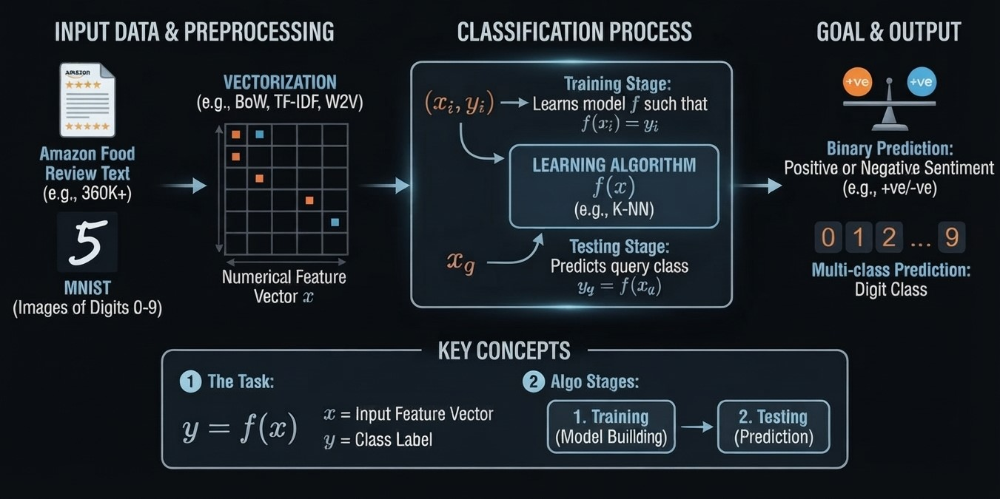

### How Classification Works

**Real-world examples:**

- Amazon Food Reviews → Positive / Negative
- MNIST digits → {0, 1, 2, …, 9} (after PCA / t-SNE)

**Pipeline:**

$$
r_i \;\xrightarrow{\text{Text}}\; \text{Vector} \quad (\text{BoW / TF-IDF / W2V})
$$

We have a dataset of **364K** reviews:

$$
r_i \;\longrightarrow\; (x_i,\; +ve / -ve)
$$

**Goal:**  
Given a new review text $x_q$, determine / predict whether the review is **positive** or **negative**.

$$
y = f(x)
$$

- $x$ = review text (converted to vector)
- $y$ = +ve / –ve

This function $f$ is the **central concept** of classification.

### How a Classification Algorithm Works

**Training Stage**

We are given labeled data:

$$
\{(x_1, y_1),\; (x_2, y_2),\; \dots,\; (x_n, y_n)\}
$$

The algorithm learns a function $f$ such that:

$$
f(x_i) \approx y_i \quad \text{for } i = 1 \text{ to } n
$$

**Test / Evaluation Stage**

For a new query point $x_q$:

$$
y_q = f(x_q)
$$

where $y_q \in \{+ve,\; -ve\}$ (or any finite set of classes).

### Summary

| Stage      | Input                         | Output                |
| ---------- | ----------------------------- | --------------------- |
| Training   | Labeled data $\{(x_i, y_i)\}$ | Learned function $f$  |
| Prediction | New review $x_q$              | Predicted class $y_q$ |

Classification algorithms try to learn the mapping

$$
y_q = f(x_q)
$$

from the training data so that they can correctly classify unseen reviews.

## 02. Data Matrix Notation

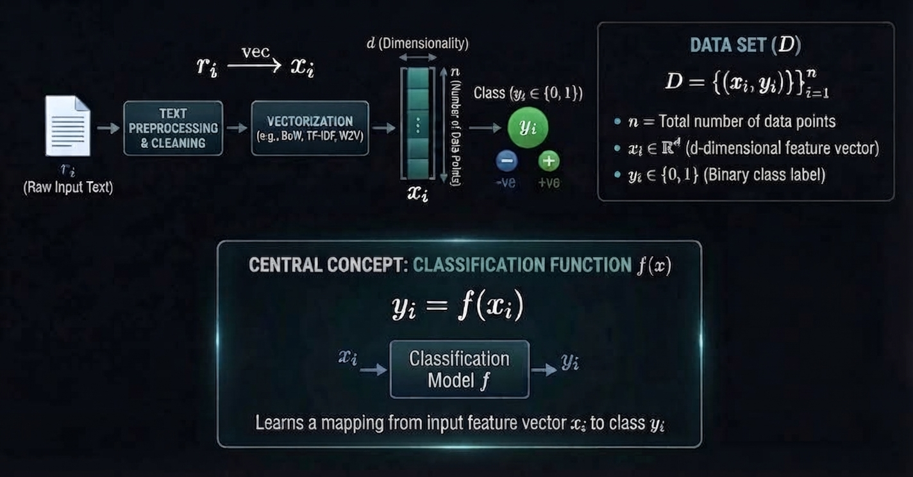

> Notation

We have a dataset of $n$ reviews:

$$
D = \big\{ (x_i, y_i) \big\}_{i=1}^{n}
$$

where:

- $x_i \in \mathbb{R}^d$ → $d$-dimensional vector obtained from the review text  
  (using BoW / TF-IDF / Word2Vec etc.)
- $y_i \in \{0, 1\}$ → class label
  - $0$ = negative
  - $1$ = positive

**Matrix view of the data:**

$$
X =
\begin{bmatrix}
\begin{array}{c|c}
 &  \\
\hline
 & x_i^\top \\
 &  \\
\end{array}
\end{bmatrix}_{n \times d}
\qquad
Y =
\begin{bmatrix}
y_1 \\
y_2 \\
\vdots \\
y_i \\
\vdots \\
y_n
\end{bmatrix}_{n \times 1}
$$

- Each row of $X$ is one data point $x_i^\top$
- $x_i$ is a **column vector** of size $d \times 1$
- $Y$ is the label vector of size $n \times 1$

### Classification Goal

Learn a function $f$ such that:

$$
f(x_i) = y_i
$$

For a new query review $x_q$:

$$
y_q = f(x_q) \quad \in \{0, 1\}
$$

## 03. Classification vs Regression (Examples)

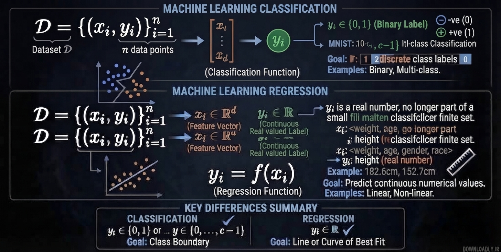

### Dataset Notation

$$
D = \big\{ (x_i, y_i) \big\}_{i=1}^{n}
\quad \text{where }\;
x_i \in \mathbb{R}^d,\;
y_i \in \{0,1\}
$$

### Classification

When the output $y_i$ belongs to a **finite set of classes**, the problem is called **Classification**.

**Examples:**

| Dataset             | Possible values of $y_i$         | Type of Classification |
| ------------------- | -------------------------------- | ---------------------- |
| Amazon Food Reviews | $\{0, 1\}$ (Negative / Positive) | 2-class / Binary       |
| MNIST               | $\{0,1,2,3,4,5,6,7,8,9\}$        | 10-class / Multi-class |

### Regression

When the output $y_i$ is a **real number** ($y_i \in \mathbb{R}$), the problem is called **Regression**.

In regression, $y_i$ is **no longer** part of a small finite set of classes.

**Example:**

- Input: $x_i = \langle \text{weight},\; \text{age},\; \text{gender},\; \text{race} \rangle$
- Output: $y_i = \text{height}$ (a real number such as 182.6 cm, 152.7 cm, …)

$$
y_i = f(x_i)
$$

### Quick Summary

| Type of $y_i$                              | Problem Type   | Symbol |
| ------------------------------------------ | -------------- | ------ |
| $y_i \in \{0,1\}$ or finite set of classes | Classification | C      |
| $y_i \in \mathbb{R}$                       | Regression     | R      |

## 04. K-Nearest Neighbours: Geometric Intuition with a Toy Example

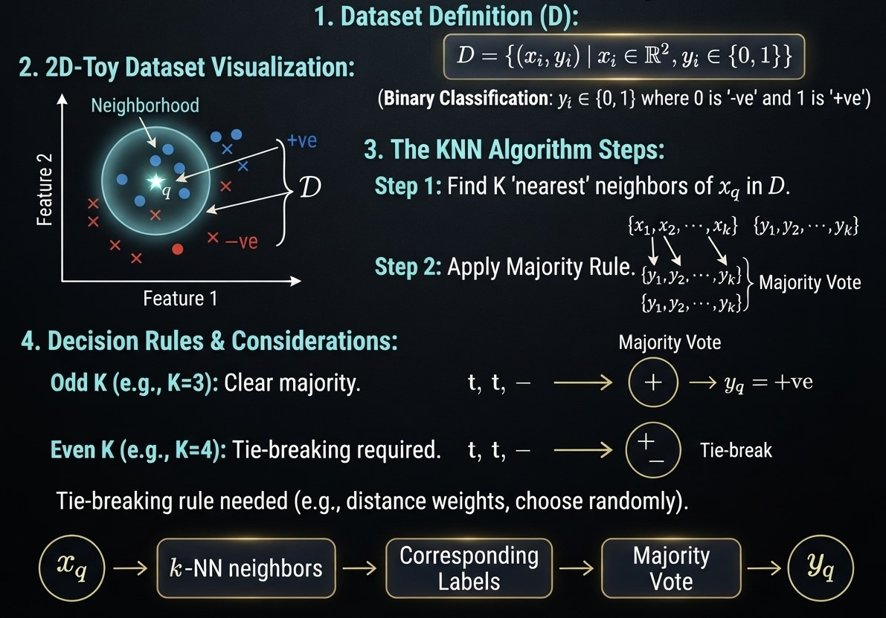

### Binary Classification Setting

Dataset:

$$
D = \big\{ (x_i, y_i) \big\} \quad \text{where }\; x_i \in \mathbb{R}^2,\; y_i \in \{0,1\}
$$

- Blue points → Positive class ($+ve$)
- Orange points → Negative class ($-ve$)

**Goal:** Given a query point $x_q$, predict its class $y_q \in \{0,1\}$.

### Geometric Idea

Look at the points that are **closest** to $x_q$ (its neighbors).

If most of the neighbors are blue → conclude $x_q$ is positive.  
If most of the neighbors are orange → conclude $x_q$ is negative.

### K-NN Algorithm (Steps)

1. **Find the K nearest points** to $x_q$ in the dataset $D$.

   Example: Let $K = 3$

   $$
   \{x_1, x_2, x_3\} \quad \text{(3 nearest neighbors of } x_q\text{)}
   $$

   Their labels: $\{y_1, y_2, y_3\}$

2. **Apply Majority Vote** on the labels of these K neighbors.

   $$
   y_q = \text{Majority class among } \{y_1, y_2, \dots, y_K\}
   $$

### Why K is usually chosen as odd?

When $K$ is odd, there cannot be a tie in binary classification.

**Examples ($K=3$):**

| Neighbor labels | Majority | Predicted $y_q$ |
| --------------- | -------- | --------------- |
| $+, +, +$       | $+$      | Positive        |
| $+, +, -$       | $+$      | Positive        |

If $K=4$ and labels are $+, +, -, -$, then we have a **tie** (ambiguous).

### Summary Flow

$$
x_q \;\longrightarrow\; \text{K nearest neighbors } \{x_1, x_2, \dots, x_K\}
$$

$$
\{y_1, y_2, \dots, y_K\} \;\xrightarrow{\text{Majority Vote}}\; y_q
$$

This is the complete geometric idea behind K-Nearest Neighbors for classification.

## 05. Failure Cases of KNN

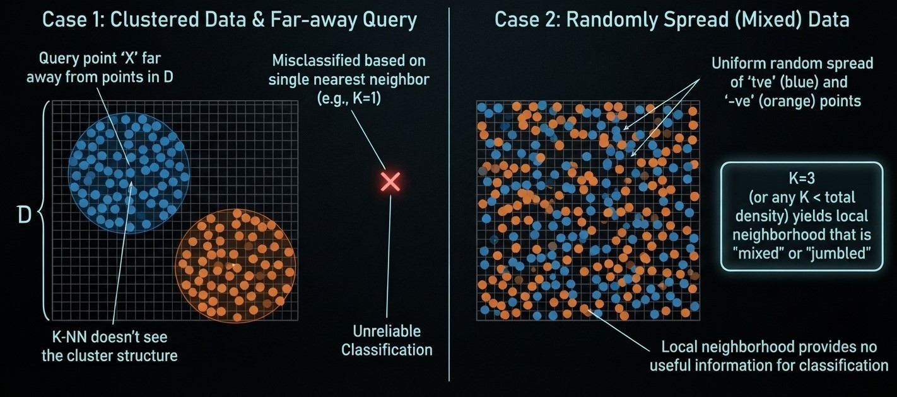

K-Nearest Neighbors can fail in certain situations. Two important failure cases are:

### 1. Query point is far away from all points in the dataset

When $x_q$ lies in a region that has **no nearby training points**, the nearest neighbors are actually far away.

- The algorithm is forced to use distant points.
- Decision becomes unreliable (“not sure”).
- Example: A point lying far from both the positive and negative clusters.

### 2. Classes are randomly mixed / overlapping

When positive and negative points are **heavily interleaved** (jumbled together):

- Even the nearest neighbors belong to different classes.
- Local neighborhood contains mixed labels.
- Majority vote gives almost random predictions.
- No useful local structure / information is present.

### Visual Summary

| Situation                   | What happens with K-NN | Result                 |
| --------------------------- | ---------------------- | ---------------------- |
| $x_q$ far from all data     | Neighbors are distant  | Unreliable prediction  |
| Classes heavily overlapping | Neighborhood is mixed  | Almost random decision |

In both cases, the fundamental assumption of K-NN (that nearby points have similar labels) is violated.

## 06. Distance Measures: Euclidean (L2), Manhattan (L1), Minkowski, Hamming

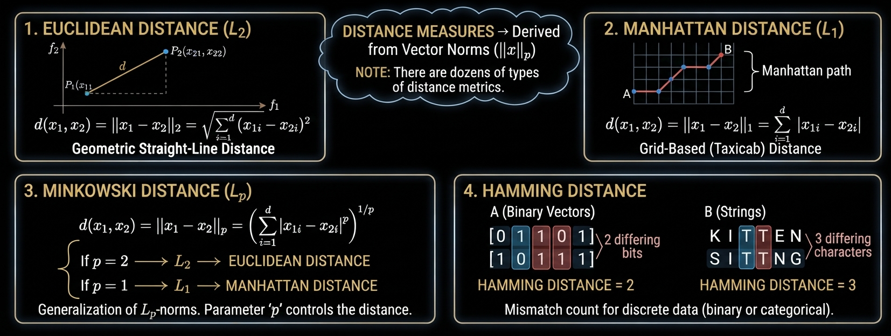

### Euclidean Distance

For two points in 2D:

$$
x_1 = (x_{11}, x_{12}), \quad x_2 = (x_{21}, x_{22})
$$

$$
d = \sqrt{(x_{21}-x_{11})^2 + (x_{22}-x_{12})^2} = \|x_1 - x_2\|
$$

This is the length of the shortest (straight) line between the two points.

**General form (d-dimensions):**

$$
\|x_1 - x_2\|_2 = \left( \sum_{i=1}^{d} (x_{1i} - x_{2i})^2 \right)^{1/2}
$$

- Also called the **L2-norm** of the vector $(x_1 - x_2)$
- $\|x\|_2$ = Euclidean distance of $x$ from the origin

### Manhattan Distance

$$
\text{Manhattan dist}(x_1, x_2) = \|x_1 - x_2\|_1 = \sum_{i=1}^{d} |x_{1i} - x_{2i}|
$$

- Also called the **L1-norm** of the vector $(x_1 - x_2)$
- Corresponds to the distance when you can only move along the axes (like city blocks)

$$
\|x\|_1 = \sum_{i=1}^{d} |x_i|
$$

### Minkowski Distance (Lp-norm)

General family of distances:

$$
\|x_1 - x_2\|_p = \left( \sum_{i=1}^{d} |x_{1i} - x_{2i}|^p \right)^{1/p}
$$

- $p = 2$ → Euclidean distance
- $p = 1$ → Manhattan distance

This is called the **Minkowski distance** or **Lp distance**.

**Lp-norm of a vector:**

$$
\|x\|_p = \left( \sum_{i=1}^{d} |x_i|^p \right)^{1/p} \quad (p > 0)
$$

### Hamming Distance

Used for **boolean / binary vectors** (e.g. Binary Bag-of-Words).

$$
\text{Hamming dist}(x_1, x_2) = \text{number of positions where the two binary vectors differ}
$$

**Example:**

$$
\begin{align*}
x_1 &= [0,\;1,\;1,\;0,\;1,\;0,\;1] \\
x_2 &= [1,\;0,\;1,\;0,\;1,\;0,\;1]
\end{align*}
$$

They differ in 3 positions → Hamming distance = 3

Also used for strings / gene sequences (AGTC):

$$
\begin{align*}
x_1 &= \text{A A G T C T C A G} \\
x_2 &= \text{A G A T C T C G A}
\end{align*}
$$

Differ in 4 positions → Hamming distance = 4

### Summary

| Distance  | Formula                       | Also known as | Typical use              |
| --------- | ----------------------------- | ------------- | ------------------------ | ------- | ------------------- |
| Euclidean | $\displaystyle\left(\sum      | x_i-y_i       | ^2\right)^{1/2}$         | L2-norm | Continuous features |
| Manhattan | $\displaystyle\sum            | x_i-y_i       | $                        | L1-norm | Continuous features |
| Minkowski | $\displaystyle\left(\sum      | x_i-y_i       | ^p\right)^{1/p}$         | Lp-norm | Generalization      |
| Hamming   | Number of differing positions | –             | Binary vectors / strings |

## 07. Cosine Distance & Cosine Similarity

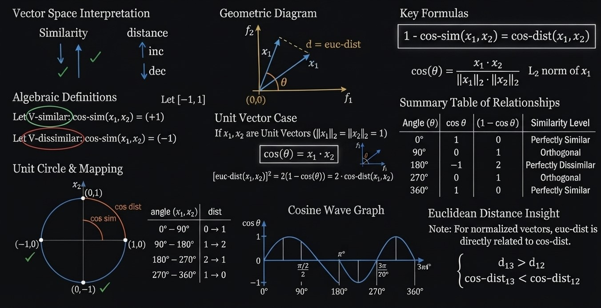
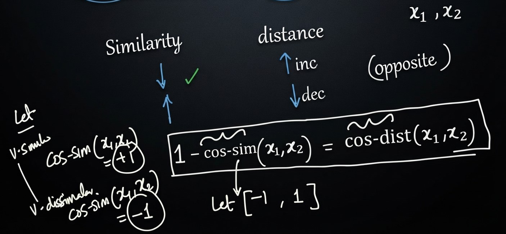
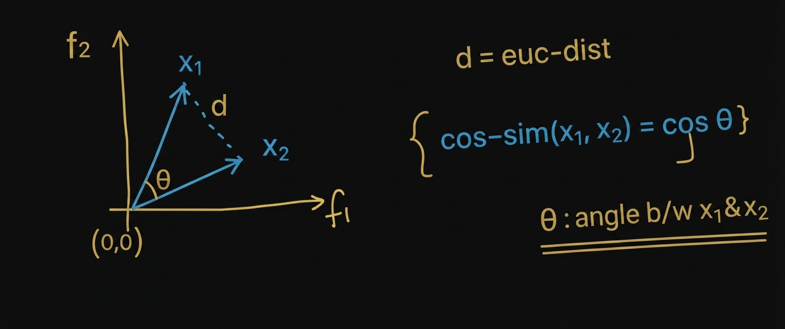
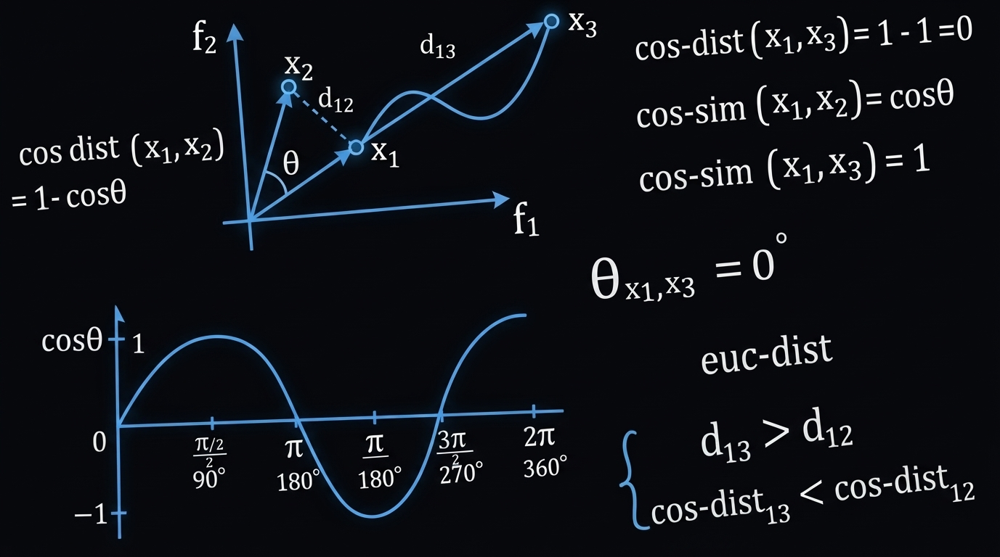
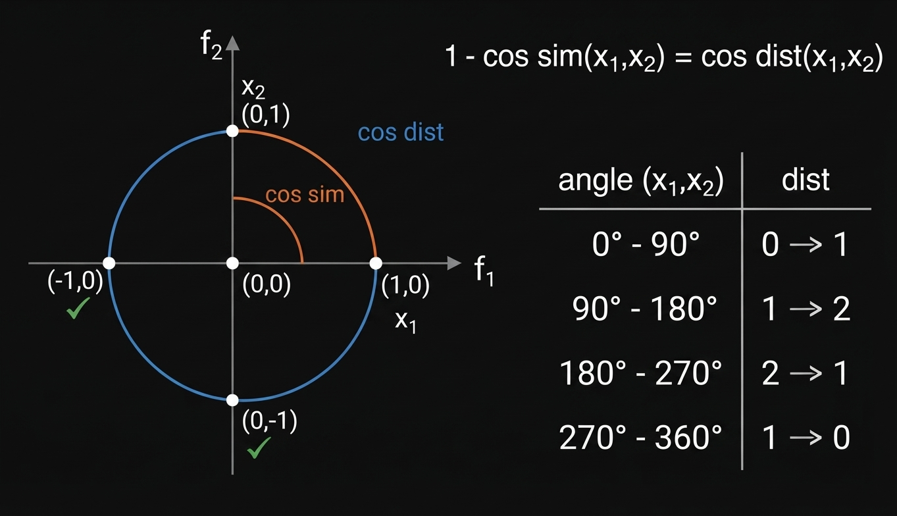
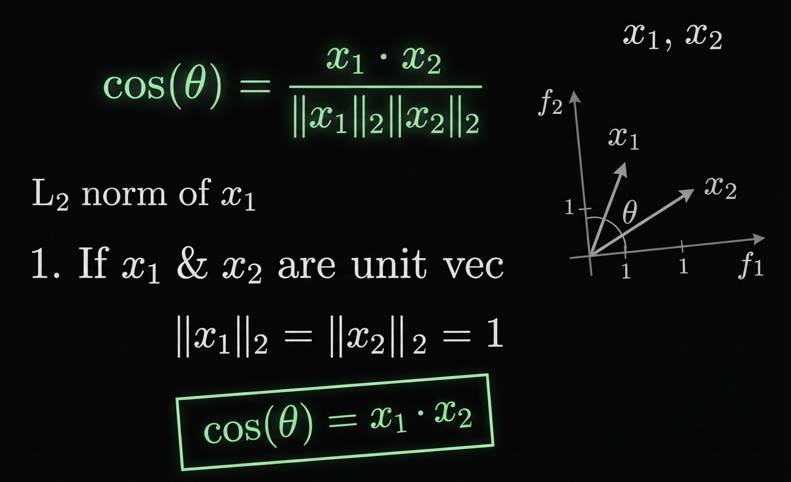
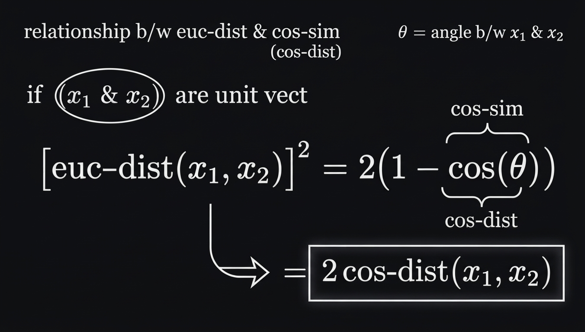

### Relationship between Similarity and Distance

- Similarity ↑ → Distance ↓ (they are opposite)
- Cosine Similarity ranges in $[-1,\; 1]$

$$
\text{Cosine Distance}(x_1, x_2) = 1 - \text{Cosine Similarity}(x_1, x_2)
$$

| Cosine Similarity | Meaning               | Cosine Distance |
| ----------------- | --------------------- | --------------- |
| $+1$              | Very similar          | $0$             |
| $0$               | Orthogonal            | $1$             |
| $-1$              | Completely dissimilar | $2$             |

### Geometric Meaning

Cosine Similarity is the **cosine of the angle** $\theta$ between the two vectors:

$$
\text{Cos-Sim}(x_1, x_2) = \cos\theta
$$

where $\theta$ is the angle between $x_1$ and $x_2$.

### Formula

$$
\cos\theta = \dfrac{x_1 \cdot x_2}{\|x_1\|_2 \; \|x_2\|_2}
$$

**Special case – Unit vectors:**

If $\|x_1\|_2 = \|x_2\|_2 = 1$, then

$$
\cos\theta = x_1 \cdot x_2
$$

### Relationship with Euclidean Distance

When $x_1$ and $x_2$ are **unit vectors**:

$$
\big[\text{Euc-dist}(x_1, x_2)\big]^2 = 2\big(1 - \cos\theta\big) = 2 \times \text{Cos-dist}(x_1, x_2)
$$

Derivation:

$$
\|x_1 - x_2\|^2 = \|x_1\|^2 + \|x_2\|^2 - 2\, x_1^\top x_2
$$

For unit vectors ($\|x_1\| = \|x_2\| = 1$):

$$
\|x_1 - x_2\|^2 = 2 - 2\cos\theta = 2(1 - \cos\theta)
$$

### Key Observations

- Cosine similarity cares only about the **direction** (angle), not the magnitude.
- Two vectors can be far in Euclidean distance but still have high cosine similarity if they point in almost the same direction.
- Very useful for text data (BoW / TF-IDF / Word2Vec) where the length of the vector often depends on document length.

## 08. How to Measure the Effectiveness of KNN

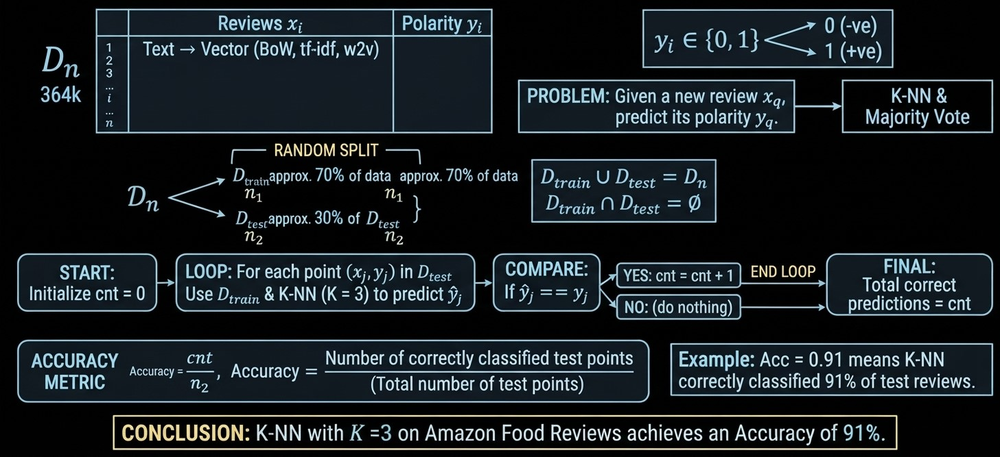

### Problem Setting

Amazon Food Reviews dataset:

$$
D = \big\{(x_i, y_i)\big\}_{i=1}^{n} \quad (n \approx 364\text{K})
$$

- $x_i$ = text review converted to vector (BoW / TF-IDF / W2V)
- $y_i \in \{0,1\}$ → Negative / Positive

**Task:** Given a new review $x_q$, predict its polarity $y_q$.

We use **K-NN + Majority Vote**.

### Train-Test Split

We randomly split the whole dataset $D_n$ into two parts:

$$
D_n = D_{\text{Train}} \;\cup\; D_{\text{Test}}
$$

$$
D_{\text{Train}} \;\cap\; D_{\text{Test}} = \emptyset
$$

Typical split:

- $D_{\text{Train}}$ → 70% of data ($n_1 \approx 0.7n$)
- $D_{\text{Test}}$ → 30% of data ($n_2 \approx 0.3n$)

### Evaluation Procedure

1. Train K-NN using only $D_{\text{Train}}$.
2. For **every** point $x_i$ in $D_{\text{Test}}$:
   - Treat it as a query point $x_q = x_i$
   - Predict $\hat{y}_q$ using K-NN on $D_{\text{Train}}$
   - Compare $\hat{y}_q$ with the true label $y_i$
3. Count how many times the prediction was correct.

### Accuracy

$$
\text{Accuracy} = \dfrac{\text{Number of correctly predicted points in } D_{\text{Test}}}{n_2}
$$

$$
0 \le \text{Accuracy} \le 1
$$

**Example:**  
If Accuracy = 0.91 → the model is correct **91%** of the time on unseen data.

### Conclusion

By splitting the data into Train and Test sets and computing Accuracy on the Test set, we get a reliable measure of how good K-NN is for the Amazon Food Reviews polarity prediction task.

## 09. Test Evaluation: Time and Space Complexity

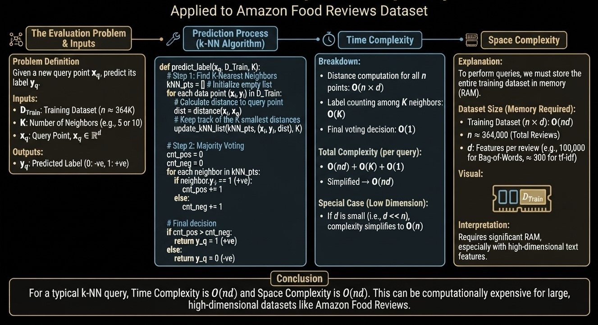

### K-NN Algorithm (Test / Evaluation Phase)

**Input:**

- Training set $D_{\text{Train}}$ ($n$ points, each in $d$ dimensions)
- Query point $x_q \in \mathbb{R}^d$
- Integer $K$ (usually small, e.g. 5 or 10)

**Output:** Predicted class $y_q$

```text
KNNpts = []                          # list to store (x_i, y_i, distance)

for each x_i in D_Train:
    compute d(x_i, x_q) → d_i        # O(d) time
    keep the smallest K distances    # maintain top-K

# Majority vote
cnt_pos = 0, cnt_neg = 0
for each point in KNNpts:            # O(K)
    if y_i is +ve → cnt_pos += 1
    else → cnt_neg += 1

if cnt_pos > cnt_neg:
    return y_q = 1                   # +ve
else:
    return y_q = 0                   # -ve
```

### Time Complexity

- Computing distance for all $n$ points: $O(nd)$
- Finding the $K$ nearest neighbors + majority vote: $O(K)$ (very small)

**Overall:**

$$
O(nd) + O(K) \approx O(nd)
$$

When $d \ll n$:

$$
O(nd) \approx O(n)
$$

### Space Complexity

We must keep the entire training set in memory:

$$
\text{Space} = O(nd)
$$

**Example (Amazon Food Reviews):**

- $n \approx 364\text{K}$
- $d \approx 100\text{K}$ (BoW) or $\approx 300$ (TF-IDF / W2V)

→ Requires a lot of RAM.

### Summary

| Complexity       | Value   | Notes                                  |
| ---------------- | ------- | -------------------------------------- |
| Time (per query) | $O(nd)$ | Dominated by distance computations     |
| Space            | $O(nd)$ | Whole training set must stay in memory |

**Key Point:**  
K-NN does almost all its work at **test / evaluation time**. This makes it slow and memory-intensive for large datasets.

## 10. KNN Limitations

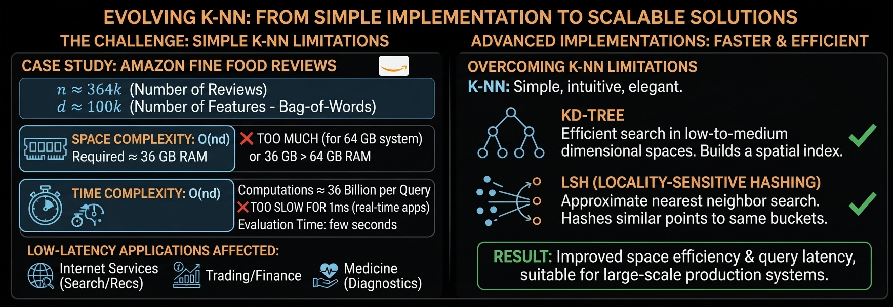

### 1. Space Complexity Problem

For Amazon Fine Food Reviews:

- $n \approx 364\text{K}$
- $d \approx 100\text{K}$ (BoW)

$$
\text{Space} = O(nd) \approx 364\text{K} \times 100\text{K} = 36.4 \text{ Billion values} \approx \mathbf{36\,GB}
$$

Even with 64 GB RAM, storing the entire training set becomes very expensive / impractical for production systems.

### 2. Time Complexity Problem

$$
\text{Time per query} = O(nd)
$$

- 36 Billion computations per prediction
- In low-latency applications (Internet, Trading, etc.) we often need answers in **1 ms**
- K-NN with the simple implementation can take **seconds** → too slow

| Application Type   | Required Latency    | Simple K-NN |
| ------------------ | ------------------- | ----------- |
| Internet / Trading | ~1 ms               | Too slow    |
| Medicine (offline) | few seconds / 1 min | Acceptable  |

### 3. Overall Limitation of Simple Implementation

The basic (brute-force) K-NN is:

- Very simple
- Intuitive
- Easy to implement

But it has severe practical limitations:

$$
\text{Time} = O(nd), \quad \text{Space} = O(nd)
$$

### Better Alternatives

To overcome these limitations, we use more advanced techniques:

- **KD-Tree**
- **Locality Sensitive Hashing (LSH)**
- Other approximate nearest neighbor methods

These methods try to reduce both time and space while still giving good approximate neighbors.

## 11. Decision Surface for K-NN as K Changes

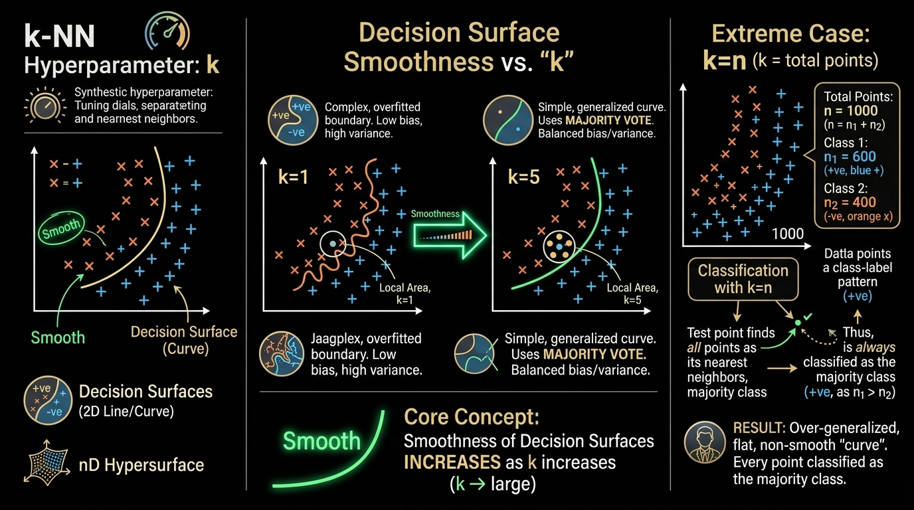

> `K` in `K-NN` (`Hyperparameter`)

$K$ is the most important **hyperparameter** in K-Nearest Neighbors.

### Effect of K on the Decision Surface

The decision surface is the boundary that separates the positive class from the negative class.

| Value of K | Decision Surface          | Characteristics                     |
|------------|---------------------------|-------------------------------------|
| $K = 1$    | Very complex / non-smooth | Overfits, sensitive to noise        |
| Small K    | Complex, wiggly           | High variance                       |
| Large K    | Smooth                    | High bias                           |
| $K = n$    | Completely flat           | Always predicts the majority class  |

### Geometric Intuition

- **K = 1 (1-NN)**  
  The decision boundary tightly follows the training points.  
  It creates many small regions and is highly non-smooth.

- **As K increases** (3, 5, 7, 15 …)  
  The decision boundary becomes smoother because more neighbors participate in the majority vote.

- **K = n** (maximum possible value)  
  Every query point looks at **all** training points.  
  The prediction is simply the majority class in the entire dataset.

**Example:**
- Total points $n = 1000$
- Positive points $n_1 = 600$
- Negative points $n_2 = 400$

When $K = 1000$, every point is classified as **Positive** (majority class).

### Summary

- Small $K$ → Complex decision surface (can overfit)
- Large $K$ → Smooth decision surface (can underfit)
- $K = n$ → Always predicts the majority class

Choosing the right $K$ is a trade-off between bias and variance.

## 12. Overfitting and Underfitting

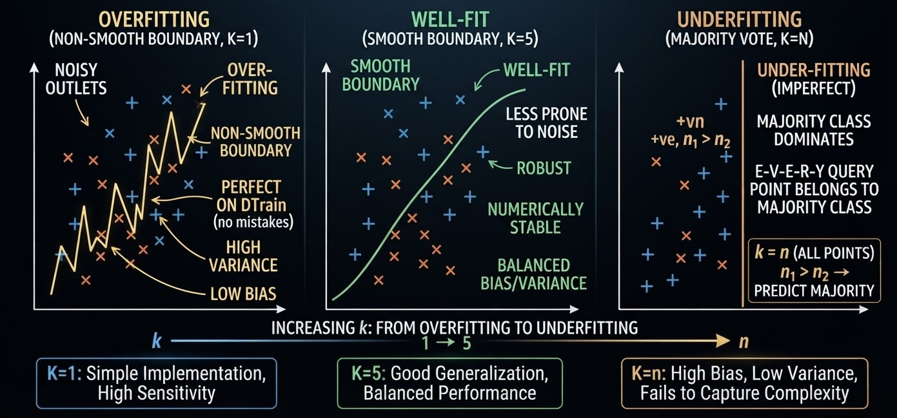

### Fundamental Concepts

| Situation       | Decision Surface     | Behavior                              | Typical K     |
|-----------------|----------------------|---------------------------------------|---------------|
| **Overfitting** | Very complex / non-smooth | Fits noise & outliers perfectly      | $K = 1$       |
| **Well-fit**    | Smooth               | Robust, less sensitive to noise       | Moderate $K$ (e.g. 5) |
| **Underfitting**| Extremely simple     | Always predicts majority class        | $K = n$       |

### Visual Understanding

**1. Overfitting ($K = 1$)**
- Decision boundary tightly follows every training point
- Classifies all training points correctly (no mistakes on $D_{\text{Train}}$)
- Highly sensitive to noisy points and outliers
- Poor generalization to new points

**2. Good Fit (e.g. $K = 5$)**
- Decision boundary becomes smoother
- Less affected by individual noisy points
- Better balance between bias and variance
- More robust predictions

**3. Underfitting ($K = n$)**
- Decision surface becomes completely flat
- Every query point is assigned the **majority class** of the entire training set
- Model is too simple / “lazy”
- Ignores local structure completely

### Key Takeaway

In K-NN:

- **Small $K$** → Low bias, High variance → Risk of **Overfitting**
- **Large $K$** → High bias, Low variance → Risk of **Underfitting**

Choosing the right $K$ is about finding the sweet spot between these two extremes.

## 13. Need for Cross Validation

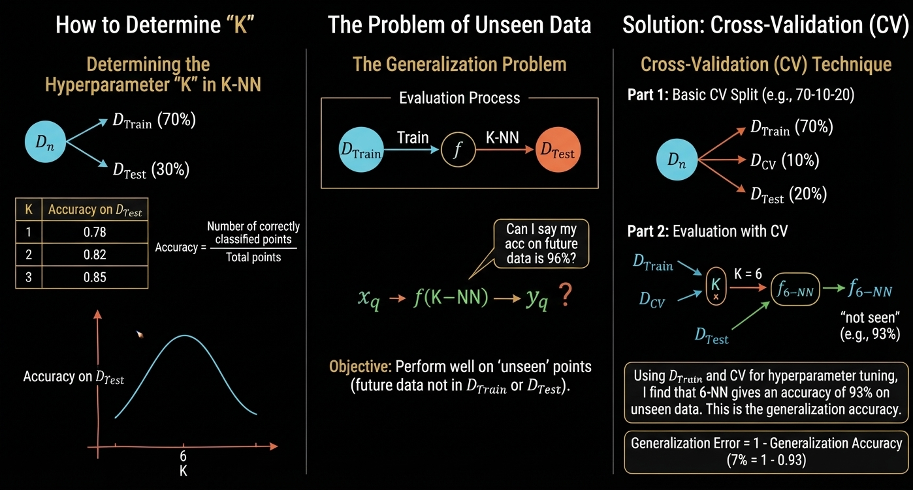

### How to Choose the Best K?

One simple idea:

1. Randomly split the data  
   - $D_{\text{Train}}$ (70%)  
   - $D_{\text{Test}}$ (30%)

2. For different values of $K = 1, 2, 3, \dots$  
   - Train K-NN on $D_{\text{Train}}$  
   - Compute Accuracy on $D_{\text{Test}}$

3. Pick the $K$ that gives the highest Accuracy on $D_{\text{Test}}$.

**Typical result:**

| K   | Accuracy on $D_{\text{Test}}$ |
|-----|-------------------------------|
| 1   | 0.78                          |
| 2   | 0.82                          |
| 3   | 0.85                          |
| …   | …                             |
| 6   | **0.96** (highest)            |

### The Problem with This Approach

We used $D_{\text{Test}}$ to **select** the best $K$.

Therefore $D_{\text{Test}}$ is no longer a pure unseen set.

**Question:**  
Can I honestly say that my model will give 96% accuracy on future data?

**Answer:** No.

### Objective of a Good Model

We want the model to perform well on **future unseen points** — points that were never used during training **or** model selection.

### Solution: Cross-Validation (CV)

We create a separate set only for choosing hyperparameters.

**Proper 3-way split:**

$$
D_n \xrightarrow{\text{random}}
\begin{cases}
D_{\text{Train}} & (60\%) \\
D_{\text{CV}}    & (20\%) \\
D_{\text{Test}}  & (20\%)
\end{cases}
$$

**Correct Procedure:**

1. Use $D_{\text{Train}}$ + different values of $K$
2. Evaluate Accuracy on $D_{\text{CV}}$ → select the best $K$
3. Finally test the chosen model **only once** on $D_{\text{Test}}$

This final Accuracy on $D_{\text{Test}}$ is a reliable estimate of **Generalization Accuracy**.

### Summary

- Never use the Test set to choose $K$.
- Use a Cross-Validation (Validation) set for hyperparameter selection.
- Report performance only on the held-out Test set.

This is why **Cross-Validation** is necessary.

## 14. K-Fold Cross Validation

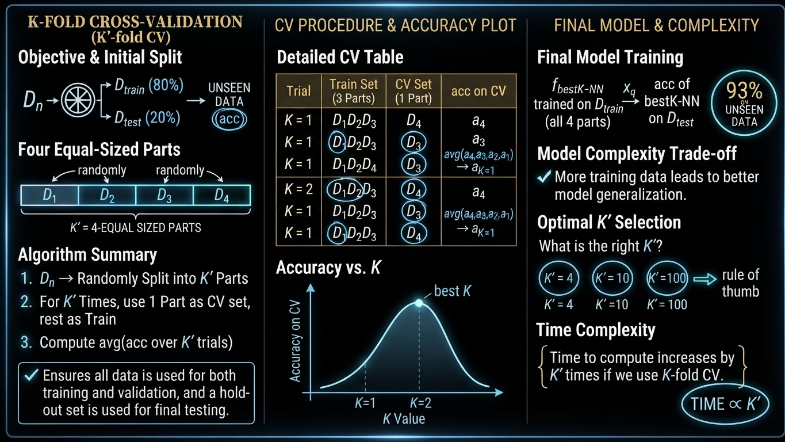

### Why do we need K'-Fold CV?

In the simple 60-20-20 split:

- Only **60%** of the data is used for training the model
- Only **20%** is used for choosing $K$

**Problem:**  
We are throwing away a lot of data.  
More training data → better algorithm.

**Goal:** Use as much data as possible for training while still getting a reliable estimate of performance.

### K'-Fold Cross-Validation Procedure

**Step 1:**  
Keep a pure Test set aside (usually 20%).

$$
D_n \xrightarrow{\text{random}} 
\begin{cases}
D_{\text{Train+CV}} & (80\%) \\
D_{\text{Test}}     & (20\%)
\end{cases}
$$

**Step 2:**  
Randomly divide $D_{\text{Train+CV}}$ into $K'$ equal-sized parts (folds).

Example for **4-fold CV**:

$$
D_{\text{Train+CV}} = D_1 \cup D_2 \cup D_3 \cup D_4
$$

**Step 3:**  
For each value of $K$ (the hyperparameter of K-NN):

- Repeat $K'$ times:
  - Use $K'-1$ folds as Training set
  - Use the remaining 1 fold as CV set
  - Compute Accuracy on that CV fold

- Average the $K'$ accuracies → get a robust estimate of performance for that $K$.

**Example (4-fold CV for $K=1$):**

| Fold | Train Set     | CV Set | Accuracy |
|------|---------------|--------|----------|
| 1    | $D_1 D_2 D_3$ | $D_4$  | $a_4$    |
| 2    | $D_1 D_2 D_4$ | $D_3$  | $a_3$    |
| 3    | $D_1 D_3 D_4$ | $D_2$  | $a_2$    |
| 4    | $D_2 D_3 D_4$ | $D_1$  | $a_1$    |

$$
\text{Average Accuracy for } K=1 = \dfrac{a_1 + a_2 + a_3 + a_4}{4}
$$

Do the same for $K=2, 3, 4, \dots$ and pick the $K$ with the highest average CV accuracy.

**Step 4:**  
Train the final model using the best $K$ on the entire $D_{\text{Train+CV}}$, then evaluate **once** on the held-out $D_{\text{Test}}$.

### Choosing the number of folds ($K'$)

Common choices:
- $K' = 4$
- $K' = 10$  ← **Rule of thumb**
- $K' = n$ (Leave-One-Out CV)

**Rule of thumb:** Prefer **10-fold Cross-Validation**.

### Time Complexity

Time required to find the best $K$ increases by a factor of $K'$  
(because we train the model $K'$ times for every candidate $K$).

### Key Benefits of K'-Fold CV

- Uses much more data for training (almost 80% instead of 60%)
- Gives a more stable and reliable estimate of performance
- Still keeps a pure Test set for final evaluation

## 15. Visualizing Train, Validation and Test Datasets

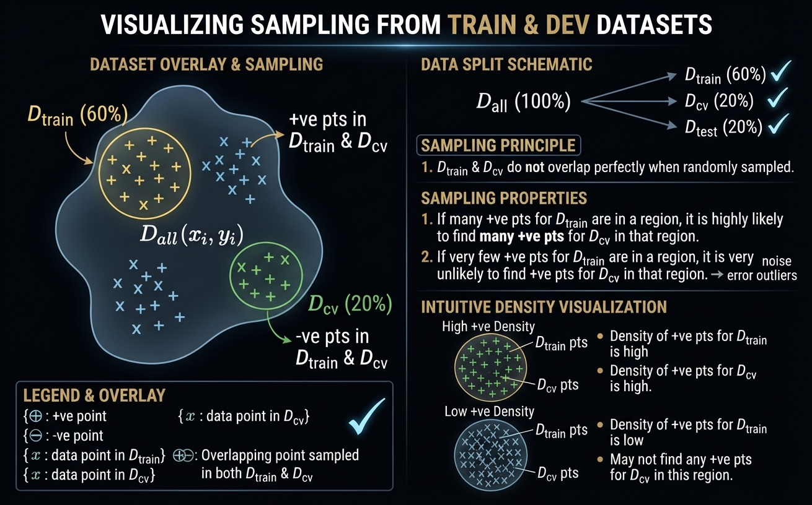

### Random Split

We randomly divide the full dataset $D_n$ into three parts:

$$
D_n \xrightarrow{\text{random}}
\begin{cases}
D_{\text{Train}} & (60\%) \\
D_{\text{CV}}    & (20\%) \\
D_{\text{Test}}  & (20\%)
\end{cases}
$$

Each point is a pair $(x_i, y_i)$ where $y_i$ is the class label (+ve or –ve).

### Important Observations

1. **$D_{\text{Train}}$ and $D_{\text{CV}}$ do not overlap perfectly**  
   When we sample randomly, the two sets are different.

2. **High-density regions**  
   If a region contains many +ve (or –ve) points from $D_{\text{Train}}$,  
   it is highly likely that we will also find many points of the same class from $D_{\text{CV}}$ in that region.

3. **Low-density / sparse regions**  
   If a region has very few points from $D_{\text{Train}}$,  
   it is very unlikely to find points from $D_{\text{CV}}$ in that region.  
   (These sparse regions often contain noise, errors, or outliers.)

### Intuitive Understanding

- Dense cloud of +ve points in Train → high chance of finding +ve points from CV in the same area.
- Dense cloud of –ve points in Train → high chance of finding –ve points from CV nearby.
- Very sparse regions → CV points are rare; these areas are less reliable for decision making.

### Visual Summary

- Orange / Blue crosses → points belonging to $D_{\text{Train}}$
- Circled points → points belonging to $D_{\text{CV}}$ (overlaid on the same space)
- The overall shape of the two classes is preserved across Train and CV because of random sampling.

This visualization helps us understand why Cross-Validation works: the CV set is a good representative sample of the same underlying distribution as the training data.

## 16. How to Determine Overfitting and Underfitting

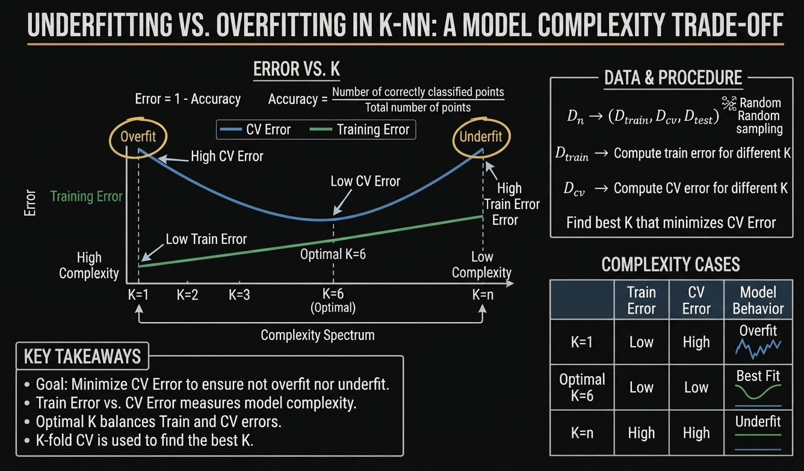

### Using K-Fold CV to Choose Best K

We use K-fold Cross-Validation on $D_{\text{CV}}$ to select the best $K$.

The goal is to find a $K$ that is **neither overfitting nor underfitting**.

### Accuracy and Error

$$
\text{Accuracy} = \dfrac{\text{Number of correctly classified points}}{\text{Total number of points}}
$$

$$
\text{Error} = 1 - \text{Accuracy}
$$

Example:  
If Accuracy = 0.93 → Error = 0.07 (7%)

### Training Error vs Validation Error

**Training Error:**  
Error of the model when evaluated on $D_{\text{Train}}$ itself.

**Validation (CV) Error:**  
Error of the model when evaluated on $D_{\text{CV}}$.

### How Errors Behave with K

| Situation          | Train Error | Validation Error | Interpretation      |
|--------------------|-------------|------------------|---------------------|
| $K = 1$            | Very Low    | High             | **Overfitting**     |
| Moderate $K$ (e.g. 5) | Low       | Low              | **Good fit**        |
| $K = n$            | High        | High             | **Underfitting**    |

### Classic Error Curves

- As $K$ increases from 1:
  - Train Error **increases**
  - Validation Error first **decreases**, reaches a minimum, then **increases**

- The best $K$ is the one where Validation Error is minimum (sweet spot).

### Visual Summary

- **$K = 1$**:  
  Decision boundary is very complex.  
  Train error is almost zero, but Validation error is high → Overfitting.

- **$K = 5$** (example):  
  Decision boundary is smoother.  
  Both Train error and Validation error are reasonably low → Good fit.

- **Very large $K$**:  
  Model becomes too simple.  
  Both errors become high → Underfitting.

### Key Rule

- **Low Train Error + High Validation Error** → Overfitting  
- **High Train Error + High Validation Error** → Underfitting  
- **Low Train Error + Low Validation Error** → Good model

By plotting Train Error and Validation Error against $K$, we can clearly see the region of overfitting, good fit, and underfitting, and select the best $K$.

## 17. Time Based Splitting

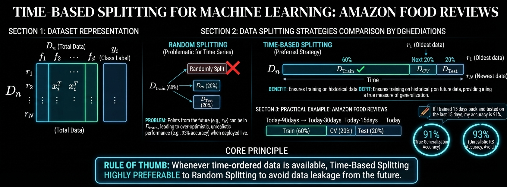

> ### Time-Based Splitting vs Random Splitting

### Amazon Food Reviews Dataset

We have two common ways to split the data into Train, CV, and Test:

1. **Random Splitting (RS)**
2. **Time-Based Splitting (TBS)**

### Random Splitting

- Randomly shuffle all reviews
- Then divide into:
  - $D_{\text{Train}}$ → 60%
  - $D_{\text{CV}}$ → 20%
  - $D_{\text{Test}}$ → 20%

**Problem:**  
Reviews from different time periods get mixed together.

### Time-Based Splitting (TBS)

**Steps:**

1. Sort the entire dataset $D_n$ in **ascending order of time**.
2. Take the oldest reviews as Training set.
3. Take the next portion as CV set.
4. Take the most recent reviews as Test set.

Example:

- Oldest 60% → $D_{\text{Train}}$
- Next 20% → $D_{\text{CV}}$
- Latest 20% → $D_{\text{Test}}$

### Why Time-Based Splitting is Better

In real-world scenarios (especially Amazon reviews):

- Products change over time
- Customer language and review style change over time
- New products keep appearing

If we use **Random Splitting**, the model may see future reviews during training.  
This creates an unrealistically optimistic accuracy.

**Example:**
- With Random Splitting we may get 93% accuracy.
- But when the model is deployed, new reviews come in the future → actual performance may drop.

With **Time-Based Splitting**:
- We train on past data
- Validate and test on more recent data
- This better simulates the real deployment situation.

### Key Rule

> Whenever **time** is available **and** the data / behavior changes over time,  
> **Time-Based Splitting is preferable** to Random Splitting.

### Summary

| Method              | When to Use                              | Advantage                              |
|---------------------|------------------------------------------|----------------------------------------|
| Random Splitting    | Time information not available           | Simple                                 |
| Time-Based Splitting| Time is available & data changes over time | More realistic evaluation of future performance |

## 18. K-NN for Regression

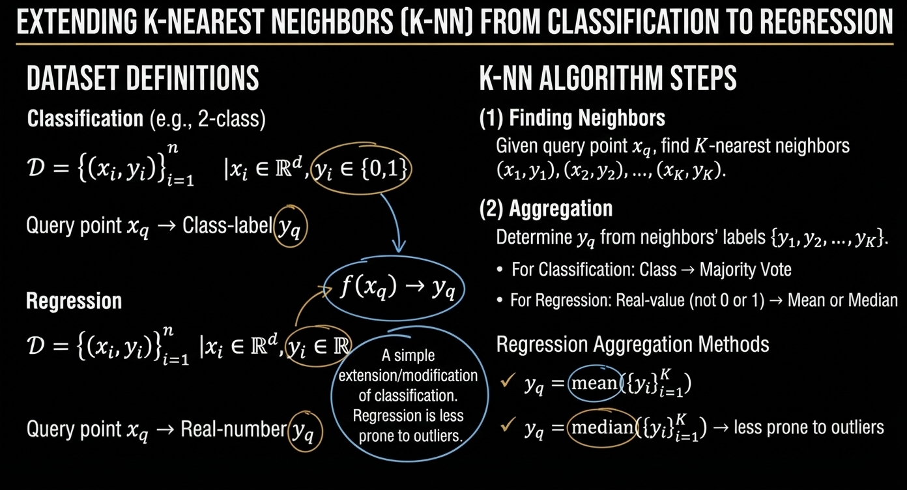

### Classification vs Regression

**Classification (2-class):**

$$
D = \left\{ (x_i, y_i) \right\}_{i=1}^{n} \quad \text{where} \quad x_i \in \mathbb{R}^d,\; y_i \in \{0,1\}
$$

- Output of K-NN: Class label (using **Majority Vote**)

**Regression:**

$$
D = \left\{ (x_i, y_i) \right\}_{i=1}^{n} \quad \text{where} \quad x_i \in \mathbb{R}^d,\; y_i \in \mathbb{R}
$$

- Output of K-NN: A real number

K-NN for regression is a **simple extension / modification** of K-NN classification.

### How K-NN Regression Works

**Step 1:**  
Given a query point $x_q$, find its $K$ nearest neighbors:

$$
(x_1, y_1),\; (x_2, y_2),\; \dots,\; (x_K, y_K)
$$

**Step 2:**  
Predict the output $y_q$ using the $y$-values of the neighbors.

Two common ways:

1. **Mean** (most common):

$$
y_q = \text{mean}(y_1, y_2, \dots, y_K) = \dfrac{1}{K} \sum_{i=1}^{K} y_i
$$

2. **Median** (more robust):

$$
y_q = \text{median}(y_1, y_2, \dots, y_K)
$$

### Why Median is Useful?

Using the **median** makes the prediction **less prone to outliers**.

### Summary

| Task          | Output Type     | Aggregation Method      |
|---------------|-----------------|--------------------------|
| Classification| Class label     | Majority Vote            |
| Regression    | Real number     | Mean or Median of neighbors |

K-NN Regression is simply K-NN Classification where instead of voting for a class, we average (or take median of) the target values of the nearest neighbors.

## 19. Weighted K-NN

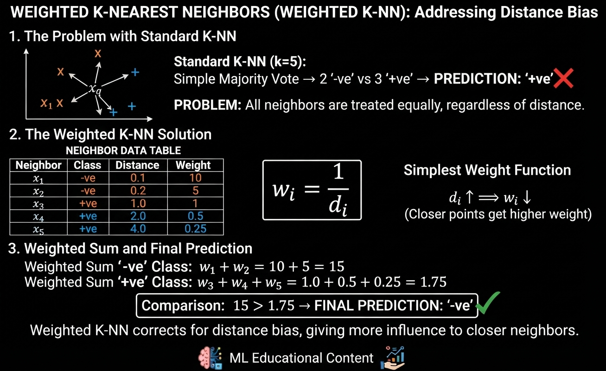

### Motivation

In standard K-NN, all $K$ neighbors contribute equally (one vote each).

But intuitively:
- A neighbor that is **very close** to the query point $x_q$ should have **more influence**.
- A neighbor that is **far** should have **less influence**.

This idea leads to **Weighted K-NN**.

### How Weighted K-NN Works

**Step 1:**  
Given query point $x_q$, find its $K$ nearest neighbors along with their distances:

$$
(x_1, y_1, d_1),\; (x_2, y_2, d_2),\; \dots,\; (x_K, y_K, d_K)
$$

**Step 2:**  
Assign a weight to each neighbor.  
The simplest and most common weight is:

$$
w_i = \dfrac{1}{d_i}
$$

**Properties of this weight:**
- As distance $d_i$ ↑ → weight $w_i$ ↓
- As distance $d_i$ ↓ → weight $w_i$ ↑

**Step 3:**  
For classification, compute the weighted votes for each class and choose the class with higher total weight.

### Example (5-NN)

| Neighbor | Class | Distance $d_i$ | Weight $w_i = 1/d_i$ |
|----------|-------|----------------|----------------------|
| $x_1$    | –ve   | 0.1            | 10                   |
| $x_2$    | –ve   | 0.2            | 5                    |
| $x_3$    | +ve   | 1.0            | 1                    |
| $x_4$    | +ve   | 2.0            | 0.5                  |
| $x_5$    | +ve   | 4.0            | 0.25                 |

**Weighted votes:**

- Total weight for –ve class = $10 + 5 = 15$
- Total weight for +ve class = $1 + 0.5 + 0.25 = 1.75$

**Decision:**  
Even though there are more +ve neighbors (3 vs 2), the –ve class wins because the closest neighbors are –ve.

$$
y_q = \text{–ve}
$$

(If we had used simple majority vote, the prediction would have been +ve.)

### Key Takeaway

Weighted K-NN gives more importance to closer neighbors.  
The simplest and widely used weight function is:

$$
w_i = \dfrac{1}{d_i}
$$

## 20. Voronoi Diagram

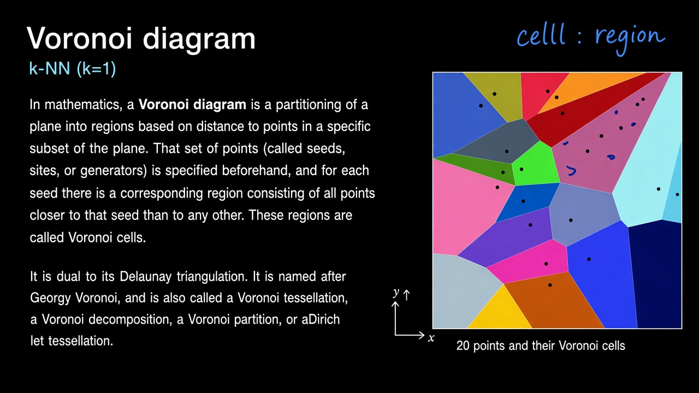
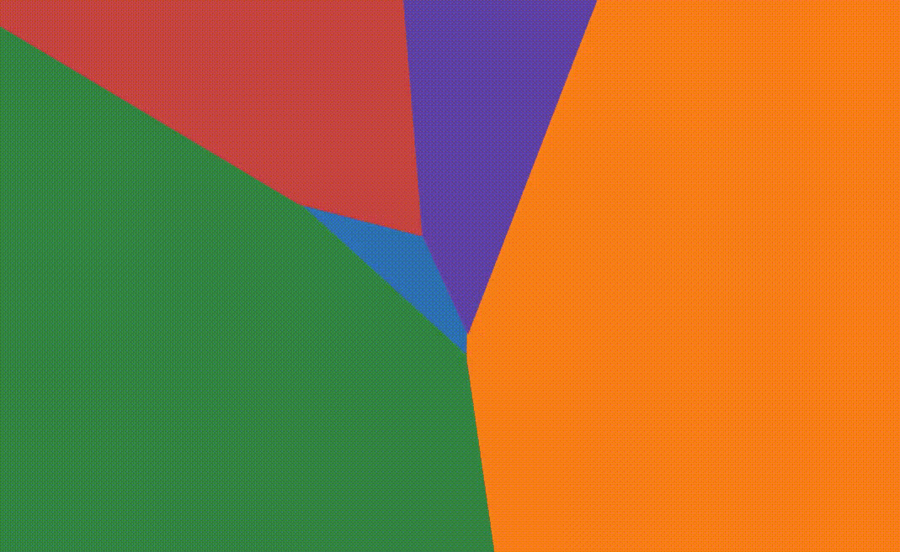

> ### Voronoi Diagram and 1-NN

### What is a Voronoi Diagram?

A **Voronoi diagram** is a partitioning of a plane into regions based on distance to a specific set of points (called seeds, sites, or generators).

- For each seed point, there is a corresponding region consisting of **all points closer to that seed than to any other seed**.
- These regions are called **Voronoi cells**.

It is also known as:
- Voronoi tessellation
- Voronoi decomposition
- Voronoi partition
- Dirichlet tessellation
- Thiessen polygons

### Connection to 1-NN

When we use **K-NN with $K = 1$** (i.e., 1-Nearest Neighbor):

- The decision boundary created by 1-NN is exactly the **Voronoi diagram** of the training points.
- Each training point owns a Voronoi cell.
- Any query point that falls inside a particular cell is assigned the class label of the training point that owns that cell.

### Visual Intuition

- Black dots = training points (seeds)
- Colored regions = Voronoi cells
- Each cell contains all locations that are closest to its seed point.

This is why 1-NN creates a piecewise-linear decision boundary that perfectly separates the space according to the nearest training example.

## 21. Binary Search Tree

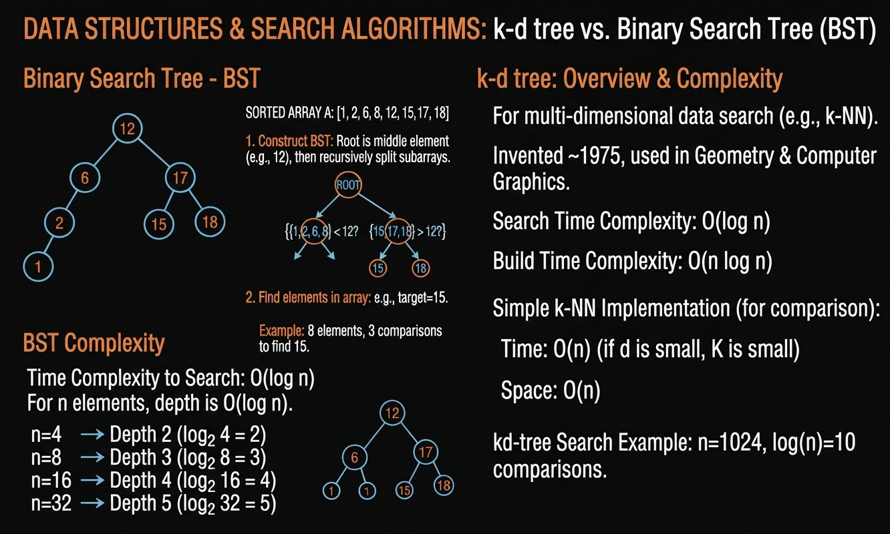

### Limitation of Simple K-NN

In the simple (brute-force) implementation of K-NN:

- **Time Complexity** (per query): $O(n)$  
  (when $d$ is small and $K$ is small)
- **Space Complexity**: $O(n)$

For large $n$, this becomes slow.

**Example:**  
If $n = 1024$, then $\log_2(n) = 10$.  
We want to reduce the query time from $O(n)$ to roughly $O(\log n)$.

### Solution: Kd-Tree

**Kd-Tree** (K-dimensional Tree) is a data structure that helps speed up nearest neighbor search.

- Invented around 1975
- Originally used in **Computational Geometry** and **Computer Graphics**
- Reduces average query time from $O(n)$ to $O(\log n)$ (when $d$ is small)

### Binary Search Tree (BST) – The Inspiration

**Problem:**  
Given a sorted array, check whether a number is present or not.

- Linear Search → $O(n)$
- Binary Search → $O(\log n)$

**Binary Search Tree** is a data structure that enables $O(\log n)$ search.

#### Key Property of BST

If a BST has $n$ elements and is reasonably balanced:

$$
\text{Depth of the tree} = O(\log n)
$$

**Examples:**

| Number of elements ($n$) | Depth ($\log_2 n$) |
|--------------------------|--------------------|
| 4                        | 2                  |
| 8                        | 3                  |
| 16                       | 4                  |
| 32                       | 5                  |

Time complexity of search in a balanced BST is $O(\log n)$ because we only need to travel down the depth of the tree.

### Connection to Kd-Tree

Kd-Tree is a generalization of Binary Search Tree to **multi-dimensional** data.

- BST works on 1-dimensional sorted data
- Kd-Tree works on $d$-dimensional points

This is why Kd-Tree can answer nearest neighbor queries much faster than the simple $O(n)$ approach when the number of dimensions is not too high.

## 22. How to Build a kd-Tree

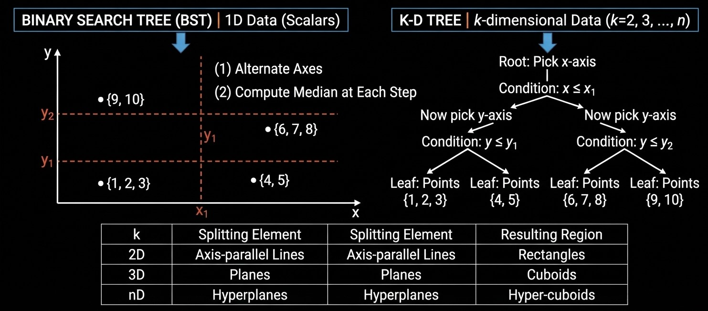

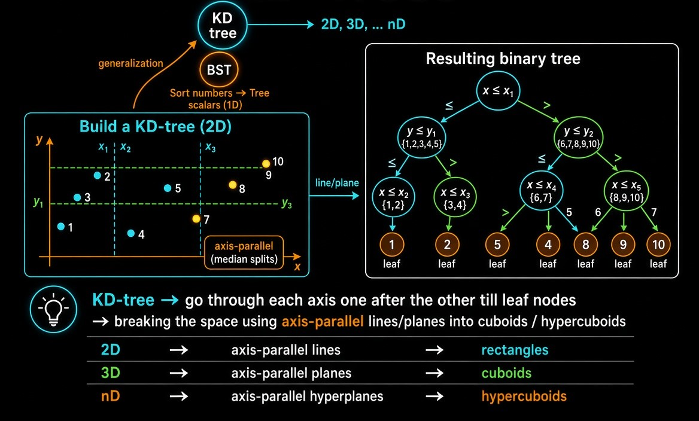

https://www.wikiwand.com/en/K-d_tree

### BST vs Kd-Tree

| Data Structure | Works on          | Data Type      |
|----------------|-------------------|----------------|
| **BST**        | 1-Dimensional     | Sorted scalars |
| **Kd-Tree**    | 2D, 3D, …, nD     | Multi-dimensional points |

Kd-Tree is a generalization of Binary Search Tree to higher dimensions.

### How to Build a Kd-Tree (2D Example)

**Steps:**

1. **Pick an axis** (start with $x$-axis).
2. Project all points onto that axis.
3. Find the **median** of the projected values.
4. Split the data into two halves using the median (axis-parallel line).
5. **Alternate** the axis at every level:
   - Level 1 → split on $x$
   - Level 2 → split on $y$
   - Level 3 → split on $x$
   - and so on…

### Geometric Interpretation

- In **2D**: We keep drawing **axis-parallel lines**. These lines divide the plane into **rectangles**.
- In **3D**: We use **axis-parallel planes**. These divide the space into **cuboids**.
- In **nD**: We use **axis-parallel hyperplanes**. These divide the space into **hyper-rectangles** (hypercuboids).

### Key Idea

A Kd-Tree recursively partitions the space by going through each axis one after another, using axis-parallel splitting hyperplanes, until we reach the leaf nodes (usually containing a small number of points).

This hierarchical partitioning is what allows nearest neighbor search to be performed much faster than the brute-force $O(n)$ approach (especially when the number of dimensions is not very high).

## 23. Find Nearest Neighbours Using kd-Tree

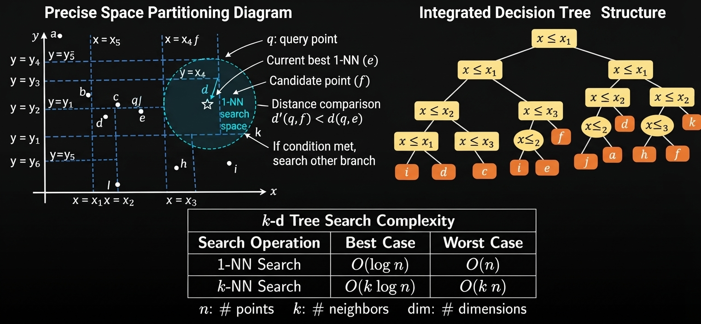
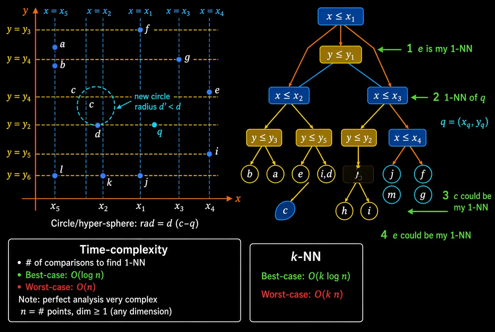

### How 1-NN Search Works in a Kd-Tree

1. Start from the root and traverse the tree just like a Binary Search Tree (following the splitting conditions) until you reach a **leaf**.
2. The point stored in that leaf becomes the **current best** (candidate for 1-NN).
3. Compute the distance $d$ from the query point $q$ to this candidate.
4. Draw a **circle** (in 2D) or **hypersphere** (in higher dimensions) of radius $d$ centered at $q$.
5. While going back up the tree (backtracking), check whether the splitting plane of any node intersects this circle/hypersphere.
   - If it does **not** intersect → the entire subtree on the other side can be **pruned** (no need to search).
   - If it **does** intersect → there might be a closer point, so we must search that subtree.

This pruning is what makes Kd-Tree much faster than brute-force search in practice.

### Time Complexity of Kd-Tree

#### For 1-Nearest Neighbor:

| Case       | Time Complexity | Explanation                              |
|------------|------------------|------------------------------------------|
| Best Case  | $O(\log n)$      | Ideal pruning, balanced tree             |
| Worst Case | $O(n)$           | Almost no pruning possible               |

A perfect theoretical analysis of the average case is **very complex**.

#### For K-Nearest Neighbors:

| Case       | Time Complexity     |
|------------|---------------------|
| Best Case  | $O(K \log n)$       |
| Worst Case | $O(K \cdot n)$      |

### Important Note

The efficiency of Kd-Tree degrades as the **number of dimensions** increases (curse of dimensionality).  
It works best when the dimensionality is relatively low.

## 24. Limitations of kd-Tree

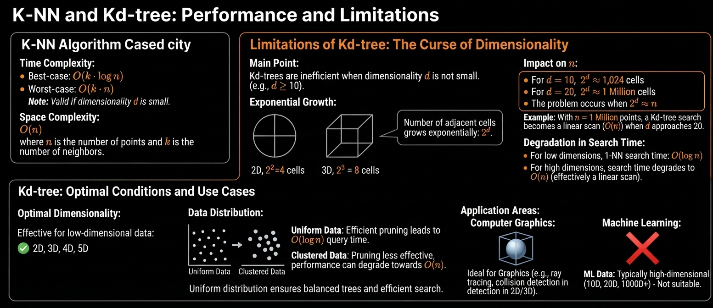
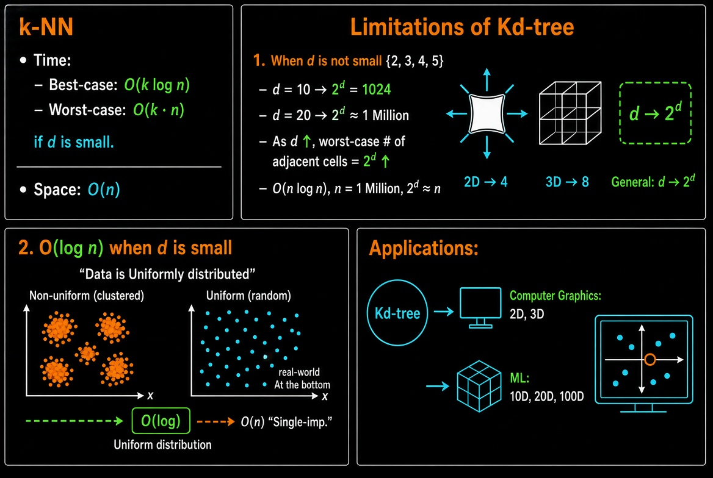

### Time & Space Complexity (Recap)

**Time Complexity of K-NN using Kd-Tree** (when $d$ is small):

| Case       | Time Complexity   |
|------------|-------------------|
| Best Case  | $O(K \log n)$     |
| Worst Case | $O(K \cdot n)$    |

**Space Complexity:** $O(n)$

### Limitation 1: High Dimensionality

Kd-Tree works well only when the number of dimensions $d$ is **small** (typically $d \leq 5$).

**Why does it fail in high dimensions?**

- In $d$ dimensions, each cell can have up to $2^d$ adjacent cells.
- Examples:
  - $d = 2$ → 4 neighbors
  - $d = 3$ → 8 neighbors
  - $d = 10$ → $2^{10} = 1024$
  - $d = 20$ → $2^{20} \approx 1$ million

When $2^d$ becomes comparable to $n$, pruning becomes ineffective and the time complexity approaches $O(n)$.

**Rule of thumb:**
- When $d$ is small (2, 3, 4, 5) → Time ≈ $O(\log n)$
- When $d$ is large (10, 20, …) → Time complexity increases **dramatically** and can become worse than simple $O(n)$ search.

### Limitation 2: Data Distribution

The $O(\log n)$ performance assumes that the data is **uniformly distributed**.

In real-world datasets:
- Data is often clustered
- Density varies a lot across the space

In such cases, the performance of Kd-Tree can degrade towards $O(n)$ (same as the simple implementation).

### Where Kd-Tree is Still Useful

| Domain              | Typical Dimensions | Kd-Tree Useful? |
|---------------------|--------------------|-----------------|
| Computer Graphics   | 2D, 3D             | Yes             |
| Machine Learning    | 10D, 20D, 100D+    | Usually No      |

### Summary

Kd-Tree is a great data structure for low-dimensional nearest neighbor search, but it suffers heavily from the **curse of dimensionality** and non-uniform data distributions, which are very common in Machine Learning.

## 25. Extensions

Variations : https://en.wikipedia.org/wiki/K-d_tree

## 26. Hashing vs LSH

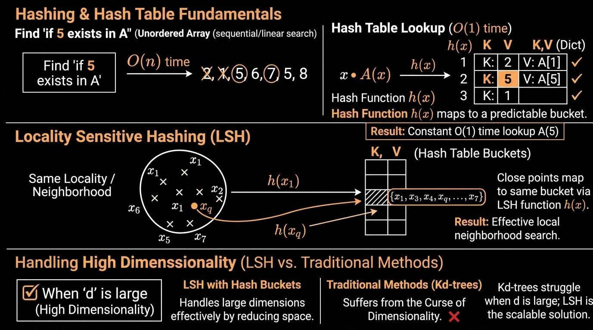
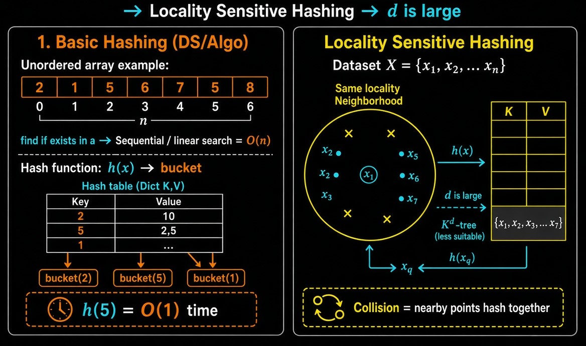

### Why do we need LSH?

Kd-Tree works well only when the number of dimensions $d$ is **small**.

When $d$ is **large**, we need a different approach → **Locality Sensitive Hashing (LSH)**.

### Classical Hashing (Reminder)

**Problem:**  
Given an unordered array, check whether a number exists or not.

- Sequential / Linear Search → $O(n)$
- Using a **Hash Table** (Dictionary) → Average $O(1)$ time

**How it works:**
- A hash function $h(x)$ maps a value $x$ to a **bucket** (index) in the hash table.
- All elements that hash to the same value go into the same bucket.

### Locality Sensitive Hashing (LSH)

**Goal:**  
Hash points that are **close to each other** (in the same neighborhood) into the **same bucket** with high probability.

**Key Idea:**

- If two points $x_i$ and $x_j$ are very close → $h(x_i) = h(x_j)$ with high probability.
- If two points are far apart → $h(x_i) \neq h(x_j)$ with high probability.

**Visual Intuition:**

- Points lying in the same local neighborhood are mapped to the same bucket in the hash table.
- During query time, we only search inside the bucket(s) where the query point hashes to — instead of searching the entire dataset.

### LSH vs Kd-Tree

| Method     | Best when          | Limitation                  |
|------------|--------------------|-----------------------------|
| Kd-Tree    | $d$ is small       | Fails when $d$ is large     |
| LSH        | $d$ is large       | Approximate (not exact)     |

LSH is particularly useful for high-dimensional data where exact nearest neighbor search becomes too expensive.

## 27. LSH for Cosine Similarity

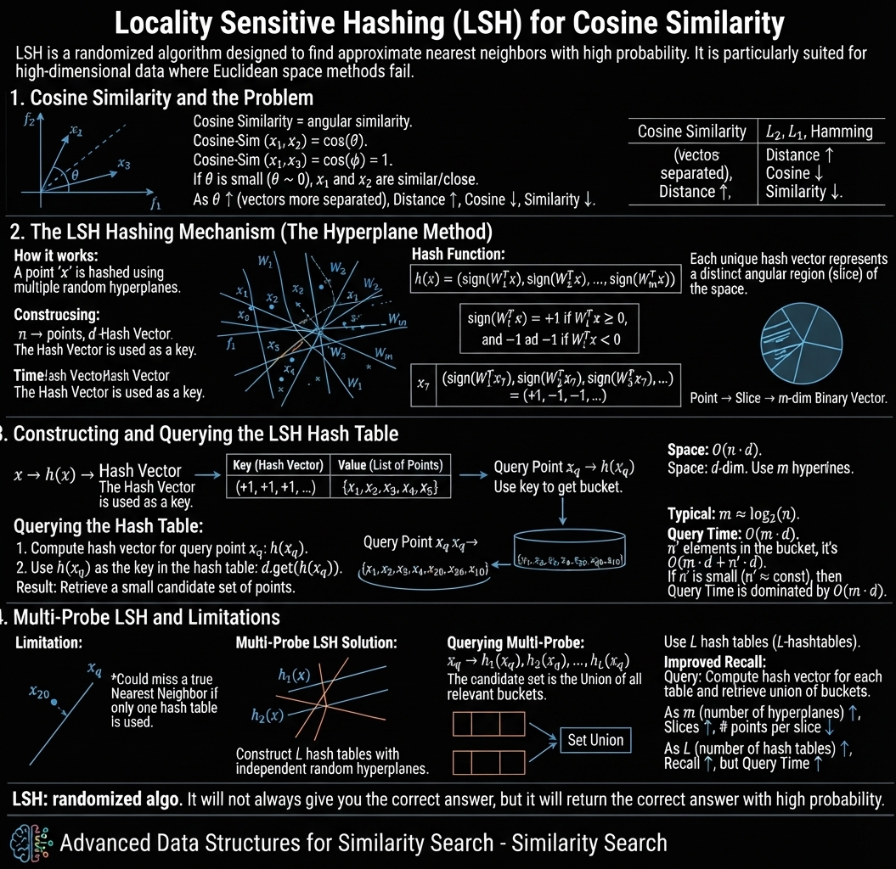
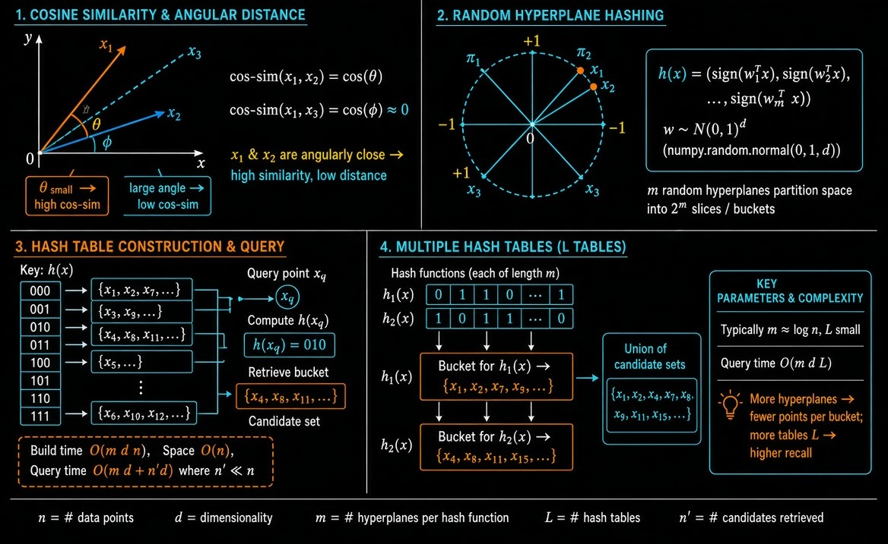

### Why Cosine Similarity?

Cosine Similarity measures the **angular** closeness between two vectors:

$$
\text{Cos-Sim}(x_1, x_2) = \cos(\theta)
$$

- $\theta$ small → high similarity (vectors point in similar directions)
- $\theta$ large → low similarity

Cosine Similarity is widely used when we care about the **direction** of vectors rather than their magnitude (common in text data, embeddings, etc.).

### Core Idea of LSH for Cosine Similarity

We want a hash function such that:

- If two points are **angularly close** (small $\theta$), they should fall into the **same bucket** with high probability.
- If two points are angularly far, they should fall into different buckets with high probability.

LSH is a **randomized algorithm**:  
It does **not** guarantee the exact nearest neighbor, but returns a correct answer with high probability.

### Random Hyperplane Hashing

**Key Idea:**  
Use randomly oriented hyperplanes to partition the space.

1. Generate a random vector $w \in \mathbb{R}^d$ where each component is sampled from $\mathcal{N}(0,1)$:

$$
w = \text{numpy.random.normal}(0, 1, d)
$$

2. The hyperplane is defined by:

$$
w^T x = 0
$$

3. The hash bit for a point $x$ is:

$$
h(x) = \text{sign}(w^T x) \quad \in \{+1, -1\}
$$

- Points on the same side of the hyperplane get the same bit.

### Creating the Hash Key (using $m$ hyperplanes)

We generate $m$ independent random hyperplanes: $w_1, w_2, \dots, w_m$.

For any point $x$, the hash key is the $m$-dimensional vector of signs:

$$
h(x) = \big( \text{sign}(w_1^T x),\; \text{sign}(w_2^T x),\; \dots,\; \text{sign}(w_m^T x) \big)
$$

This key is used to place the point into a bucket of a hash table.

**Effect of $m$:**
- Larger $m$ → more slices → fewer points per bucket → higher precision, but higher chance of missing true neighbors.

### Building the LSH Hash Table

**Input:**  
$n$ points in $d$ dimensions ($d$ can be large).

**Steps:**
1. Generate $m$ random hyperplanes.
2. For every point $x_i$, compute $h(x_i)$.
3. Insert $x_i$ into the hash table using $h(x_i)$ as the key.

**Complexity:**
- Time to build one hash table: $O(m \cdot d \cdot n)$
- Space: $O(n)$

### Querying with LSH

Given a query point $x_q$:

1. Compute its hash key $h(x_q)$ using the same $m$ hyperplanes.
2. Retrieve all points that fall into the same bucket.
3. Compute exact distances/similarities only with the points inside that bucket (usually a small number $n'$).

**Query Time (single table):**

$$
O(m d + n' d)
$$

If $n'$ is small → query is much faster than $O(n d)$.

### Improving Recall: Multiple Hash Tables

A single hash table can miss true neighbors (because of the random nature of the hyperplanes).

**Solution:** Use $L$ independent hash tables (each with its own set of $m$ random hyperplanes).

For a query $x_q$:
- Query all $L$ tables.
- Take the **union** of the candidates from all tables.
- Compute exact similarities only on this candidate set.

This significantly increases the probability of finding the true nearest neighbors.

### Typical Parameter Choices

- Number of hyperplanes per table:  
  $$m \approx \log n$$

- Number of tables $L$: kept relatively small.

**Typical Query Time:**

$$
O(d \cdot \log n)
$$

(when parameters are chosen well)

### Important Notes

- LSH for Cosine Similarity can **miss** a true nearest neighbor (it is approximate).
- It is especially useful when $d$ is large (where Kd-Tree fails).
- Increasing $m$ makes buckets purer but increases the chance of missing neighbors → compensated by using multiple tables ($L$).

### Summary

| Component              | Role                                      |
|------------------------|-------------------------------------------|
| Random Hyperplanes     | Create binary hash bits based on side     |
| $m$ hyperplanes        | Form the hash key (controls bucket size)  |
| Hash Table             | Groups similar points together            |
| $L$ tables             | Improves recall (reduces missed neighbors)|
| Query                  | Only search inside relevant buckets       |

## 28. LSH for Euclidean Distance

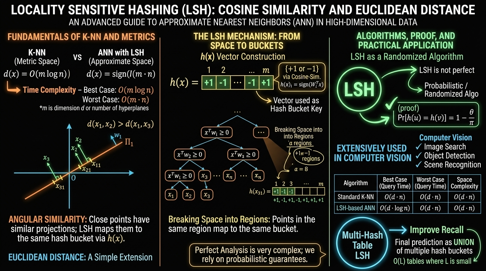
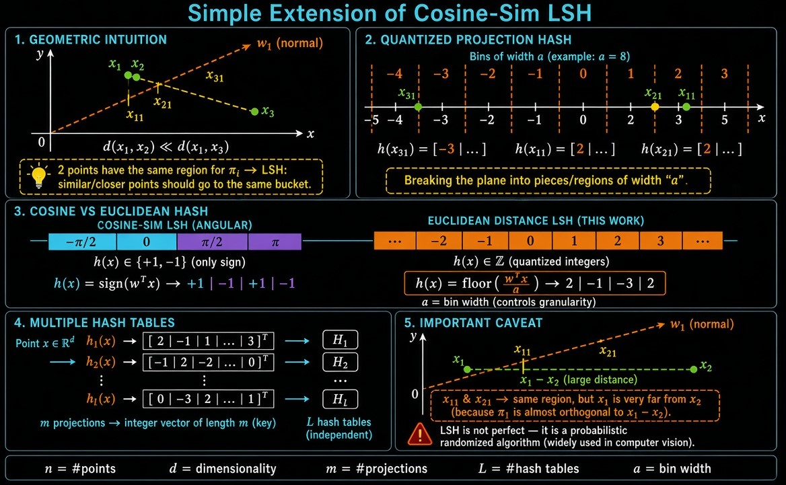

### Overview

- LSH for **Cosine Similarity** was based on random hyperplanes and sign bits ($+1$ / $-1$).
- LSH for **Euclidean Distance** is a simple extension of the same idea.

### Key Difference from Cosine LSH

In Cosine LSH, we only care about which **side** of the hyperplane a point lies on (the sign).

In Euclidean LSH, we care about **where** the point projects onto the random line (the actual projected value).

### How it Works

1. Take a random hyperplane (or random direction) $w$.
2. Project every point $x$ onto this direction:
   $$
   x_{\text{proj}} = w^T x
   $$
3. Instead of just taking the sign, we **discretize** the real line into buckets (regions) of fixed width.
4. The hash value is the **bucket ID** (an integer) into which the projection falls.

**Example:**
- The real line is broken into regions of width $a$ (e.g., $a = 8$).
- Points whose projections fall into the same interval get the same hash value.

### Visual Intuition

- Points that are close in Euclidean distance tend to have projections that fall into the **same region**.
- Points that are far apart are more likely to fall into different regions.

### Hash Key Construction

We use $m$ independent random directions.

For a point $x$, the hash key becomes a vector of $m$ integers (bucket IDs):

$$
h(x) = \big( b_1,\; b_2,\; \dots,\; b_m \big)
$$

where each $b_i$ is the bucket index of the projection onto the $i$-th random direction.

This is different from Cosine LSH, where the key consists only of $+1$ and $-1$.

### Multiple Hash Tables

Just like in Cosine LSH, we create $L$ independent hash tables (each with its own set of $m$ random directions) to improve the probability of finding true nearest neighbors.

### Important Properties

- LSH is a **probabilistic / randomized** algorithm.
- It does **not** always return the exact nearest neighbor.
- It returns the correct answer with high probability.
- It is used extensively in Computer Vision and other high-dimensional domains.

### Summary Comparison

| Aspect              | Cosine LSH                  | Euclidean LSH                     |
|---------------------|-----------------------------|-----------------------------------|
| Hash bit / value    | $\text{sign}(w^T x)$ ($+1/-1$) | Bucket ID of projection (integer) |
| What it captures    | Angular closeness           | Euclidean closeness               |
| Discretization      | Two sides of hyperplane     | Multiple intervals on the line    |
| Nature              | Approximate / Probabilistic | Approximate / Probabilistic       |

## 29. Probabilistic Class Label

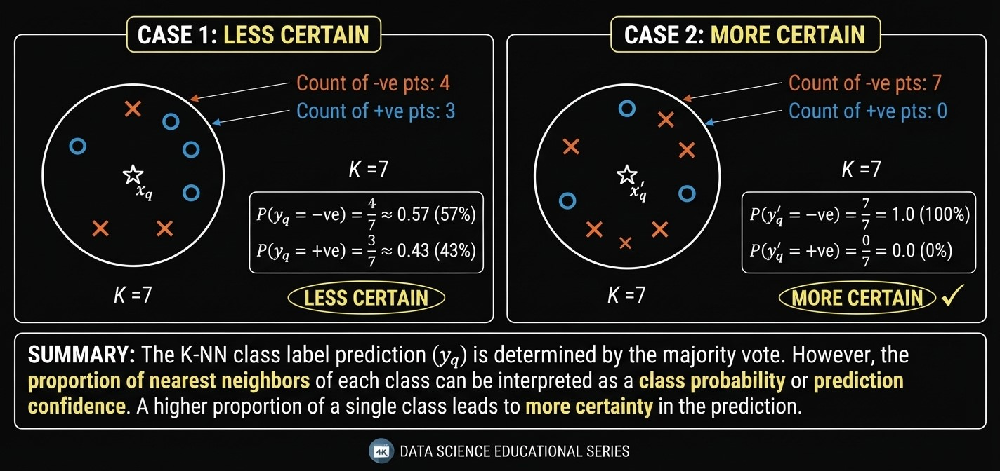
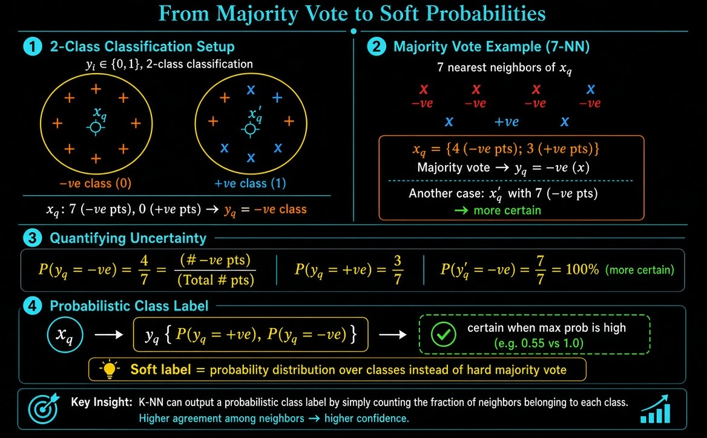

### Standard K-NN (Majority Vote)

In binary classification ($y_i \in \{0,1\}$ or $\{+\text{ve}, -\text{ve}\}$):

- Find the $K$ nearest neighbors of the query point $x_q$.
- Predict the class that has the **majority** among those $K$ neighbors.

**Example (7-NN):**

- Query point $x_q$ has:
  - 4 negative points
  - 3 positive points

$$
y_q = -\text{ve} \quad (\text{by majority vote})
$$

### Problem with Hard Labels

Majority vote gives only a **hard** prediction.  
It does not tell us **how confident** we are in that prediction.

### Probabilistic Class Label

Instead of returning only the majority class, we can return the **probability** of each class:

$$
P(y_q = -\text{ve}) = \dfrac{\text{Number of } -\text{ve neighbors}}{K}
$$

$$
P(y_q = +\text{ve}) = \dfrac{\text{Number of } +\text{ve neighbors}}{K}
$$

**Example (same 7-NN):**

$$
P(y_q = -\text{ve}) = \dfrac{4}{7} \approx 0.57
$$

$$
P(y_q = +\text{ve}) = \dfrac{3}{7} \approx 0.43
$$

### Interpreting Confidence

| Situation                          | Probability              | Confidence Level      |
|------------------------------------|--------------------------|-----------------------|
| 4 negative, 3 positive             | $P(-\text{ve}) = 4/7$    | Moderate certainty    |
| 7 negative, 0 positive             | $P(-\text{ve}) = 7/7 = 1$| Very high certainty   |
| Probability close to 0.5           | ≈ 0.55                   | Low certainty         |

### Key Takeaway

By returning class probabilities instead of only the majority label, K-NN becomes a **probabilistic classifier**.

This is useful when:
- We need calibrated confidence scores
- We want to reject low-confidence predictions
- We need soft labels for downstream tasks

## 30. Code Sample: Decision Boundary

> [KNN.ipynb](./30.%20KNN.ipynb)

https://scikit-learn.org/stable/modules/generated/sklearn.neighbors.KNeighborsClassifier.html

## 31. Code Sample: Cross Validation

> [K-fold.ipynb](./31.%20K-fold.ipynb)

## 32. Revision Questions

[01. Explain about K-Nearest Neighbors?](#01-explain-about-k-nearest-neighbors)  
[02. Failure cases of KNN?](#02-failure-cases-of-knn)  
[03. Define Distance measures: Euclidean (L2), Manhattan (L1), Minkowski, Hamming?](#03-define-distance-measures-euclidean-l2-manhattan-l1-minkowski-hamming)  
[04. What is Cosine Distance & Cosine Similarity?](#04-what-is-cosine-distance--cosine-similarity)  
[05. How to measure the effectiveness of k-NN?](#05-how-to-measure-the-effectiveness-of-k-nn)  
[06. Limitations of KNN?](#06-limitations-of-knn)  
[07. How to handle Overfitting and Underfitting in KNN?](#07-how-to-handle-overfitting-and-underfitting-in-knn)  
[08. Need for Cross validation?](#08-need-for-cross-validation)  
[09. What is K-fold cross validation?](#09-what-is-k-fold-cross-validation)  
[10. What is Time based splitting?](#10-what-is-time-based-splitting)  
[11. Explain k-NN for regression?](#11-explain-k-nn-for-regression)  
[12. Weighted k-NN?](#12-weighted-k-nn)  
[13. How to build a kd-tree?](#13-how-to-build-a-kd-tree)  
[14. Find nearest neighbors using kd-tree?](#14-find-nearest-neighbors-using-kd-tree)  
[15. What is Locality Sensitive Hashing (LSH)?](#15-what-is-locality-sensitive-hashing-lsh)  
[16. Hashing vs LSH?](#16-hashing-vs-lsh)  
[17. LSH for cosine similarity?](#17-lsh-for-cosine-similarity)  
[18. LSH for Euclidean distance?](#18-lsh-for-euclidean-distance)

### 01. Explain about K-Nearest Neighbors?
<a id="01-explain-about-k-nearest-neighbors"></a>

**K-Nearest Neighbors (KNN)** is a simple, non-parametric, lazy learning algorithm used for both **classification** and **regression**.

**Core idea (Geometric intuition):**  
Given a query point \(x_q\), find the \(k\) closest training points (neighbors) according to a distance metric.  

- **Classification**: Majority vote of the class labels of the \(k\) neighbors.  
- **Regression**: Average (or weighted average) of the target values of the \(k\) neighbors.

**Key characteristics:**
- Instance-based / memory-based learning (stores the entire training set).
- No explicit training phase (lazy learner).
- Decision boundary is piecewise linear / Voronoi-like.
- Works well when the decision surface is highly non-linear.

**Hyper-parameter**: \(k\) (number of neighbors). Small \(k\) → complex boundary; large \(k\) → smoother boundary.

### 02. Failure cases of KNN?
<a id="02-failure-cases-of-knn"></a>

KNN fails or performs poorly in these situations:

1. **High-dimensional data** (Curse of Dimensionality) – distances become similar; nearest neighbors lose meaning.
2. **Imbalanced classes** – majority class dominates the vote.
3. **Noisy data / outliers** – a single noisy point can change the prediction (especially for small \(k\)).
4. **Irrelevant or correlated features** – distance is dominated by useless dimensions.
5. **Non-uniform density** – in regions of varying density, fixed \(k\) can pick points that are too far or too close.
6. **Large datasets** – brute-force search is \(O(nd)\) per query (slow).
7. **When features are on very different scales** – without normalization, large-scale features dominate.

### 03. Define Distance measures: Euclidean (L2), Manhattan (L1), Minkowski, Hamming?
<a id="03-define-distance-measures-euclidean-l2-manhattan-l1-minkowski-hamming"></a>

**1. Euclidean Distance (L2)**  
\[
d(\mathbf{x}, \mathbf{y}) = \sqrt{\sum_{i=1}^{d} (x_i - y_i)^2}
\]
Most common. Sensitive to scale and outliers.

**2. Manhattan Distance (L1 / City-block)**  
\[
d(\mathbf{x}, \mathbf{y}) = \sum_{i=1}^{d} |x_i - y_i|
\]
Less sensitive to outliers. Useful in grid-like spaces.

**3. Minkowski Distance**  
Generalization of both:  
\[
d(\mathbf{x}, \mathbf{y}) = \left( \sum_{i=1}^{d} |x_i - y_i|^p \right)^{1/p}
\]
- \(p=1\) → Manhattan  
- \(p=2\) → Euclidean  
- \(p \to \infty\) → Chebyshev distance

**4. Hamming Distance**  
Number of positions at which two binary (or categorical) vectors differ.  
Used for binary features, strings, DNA sequences, etc.

### 04. What is Cosine Distance & Cosine Similarity?
<a id="04-what-is-cosine-distance--cosine-similarity"></a>

**Cosine Similarity** measures the cosine of the angle between two vectors:  
\[
\text{CosSim}(\mathbf{x}, \mathbf{y}) = \frac{\mathbf{x} \cdot \mathbf{y}}{\|\mathbf{x}\| \|\mathbf{y}\|}
\]
Range: \([-1, 1]\) (usually \([0, 1]\) for non-negative data).

**Cosine Distance** = \(1 - \text{CosSim}\)

**When to use**:  
- Text data (TF-IDF, word embeddings)  
- When magnitude does not matter, only direction/orientation matters.  
- High-dimensional sparse data.

### 05. How to measure the effectiveness of k-NN?
<a id="05-how-to-measure-the-effectiveness-of-k-nn"></a>

Common evaluation metrics:

**Classification**
- Accuracy
- Precision, Recall, F1-score
- Confusion matrix
- ROC-AUC (for binary / multi-class one-vs-rest)

**Regression**
- Mean Squared Error (MSE)
- Mean Absolute Error (MAE)
- \(R^2\) score

**Best practice**: Always evaluate on a **held-out test set** or use **cross-validation**. Never report training accuracy (KNN can achieve 100% train accuracy for \(k=1\)).

### 06. Limitations of KNN?
<a id="06-limitations-of-knn"></a>

- Computationally expensive at prediction time (\(O(nd)\)).
- Requires large memory (stores all training points).
- Sensitive to the choice of \(k\) and distance metric.
- Suffers from the curse of dimensionality.
- Does not handle missing values well natively.
- Performance degrades with noisy/irrelevant features.
- No interpretability of “learned” model (no coefficients or feature importance by default).

### 07. How to handle Overfitting and Underfitting in KNN?
<a id="07-how-to-handle-overfitting-and-underfitting-in-knn"></a>

| Problem       | Cause                  | Solution                                      |
|---------------|------------------------|-----------------------------------------------|
| **Overfitting** | Small \(k\) (esp. \(k=1\)) | Increase \(k\), use weighted KNN, feature selection/dimensionality reduction |
| **Underfitting** | Very large \(k\)      | Decrease \(k\), try different distance metrics |

Additional techniques:
- Feature scaling / normalization
- Feature selection or PCA
- Cross-validation to choose optimal \(k\)

### 08. Need for Cross validation?
<a id="08-need-for-cross-validation"></a>

- To get a more reliable estimate of model performance than a single train-test split.
- To select the best hyper-parameters (especially \(k\)) without overfitting to the test set.
- Reduces variance of the performance estimate.
- Makes better use of limited data.

### 09. What is K-fold cross validation?
<a id="09-what-is-k-fold-cross-validation"></a>

1. Split the data into \(K\) equal-sized folds.
2. For each fold \(i = 1\) to \(K\):
   - Train on the remaining \(K-1\) folds.
   - Validate on fold \(i\).
3. Average the \(K\) validation scores → final performance estimate.

Common values: \(K=5\) or \(K=10\).  
Special case: Leave-One-Out CV when \(K = n\).

### 10. What is Time based splitting?
<a id="10-what-is-time-based-splitting"></a>

Used when data has a temporal order (time-series, sequential data, user activity logs, etc.).

- Sort data by time.
- Train on past data, validate/test on future data.
- Never randomly shuffle (would cause data leakage).

Common schemes:
- Simple chronological split
- Rolling-window / expanding-window cross-validation

### 11. Explain k-NN for regression?
<a id="11-explain-k-nn-for-regression"></a>

Instead of majority vote, we take the **average** (or weighted average) of the target values of the \(k\) nearest neighbors:

\[
\hat{y}_q = \frac{1}{k} \sum_{i \in N_k(x_q)} y_i
\]

or weighted version:

\[
\hat{y}_q = \frac{\sum_{i \in N_k} w_i y_i}{\sum_{i \in N_k} w_i}
\]

where \(w_i\) is usually inversely proportional to distance.

### 12. Weighted k-NN?
<a id="12-weighted-k-nn"></a>

Neighbors closer to the query point get higher weight.

Common weighting schemes:
- Inverse distance: \(w_i = \frac{1}{d(x_q, x_i)}\)
- Inverse squared distance
- Kernel-based weights (Gaussian, Epanechnikov, etc.)

Advantage: Reduces the impact of distant neighbors and often improves performance, especially for small \(k\).

### 13. How to build a kd-tree?
<a id="13-how-to-build-a-kd-tree"></a>

A **kd-tree** is a binary space-partitioning tree for organizing points in \(k\)-dimensional space.

**Construction (recursive):**
1. Choose a dimension (usually cycle through dimensions or choose the one with highest variance).
2. Find the median of the points along that dimension → this becomes the splitting hyperplane.
3. Recursively build left subtree on points ≤ median and right subtree on points > median.
4. Stop when a leaf contains fewer than a threshold number of points.

Depth is \(O(\log n)\) on average for balanced trees.

### 14. Find nearest neighbors using kd-tree?
<a id="14-find-nearest-neighbors-using-kd-tree"></a>

**Nearest Neighbor Search algorithm:**
1. Start at the root and traverse down to a leaf following the splitting planes (as if inserting the query point).
2. Keep track of the current best (closest) point found.
3. Backtrack: at each node, check if the other side of the splitting plane could contain a closer point (using the distance to the plane).
4. Prune branches that cannot improve the current best distance.
5. Continue until the entire tree has been explored or pruned.

Average time complexity: \(O(\log n)\) in low dimensions; degrades toward \(O(n)\) in high dimensions.

### 15. What is Locality Sensitive Hashing (LSH)?
<a id="15-what-is-locality-sensitive-hashing-lsh"></a>

**Locality Sensitive Hashing** is a technique for approximate nearest neighbor search in high dimensions.

**Idea**: Design hash functions such that  
- Similar points (close in the chosen distance) have a high probability of colliding (same hash bucket).  
- Dissimilar points have a low probability of colliding.

Multiple hash tables are usually used to improve recall.  
Trade-off: Approximate results for massive speed-up.

### 16. Hashing vs LSH?
<a id="16-hashing-vs-lsh"></a>

| Aspect              | Traditional Hashing                  | Locality Sensitive Hashing (LSH)          |
|---------------------|--------------------------------------|-------------------------------------------|
| Goal                | Minimize collisions                  | Maximize collisions for similar items     |
| Collision behavior  | Random / uniform                     | Distance-dependent                        |
| Use case            | Exact lookup, load balancing         | Approximate nearest neighbor search       |
| Hash function design| Independent of data similarity       | Carefully designed for a distance metric  |

### 17. LSH for cosine similarity?
<a id="17-lsh-for-cosine-similarity"></a>

**Random Projection / SimHash method:**

1. Generate random hyperplanes (random vectors \(r\) from Gaussian or uniform on sphere).
2. For a data point \(x\), the hash bit is:
   \[
   h_r(x) = \begin{cases} 
   1 & \text{if } x \cdot r \ge 0 \\
   0 & \text{otherwise}
   \end{cases}
   \]
3. Concatenate several such bits to form a hash signature.
4. Points with similar cosine similarity will have similar signatures (Hamming distance of signatures approximates the angle).

This is the classic LSH family for cosine similarity (or angular distance).

### 18. LSH for Euclidean distance?
<a id="18-lsh-for-euclidean-distance"></a>

**p-stable distributions method (mainly for \(p=2\)):**

1. Choose a random vector \(a\) from a Gaussian distribution (2-stable).
2. Choose a random offset \(b \sim U[0, w]\).
3. Hash function:
   \[
   h_{a,b}(x) = \left\lfloor \frac{a \cdot x + b}{w} \right\rfloor
   \]
   where \(w\) is the bucket width.

Points that are close in Euclidean distance are more likely to fall into the same bucket.  
Multiple independent hash functions + multiple tables are used to boost accuracy.

**Quick Tips for Revision**
- Always normalize/standardize features before using distance-based methods.
- Use cross-validation to choose \(k\).
- For high-dimensional or large-scale data → consider LSH, kd-trees (low-d), or approximate methods.
- Weighted KNN + good feature engineering often beats plain KNN.
