

# Classification Algorithms in Various Situations

## Table of Contents

[01. Introduction](#01-introduction)

[02. Imbalanced vs Balanced Dataset](#02-imbalanced-vs-balanced-dataset)

[03. Multi-Class Classification](#03-multi-class-classification)

[04. k-NN, Given a Distance or Similarity Matrix](#04-k-nn-given-a-distance-or-similarity-matrix)

[05. Train and Test Set Differences](#05-train-and-test-set-differences)

[06. Impact of Outliers](#06-impact-of-outliers)

[07. Local Outlier Factor (Simple Solution: Mean Distance to k-NN)](#07-local-outlier-factor-simple-solution-mean-distance-to-k-nn)

[08. k-Distance](#08-k-distance)

[09. Reachability-Distance (A, B)](#09-reachability-distance-a-b)

[10 - Local Reachability-Density (A)](#10-local-reachability-density-a)

[11. Local Outlier Factor (A)](#11-local-outlier-factor-a)

[12. Impact of Scale & Column Standardization](#12-impact-of-scale-column-standardization)

[13. Interpretability](#13-interpretability)

[14. Feature Importance and Forward Feature Selection](#14-feature-importance-and-forward-feature-selection)

[15. Handling Categorical and Numerical Features](#15-handling-categorical-and-numerical-features)

[16. Handling Missing Values by Imputation](#16-handling-missing-values-by-imputation)

[17. Curse of Dimensionality](#17-curse-of-dimensionality)

[18. Bias-Variance Tradeoff](#18-bias-variance-tradeoff)

[19. Intuitive Understanding of Bias-Variance](#19-intuitive-understanding-of-bias-variance)

[20. Best and Worst Case of Algorithm](#20-best-and-worst-case-of-algorithm)

[21. Revision Questions](#21-revision-questions)

## 01. Introduction

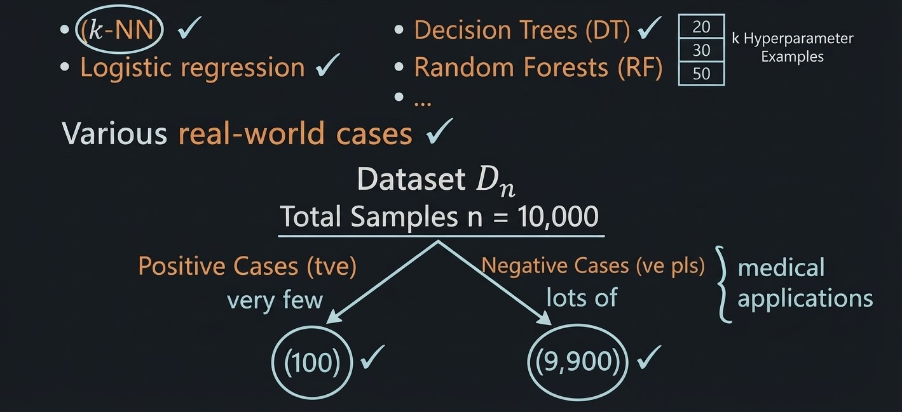

### Overview

We have studied several classification algorithms:

- **K-NN**
- Logistic Regression
- Decision Trees (DT)
- Random Forest (RF)
- … and others

Now we look at how these algorithms behave in **real-world cases**, especially when the data is highly imbalanced.

### Real-World Case: Imbalanced Data

In many practical problems (especially medical applications), the two classes are **not equally represented**.

**Example:**

Dataset size: $n = 10{,}000$

- Positive class ($+$ve): only **100** points (very few)
- Negative class ($-$ve): **9{,}900** points

Or even more extreme:

- Positive: 1{,}000
- Negative: 1 Million (1M)

This kind of severe class imbalance is very common in:

- Medical diagnosis (disease vs healthy)
- Fraud detection
- Rare event prediction

### Key Challenge

When the positive class is extremely rare:

- A model that always predicts the majority class (negative) can achieve very high accuracy.
- But such a model is useless in practice because it never detects the rare (but important) positive cases.

This is why we need to carefully choose and evaluate classification algorithms in imbalanced settings.

## 02. Imbalanced vs Balanced Dataset

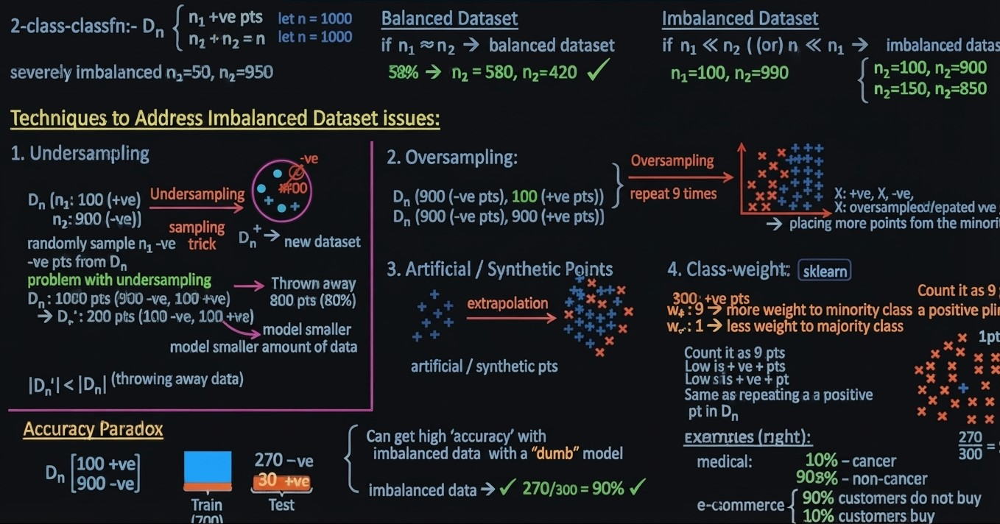

### Definition

In a 2-class classification problem:

$$
D_n = \{ n_1 \text{ positive points},\; n_2 \text{ negative points} \}
$$

where $n_1 + n_2 = n$.

- **Balanced Dataset**: $n_1 \approx n_2$
- **Imbalanced Dataset**: $n_1 \ll n_2$ or $n_2 \ll n_1$

**Examples of Imbalance:**

| Positive ($n_1$) | Negative ($n_2$) | Type                  |
|------------------|------------------|-----------------------|
| 580              | 420              | Slightly imbalanced   |
| 100              | 900              | Imbalanced            |
| 50               | 950              | Severely imbalanced   |

### Problem with K-NN on Imbalanced Data

When the majority class dominates (e.g., 950 negative vs 50 positive):

- K-NN uses **majority vote**.
- The majority class becomes the **dominant class**.
- Most query points will be classified as the majority class simply because most neighbors belong to it.

This is **not always** desirable, especially when the minority class is the important one (e.g., disease detection).

### How to Work Around Imbalanced Dataset Issues

#### 1. Undersampling

- Keep all minority class points.
- Randomly sample the same number of majority class points.
- Create a new balanced dataset $D_n'$.

**Example:**
- Original: 100 positive + 900 negative
- After undersampling: 100 positive + 100 negative

**Problem with Undersampling:**
- We throw away a large amount of data (e.g., 800 points).
- The model is trained on a much smaller dataset → information loss.

#### 2. Oversampling

- Keep all majority class points.
- Repeat (duplicate) the minority class points multiple times until the classes become balanced.

**Example:**
- Original: 100 positive + 900 negative
- Repeat the 100 positive points 9 times → 900 positive + 900 negative

**Visual Idea:**
- We place more copies of the minority class points into the dataset.

#### 3. Synthetic Points (Advanced Oversampling)

Instead of simply duplicating points, we can generate **artificial / synthetic** points by extrapolation around the existing minority class points.

This is the idea behind techniques like SMOTE.

#### 4. Class-Weight (in sklearn)

Instead of changing the data, we can give **higher weight** to the minority class during training.

**Example:**
- 100 positive, 900 negative
- Set `class_weight`:
  - $w_{+} = 9$ (more weight to minority)
  - $w_{-} = 1$ (less weight to majority)

In K-NN, this is equivalent to treating each positive point as if it were repeated 9 times.

### Why Accuracy is Misleading on Imbalanced Data

**Example:**

- Dataset: 100 positive + 900 negative (ratio 1:9)
- Train: 700 points (630 negative, 70 positive)
- Test: 300 points (270 negative, 30 positive)

A **dumb model** that always predicts “negative” achieves:

$$
\text{Accuracy} = \dfrac{270}{300} = 90\%
$$

This looks excellent, but the model never detects any positive case → completely useless in practice.

### Real-World Examples of Imbalanced Data

| Domain        | Minority Class       | Majority Class          |
|---------------|----------------------|-------------------------|
| Medical       | Cancer (10%)         | Non-Cancer (90%)        |
| E-Commerce    | Customers who buy (10%) | Customers who do not buy (90%) |

### Summary of Solutions

| Method              | Idea                              | Drawback / Note                     |
|---------------------|-----------------------------------|-------------------------------------|
| Undersampling       | Reduce majority class             | Throws away data                    |
| Oversampling        | Duplicate minority class          | Can cause overfitting               |
| Synthetic points    | Generate new minority points      | Better than simple duplication      |
| Class-weight        | Give higher weight to minority    | No change to data size              |

**Key Takeaway:**  
Never rely only on accuracy when the dataset is imbalanced. Always look at metrics that focus on the minority class (Precision, Recall, F1-score, etc.).

## 03. Multi-Class Classification

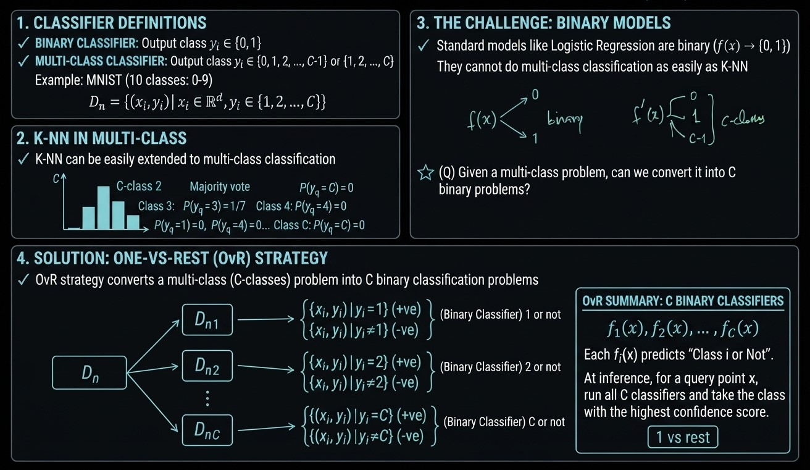

### Binary vs Multi-Class

- **Binary Classifier**:  
  $y_i \in \{0, 1\}$

- **Multi-Class Classifier**:  
  $y_i \in \{0, 1, 2, \dots, 9\}$  
  (Example: MNIST digit classification → 10 classes)

In general, for a $c$-class problem:

$$
D_n = \big\{ (x_i, y_i) \;\big|\; x_i \in \mathbb{R}^d,\; y_i \in \{1, 2, 3, \dots, c\} \big\}
$$

### K-NN for Multi-Class Classification

K-NN extends **very easily** to multi-class problems.

**Example (7-NN):**

For a query point $x_q$, the 7 nearest neighbors belong to classes:

| Class | Count |
|-------|-------|
| 1     | 0     |
| 2     | 6     |
| 3     | 1     |
| …     | 0     |

- **Majority Vote** → Predict class 2  
  ($y_q = 2$)

- **Probabilistic Classifier**:

$$
P(y_q = 2) = \dfrac{6}{7}, \quad
P(y_q = 3) = \dfrac{1}{7}, \quad
P(y_q = 1) = 0,\; \dots
$$

### Logistic Regression and Multi-Class

Logistic Regression is fundamentally a **binary classifier**.  
It cannot directly handle multi-class problems the way K-NN can.

**Question:**  
Given a multi-class classification problem, can we convert it into binary classification problems?

### One-vs-Rest (OvR) Strategy

Yes. We can reduce a $c$-class problem into **$c$ binary classification problems**.

**Idea:**

For each class $k = 1$ to $c$:

- Treat class $k$ as the **positive** class
- Treat all other classes as the **negative** class
- Train a binary classifier $f_k(x)$ that answers:  
  “Is this point class $k$ or not?”

**Result:**

We obtain $c$ binary classifiers:

$$
\begin{align*}
f_1(x) &\rightarrow \text{Class 1 or not} \\
f_2(x) &\rightarrow \text{Class 2 or not} \\
&\vdots \\
f_c(x) &\rightarrow \text{Class } c \text{ or not}
\end{align*}
$$

This approach is called **One-vs-Rest** (also known as One-vs-All).

### Summary

| Algorithm            | Multi-class Support          | How?                          |
|----------------------|------------------------------|-------------------------------|
| K-NN                 | Native                       | Majority vote / probabilities |
| Logistic Regression  | Needs conversion             | One-vs-Rest (OvR)             |

One-vs-Rest is a standard and widely used technique to extend any binary classifier to multi-class problems.

## 04. k-NN, Given a Distance or Similarity Matrix

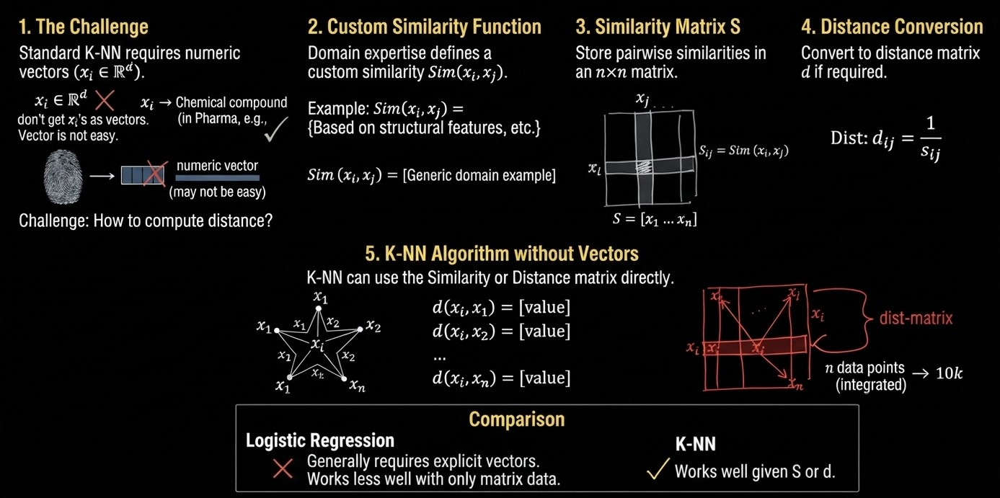

### The Standard Assumption

In normal classification, we assume:

$$
x_i \in \mathbb{R}^d
$$

i.e., every data point is available as a **numeric feature vector**.

### Real-World Situation Where Vectors Are Hard

Sometimes it is **not easy** (or not natural) to represent the data as numeric vectors.

**Example (Pharmaceutical / Chemical domain):**

- Each $x_i$ is a **chemical compound** (e.g., Paracetamol).
- Converting a chemical structure into a fixed-length numeric vector is non-trivial.
- However, domain experts (pharmacists / chemists) can easily define a **similarity** between two compounds:

$$
\text{Sim}(x_i, x_j)
$$

### Similarity Matrix / Distance Matrix

When we have $n$ data points, we can construct an $n \times n$ **Similarity Matrix** $S$:

$$
S_{ij} = \text{Sim}(x_i, x_j)
$$

We can convert similarity into distance:

$$
d_{ij} = \dfrac{1}{S_{ij}}
$$

(or any other decreasing transformation).

### K-NN Works Directly with Similarity or Distance Matrix

K-NN does **not** require the original feature vectors $x_i \in \mathbb{R}^d$.

It only needs:

- Either the Similarity Matrix $S$, or
- The Distance Matrix $D$

Given any query point, we can still find its $K$ nearest neighbors using the precomputed distances/similarities and apply majority vote (or probabilistic prediction).

### Comparison with Other Algorithms

| Algorithm            | Needs explicit feature vectors $x_i \in \mathbb{R}^d$? | Works with only Similarity / Distance Matrix? |
|----------------------|-------------------------------------------------------|-----------------------------------------------|
| **K-NN**             | No                                                    | Yes (works very well)                         |
| Logistic Regression  | Yes                                                   | No                                            |
| Most other models    | Yes                                                   | No                                            |

### Key Takeaway

K-NN is extremely flexible:

- It only needs a notion of **distance** or **similarity** between points.
- It does not require the points to be embedded in a Euclidean vector space.
- This makes it useful in domains (chemistry, biology, graphs, text, etc.) where defining a good feature vector is hard, but defining a similarity is natural.

## 05. Train and Test Set Differences

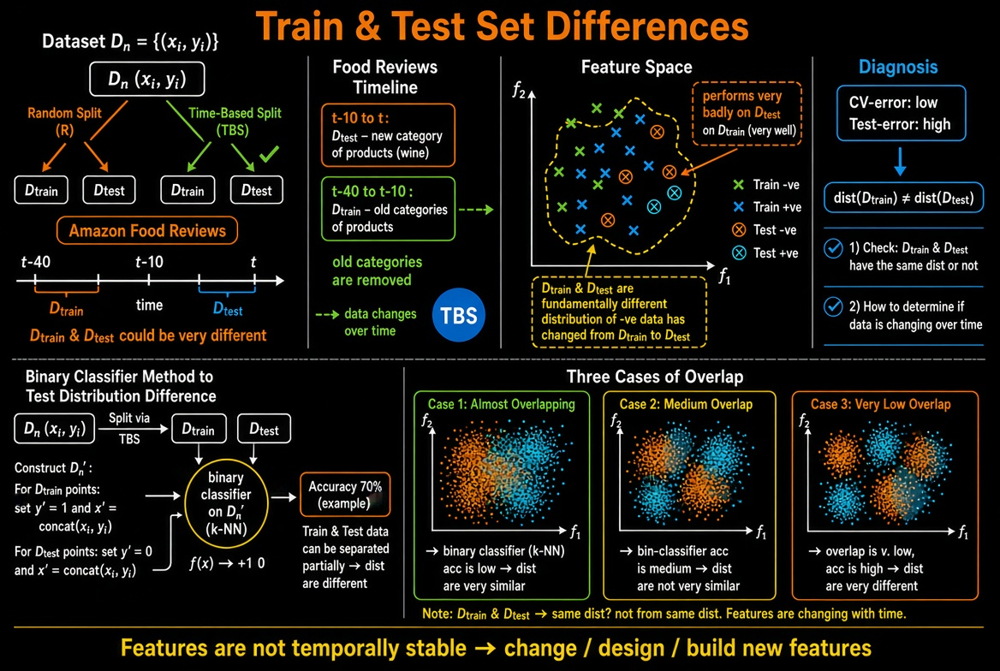

### Random Split vs Time-Based Split (TBS)

When we split $D_n$ into $D_{\text{Train}}$ and $D_{\text{Test}}$:

- **Random Split (R)**: Points are randomly assigned → Train and Test usually come from the same distribution.
- **Time-Based Split (TBS)**: Older data → Train, newer data → Test.

**Example: Amazon Food Reviews**

- Train: reviews from $t-40$ to $t-10$
- Test: reviews from $t-10$ to $t$

Over time:
- Old product categories may be removed
- New categories (e.g., Wine) may appear
- Language, preferences, and product distribution can change

→ $D_{\text{Train}}$ and $D_{\text{Test}}$ can become **very different**.

### Consequence of Distribution Shift

If the distribution of data changes significantly:

- A model (e.g., K-NN) that performs **very well** on $D_{\text{Train}}$
- Can perform **very badly** on $D_{\text{Test}}$

This happens because the decision boundary learned on Train no longer matches the Test distribution.

**Symptom:**
- CV error → Low
- Test error → High

### How to Check if Train and Test Have Different Distributions

**Idea:** Convert the problem into a binary classification task.

1. Create a new dataset $D_n'$:
   - All points from $D_{\text{Train}}$ get label $y' = 1$
   - All points from $D_{\text{Test}}$ get label $y' = 0$
   - Features $x'$ can be the original features (or concatenated features)

2. Train a binary classifier (e.g., K-NN) on $D_n'$ to distinguish Train vs Test.

3. Look at the accuracy of this binary classifier:

| Case | Overlap between Train & Test | Binary Classifier Accuracy | Conclusion                          |
|------|------------------------------|----------------------------|-------------------------------------|
| 1    | Almost overlapping           | Low                        | Distributions are very similar      |
| 2    | Medium overlap               | Medium                     | Distributions are somewhat different|
| 3    | Very low overlap             | High                       | Distributions are very different    |

**Interpretation:**
- If the binary classifier can easily separate Train from Test (high accuracy) → the two sets come from different distributions.
- If it cannot separate them well (accuracy near random) → the distributions are similar.

### What to Do When Distributions Differ

If features are **not temporally stable** (they change over time):

- We need to **change / redesign / build new features** that are more robust to temporal shifts.

### Key Takeaway

When using Time-Based Splitting (common in real-world systems):

- Always check whether $D_{\text{Train}}$ and $D_{\text{Test}}$ come from the same distribution.
- A simple binary classifier that tries to distinguish Train vs Test is a practical diagnostic tool.
- High accuracy of this classifier is a warning sign of distribution shift.

## 06. Impact of Outliers

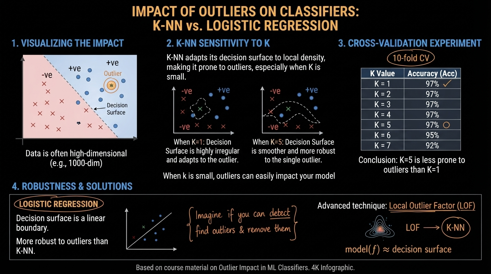

### What is an Outlier?

An outlier is a data point that lies far away from the majority of the points of its class.

### Effect on Models

The model $f$ roughly corresponds to the **decision surface**.

- **Logistic Regression**:  
  Relatively robust. A few outliers usually do not drastically change the decision boundary.

- **K-NN**:  
  More prone to outliers, especially when $K$ is small.

### Why K-NN is Sensitive to Outliers

When $K$ is small (particularly $K=1$):

- The prediction for a query point is completely determined by its nearest neighbor(s).
- A single outlier can create a small “island” of the wrong class in the decision surface.
- This leads to overfitting and poor generalization.

**Rule of thumb:**
- Smaller $K$ → more sensitive to outliers
- Larger $K$ → more robust to outliers (but can underfit)

### Evidence from Cross-Validation

Using 10-fold CV:

| $K$ | Accuracy |
|-----|----------|
| 1   | 97%      |
| 2   | 97%      |
| 3   | 97%      |
| 4   | 97%      |
| 5   | 97%      |
| 6   | 95%      |
| 7   | 92%      |

Even though $K=1$ to $K=5$ give similar accuracy,  
**$K=5$ is less prone to outliers than $K=1$**.

### What If We Can Detect Outliers?

If we can reliably detect and remove outliers before training:

- The negative impact on K-NN can be greatly reduced.

One common technique for detecting outliers is based on **Local Outlier Factor (LOF)**, which itself uses the idea of K-NN (local density comparison).

### Key Takeaway

- K-NN with small $K$ is highly sensitive to outliers.
- Prefer moderately larger $K$ when outliers are present.
- Outlier detection and removal (or robust distance measures) can improve K-NN performance.

## 07. Local Outlier Factor (Simple Solution: Mean Distance to k-NN)

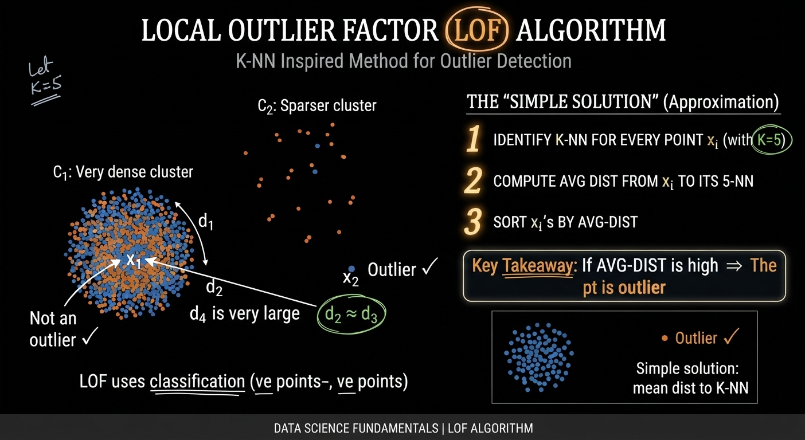

### Purpose

**Local Outlier Factor (LOF)** is a method to **detect outliers**.  
It is heavily inspired by the idea of K-Nearest Neighbors.

### Intuition

Consider two clusters:

- $C_1$: Very dense cluster
- $C_2$: Sparser cluster

And two points:

- $x_1$: Lies near the dense cluster $C_1$ → **not an outlier**
- $x_2$: Lies far from both clusters → **outlier**

Even if the absolute distance of $x_1$ to its neighbors is small and the distance of $x_2$ is large, the key idea is to look at **local density**.

### Simple Solution (Basic Idea)

Let $K = 5$.

For every point $x_i$:

1. Find its $K$ nearest neighbors.
2. Compute the **average distance** from $x_i$ to its $K$ nearest neighbors.
3. Sort all points by this average distance.
4. Points with **very high average distance** are considered outliers.

This simple approach already captures the idea of local density.

### Local Density

- Dense region → small average distance to $K$-NN
- Sparse region / outlier → large average distance to $K$-NN

LOF formalizes this idea more carefully by comparing the local density of a point with the local densities of its neighbors.

### Key Takeaway

- LOF is a **K-NN inspired** outlier detection technique.
- It looks at how isolated a point is **relative to its local neighborhood**.
- A simple practical version:
  1. Compute mean distance to $K$ nearest neighbors for every point.
  2. Points with the largest mean distances are the strongest outlier candidates.

## 08. k-Distance

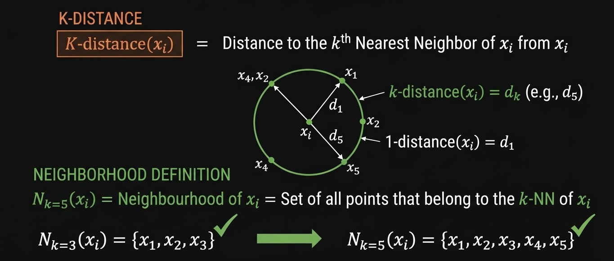

### 1. K-distance

$$
\text{K-distance}(x_i) = \text{distance to the } K^{\text{th}} \text{ nearest neighbor of } x_i
$$

**Example:**
- If $K = 5$, then 5-distance$(x_i) = d_5$ (distance to the 5th nearest neighbor)
- 1-distance$(x_i) = d_1$ (distance to the nearest neighbor)

### 2. Neighborhood of a Point

$$
N_K(x_i) = \text{Set of all points that belong to the } K\text{-nearest neighbors of } x_i
$$

**Notation:**
- $N_{K=3}(x_i) = \{x_1, x_2, x_3\}$
- $N_{K=5}(x_i) = \{x_1, x_2, x_3, x_4, x_5\}$

### Visual Intuition

For a point $x_i$:

- Draw a circle centered at $x_i$ that just reaches its $K$-th nearest neighbor.
- All points lying inside or on this circle form the neighborhood $N_K(x_i)$.
- The radius of this circle is exactly the **K-distance** of $x_i$.

These two quantities (K-distance and the neighborhood set) are the basic building blocks used to compute local density and eventually the Local Outlier Factor.

## 09. Reachability-Distance (A, B)

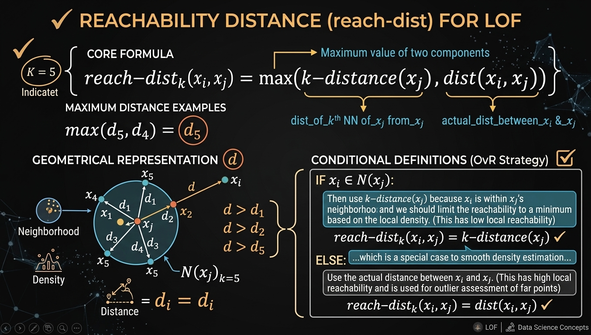

### Definition

The **reachability distance** of a point $x_i$ with respect to a point $x_j$ is defined as:

$$
\text{reachability-distance}_K(x_i, x_j) = \max\big( \text{K-distance}(x_j),\; \text{dist}(x_i, x_j) \big)
$$

Where:
- $\text{K-distance}(x_j)$ = distance from $x_j$ to its $K$-th nearest neighbor
- $\text{dist}(x_i, x_j)$ = actual Euclidean (or other) distance between $x_i$ and $x_j$

### Intuition

- If $x_i$ is **inside** the $K$-neighborhood of $x_j$ (i.e., $x_i \in N_K(x_j)$),  
  then the reachability distance is simply the **K-distance** of $x_j$.

- If $x_i$ is **outside** the $K$-neighborhood of $x_j$,  
  then the reachability distance is the actual distance $\text{dist}(x_i, x_j)$.

In other words:

$$
\text{reach-dist}_K(x_i, x_j) =
\begin{cases}
\text{K-distance}(x_j) & \text{if } x_i \in N_K(x_j) \\
\text{dist}(x_i, x_j) & \text{otherwise}
\end{cases}
$$

### Why This Definition?

This “smoothing” effect prevents points that are very close to $x_j$ from having artificially small reachability distances.  
It makes the density estimate more stable.

### Visual Example ($K=5$)

- Circle around $x_j$ has radius = 5-distance$(x_j) = d_5$
- For a point $x_i$ outside this circle:  
  $\text{reach-dist}(x_i, x_j) = \text{dist}(x_i, x_j) = d$
- For a point inside the circle:  
  $\text{reach-dist}(x_i, x_j) = d_5$

## 10. Local Reachability-Density (A)

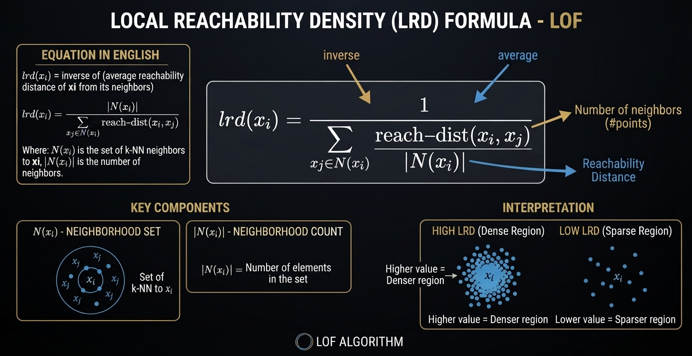

### Definition

The **Local Reachability Density** ( `lrd` ) of a point $x_i$ is defined as:

$$
\text{lrd}(x_i) = \dfrac{|N(x_i)|}{\displaystyle\sum_{x_j \in N(x_i)} \text{reach-dist}(x_i, x_j)}
$$

Where:
- $N(x_i)$ = set of $K$-nearest neighbors of $x_i$
- $|N(x_i)|$ = number of points in the neighborhood
- $\text{reach-dist}(x_i, x_j)$ = reachability distance of $x_i$ with respect to $x_j$

### English Interpretation

$$
\text{lrd}(x_i) = \text{inverse of the average reachability distance of } x_i \text{ from its neighbors}
$$

In short:

$$
\text{lrd}(x_i) \propto \dfrac{1}{\text{average reach-dist of } x_i}
$$

### Intuition

- If the average reachability distance from $x_i$ to its neighbors is **small** → the point is in a **dense** region → **high** lrd.
- If the average reachability distance is **large** → the point is in a **sparse** region → **low** lrd.

### Visual Idea

- Dense cluster → small average reach-dist → high local reachability density
- Sparse region / outlier → large average reach-dist → low local reachability density

This local density estimate is the key quantity used in the final LOF score.

## 11. Local Outlier Factor (A)

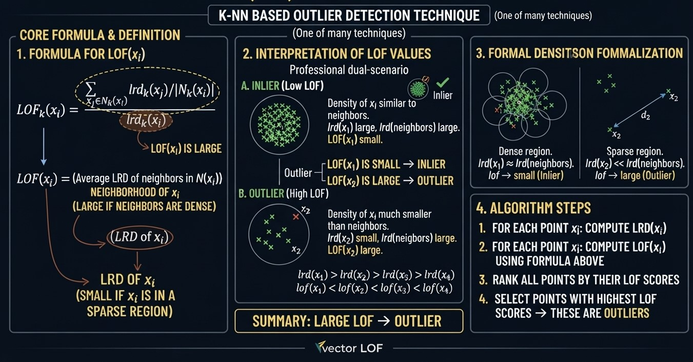

https://en.wikipedia.org/wiki/Local_outlier_factor

> ### [`LOF.ipynb`](./LOF.ipynb)

https://scikit-learn.org/stable/auto_examples/neighbors/plot_lof_outlier_detection.html

https://scikit-learn.org/stable/modules/generated/sklearn.neighbors.LocalOutlierFactor.html

### Definition

The **Local Outlier Factor** of a point $x_i$ is defined as:

$$
\text{LOF}(x_i) = \dfrac{\displaystyle\sum_{x_j \in N(x_i)} \text{lrd}(x_j)}{|N(x_i)|} \;\bigg/\; \text{lrd}(x_i)
$$

In other words:

$$
\text{LOF}(x_i) = \dfrac{\text{average lrd of the neighbors of } x_i}{\text{lrd of } x_i}
$$

### Interpretation

| LOF Value          | Meaning                                      | Conclusion     |
|--------------------|----------------------------------------------|----------------|
| LOF$(x_i)$ is **large** | Density of $x_i$ is much smaller than the density of its neighbors | **Outlier**    |
| LOF$(x_i)$ is **small** (≈ 1) | Density of $x_i$ is similar to the density of its neighbors | **Inlier**     |

### Visual Understanding

- Points inside a dense cluster ($C_1$ or $C_2$) → LOF ≈ 1 (small) → inliers
- Points lying far away from clusters → LOF ≫ 1 (large) → outliers

**Examples:**
- $x_1 \in C_1$ → LOF small
- $x_2$ (isolated) → LOF large → outlier
- $x_3 \in C_2$ → LOF small
- $x_4$ (isolated) → LOF large → outlier

### How to Use LOF in Practice

1. For every point $x_i$, compute LOF$(x_i)$.
2. Sort the points in decreasing order of LOF.
3. The points with the **highest LOF scores** are the strongest outliers.

### Summary of the LOF Pipeline

| Step | Quantity                        | Meaning                                      |
|------|---------------------------------|----------------------------------------------|
| 1    | K-distance$(x_i)$               | Distance to the $K$-th nearest neighbor      |
| 2    | $N_K(x_i)$                      | Set of $K$ nearest neighbors                 |
| 3    | reach-dist$(x_i, x_j)$          | max(K-distance$(x_j)$, dist$(x_i,x_j)$)      |
| 4    | lrd$(x_i)$                      | Inverse of average reachability distance     |
| 5    | LOF$(x_i)$                      | Ratio of average neighbor lrd to own lrd     |

### Final Note

LOF is a powerful **K-NN inspired** outlier detection technique.  
There are many other outlier detection methods, but LOF is one of the most popular density-based approaches.

## 12. Impact of Scale & Column Standardization

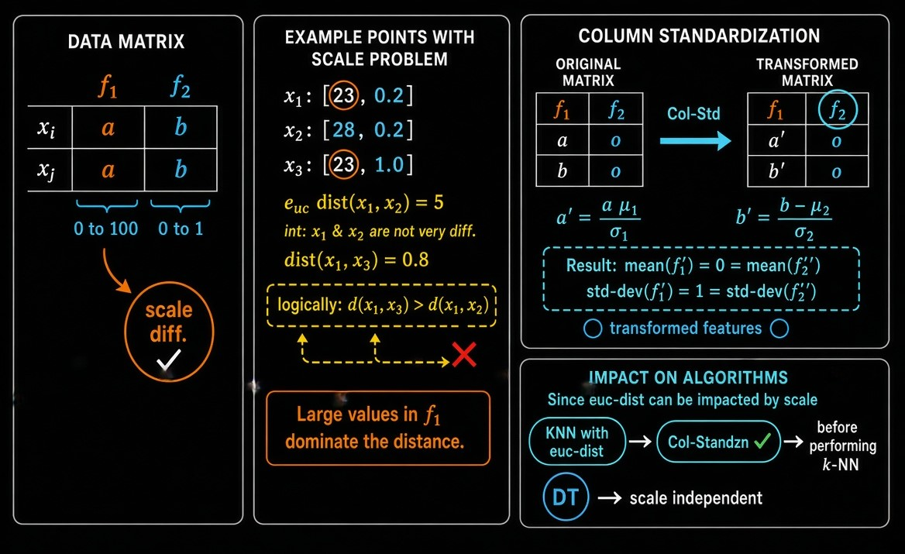
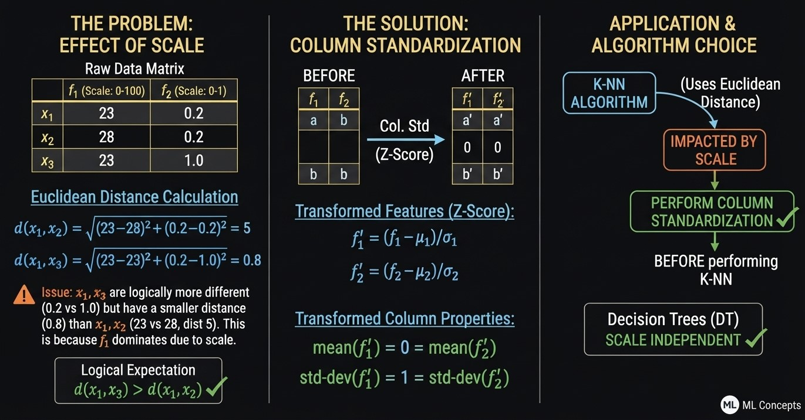

### Why Scale Matters

Features often have very different scales.

**Example:**

| Point | $f_1$ (0–100) | $f_2$ (0–1) |
|-------|---------------|-------------|
| $x_1$ | 23            | 0.2         |
| $x_2$ | 28            | 0.2         |
| $x_3$ | 23            | 1.0         |

Euclidean distances:

$$
\text{dist}(x_1, x_2) = 5
$$

$$
\text{dist}(x_1, x_3) = 0.8
$$

**Problem:**  
Logically, $x_1$ and $x_2$ are very similar (only $f_1$ differs by 5 on a 0–100 scale), while $x_1$ and $x_3$ differ significantly in $f_2$.  
But because of the scale difference, the distance calculation is dominated by $f_1$.

### Column Standardization

To remove the effect of different scales, we apply **Column Standardization** (also called Z-score normalization):

For each feature $f_j$:

$$
a' = \dfrac{a - \mu_j}{\sigma_j}
$$

After transformation:

- Mean of each feature = 0
- Standard deviation of each feature = 1

### Importance for K-NN

- Euclidean distance is **highly sensitive** to feature scale.
- Therefore, **always perform Column Standardization before applying K-NN** (when using Euclidean distance).

### Comparison with Other Algorithms

| Algorithm            | Sensitive to Feature Scale? | Recommendation                          |
|----------------------|-----------------------------|-----------------------------------------|
| K-NN (Euclidean)     | Yes                         | Must do Column Standardization          |
| Decision Trees (DT)  | No                          | Scale-independent                       |
| Random Forest        | No                          | Scale-independent                       |

### Key Takeaway

Whenever you use a distance-based algorithm (especially K-NN with Euclidean distance), always standardize the features first so that no single feature dominates the distance calculation because of its scale.

## 13. Interpretability

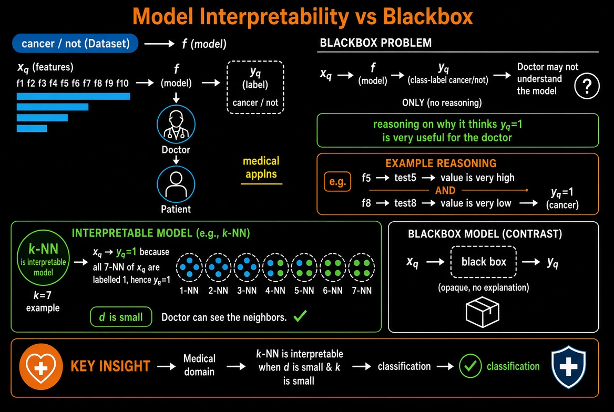
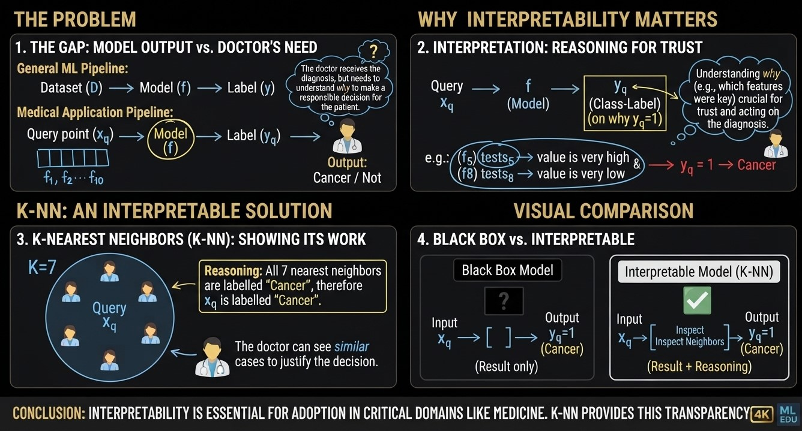

> ### Model Interpretability vs Black-box Models

### The Medical Scenario

In medical applications (e.g., Cancer / Not Cancer):

1. We train a model $f$ on a dataset $D$.
2. For a new patient (query $x_q$ with features $f_1, f_2, \dots, f_{10}$), the model predicts a label $y_q$.
3. The prediction is given to the **doctor**, who then communicates with the patient.

### Why Interpretability Matters

If the model only outputs a class label (Cancer / Not Cancer) **without any reasoning**, the doctor may not trust or understand the decision.

**What doctors really need:**

> Reasoning on *why* the model thinks $y_q = 1$ (Cancer).

**Example of useful reasoning:**
- Feature $f_5$ (Test 5) value is very high
- Feature $f_8$ (Test 8) value is very low  
→ Therefore the model predicts Cancer.

This kind of explanation is extremely valuable in high-stakes domains.

### Interpretable Model vs Black-box Model

| Type                  | Example     | Can we understand the decision? | Typical Behavior |
|-----------------------|-------------|----------------------------------|------------------|
| Interpretable Model   | K-NN        | Yes                              | We can see the neighbors |
| Black-box Model       | Deep Neural Networks, complex ensembles | No (or very hard) | Just input → output |

### Why K-NN is Interpretable

K-NN is an **interpretable model**, especially when:

- Dimensionality $d$ is small, and
- $K$ is small

**Example ($K=7$):**

- Query point $x_q$
- All 7 nearest neighbors are labeled 1
- Therefore $y_q = 1$

The doctor can actually look at the 7 nearest patients and understand why the prediction was made.

### Key Takeaway for Medical Domain

- K-NN is particularly useful in medical applications because it is interpretable when $d$ and $K$ are small.
- Interpretability allows doctors to verify and trust the model’s decisions.
- Black-box models may achieve higher accuracy but often lack the transparency required in critical domains.

## 14. Feature Importance and Forward Feature Selection

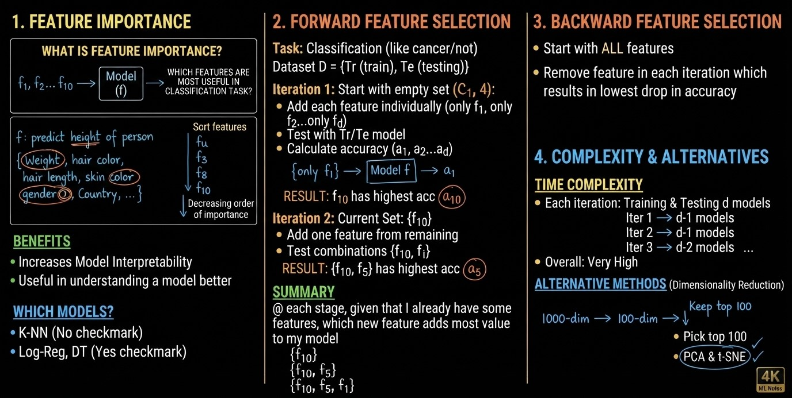
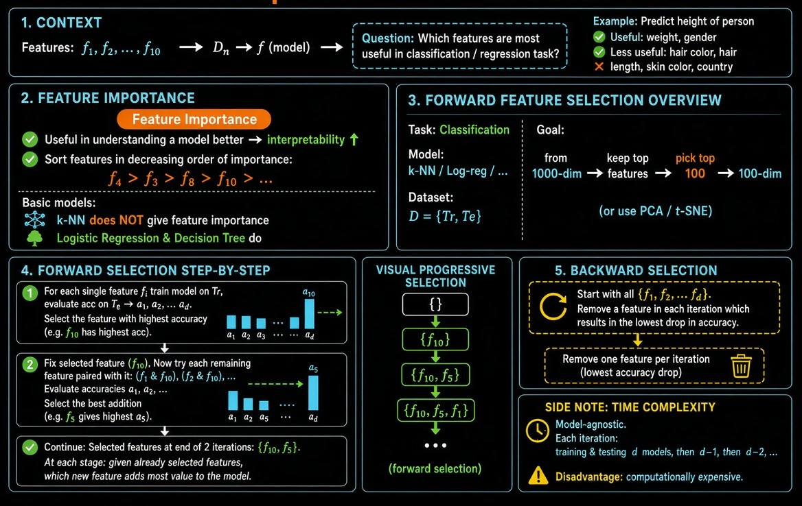

### What is Feature Importance?

Given a dataset with features $f_1, f_2, \dots, f_{10}$ and a model $f$:

**Question:** Which features are most useful for the classification / regression task?

**Example:** Predicting height of a person  
Possible features: Weight, Hair color, Hair length, Skin color, Gender, Country, …

Feature Importance helps us:
- Understand the model better
- Increase interpretability
- Rank features in decreasing order of importance

**Note:**  
Basic K-NN does **not** provide feature importance directly.  
Models like Logistic Regression and Decision Trees do.

### Forward Feature Selection

**Goal:** Select a small subset of the most useful features.

**Setting:**
- Task: Classification
- Model: K-NN / Logistic Regression / …
- Data: $D = \{Train, Test\}$

**High-level idea (especially useful when $d$ is large, e.g. 1000-dim):**
- Discard most features
- Keep only the top useful ones (e.g. top 100)
- Can be combined with PCA / t-SNE later

### How Forward Selection Works

**Step 1: Find the single best feature**

- Train a model using only $f_1$ → get accuracy $a_1$ on Test
- Train using only $f_2$ → get accuracy $a_2$
- …
- Train using only $f_d$ → get accuracy $a_d$

Pick the feature with the **highest accuracy**.  
Suppose $f_{10}$ has the highest accuracy → select $f_{10}$.

**Step 2: Add the next best feature**

Now we already have $\{f_{10}\}$.

- Try adding $f_1$ → train on $\{f_1, f_{10}\}$ → accuracy $a_1$
- Try adding $f_2$ → train on $\{f_2, f_{10}\}$ → accuracy $a_2$
- …
- Try adding each remaining feature

Pick the feature that gives the **highest accuracy** when added.  
Suppose $f_5$ is the best → now selected set = $\{f_{10}, f_5\}$

**Step 3: Repeat**

Continue adding one feature at a time, always choosing the feature that improves the model the most, given the features already selected.

At each stage the question is:

> Given that I already have some features, which new feature adds the most value to my model?

### Backward Feature Selection

Opposite of Forward Selection:

- Start with **all** features $\{f_1, f_2, \dots, f_d\}$
- In each iteration, **remove** the feature whose removal causes the **lowest drop** in accuracy
- Continue until the desired number of features remains

### Time Complexity

Forward / Backward selection is **model-agnostic** but expensive:

In each iteration we need to train and test multiple models:

- Iteration 1 → train $d$ models
- Iteration 2 → train $d-1$ models
- Iteration 3 → train $d-2$ models
- …

Total number of models trained ≈ $\dfrac{d(d+1)}{2}$

### Summary

| Method              | Direction          | Key Idea                                      | Cost          |
|---------------------|--------------------|-----------------------------------------------|---------------|
| Forward Selection   | Start empty → add  | Greedily add the most useful feature          | High          |
| Backward Selection  | Start full → remove| Greedily remove the least useful feature      | High          |
| Feature Importance  | Model-dependent    | Rank features by how much they help the model | Depends on model |

These techniques help us build simpler, more interpretable, and often better-generalizing models by removing irrelevant or redundant features.

## 15. Handling Categorical and Numerical Features

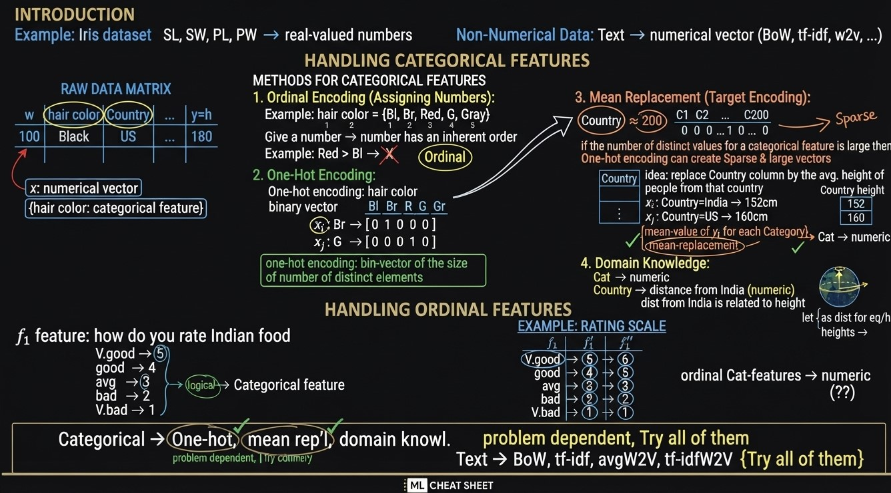  
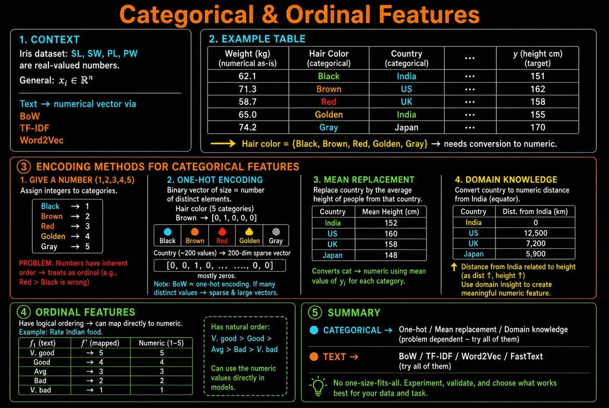

### Background

In many datasets (e.g. Iris), features are real-valued numbers (SL, SW, PL, PW).

But real-world data often contains:
- **Categorical features** (e.g. Hair color, Country)
- **Ordinal features** (e.g. Rating: Very Good → Very Bad)
- **Text** (which we convert to numerical vectors using BoW, TF-IDF, Word2Vec, etc.)

Most ML models expect $x_i \in \mathbb{R}^d$ (numerical vectors).  
So we need ways to convert categorical / ordinal features into numbers.

### Example

Predicting height ($y$ = height):

| Weight | Hair Color | Country | … | Height |
|--------|------------|---------|---|--------|
| 100    | Black      | US      | … | 180    |

- Weight → already numerical → keep as-is
- Hair Color → categorical feature  
  Possible values: {Black, Brown, Red, Golden, Gray}

### Ways to Handle Categorical Features

#### 1. Give a Number (Label Encoding)

Assign numbers: Black=1, Brown=2, Red=3, Golden=4, Gray=5

**Problem:**  
Numbers have an inherent order (Red > Black), but hair colors have **no natural order**.  
This is wrong for pure categorical features → creates false ordinal relationship.

#### 2. One-Hot Encoding

Create a binary vector of size = number of distinct categories.

Hair Color = {Bl, Br, Red, G, Gray}

- Black  → [1, 0, 0, 0, 0]
- Brown  → [0, 1, 0, 0, 0]
- Golden → [0, 0, 0, 1, 0]

**Definition:**  
One-hot encoding = binary vector of the size of the number of distinct elements.

**Issue when number of categories is large:**
- Country ≈ 200 values → 200-dimensional sparse vector
- Creates very sparse and high-dimensional data
- Similar to Bag-of-Words

#### 3. Mean Replacement (Target Encoding)

**Idea:** Replace the categorical value by the **average value of the target** for that category.

Example (predicting height):

- Country = India → average height of people from India = 152 cm
- Country = US    → average height of people from US = 160 cm

Now the feature becomes numerical.

This is also called **mean encoding** or **target encoding**.

#### 4. Domain Knowledge

Convert categorical feature into a meaningful numerical feature using domain knowledge.

Example:
- Country → Distance from India (or from equator)
- Distance from equator is related to height (people farther from equator tend to be taller)

### Ordinal Features

Features that have a **natural order**.

Example:  
“How do you rate Indian food?”

| Rating     | Numeric Code |
|------------|--------------|
| Very Good  | 5            |
| Good       | 4            |
| Average    | 3            |
| Bad        | 2            |
| Very Bad   | 1            |

Because there is a logical ordering, we can directly convert them to numbers.

### Summary of Strategies

| Feature Type     | Common Techniques                          | Notes                              |
|------------------|--------------------------------------------|------------------------------------|
| Categorical      | One-Hot Encoding, Mean Replacement, Domain Knowledge | Try all; problem-dependent         |
| Ordinal          | Label Encoding (ordered numbers)           | Preserves natural order            |
| Text             | BoW, TF-IDF, Word2Vec, Avg Word2Vec, TF-IDF weighted Word2Vec | Try all of them                    |

**Key Advice:**  
There is no single best method.  
The choice is **problem-dependent** — always experiment with multiple encodings and see what works best for your data and model.

## 16. Handling Missing Values by Imputation

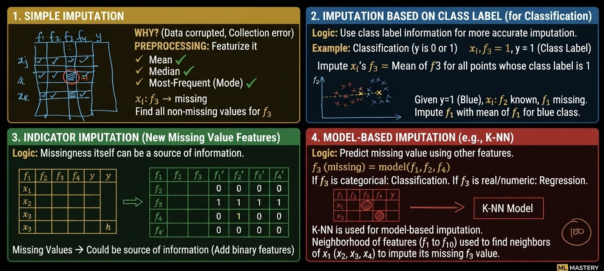  
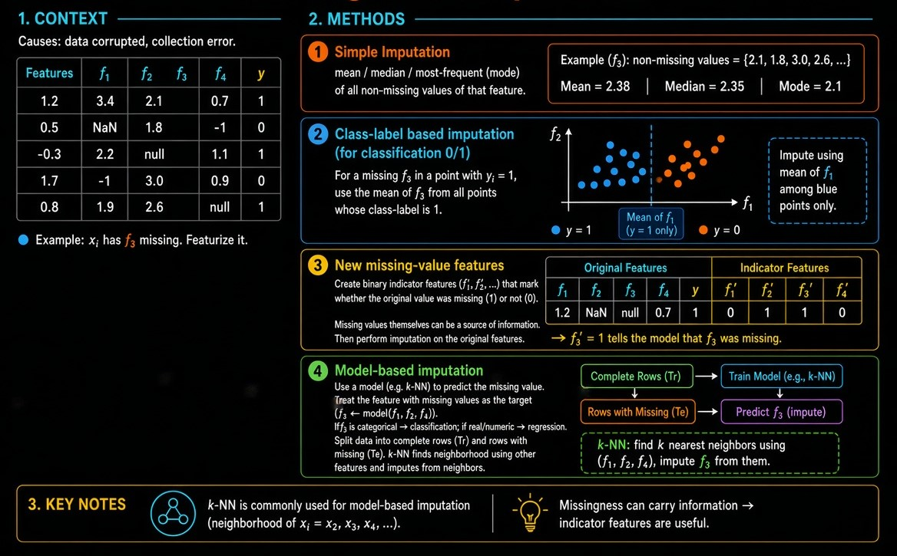

https://scikit-learn.org/stable/api/sklearn.impute.html

### Why Do Missing Values Occur?

- Data corruption
- Collection errors
- Sensor failures, user skipping questions, etc.

Missing values are usually represented as:
- NaN
- null
- -1
- or simply blank

### Common Imputation Techniques

#### 1. Simple Statistical Imputation

Replace the missing value with a statistic computed from the non-missing values of that feature:

- **Mean**
- **Median**
- **Most frequent value (Mode)**

Example:  
If $x_i$ has $f_3$ missing → fill it with the mean / median / mode of all non-missing values of $f_3$.

#### 2. Class-label based Imputation (for Classification)

When the task is classification ($y \in \{0,1\}$):

- Look at the class label of the point that has the missing value.
- Impute using only the points that belong to the **same class**.

Example:  
$x_i$ has $f_3$ missing and $y_i = 1$  
→ Fill $f_3$ with the mean of $f_3$ computed only on points whose class label is 1.

This often works better than global mean/median because the distribution of a feature can be different across classes.

#### 3. Create New “Missing Value” Indicator Features

Missingness itself can be informative.

**Idea:**
- For every feature that has missing values, create a new binary feature:
  - 1 → value was missing
  - 0 → value was present
- Then perform normal imputation on the original feature.

This way the model can learn whether “the fact that the value is missing” carries predictive signal.

#### 4. Model-based Imputation

Treat the feature with missing values as the **target** and use the other features to predict it.

**Steps:**
1. Take all points where the feature is **not** missing → Train set
2. Take points where the feature **is** missing → Test set
3. Train a model (very commonly **K-NN**) to predict the missing feature using the other features.
4. Use the trained model to fill the missing values.

- If the feature is categorical → use classification
- If the feature is numerical → use regression

**Why K-NN is popular for this:**
- It finds the nearest neighbors of the point (using the other features)
- Then uses the values of those neighbors to impute the missing feature

### Summary of Techniques

| Method                        | Idea                                      | When useful                              |
|-------------------------------|-------------------------------------------|------------------------------------------|
| Mean / Median / Mode          | Simple statistic                          | Quick baseline                           |
| Class-label based             | Impute using same class only              | Classification problems                  |
| Missing indicator features    | Add binary flags for missingness          | When missingness itself is informative   |
| Model-based (K-NN etc.)       | Predict missing value from other features | More accurate, especially with correlated features |

**Practical Advice:**  
Always try multiple imputation strategies and evaluate their impact on the final model performance. There is no universally best method.

## 17. Curse of Dimensionality

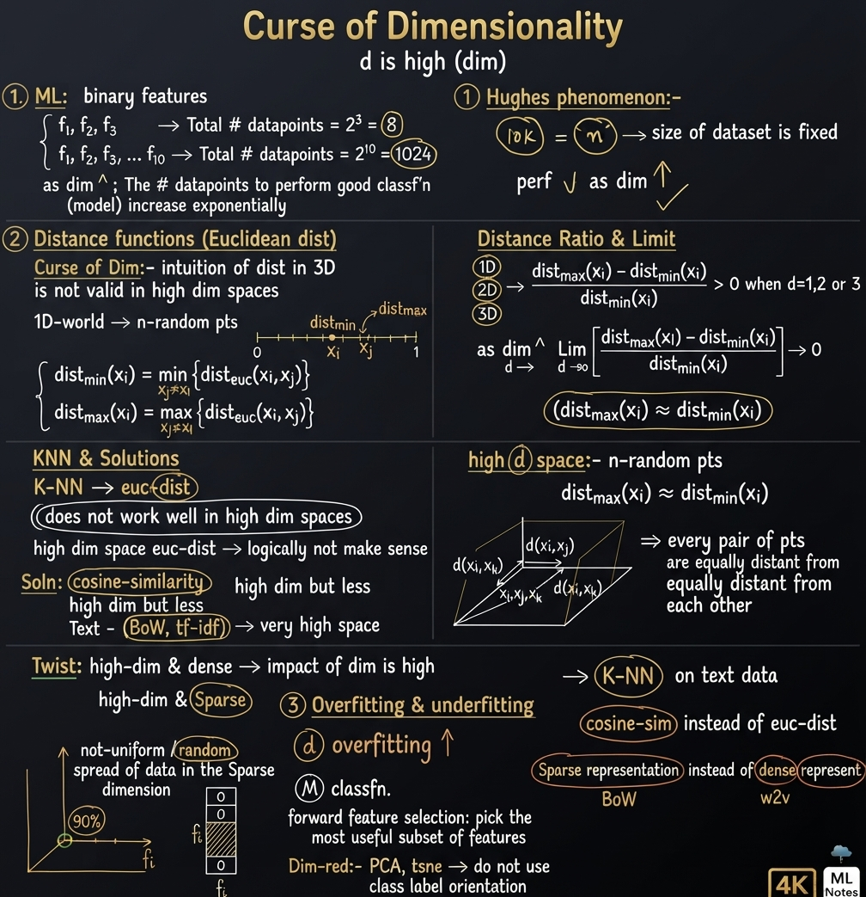  
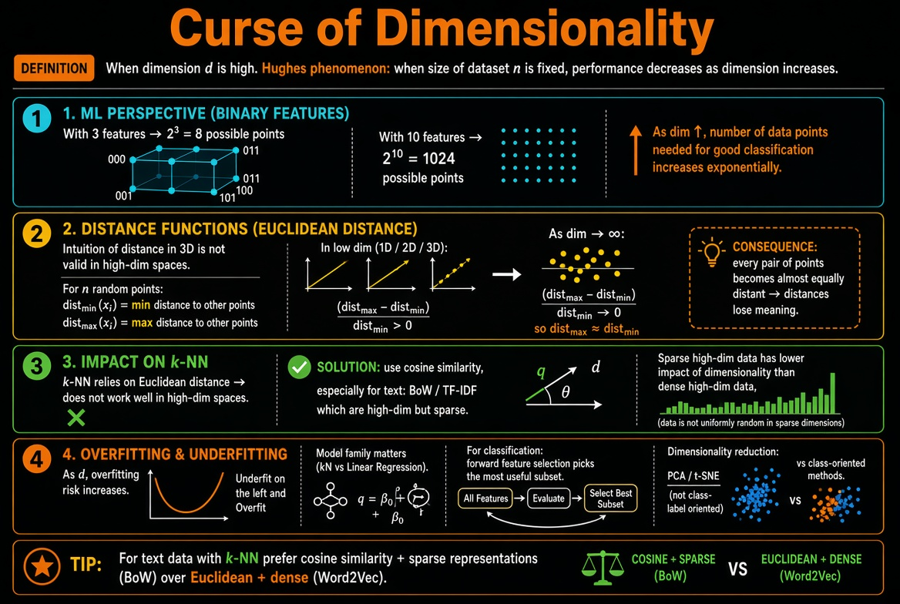

https://en.wikipedia.org/wiki/Curse_of_dimensionality

> ### Curse of Dimensionality

When the number of dimensions $d$ becomes very high, many intuitive properties of data break down. This is known as the **Curse of Dimensionality**.

### 1. Exponential Growth of Data Requirement

For binary features:

- 3 features → $2^3 = 8$ possible data points
- 10 features → $2^{10} = 1024$ possible data points

**Key Observation:**  
As dimensionality increases, the number of data points needed to perform good classification / modeling increases **exponentially**.

**Hughes Phenomenon:**  
When the size of the dataset is fixed ($n$ is constant), model performance starts decreasing as dimensionality increases.

### 2. Distance Functions Break Down (Especially Euclidean)

In low dimensions (1D, 2D, 3D) we have a clear notion of “near” and “far”.

Define for a point $x_i$:

$$
\text{dist-min}(x_i) = \min_{x_j \neq x_i} \text{dist}(x_i, x_j)
$$

$$
\text{dist-max}(x_i) = \max_{x_j \neq x_i} \text{dist}(x_i, x_j)
$$

In low dimensions:

$$
\frac{\text{dist-max}(x_i) - \text{dist-min}(x_i)}{\text{dist-min}(x_i)} > 0
$$

But as dimension $d \to \infty$:

$$
\lim_{d \to \infty} \frac{\text{dist-max}(x_i) - \text{dist-min}(x_i)}{\text{dist-min}(x_i)} \to 0
$$

**Meaning:**  
In very high dimensions,  
$\text{dist-max}(x_i) \approx \text{dist-min}(x_i)$

→ Every pair of points becomes almost equally distant from each other.  
→ The concept of “nearest neighbor” loses meaning.

### Impact on K-NN

- K-NN relies heavily on Euclidean distance.
- In high-dimensional spaces, Euclidean distance becomes less meaningful.
- Therefore **K-NN does not work well in high dimensions**.

**Common Solutions:**
- Use **Cosine Similarity** instead of Euclidean distance (especially for text data).
- Prefer sparse representations (BoW, TF-IDF) over dense ones (Word2Vec) when dimensionality is extremely high.

### Dense vs Sparse High-Dimensional Data

| Type of Data              | Impact of High Dimensionality | Reason |
|---------------------------|-------------------------------|--------|
| High-dim **& Dense**      | Impact is **high**            | Points are spread everywhere |
| High-dim **& Sparse**     | Impact is **lower**           | Data is not uniformly / randomly spread |

Sparse data (e.g., text with BoW) suffers less from the curse compared to dense random high-dimensional data.

### 3. Overfitting Increases with Dimensionality

As $d$ increases → model capacity increases → risk of **overfitting** increases.

**Ways to handle this:**

- **Forward Feature Selection** → pick only the most useful subset of features (classification-oriented)
- **Dimensionality Reduction** (PCA, t-SNE) → not class-label oriented
- Prefer simpler model families when $d$ is large

### Practical Advice for Text Data

When applying K-NN on text data:

- Prefer **Cosine Similarity** over Euclidean distance
- Prefer **Sparse representations** (BoW / TF-IDF) over dense representations (Word2Vec)

### Summary

The Curse of Dimensionality manifests in three major ways:

1. Exponentially more data is required
2. Distance metrics (especially Euclidean) become less meaningful
3. Models tend to overfit more easily

Understanding these effects is crucial when working with high-dimensional data such as text, images, or one-hot encoded categorical features.

## 18. Bias-Variance Tradeoff

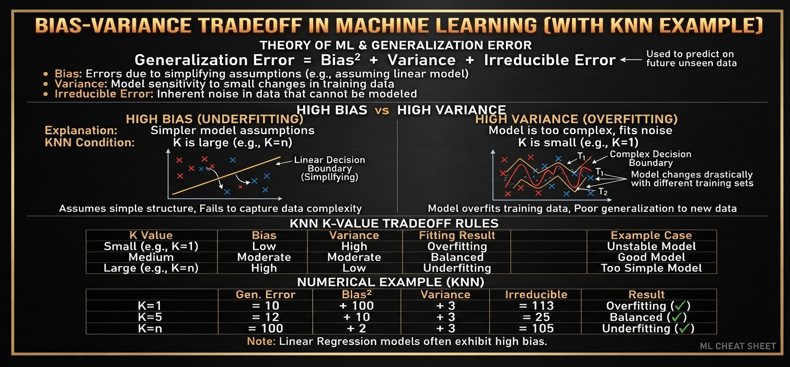  
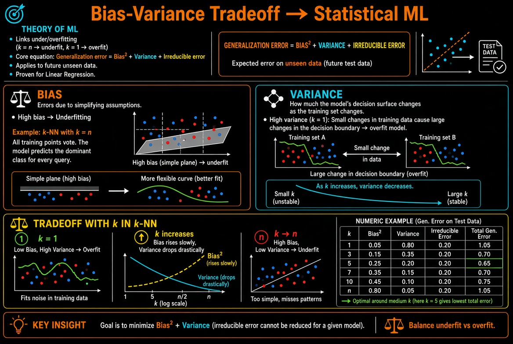

https://en.wikipedia.org/wiki/Bias%E2%80%93variance_tradeoff

Bias-Variance Tradeoff is one of the most important ideas in the **Theory of Machine Learning** (Statistical ML).

It gives the mathematical basis for understanding **Underfitting** and **Overfitting**.

### Generalization Error Decomposition

For a model (especially easy to prove for Linear Regression):

$$
\text{Generalization Error} = \text{Bias}^2 + \text{Variance} + \text{Irreducible Error}
$$

- **Generalization Error** = Error on future unseen data
- **Irreducible Error** = Error that cannot be reduced further for a given model / problem (noise in the data)

### 1. Bias

**Bias** = Error due to simplifying assumptions made by the model.

- High Bias → **Underfitting**
- Classic example in K-NN: when $K = n$ (very large K)

When $K = n$:
- The model always predicts the dominant class in the entire training set
- It ignores the local structure completely
- This is a strong simplifying assumption → High Bias → Underfitting

**Visual intuition:**
- True decision boundary is a curve
- Model assumes a straight line / plane → simplifying assumption → High Bias

### 2. Variance

**Variance** = How much the model (decision surface) changes when the training data changes.

- High Variance → **Overfitting**
- Classic example in K-NN: when $K = 1$

When $K = 1$:
- Small changes in the training data lead to very different decision surfaces
- The model is extremely sensitive to the training set
- This is High Variance → Overfitting

**As $K$ increases:**
- Variance decreases
- Bias increases

### Bias-Variance Behavior in K-NN

| Value of K | Bias          | Variance       | Behavior          |
|------------|---------------|----------------|-------------------|
| $K = 1$    | Low           | Very High      | Overfitting       |
| $K$ medium | Balanced      | Balanced       | Best tradeoff     |
| $K = n$    | High          | Low            | Underfitting      |

### Numerical Illustration

$$
\text{Gen. Error} = \text{Bias}^2 + \text{Var} + \text{Irreducible Error}
$$

Example numbers:

| K     | Bias² | Variance | Irreducible | Total Gen. Error | Diagnosis     |
|-------|-------|----------|-------------|------------------|---------------|
| K=1   | 10    | 100      | 3           | 113              | Overfit       |
| K=5   | 12    | 10       | 3           | 25               | Good          |
| K=n   | 100   | 2        | 3           | 105              | Underfit      |

### Key Takeaways

- We cannot simultaneously make Bias and Variance zero.
- There is always a **tradeoff**.
- The goal is to find the sweet spot where the sum (Bias² + Variance) is minimized.
- This tradeoff is fundamental and appears in almost every model family (K-NN, Linear Regression, Decision Trees, Neural Networks, etc.).

Bias-Variance Tradeoff is the theoretical foundation that explains why we need techniques like cross-validation, regularization, and careful model selection.

## 19. Intuitive Understanding of Bias-Variance

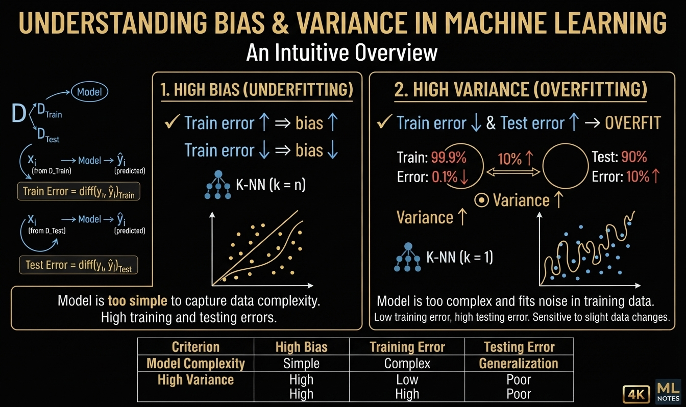  
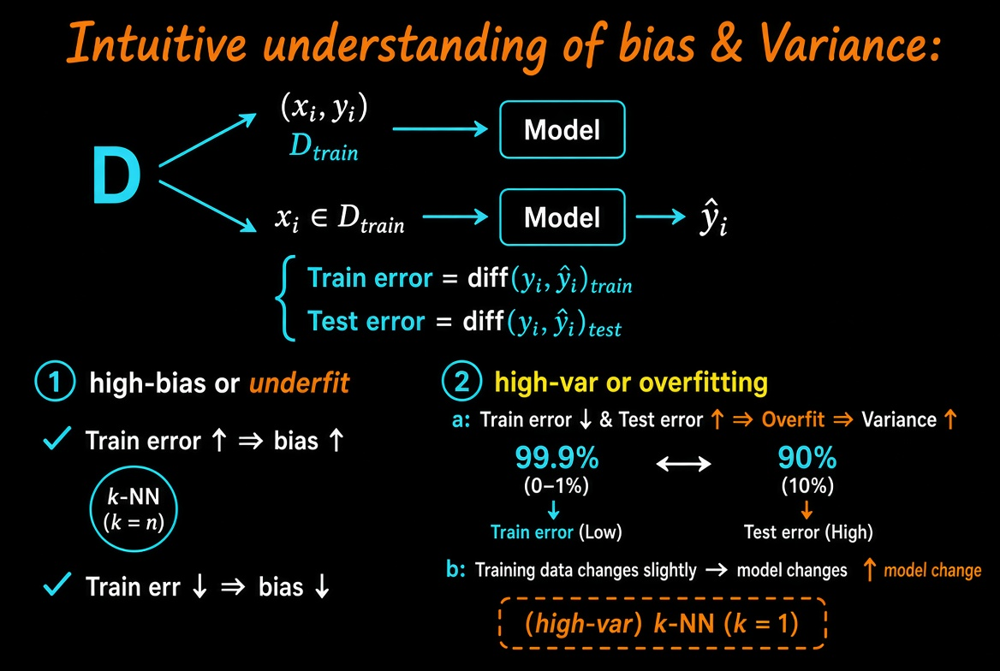

> ### Intuitive Understanding of Bias & Variance

We split the data $D$ into $D_{\text{Train}}$ and $D_{\text{Test}}$.

- Train a model on $D_{\text{Train}}$
- Measure errors on both Train and Test sets

$$
\text{Train Error} = \text{difference}(y_i, \hat{y}_i) \quad \text{on training data}
$$

$$
\text{Test Error} = \text{difference}(y_i, \hat{y}_i) \quad \text{on test data}
$$

### 1. High Bias (Underfitting)

**Symptoms:**
- Train Error is **high**
- Test Error is also high

**Rule of thumb:**
- High Train Error → High Bias → Underfitting

**Classic example:** K-NN with $K = n$

When Train Error is low → Bias is low.

### 2. High Variance (Overfitting)

**Symptoms:**
- Train Error is **very low**
- Test Error is **high**

**Example:**
- Train accuracy = 99.9% (error ≈ 0.1%)
- Test accuracy = 90% (error ≈ 10%)

This gap indicates **Overfitting** (High Variance).

**Another intuition:**
- Small changes in the training data cause large changes in the model (decision surface)
- Classic example: K-NN with $K = 1$

### Quick Diagnostic Table

| Train Error | Test Error | Diagnosis              |
|-------------|------------|------------------------|
| High        | High       | High Bias (Underfit)   |
| Low         | High       | High Variance (Overfit)|
| Low         | Low        | Good model             |

These simple observations from Train vs Test error give a very practical and intuitive way to detect bias and variance problems.

## 20. Best and Worst Case of Algorithm

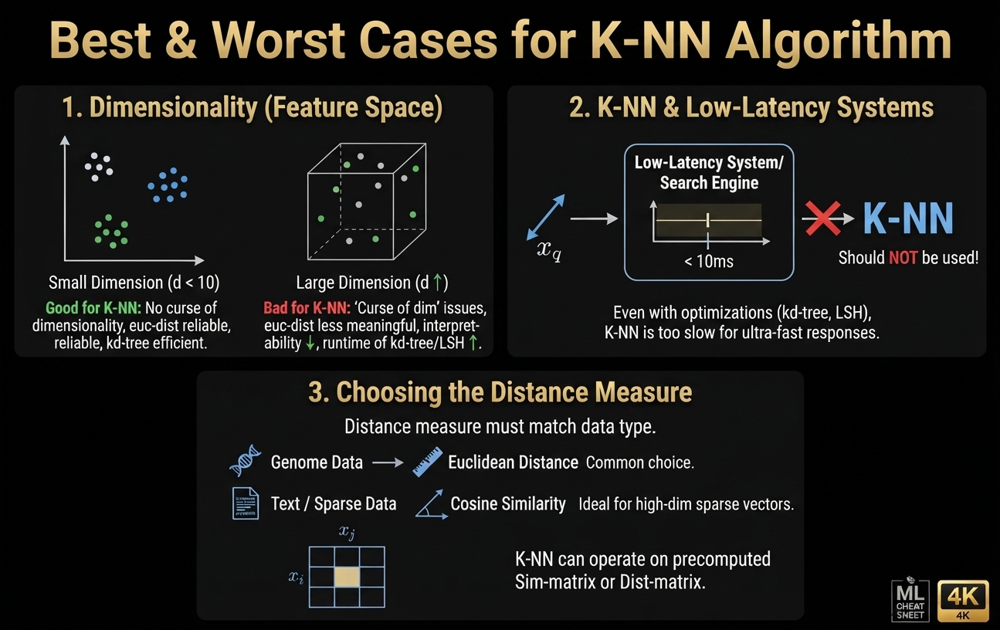  
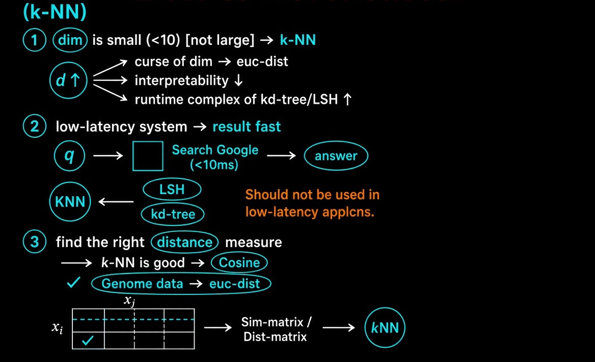

### 1. Dimensionality

**Best case for K-NN:**
- Dimensionality $d$ is **small** ($d < 10$)

**When dimensionality increases:**
- Curse of dimensionality hurts Euclidean distance
- Interpretability decreases
- Runtime complexity of exact methods (Kd-tree) and approximate methods (LSH) increases

→ K-NN becomes less attractive as $d$ grows large.

### 2. Latency Requirements

**Low-latency systems** need results extremely fast (e.g. Google Search < 10 ms).

- Brute-force K-NN is too slow for such applications
- Even with Kd-tree or LSH, K-NN is generally **not preferred** in strict low-latency production systems

**Recommendation:**  
Avoid K-NN when the application demands very low latency.

### 3. Choice of Distance / Similarity Measure

K-NN is only as good as the distance (or similarity) measure you use.

**Examples:**
- Text data → Cosine Similarity works well
- Genome data → Euclidean distance is often suitable
- When only a Similarity matrix or Distance matrix is available → K-NN can still be applied directly

**Key point:**  
Always choose the right distance/similarity measure for the domain. A good distance measure can make K-NN perform very well; a poor one will make it fail.

### Summary: When to Use K-NN

| Situation                        | Recommendation for K-NN          |
|----------------------------------|----------------------------------|
| Low dimensionality ($d < 10$)    | Good choice                      |
| High dimensionality              | Avoid or use with caution        |
| Need very low latency            | Avoid                            |
| Good domain-specific distance    | Strong candidate                 |
| Need high interpretability       | Good choice (especially small $K$)|

K-NN shines in low-dimensional problems where interpretability matters and a meaningful distance measure exists.

## 21. Revision Questions

1. [What is Imbalanced and balanced dataset?](#1-what-is-imbalanced-and-balanced-dataset)
2. [Define Multi-class classification?](#2-define-multi-class-classification)
3. [Explain Impact of Outliers?](#3-explain-impact-of-outliers)
4. [What is Local Outlier Factor?](#4-what-is-local-outlier-factor)
5. [What is k-distance(A), N(A)?](#5-what-is-k-distancea-na)
6. [Define reachability-distance(A, B)?](#6-define-reachability-distancea-b)
7. [What is Local-reachability-density(A)?](#7-what-is-local-reachability-densitya)
8. [Define LOF(A)?](#8-define-lofa)
9. [Impact of Scale & Column standardization?](#9-impact-of-scale--column-standardization)
10. [What is Interpretability?](#10-what-is-interpretability)
11. [Handling categorical and numerical features?](#11-handling-categorical-and-numerical-features)
12. [Handling missing values by imputation?](#12-handling-missing-values-by-imputation)
13. [Bias-Variance tradeoff?](#13-bias-variance-tradeoff)

### 1. What is Imbalanced and balanced dataset?

**Balanced dataset**: Classes have roughly equal number of samples (e.g., 50-50 for binary classification). Models train well without bias toward any class.

**Imbalanced dataset**: One or more classes have significantly fewer samples (minority class) than others (majority class). Example: fraud detection (0.1% fraud cases).  

**Problems**: Model becomes biased toward majority class → high accuracy but poor recall/precision on minority class.  
**Solutions**: Oversampling (SMOTE), undersampling, class weights, ensemble methods, anomaly detection techniques, collecting more data.

### 2. Define Multi-class classification?

Multi-class classification is a supervised learning task where the target variable has **more than two classes**.  

Examples:  
- Digit recognition (0–9)  
- News categorization (sports, politics, tech, …)  
- Image classification (cat, dog, bird, car, …)

Approaches:  
- One-vs-Rest (OvR)  
- One-vs-One (OvO)  
- Softmax (multinomial logistic regression, neural nets)  
- Algorithms that natively support multi-class (Random Forest, k-NN, Naive Bayes, etc.)

### 3. Explain Impact of Outliers?

Outliers are data points that differ significantly from the rest of the observations.

**Impact**:
- **Distance-based models** (k-NN, k-Means, SVM with RBF kernel) → outliers distort neighborhoods and decision boundaries.
- **Linear models** (Linear Regression, Logistic Regression) → outliers pull the fitted line/hyperplane strongly (high leverage).
- **Statistics** → mean and variance become unreliable; median/IQR are more robust.
- Can lead to overfitting or poor generalization.
- May represent rare but important events (fraud, defects) or data errors.

**Handling**: Detection (Z-score, IQR, Isolation Forest, LOF) + removal / capping / robust models / transformation.

### 4. What is Local Outlier Factor?

**Local Outlier Factor (LOF)** is an unsupervised anomaly detection algorithm that measures the **local density deviation** of a data point with respect to its neighbors.

- A point is considered an outlier if its local density is much lower than the densities of its neighbors.
- LOF score ≈ 1 → similar density (inlier)
- LOF score ≫ 1 → lower density than neighbors (outlier)

It works well for datasets with varying density regions (unlike global methods such as Isolation Forest or simple distance-to-mean).

### 5. What is k-distance(A), N(A)?

- **k-distance(A)**: Distance from point A to its **k-th nearest neighbor**.  
  Formally: \( k\text{-distance}(A) = d(A, p_k) \) where \( p_k \) is the k-th closest point to A.

- **N(A)** or **\( N_k(A) \)**: The **k-nearest neighborhood** of A – the set of all points whose distance from A is ≤ k-distance(A).  
  (It can contain more than k points if ties exist.)

These are fundamental building blocks of the LOF algorithm.

### 6. Define reachability-distance(A, B)?

**Reachability-distance** of point A with respect to point B is:

\[
\text{reach-dist}_k(A, B) = \max\{ k\text{-distance}(B),\ d(A, B) \}
\]

**Intuition**:  
- If A is far from B, use the actual distance \( d(A,B) \).  
- If A is inside the k-neighborhood of B, “smooth” it by using k-distance(B).  

This prevents points that are very close to a dense region from getting artificially low reachability distances.

### 7. What is Local-reachability-density(A)?

**Local Reachability Density (LRD)** of point A is the inverse of the average reachability distance of A from its k-nearest neighbors:

\[
\text{lrd}_k(A) = \frac{|N_k(A)|}{\sum_{B \in N_k(A)} \text{reach-dist}_k(A, B)}
\]

- High LRD → point lies in a dense region.  
- Low LRD → point lies in a sparse region.

### 8. Define LOF(A)?

**Local Outlier Factor** of point A is the average ratio of the local reachability densities of A’s neighbors to the local reachability density of A itself:

\[
\text{LOF}_k(A) = \frac{\sum_{B \in N_k(A)} \frac{\text{lrd}_k(B)}{\text{lrd}_k(A)}}{|N_k(A)|}
\]

- LOF(A) ≈ 1 → A has similar density to its neighbors (inlier)  
- LOF(A) > 1 (typically > 1.5–2) → A is less dense than its neighbors → outlier

### 9. Impact of Scale & Column standardization?

**Impact of different scales**:
- Features with larger numeric ranges dominate distance calculations (Euclidean, Manhattan, etc.).
- Affects k-NN, k-Means, SVM, PCA, Gradient Descent, Regularization, etc.
- Can make the model biased toward high-magnitude features.

**Column Standardization** (Z-score normalization):
\[
x' = \frac{x - \mu}{\sigma}
\]
- Makes every feature mean = 0, std = 1.
- Removes scale differences while preserving distribution shape.
- Preferred when algorithms assume Gaussian-like features or use regularization.

**Min-Max Scaling** is an alternative when you need values in a fixed range [0,1].

Always apply scaling **after** train-test split (fit only on train).

### 10. What is Interpretability?

**Interpretability** is the degree to which a human can understand the cause of a decision / prediction made by a machine learning model.

- **High interpretability**: Linear Regression, Logistic Regression, Decision Trees, Rule-based models.
- **Low interpretability (black-box)**: Deep Neural Networks, Gradient Boosting, complex ensembles.

Why it matters:
- Trust & accountability (especially in healthcare, finance, law)
- Debugging & improving models
- Regulatory compliance (GDPR “right to explanation”)
- Domain expert validation

Techniques to improve interpretability of black-box models: SHAP, LIME, Partial Dependence Plots, Feature Importance, attention mechanisms, etc.

### 11. Handling categorical and numerical features?

**Numerical features**:
- Scaling / Standardization / Normalization
- Binning (discretization)
- Log / Power transforms for skewed data
- Handling outliers

**Categorical features**:
- **Nominal** (no order): One-Hot Encoding, Dummy Encoding, Target Encoding, Embedding
- **Ordinal** (ordered): Ordinal Encoding, Label Encoding (with care)
- High-cardinality: Frequency Encoding, Hashing, Target Encoding, Embeddings

**Mixed data**:
- Keep numerical as-is (after scaling) + encode categorical
- Tree-based models (Random Forest, XGBoost, LightGBM) can handle categorical natively (or with simple integer encoding)
- Distance-based models require proper encoding + scaling

### 12. Handling missing values by imputation?

**Imputation** = filling missing values with estimated values instead of dropping rows/columns.

Common strategies:

| Strategy              | When to use                          | Pros / Cons |
|-----------------------|--------------------------------------|-----------|
| Mean / Median         | Numerical, MCAR                      | Simple; median more robust to outliers |
| Mode                  | Categorical                          | Simple |
| Constant (0, -1, “Missing”) | When missingness is informative | Preserves missing pattern |
| KNN Imputation        | Numerical / mixed                    | Uses local similarity |
| Multivariate (MICE, IterativeImputer) | Complex relationships | More accurate but slower |
| Model-based (Predict missing with another model) | When strong predictors exist | Powerful |

**Important**:
- Fit imputation only on training data
- Create a missing indicator feature if missingness carries information
- Never impute the target variable for supervised learning

### 13. Bias-Variance tradeoff?

**Bias**: Error due to overly simplistic assumptions in the learning algorithm (underfitting).  
**Variance**: Error due to the model being too sensitive to small fluctuations in the training data (overfitting).

**Trade-off**:
- High Bias + Low Variance → Underfitting (simple models: linear regression on non-linear data)
- Low Bias + High Variance → Overfitting (very deep trees, high-degree polynomials)
- Goal: Find the sweet spot with low total error = Bias² + Variance + Irreducible error

**How to control**:
- Increase model complexity → ↓ Bias, ↑ Variance
- Regularization, more data, cross-validation, ensemble methods, early stopping → reduce variance
- Feature engineering, better algorithms → reduce bias

This is one of the most fundamental concepts in machine learning model selection.