

# Performance Measure of Models

## Table of Contents

[01. Accuracy](#01-accuracy)

[02. Confusion Matrix, TPR, FPR, FNR, TNR](#02-confusion-matrix-tpr-fpr-fnr-tnr)

[03. Precision and Recall, F1-Score](#03-precision-and-recall-f1-score)

[04. Receiver Operating Characteristic (ROC) Curve and AUC](#04-receiver-operating-characteristic-roc-curve-and-auc)

[05. Log-Loss](#05-log-loss)

[06. R² : Coefficient of Determination](#06-r--coefficient-of-determination)

[07. Median Absolute Deviation (MAD)](#07-median-absolute-deviation-mad)

[08. Distribution of Errors](#08-distribution-of-errors)

[09. Assignment-3: Apply k-Nearest Neighbor](#09-assignment-3-apply-k-nearest-neighbor)

[10 - Revision Questions](#10-revision-questions)

# Performance Measure of Models

## 01. Accuracy

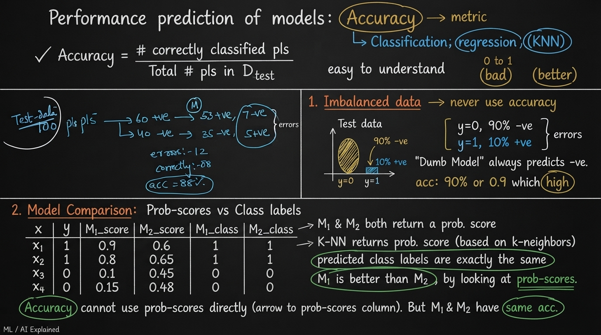  
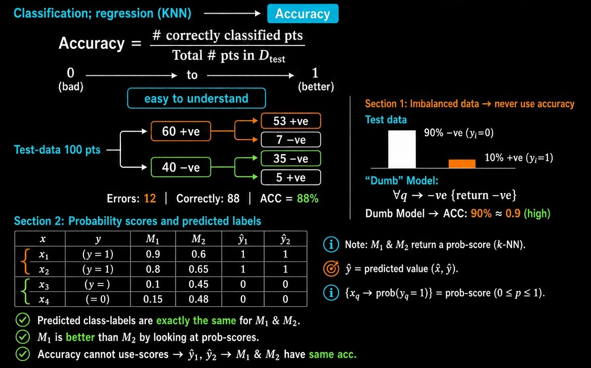

> ### Performance Prediction of Models: Accuracy

### What is Accuracy?

**Accuracy** is the most common and easiest-to-understand performance metric for classification (and sometimes used in regression contexts).

$$
\text{Accuracy} = \dfrac{\text{Number of correctly classified points}}{\text{Total number of points in } D_{\text{Test}}}
$$

- Range: 0 to 1 (or 0% to 100%)
- Higher is better

**Example:**

Test set has 100 points:

- 60 actual +ve → Model predicts 53 +ve and 7 –ve
- 40 actual –ve → Model predicts 35 –ve and 5 +ve

Errors = 12  
Correct = 88  
**Accuracy = 88%**

### Problem 1: Imbalanced Data

**Never use Accuracy on imbalanced datasets.**

Example:

- Test data: 90% –ve class, 10% +ve class
- A “dumb” model that **always predicts –ve** gets **90% accuracy**

This high accuracy is misleading — the model has learned nothing useful.

### Problem 2: Accuracy Ignores Probability Scores

Many models (including K-NN) can return a **probability score** instead of just a hard class label.

Example:

| Point | True y | M1 Prob | M2 Prob | M1 Pred | M2 Pred |
| ----- | ------ | ------- | ------- | ------- | ------- |
| $x_1$ | 1      | 0.9     | 0.6     | 1       | 1       |
| $x_2$ | 1      | 0.8     | 0.65    | 1       | 1       |
| $x_3$ | 0      | 0.1     | 0.45    | 0       | 0       |
| $x_4$ | 0      | 0.15    | 0.48    | 0       | 0       |

- Both models give **exactly the same predicted class labels**
- Therefore both have the **same Accuracy**
- But M1 gives much more confident and better probability scores than M2

**Conclusion:**  
Accuracy cannot distinguish between M1 and M2, even though M1 is clearly better.

### Key Takeaways

- Accuracy is simple and intuitive.
- It fails badly on imbalanced data.
- It cannot use the rich information present in probability scores.
- In many real-world problems we need better metrics (Precision, Recall, F1, Log-loss, AUC, etc.).

## 02. Confusion Matrix, TPR, FPR, FNR, TNR

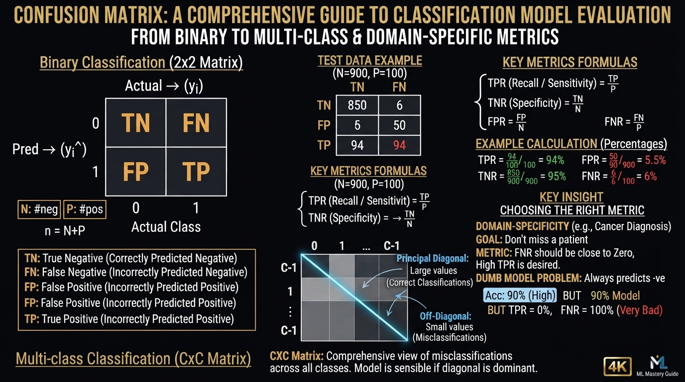  
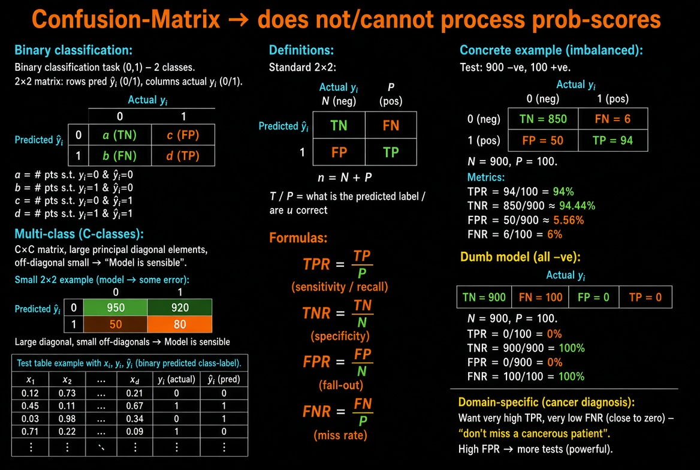

> ### Confusion Matrix

The **Confusion Matrix** is a fundamental tool for evaluating classification models.  
It works with **hard class labels** only — it **cannot process probability scores**.

### Binary Classification (2 classes)

For a binary classification task ($y_i \in \{0,1\}$):

|                                                                  | Actual 0 | Actual 1 |
| ---------------------------------------------------------------- | ---------------------------------------------------------- | ---------------------------------------------------------- |
| Predicted **0** | a        | b        |
| Predicted **1** | c        | d        |

- $a$ = number of points where actual $y_i = 0$ and predicted $\hat{y}_i = 0$
- $b$ = number of points where actual $y_i = 1$ and predicted $\hat{y}_i = 0$
- $c$ = number of points where actual $y_i = 0$ and predicted $\hat{y}_i = 1$
- $d$ = number of points where actual $y_i = 1$ and predicted $\hat{y}_i = 1$

> ### Multi-class Confusion Matrix (C classes) — C × C

|                                                                      | Actual 0 | Actual 1 | …   | Actual C-1 |
| -------------------------------------------------------------------- | ------------------------------------------------------------ | ------------------------------------------------------------ | --- | -------------------------------------------------------------- |
| Predicted **0**   | large    | small    | …   | small      |
| Predicted **1**   | small    | large    | …   | small      |
| ⋮                                                                    | ⋮                                                            | ⋮                                                            | ⋱   | ⋮                                                              |
| Predicted **C-1** | small    | small    | …   | large      |

### Binary special case (2 × 2)

|                                                                  | Actual 0 | Actual 1 |
| ---------------------------------------------------------------- | ---------------------------------------------------------- | ---------------------------------------------------------- |
| Predicted **0** | large    | small    |
| Predicted **1** | small    | large    |

**Key idea from the notes**

- **Principal diagonal** (correct predictions) → large values
- **Off-diagonal** (errors) → small values  
  → **Model is sensible**

### Standard Terminology (TP, FP, FN, TN)

|                                                                  | Actual 0 | Actual 1 |
| ---------------------------------------------------------------- | ---------------------------------------------------------- | ---------------------------------------------------------- |
| Predicted **0** | TN       | FN       |
| Predicted **1** | FP       | TP       |

| Term | Full Form      | Meaning                   |
| ---- | -------------- | ------------------------- |
| TP   | True Positive  | Actual = 1, Predicted = 1 |
| TN   | True Negative  | Actual = 0, Predicted = 0 |
| FP   | False Positive | Actual = 0, Predicted = 1 |
| FN   | False Negative | Actual = 1, Predicted = 0 |

- $N$ = Total number of actual negatives = TN + FP
- $P$ = Total number of actual positives = TP + FN
- $n = N + P$ (total points)

### Rates Derived from Confusion Matrix

$$
\text{TPR} = \dfrac{\text{TP}}{P} \quad \text{(True Positive Rate / Recall / Sensitivity)}
$$

$$
\text{TNR} = \dfrac{\text{TN}}{N} \quad \text{(True Negative Rate / Specificity)}
$$

$$
\text{FPR} = \dfrac{\text{FP}}{N} \quad \text{(False Positive Rate)}
$$

$$
\text{FNR} = \dfrac{\text{FN}}{P} \quad \text{(False Negative Rate)}
$$

### Example (Imbalanced Data)

Test set: 900 negatives + 100 positives

**Confusion Matrix**

|                                                                  | Actual 0                                                         | Actual 1                                                         |
| ---------------------------------------------------------------- | ------------------------------------------------------------------------------------------------------------------ | ------------------------------------------------------------------------------------------------------------------ |
| Predicted **0** | 850 **TN**  | 6 **FN**    |
| Predicted **1** | 50 **FP**   | 94 **TP**   |
|                                                                  | **N** 900 | **P** 100 |

**Rates**

| Metric                                                    | Formula         | Math                              | Value                     | Direction                                                |
| --------------------------------------------------------- | --------------- | --------------------------------- | ------------------------- | -------------------------------------------------------- |
| **TPR** | $\dfrac{TP}{P}$ | $ \dfrac{94}{100} \times 100\% $  | ${\mathbf{94\%}}$         | ⬆ Good |
| **TNR** | $\dfrac{TN}{N}$ | $ \dfrac{850}{900} \times 100\% $ | $\approx {\mathbf{94\%}}$ | ⬆ Good |
| **FPR**   | $\dfrac{FP}{N}$ | $ \dfrac{50}{900} \times 100\% $  | $\approx {\mathbf{6\%}}$  | ⬇ Good   |
| **FNR**   | $\dfrac{FN}{P}$ | $ \dfrac{6}{100} \times 100\% $   | $ {\mathbf{6\%}}$         | ⬇ Good   |

### Dumb Model Example (Always Predicts Negative)

|                                                                  | Actual 0                                                         | Actual 1                                                         |
| ---------------------------------------------------------------- | ------------------------------------------------------------------------------------------------------------------ | ------------------------------------------------------------------------------------------------------------------ |
| Predicted **0** | 900 **TN**  | 100 **FN**  |
| Predicted **1** | 0 **FP**    | 0 **TP**    |
|                                                                  | **N** 900 | **P** 100 |

**Rates**

| Metric                                                    | Formula         | Math                              | Value                | Direction                                                |
| --------------------------------------------------------- | --------------- | --------------------------------- | -------------------- | -------------------------------------------------------- |
| **TPR** | $\dfrac{TP}{P}$ | $ \dfrac{0}{100} \times 100\% $   | ${\mathbf{0\%}}$     | ⬇ Bad    |
| **TNR** | $\dfrac{TN}{N}$ | $ \dfrac{900}{900} \times 100\% $ | $ {\mathbf{100\%}} $ | ⬆ Good |
| **FPR**   | $\dfrac{FP}{N}$ | $ \dfrac{0}{900} \times 100\% $   | $ {\mathbf{0\%}} $   | ⬇ Good |
| **FNR**   | $\dfrac{FN}{P}$ | $ \dfrac{100}{100} \times 100\% $ | $ {\mathbf{100\%}}$  | ⬆ Bad    |

Even though Accuracy looks high (100%), the model is useless (TPR = 0).

### Multi-class Classification ($C$ classes)

Confusion Matrix becomes a $C \times C$ matrix.

- **Large values on the principal diagonal** → Model is sensible
- **Small off-diagonal values** → Few mistakes
- Ideal case: almost all mass concentrated on the diagonal

### Domain-Specific Importance (Medical Example)

**Task:** Diagnose Cancer / Not Cancer

**Critical requirement:**  
Do **not** miss a cancerous patient.

→ We want:

- Very high TPR
- Very low FNR (close to zero)

If FPR is high → more patients will be sent for further (expensive/powerful) tests, which is usually acceptable.

### Key Insight:

In medical diagnosis, False Negatives are far more dangerous than False Positives.  
Always look at TPR and FNR carefully in such domains.

## 03. Precision and Recall, F1-Score

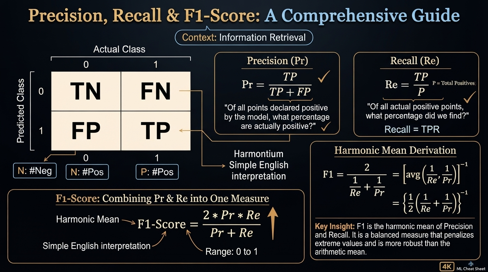  
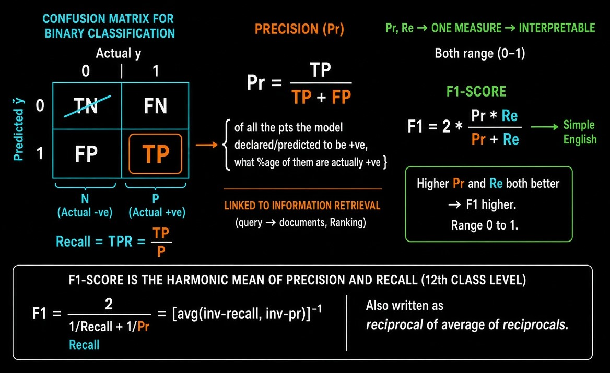

> ### Precision, Recall & F1-Score

These metrics are defined with respect to the **positive class**.

They originally come from **Information Retrieval**.

### Precision (Pr)

$$
\text{Precision} = \dfrac{\text{TP}}{\text{TP} + \text{FP}}
$$

**English meaning:**  
Of all the points the model **declared / predicted** to be positive, what percentage of them are **actually** positive?

### Recall (Re)

$$
\text{Recall} = \text{TPR} = \dfrac{\text{TP}}{P} = \dfrac{\text{TP}}{\text{TP} + \text{FN}}
$$

**English meaning:**  
Of all the actual positive points, what percentage did the model correctly find?

### F1-Score

We often want **one single interpretable number** that combines both Precision and Recall.

$$
\text{F1-Score} = 2 \times \dfrac{\text{Precision} \times \text{Recall}}{\text{Precision} + \text{Recall}}
$$

- Range: 0 to 1
- Higher is better
- Both Precision ↑ and Recall ↑ → F1 ↑

### Why Harmonic Mean?

F1-Score is the **harmonic mean** of Precision and Recall.

$$
\text{F1} = \dfrac{2}{\dfrac{1}{\text{Recall}} + \dfrac{1}{\text{Precision}}} = \left[ \text{average of } \left( \dfrac{1}{\text{Recall}}, \dfrac{1}{\text{Precision}} \right) \right]^{-1}
$$

Or equivalently:

$$
\text{F1} = \left( \dfrac{1}{2} \left( \dfrac{1}{\text{Recall}} + \dfrac{1}{\text{Precision}} \right) \right)^{-1}
$$

**Why harmonic mean instead of arithmetic mean?**  
Harmonic mean punishes extreme values more strongly.  
If either Precision or Recall is very low, F1-Score will also be low.

### Quick Summary

| Metric     | Formula                          | Focus                                      |
|------------|----------------------------------|--------------------------------------------|
| Precision  | TP / (TP + FP)                   | Correctness of positive predictions        |
| Recall     | TP / (TP + FN)                   | Coverage of actual positives               |
| F1-Score   | $2 \times \frac{\text{Pr} \times \text{Re}}{\text{Pr} + \text{Re}}$ | Balance between Precision & Recall |

**Key Insight:**  
When you care about both “not making false alarms” (Precision) and “not missing real cases” (Recall), use **F1-Score**.

## 04. Receiver Operating Characteristic (ROC) Curve and AUC

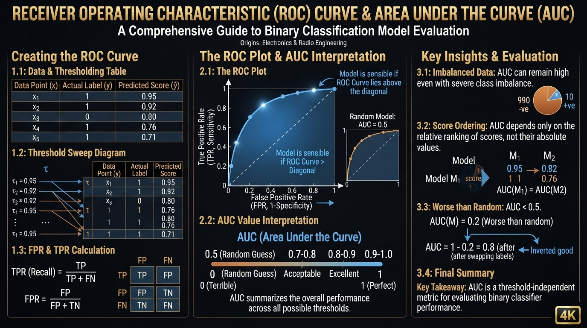  
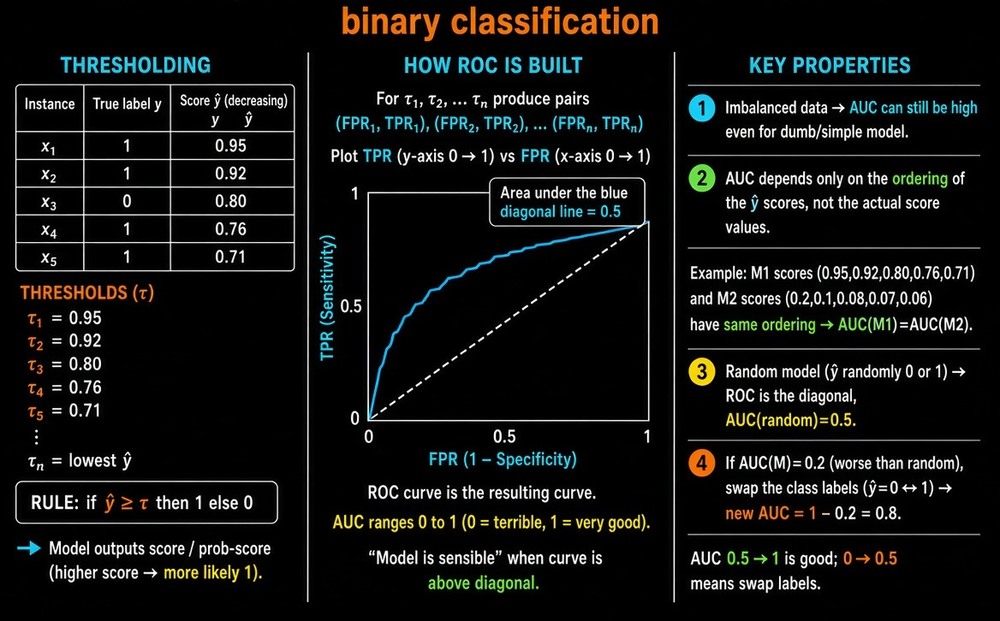

ROC and AUC are used for **binary classification**.

Originally developed by electronics & radio engineers.

### How ROC is Constructed

A model outputs a **score** (probability or decision score) for each point.

We sort the points in **decreasing order of the predicted score** $\hat{y}$.

Example:

| Point | Actual y | Score $\hat{y}$ |
|-------|----------|-----------------|
| $x_1$ | 1        | 0.95            |
| $x_2$ | 1        | 0.92            |
| $x_3$ | 0        | 0.80            |
| $x_4$ | 1        | 0.76            |
| $x_5$ | 1        | 0.71            |

We now choose different **thresholds** $\tau$.

**Thresholding rule:**
- If $\hat{y} \ge \tau$ → predict 1
- Else → predict 0

For every threshold we get a pair **(FPR, TPR)**.

Example thresholds:
- $\tau_1 = 0.95$
- $\tau_2 = 0.92$
- …
- $\tau_n$

This gives us a sequence of points:
$$
(\text{FPR}_1, \text{TPR}_1),\ (\text{FPR}_2, \text{TPR}_2),\ \dots,\ (\text{FPR}_n, \text{TPR}_n)
$$

### ROC Curve

Plot **TPR** (y-axis) vs **FPR** (x-axis).

- The curve starts near (0,0) and ends at (1,1)
- A good model’s curve stays close to the top-left corner
- The diagonal line (random model) has Area = 0.5

### AUC – Area Under the ROC Curve

$$
\text{AUC} \in [0, 1]
$$

| AUC Value     | Meaning                          |
|---------------|----------------------------------|
| close to 1    | Very good model                  |
| = 0.5         | Random model                     |
| < 0.5         | Worse than random                |
| close to 0    | Terrible (predictions are inverted) |

### Important Properties of AUC

**1. Works reasonably well even on imbalanced data**  
(AUC can still be high for a simple/dumb model if the ranking is decent)

**2. AUC depends only on the ranking / ordering of the scores**  
It does **not** depend on the absolute values of the scores.

Example:  
If two models produce scores that give the **same ordering** of points, then  
$$
\text{AUC}(M_1) = \text{AUC}(M_2)
$$

even if the actual score values are very different.

**3. Random model**  
A model that randomly predicts 0 or 1 has  
$$
\text{AUC} = 0.5
$$

**4. AUC < 0.5**  
If a model has AUC = 0.2, it is worse than random.  
Simply **swap the class labels** (predict the opposite) and the new AUC becomes  
$$
1 - 0.2 = 0.8
$$

### Visual Summary

- X-axis → FPR (0 to 1)
- Y-axis → TPR (0 to 1)
- Diagonal line → Random classifier (AUC = 0.5)
- Curve above diagonal → Better than random
- Curve below diagonal → Worse than random (can be fixed by swapping labels)

**Key Insight:**  
AUC measures how well the model **ranks** positive points higher than negative points, independent of any particular threshold.

## Why Use AUC?

> #### 1. Threshold Independent
Most metrics (Accuracy, Precision, Recall, F1) depend on a **specific threshold**.  
AUC evaluates the model across **all possible thresholds**.  
→ Gives a complete picture of model performance.

> #### 2. Works Well with Imbalanced Data
Accuracy fails badly on imbalanced datasets.  
AUC is much more robust and still gives meaningful scores even when classes are highly imbalanced.

> #### 3. Focuses on Ranking Quality
AUC only cares about the **ordering** of the predicted scores.  
It measures:  
> #### `How well does the model rank positive points higher than negative points?`

This is extremely useful in ranking-oriented applications (search, recommendation, risk scoring, etc.).

> #### 4. Scale Invariant
AUC does not depend on the absolute values of the scores.  
Two models that produce different score ranges but the **same ranking** will have the same AUC.

> #### 5. Easy Interpretation
- AUC = 0.5 → Random model
- AUC > 0.5 → Better than random
- AUC close to 1 → Excellent model
- AUC < 0.5 → Worse than random (just invert the predictions)

> #### 6. Widely Used & Comparable
AUC is one of the most standard metrics in binary classification.  
It allows easy comparison between different models.

> #### When AUC is Especially Useful
- Imbalanced datasets
- When you care about ranking more than a single operating point
- When you have not yet decided the final threshold
- Probabilistic models (Logistic Regression, K-NN with probability scores, etc.)

**Key Takeaway:**  
Use AUC when you want a single, threshold-independent, ranking-based measure of how well your model separates the two classes.

## 05. Log-Loss

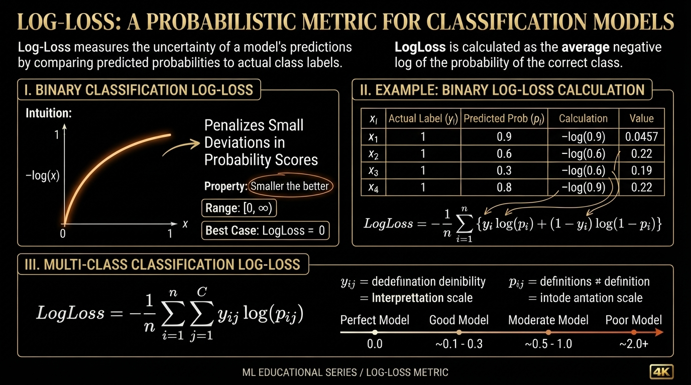  
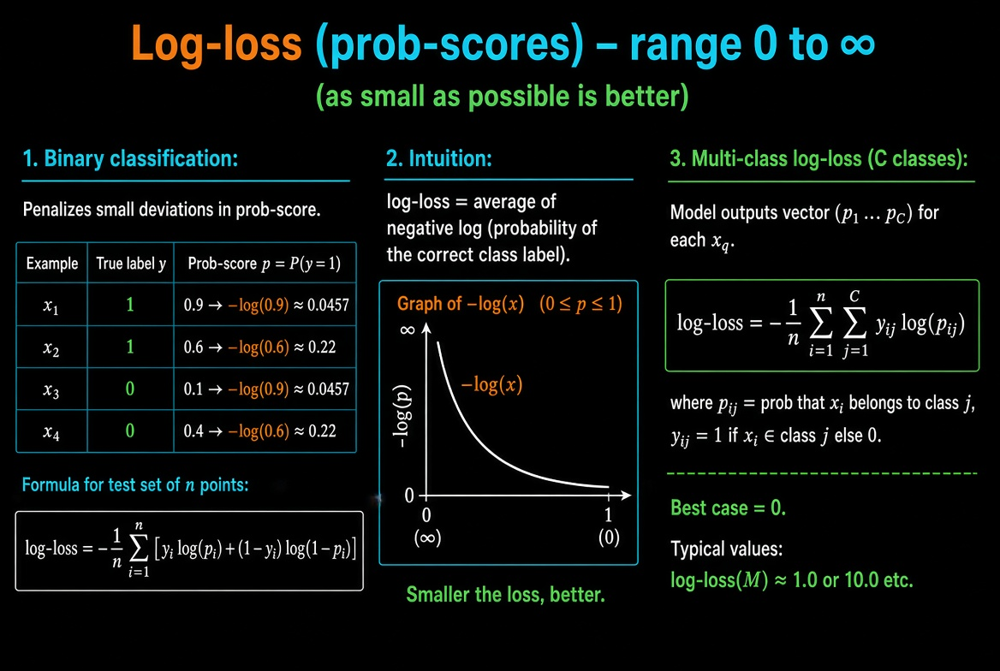

Log-Loss is a metric that works with **probability scores**.

- Range: $0$ to $\infty$
- **Smaller is better**
- Heavily penalizes confident but wrong predictions

### Binary Classification

Let the model output a probability $p_i = \hat{y}_i$ for the positive class.

**Formula:**

$$
\text{Log-Loss} = -\dfrac{1}{n} \sum_{i=1}^{n} \Big[ y_i \log(p_i) + (1 - y_i) \log(1 - p_i) \Big]
$$

**Example:**

| Point | Actual $y$ | Predicted $p$ | Contribution                  |
|-------|------------|---------------|-------------------------------|
| $x_1$ | 1          | 0.9           | $-\log(0.9) \approx 0.0457$   |
| $x_2$ | 1          | 0.6           | $-\log(0.6) \approx 0.22$     |
| $x_3$ | 0          | 0.1           | $-\log(0.9) \approx 0.0457$   |
| $x_4$ | 0          | 0.4           | $-\log(0.6) \approx 0.22$     |

Average of these values = Log-Loss of the model.

### Intuition

Log-Loss = Average of **negative log of the probability of the correct class**.

- If the model is very confident and correct ($p \approx 1$), loss $\approx 0$
- If the model is very confident and wrong ($p \approx 0$ for the true class), loss $\to \infty$

Graph of $-\log(x)$:
- As $x \to 0$, $-\log(x) \to \infty$
- As $x \to 1$, $-\log(x) \to 0$

### Multi-class Log-Loss

For $C$ classes, the model outputs a probability distribution $(p_1, p_2, \dots, p_C)$.

$$
\text{Log-Loss} = -\dfrac{1}{n} \sum_{i=1}^{n} \sum_{j=1}^{C} y_{ij} \log(p_{ij})
$$

Where:
- $y_{ij} = 1$ if point $x_i$ belongs to class $j$, else 0
- $p_{ij}$ = predicted probability that $x_i$ belongs to class $j$

**Best case:** Log-Loss = 0 (model always predicts probability 1 for the correct class)

**Worst case:** Log-Loss $\to \infty$

### Key Properties

| Property                  | Value / Behavior                  |
|---------------------------|-----------------------------------|
| Range                     | $[0, \infty)$                     |
| Best possible value       | 0                                 |
| Sensitive to confidence   | Yes (strongly penalizes overconfidence) |
| Works with                | Probability scores                |
| Suitable for              | Binary & Multi-class              |

**Key Insight:**  
Log-Loss not only checks whether the prediction is correct, but also **how confident** the model is. A model that is correct but unsure is preferred over a model that is confident and wrong.

## 06. R² : Coefficient of Determination

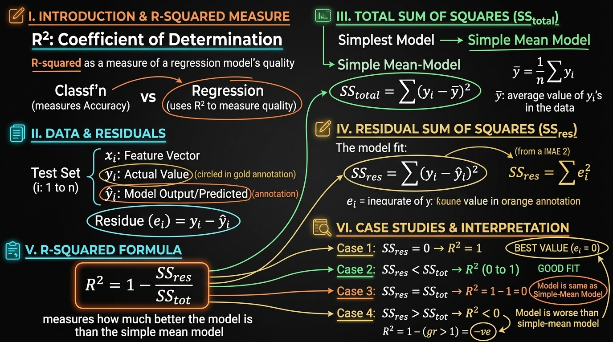  
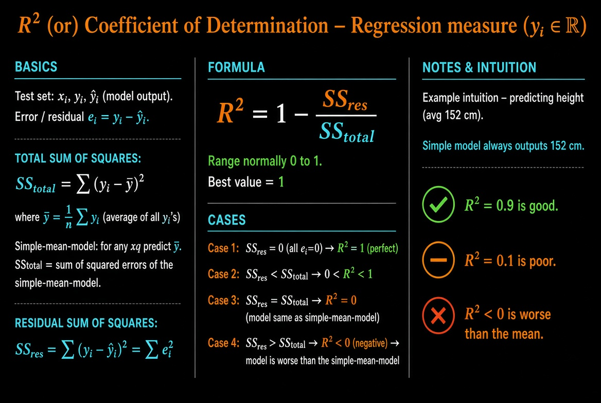

R² is a performance metric used for **Regression** problems (where $y_i \in \mathbb{R}$).

### Error / Residual

For each point:

$$
e_i = y_i - \hat{y}_i
$$

- $y_i$ = actual value  
- $\hat{y}_i$ = model prediction  
- $e_i$ = residual (error)

### Total Sum of Squares (SS_total)

$$
\text{SS}_{\text{total}} = \sum_{i=1}^{n} (y_i - \bar{y})^2
$$

Where

$$
\bar{y} = \dfrac{1}{n} \sum_{i=1}^{n} y_i
$$

**Interpretation:**  
SS_total is the sum of squared errors of the **simplest possible model** — the model that always predicts the mean $\bar{y}$.

Example:  
If average height in training data is 152 cm, the simple mean model always predicts 152 cm for any query point.

### Residual Sum of Squares (SS_res)

$$
\text{SS}_{\text{res}} = \sum_{i=1}^{n} (y_i - \hat{y}_i)^2 = \sum_{i=1}^{n} e_i^2
$$

This is the sum of squared errors of **our actual model**.

### Definition of R²

$$
R^2 = 1 - \dfrac{\text{SS}_{\text{res}}}{\text{SS}_{\text{total}}}
$$

### Different Cases of R²

| Case | Condition                  | R² Value      | Meaning                                      |
|------|----------------------------|---------------|----------------------------------------------|
| 1    | SS_res = 0                 | $R^2 = 1$     | Perfect model (all residuals zero)           |
| 2    | SS_res < SS_total          | $0 < R^2 < 1$ | Model is better than the simple mean model   |
| 3    | SS_res = SS_total          | $R^2 = 0$     | Model is exactly as good as the mean model   |
| 4    | SS_res > SS_total          | $R^2 < 0$     | Model is **worse** than the simple mean model|

- Best possible value: $R^2 = 1$
- $R^2$ can be negative (unlike many classification metrics)

### Key Insights

- R² tells us **how much better** our model is compared to simply predicting the average.
- $R^2 = 0.9$ means the model explains 90% of the variance in the target.
- $R^2 = 0.1$ means the model is only slightly better than predicting the mean.
- Negative R² is a strong warning that the model is performing poorly.

## 07. Median Absolute Deviation (MAD)

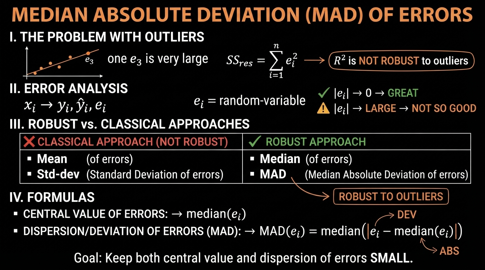  
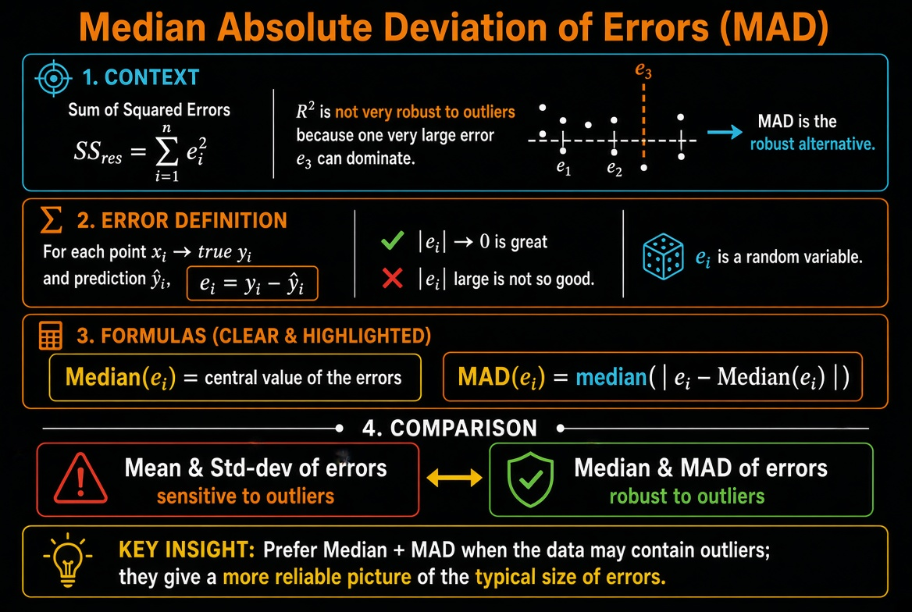

> ### Median Absolute Deviation (MAD) of Errors

### Why Do We Need MAD?

We know:

$$
\text{SS}_{\text{res}} = \sum_{i=1}^{n} e_i^2
$$

If even **one** residual $e_i$ is very large (outlier), it heavily influences SS_res (because of squaring).

→ **R² is not very robust to outliers**.

### Residuals as a Random Variable

For each point:

$$
x_i \;\to\; y_i,\; \hat{y}_i \;\to\; e_i = y_i - \hat{y}_i
$$

- $e_i$ is treated as a random variable
- Ideal case: all $|e_i| \to 0$ (great model)
- If $|e_i|$ are large → model is not good

### Median and MAD

Instead of using mean and standard deviation (which are sensitive to outliers), we use:

- **Median** of the errors → central value of errors
- **MAD** (Median Absolute Deviation)

$$
\text{MAD}(e_i) = \text{Median}\big( |e_i - \text{Median}(e_i)| \big)
$$

### Comparison

| Measure              | Sensitive to Outliers? | Robust Alternative      |
|----------------------|------------------------|-------------------------|
| Mean                 | Yes                    | Median                  |
| Standard Deviation   | Yes                    | MAD                     |

### Key Insight

- Mean & Standard Deviation → affected by extreme residuals
- Median & MAD → **robust to outliers**

When the dataset contains outliers in the target variable (or large prediction errors), prefer looking at **Median of errors** and **MAD** instead of relying only on R² or SS_res.

## 08. Distribution of Errors

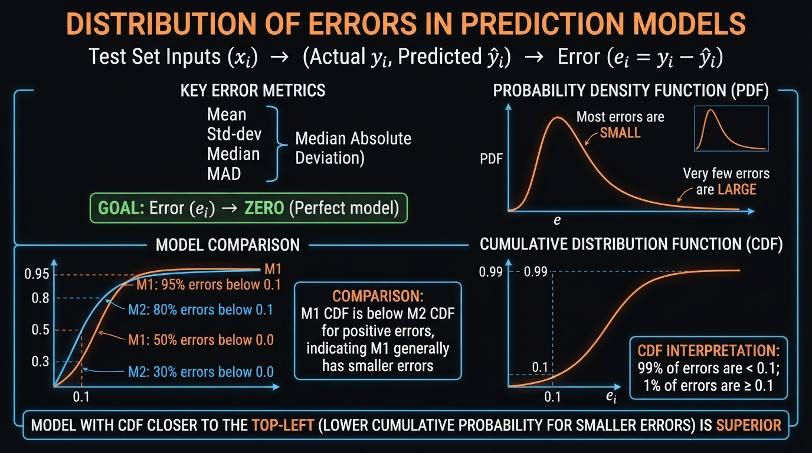  
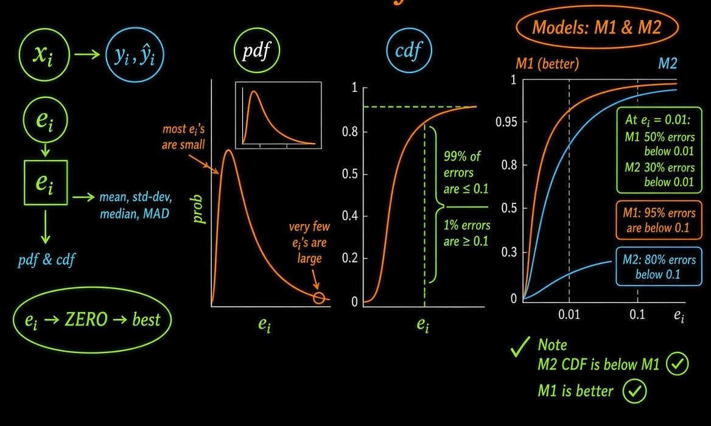

## 09. Assignment-3: Apply k-Nearest Neighbor

> ### [`Assignment.ipynb`](./Assignment.ipynb)

## 10. Revision Questions

**Questions (clickable to respective answers)**

1. [What is Accuracy?](#1-what-is-accuracy)
2. [Explain about Confusion matrix, TPR, FPR, FNR, TNR?](#2-explain-about-confusion-matrix-tpr-fpr-fnr-tnr)
3. [What do you understand about Precision & recall, F1-score? How would you use it?](#3-what-do-you-understand-about-precision--recall-f1-score-how-would-you-use-it)
4. [What is the ROC Curve and what is AUC (a.k.a. AUROC)?](#4-what-is-the-roc-curve-and-what-is-auc-aka-auroc)
5. [What is Log-loss and how it helps to improve performance?](#5-what-is-log-loss-and-how-it-helps-to-improve-performance)
6. [Explain about R-Squared / Coefficient of determination.](#6-explain-about-r-squared--coefficient-of-determination)
7. [Explain about Median absolute deviation (MAD)? Importance of MAD?](#7-explain-about-median-absolute-deviation-mad-importance-of-mad)
8. [Define Distribution of errors?](#8-define-distribution-of-errors)

### 1. What is Accuracy?

**Accuracy** is the simplest classification metric. It measures the proportion of correctly predicted instances out of the total number of instances.

$ \text{Accuracy} = \frac{\text{Number of correct predictions}}{\text{Total number of predictions}} = \frac{TP + TN}{TP + TN + FP + FN} $

**When it is useful**:
- Classes are roughly balanced.
- All classes are equally important.

**Limitation**:
- On imbalanced datasets, accuracy can be misleading. A model that always predicts the majority class can achieve high accuracy while completely failing on the minority class.

### 2. Explain about Confusion matrix, TPR, FPR, FNR, TNR?

**Confusion Matrix** is a table that summarizes the performance of a classification model by showing the counts of:

|                | Predicted Positive | Predicted Negative |
|----------------|--------------------|--------------------|
| **Actual Positive** | True Positive (TP)     | False Negative (FN)    |
| **Actual Negative** | False Positive (FP)    | True Negative (TN)     |

**Derived rates**:

- **TPR (True Positive Rate)** / **Recall** / **Sensitivity**  
  $ TPR = \frac{TP}{TP + FN} $  
  Proportion of actual positives correctly identified.

- **FPR (False Positive Rate)**  
  $ FPR = \frac{FP}{FP + TN} $  
  Proportion of actual negatives incorrectly classified as positive.

- **FNR (False Negative Rate)**  
  $ FNR = \frac{FN}{TP + FN} = 1 - TPR $  
  Proportion of actual positives missed by the model.

- **TNR (True Negative Rate)** / **Specificity**  
  $ TNR = \frac{TN}{TN + FP} = 1 - FPR $  
  Proportion of actual negatives correctly identified.

These four rates fully describe the model’s behavior at a given threshold.

### 3. What do you understand about Precision & recall, F1-score? How would you use it?

**Precision** (Positive Predictive Value):
$ \text{Precision} = \frac{TP}{TP + FP} $  
Of all the instances the model predicted as positive, how many were actually positive?

**Recall** (TPR / Sensitivity):
$ \text{Recall} = \frac{TP}{TP + FN} $  
Of all the actual positive instances, how many did the model correctly find?

**F1-Score** is the harmonic mean of Precision and Recall:
$ F1 = 2 \times \frac{\text{Precision} \times \text{Recall}}{\text{Precision} + \text{Recall}} $

**How to use them**:
- **High Precision** needed when False Positives are costly (e.g., spam detection, recommending expensive medical tests).
- **High Recall** needed when False Negatives are costly (e.g., cancer detection, fraud detection, safety-critical systems).
- **F1-Score** is useful when you want a single number that balances both, especially on imbalanced datasets.
- You can also look at **Precision-Recall curves** and **Average Precision** when classes are highly imbalanced (often better than ROC in such cases).

### 4. What is the ROC Curve and what is AUC (a.k.a. AUROC)?

**ROC Curve** (Receiver Operating Characteristic Curve) plots:
- **X-axis**: False Positive Rate (FPR)
- **Y-axis**: True Positive Rate (TPR)

It is generated by varying the classification threshold from 0 to 1 and recording the (FPR, TPR) pairs.

**AUC (Area Under the ROC Curve)** / **AUROC**:
- Measures the overall ability of the model to discriminate between positive and negative classes, independent of any particular threshold.
- AUC = 1.0 → Perfect classifier
- AUC = 0.5 → Random classifier (no discriminative power)
- AUC < 0.5 → Worse than random (can be inverted)

**Advantages**:
- Threshold-independent.
- Works reasonably well even with moderate class imbalance.
- Easy to compare multiple models.

**Note**: On extremely imbalanced datasets, the Precision-Recall curve is often more informative than ROC.

### 5. What is Log-loss and how it helps to improve performance?

**Log-loss** (also called Binary Cross-Entropy or Logistic Loss) measures the performance of a classification model whose output is a probability value between 0 and 1.

For binary classification:
$ \text{Log-loss} = -\frac{1}{N} \sum_{i=1}^{N} \left[ y_i \log(p_i) + (1 - y_i) \log(1 - p_i) \right] $

where $ y_i $ is the true label (0 or 1) and $ p_i $ is the predicted probability of class 1.

**Key properties**:
- Heavily penalizes confident but wrong predictions (e.g., predicting 0.99 when the true label is 0).
- Rewards well-calibrated probability estimates.

**How it helps improve performance**:
- Forces the model to output meaningful probabilities rather than just hard labels.
- Encourages the model to be less overconfident on wrong predictions.
- Commonly used as the loss function for Logistic Regression, Neural Networks, Gradient Boosting (with logistic objective), etc.
- Optimizing log-loss usually leads to better-calibrated models and improved ranking metrics (AUC, etc.).

### 6. Explain about R-Squared / Coefficient of determination.

**R-Squared ($ R^2 $)** measures the proportion of variance in the dependent variable that is predictable from the independent variables.

$ R^2 = 1 - \frac{SS_{\text{res}}}{SS_{\text{tot}}} = 1 - \frac{\sum (y_i - \hat{y}_i)^2}{\sum (y_i - \bar{y})^2} $

- $ SS_{\text{res}} $ = Residual Sum of Squares (error of the model)
- $ SS_{\text{tot}} $ = Total Sum of Squares (variance of the target)

**Interpretation**:
- $ R^2 = 1 $ → Perfect fit
- $ R^2 = 0 $ → Model is no better than predicting the mean
- $ R^2 < 0 $ → Model is worse than predicting the mean

**Limitations**:
- Always increases when you add more features (even useless ones) → use **Adjusted $ R^2 $** instead.
- Does not tell you whether the model is biased or whether residuals are well-behaved.
- Sensitive to outliers.

### 7. Explain about Median absolute deviation (MAD)? Importance of MAD?

**Median Absolute Deviation (MAD)** is a robust measure of statistical dispersion:

$ \text{MAD} = \text{median} \left( |x_i - \text{median}(X)| \right) $

**Importance**:
- Extremely robust to outliers (unlike standard deviation, which is heavily influenced by extreme values).
- Used for robust outlier detection (e.g., modified Z-score = $ 0.6745 \times \frac{x_i - \text{median}}{\text{MAD}} $).
- Preferred when data is skewed or contains outliers.
- Commonly used in robust statistics and as a scale estimator in robust regression and anomaly detection algorithms.

A common rule of thumb: points with modified Z-score > 3.5 are considered potential outliers.

### 8. Define Distribution of errors?

**Distribution of errors** (or residual distribution) refers to the statistical distribution of the prediction errors $ e_i = y_i - \hat{y}_i $.

In a well-behaved regression model, we typically expect:
- Errors to be approximately **normally distributed** (for many classical statistical tests and confidence intervals).
- Errors to have **mean ≈ 0** (no systematic bias).
- Errors to be **homoscedastic** (constant variance across the range of predictions).
- No strong patterns or autocorrelation in the residuals.

**Why it matters**:
- Helps diagnose model misspecification (non-linearity, missing features, heteroscedasticity).
- Guides choice of evaluation metrics (MAE vs MSE vs Huber loss).
- Important for uncertainty quantification and prediction intervals.
- Visual tools: residual histograms, Q-Q plots, residual vs fitted plots.

If errors are heavily skewed or have heavy tails, robust metrics (MAE, MAD, quantile loss) or transformations may be more appropriate than MSE / $ R^2 $.