<style>
  @import url("https://fonts.googleapis.com/css2?family=Play:wght@400;700&display=swap");
  @import url("https://cdnjs.cloudflare.com/ajax/libs/latin-modern/1.1.0/css/latinmodern-math.min.css");

  :root {
    --la-ink: #3f6386;
    --la-teal: #3f6386;
    --la-teal-soft: #e8f6f7;
    --la-coral: #9333ea;
    --la-coral-soft: #fff1ed;
    --la-cdf: #17283a;
    --la-line: #5b5c5c;
    --la-surface: #f7faf9;
    --la-text: #c9c9c9;
    --la-panel: #00070e;
    --la-chip: #17283a;
    --la-amber: #9a6b16;
    --la-amber-soft: #fff8e6;
  }

  *,
  *::before,
  *::after {
    font-family: "Play", sans-serif !important;
  }

  pre,
  pre code {
    font-family: Consolas, "Courier New", monospace !important;
  }

  body,
  .markdown-body,
  p,
  li {
    color: var(--la-text) !important;
  }

  h1 {
    color: var(--la-ink);
    border-bottom: 4px solid var(--la-teal);
    padding-bottom: 0.35em;
  }

  h2 {
    color: var(--la-teal);
    border-left: 6px solid var(--la-teal);
    padding-left: 0.55em;
    margin-top: 2em;
  }

  h3,
  h4 {
    color: var(--la-coral);
  }

  a {
    color: var(--la-coral);
    text-decoration: none;
  }

  a:hover {
    text-decoration: underline;
  }

  blockquote {
    background: var(--la-panel);
    border-left: 5px solid var(--la-cdf) !important;
    border-radius: 6px;
    color: var(--la-text);
    padding: 0.75em 1em;
  }

  code {
    background: var(--la-chip);
    border-radius: 4px;
    color: var(--la-text);
    padding: 0.1em 0.3em;
  }

  pre {
    background: var(--la-panel);
    border: 1px solid var(--la-line);
    border-radius: 8px;
    overflow-x: auto;
    padding: 1em;
  }

  table {
    border: 1px solid var(--la-line);
    border-collapse: collapse;
    border-radius: 8px;
    overflow: hidden;
    width: 100%;
  }

  th {
    background: var(--la-panel);
    color: var(--la-text);
    padding: 0.7em 0.8em;
    text-align: left;
  }

  td {
    color: var(--la-text);
    padding: 0.7em 0.8em;
  }

  tr:nth-child(even) {
    background: var(--la-chip);
  }

  hr {
    border: 0;
    border-top: 2px solid var(--la-line);
    margin: 2.2em 0;
  }

  .summary-grid,
  .ml-grid,
  .intuition-grid {
    display: flex;
    gap: 1em;
    margin: 1.25em 0;
  }

  .summary-card,
  .ml-card,
  .intuition-card {
    background: var(--la-panel);
    border-radius: 7px;
    color: var(--la-text);
    flex: 1 1 0;
    min-width: 0;
    padding: 1em;
  }

  .summary-card {
    border-top: 5px solid var(--la-teal);
  }

  .summary-card.pdf,
  .ml-card.diagnostics,
  .intuition-card.pdf {
    border-top-color: var(--la-coral);
  }

  .summary-card.cdf,
  .intuition-card.cdf {
    border-top-color: var(--la-cdf);
  }

  .summary-card h3,
  .ml-card h3,
  .intuition-card h3 {
    margin-top: 0;
  }

  .summary-tag,
  .panel-kicker {
    color: var(--la-teal);
    font-size: 0.82em;
    font-weight: 700;
    letter-spacing: 0.04em;
    text-transform: uppercase;
  }

  .relationship-banner,
  .ml-workflow {
    align-items: center;
    background: var(--la-panel);
    border: 1px solid var(--la-teal);
    border-radius: 7px;
    color: var(--la-text);
    display: flex;
    flex-wrap: wrap;
    gap: 0.6em;
    justify-content: center;
    margin: 1.25em 0;
    padding: 0.85em 1em;
    text-align: center;
  }

  .relationship-banner strong,
  .ml-workflow strong,
  .relationship-item strong,
  .insight-item strong {
    color: var(--la-coral);
  }

  .relationship-banner .arrow {
    color: var(--la-teal);
    font-size: 1.2em;
  }

  .relationship-item,
  .insight-item {
    background: var(--la-panel);
    border-left: 5px solid var(--la-teal);
    border-radius: 5px;
    color: var(--la-text);
    margin: 0.65em 0;
    padding: 0.55em 0.85em;
  }

  .insight-item {
    border-left-color: var(--la-coral);
  }

  .insight-list,
  .feature-chips {
    display: flex;
    flex-wrap: wrap;
    gap: 0.55em;
    list-style: none;
    margin: 0.5em 0 1em;
    padding: 0;
  }

  .insight-list li,
  .feature-chips li {
    background: var(--la-chip);
    border: 1px solid var(--la-teal);
    border-radius: 999px;
    color: var(--la-text);
    padding: 0.35em 0.75em;
  }

  .feature-chips li {
    border-radius: 4px;
    border-left: 3px solid var(--la-coral);
    border-right: none;
    border-top: none;
    border-bottom: none;
    flex: 1 1 calc(50% - 0.45em);
  }

  .concept-flow {
    align-items: center;
    display: flex;
    flex-direction: column;
    margin: 1.25em 0;
  }

  .concept-flow .flow-step {
    background: var(--la-panel);
    border: 1px solid var(--la-teal);
    border-radius: 7px;
    color: var(--la-text);
    max-width: 22em;
    padding: 0.7em 1.2em;
    text-align: center;
    width: 100%;
  }

  .concept-flow .flow-step strong {
    color: var(--la-coral);
  }

  .concept-flow .flow-arrow {
    color: var(--la-teal);
    font-size: 1.35em;
    line-height: 1.25;
  }

  .percentile-callout {
    background: var(--la-panel);
    border-left: 5px solid var(--la-cdf);
    border-radius: 7px;
    color: var(--la-text);
    margin: 1.25em 0;
    padding: 1em;
  }

  .percentile-callout strong {
    color: var(--la-cdf);
  }

  .katex-display,
  .math,
  .math-block {
    background: #00070e;
    border-left: 6px solid #2f005c;
    border-radius: 6px;
    padding: 0.6em 0.8em;
    overflow-x: auto;
    color: #c9c9c9 !important;
    font-family: "Latin Modern Math", "Cambria Math", "STIX Two Math", serif !important;
  }

  .katex,
  .katex * {
    color: #9b9a9a !important;
    font-family: "Latin Modern Math", "Cambria Math", "STIX Two Math", serif !important;
  }

  @media (max-width: 700px) {
    .summary-grid,
    .ml-grid,
    .intuition-grid {
      flex-direction: column;
    }
  }
</style>

# Naive Bayes

## Table of Contents

[01. Conditional Probability](#01-conditional-probability)

[02. Independent vs Mutually Exclusive Events](#02-independent-vs-mutually-exclusive-events)

[03. Bayes Theorem with Examples](#03-bayes-theorem-with-examples)

[04. Exercise Problems on Bayes Theorem](#04-exercise-problems-on-bayes-theorem)

[05. Naive Bayes Algorithm](#05-naive-bayes-algorithm)

[06. Toy Example: Train and Test Stages](#06-toy-example-train-and-test-stages)

[07. Naive Bayes on Text Data](#07-naive-bayes-on-text-data)

[08. Laplace/Additive Smoothing](#08-laplaceadditive-smoothing)

[09. Log-Probabilities for Numerical Stability](#09-log-probabilities-for-numerical-stability)

[10 - Bias and Variance Tradeoff](#10-bias-and-variance-tradeoff)

[11. Feature Importance and Interpretability](#11-feature-importance-and-interpretability)

[12. Imbalanced Data](#12-imbalanced-data)

[13. Outliers](#13-outliers)

[14. Missing Values](#14-missing-values)

[15. Handling Numerical Features (Gaussian NB)](#15-handling-numerical-features-gaussian-nb)

[16. Multiclass Classification](#16-multiclass-classification)

[17. Similarity or Distance Matrix](#17-similarity-or-distance-matrix)

[18. Large Dimensionality](#18-large-dimensionality)

[19. Best and Worst Cases](#19-best-and-worst-cases)

[20. Code Example](#20-code-example)

[21. Assignment-4: Apply Naive Bayes](#21-assignment-4-apply-naive-bayes)

[22. Revision Questions](#22-revision-questions)

## 01. Conditional Probability

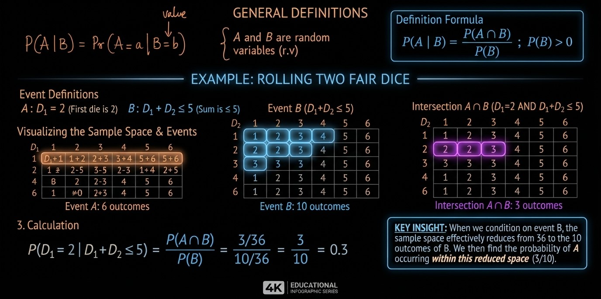  
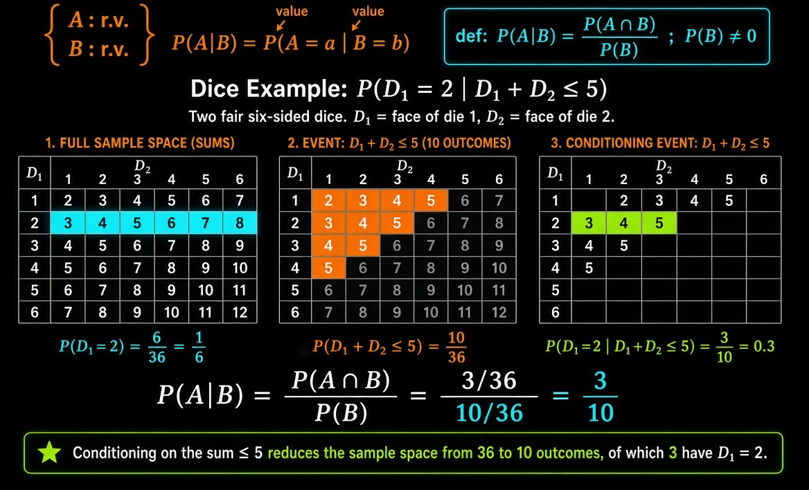

### Definition

Conditional probability of event $A$ given event $B$ is written as:

$$
P(A \mid B) = P(A = a \mid B = b)
$$

Here both $A$ and $B$ are random variables.

### Formal Definition

$$
P(A \mid B) = \dfrac{P(A \cap B)}{P(B)} \quad \text{provided } P(B) \neq 0
$$

- $P(A \cap B)$ = Probability that both $A$ and $B$ occur
- $P(B)$ = Probability that $B$ occurs
- We cannot condition on an impossible event ($P(B) = 0$)

### Intuition

$P(A \mid B)$ answers the question:

> “What is the probability of $A$ happening, **given that** we already know $B$ has happened?”

Suppose that somebody secretly rolls two fair six-sided dice, and we wish to compute the probability that the face-up value of the first one is 2, given the information that their sum is no greater than 5.

- Let $D_1$ be the value rolled on dice 1.
- Let $D_2$ be the value rolled on dice 2.

> ### Probability that $D_1 = 2$

Table 1 shows the sample space of 36 combinations of rolled values of the two dice, each of which occurs with probability $\dfrac{1}{36}$, with the numbers displayed in the red and dark gray cells being $D_1 + D_2$.

$D_1 = 2$ in exactly 6 of the 36 outcomes; thus $P(D_1 = 2) = \dfrac{6}{36} = \dfrac{1}{6}$:

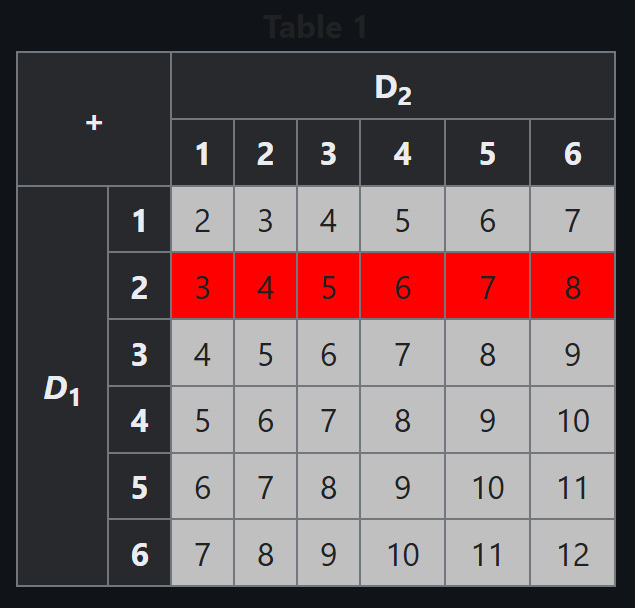

> ### Probability that $D_1 + D_2 \leq 5$

Table 2 shows that $D_1 + D_2 \leq 5$ for exactly 10 of the 36 outcomes, thus $P(D_1 + D_2 \leq 5) = \dfrac{10}{36}$:

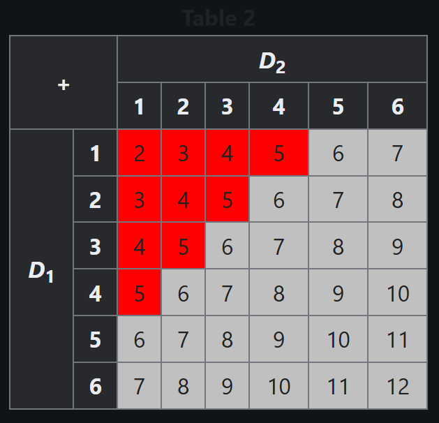

### Probability that $D_1 = 2$ given that $D_1 + D_2 \leq 5$

Table 3 shows that for 3 of these 10 outcomes, $D_1 = 2$.

Thus, the conditional probability $P(D_1 = 2 \mid D_1 + D_2 \leq 5) = \dfrac{3}{10} = 0.3$:

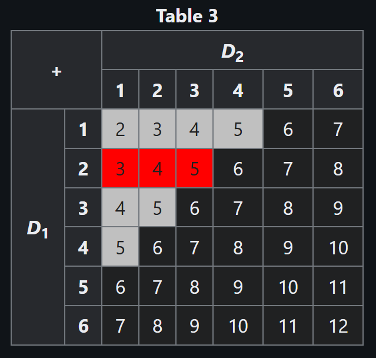

Here, in the earlier notation for the definition of conditional probability, the conditioning event $B$ is that $D_1 + D_2 \leq 5$, and the event $A$ is $D_1 = 2$. We have:

$$P(A \mid B) = \frac{P(A \cap B)}{P(B)} = \frac{\dfrac{3}{36}}{\dfrac{10}{36}} = \frac{3}{10}$$

## 02. Independent vs Mutually Exclusive Events

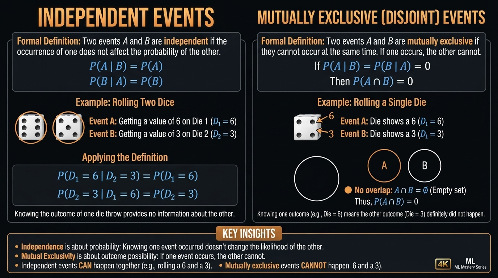  
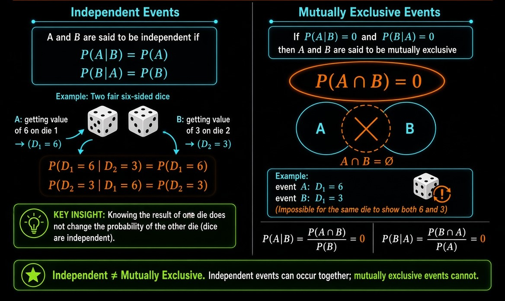

### Independent Events

Two events $A$ and $B$ are said to be **independent** if:

$$
P(A \mid B) = P(A)
$$

$$
P(B \mid A) = P(B)
$$

**Meaning:**  
Knowing that one event has occurred does not change the probability of the other event.

**Example (Two fair dice):**

- Event $A$: Getting value 6 on Die 1 ($D_1 = 6$)
- Event $B$: Getting value 3 on Die 2 ($D_2 = 3$)

Then:

$$
P(D_1 = 6 \mid D_2 = 3) = P(D_1 = 6)
$$

$$
P(D_2 = 3 \mid D_1 = 6) = P(D_2 = 3)
$$

The outcome of one die does not affect the other → the events are independent.

### Mutually Exclusive Events

Two events $A$ and $B$ are said to be **mutually exclusive** if they cannot occur at the same time.

$$
P(A \cap B) = 0
$$

This also implies:

$$
P(A \mid B) = 0 \quad \text{and} \quad P(B \mid A) = 0
$$

(when the conditioning event has non-zero probability)

**Example (Single die):**

- Event $A$: $D_1 = 6$
- Event $B$: $D_1 = 3$

A die cannot show both 6 and 3 at the same time.

$$
P(A \cap B) = 0
$$

In the Venn diagram, the two sets do not overlap.

### Key Difference

| Concept            | Condition            | Meaning                                     |
| ------------------ | -------------------- | ------------------------------------------- |
| Independent        | $P(A \mid B) = P(A)$ | Occurrence of one does not affect the other |
| Mutually Exclusive | $P(A \cap B) = 0$    | Both cannot happen together                 |

**Note:**  
If two events are mutually exclusive and both have positive probability, they **cannot** be independent (because knowing one occurred makes the probability of the other zero).

## 03. Bayes Theorem with Examples

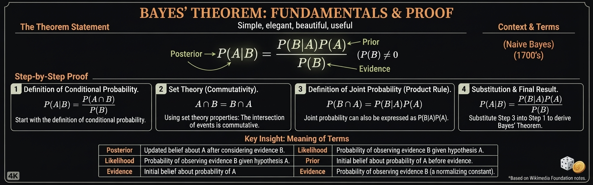  
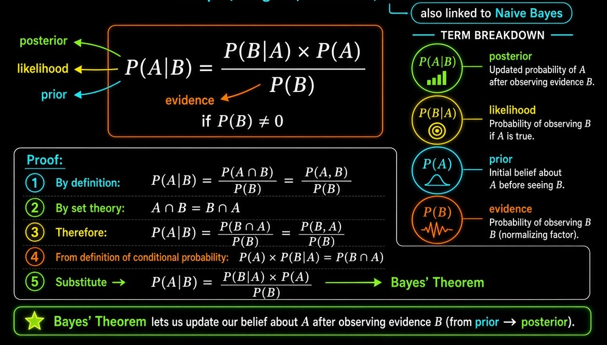

## Bayes’ Theorem (1700s)

Bayes’ Theorem is simple, elegant, beautiful, and extremely useful.  
It is the foundation of **Naive Bayes** classifiers.

### Statement

$$
P(A \mid B) = \dfrac{P(B \mid A)\, P(A)}{P(B)} \quad \text{if } P(B) \neq 0
$$

### Terminology

| Term       | Symbol        | Meaning                                       |
| ---------- | ------------- | --------------------------------------------- |
| Posterior  | $P(A \mid B)$ | Probability of $A$ after observing $B$        |
| Likelihood | $P(B \mid A)$ | Probability of observing $B$ given $A$        |
| Prior      | $P(A)$        | Probability of $A$ before seeing any evidence |
| Evidence   | $P(B)$        | Probability of observing $B$                  |

### Proof

Start from the definition of conditional probability:

$$
P(A \mid B) = \dfrac{P(A \cap B)}{P(B)} = \dfrac{P(A, B)}{P(B)}
$$

By set theory:

$$
A \cap B = B \cap A
$$

So

$$
P(A \mid B) = \dfrac{P(B \cap A)}{P(B)} = \dfrac{P(B, A)}{P(B)}
$$

From the definition of conditional probability again:

$$
P(B \mid A) = \dfrac{P(B \cap A)}{P(A)} \implies P(B \cap A) = P(B \mid A)\, P(A)
$$

Substitute back:

$$
P(A \mid B) = \dfrac{P(B \mid A)\, P(A)}{P(B)}
$$

This is **Bayes’ Theorem**.

### Key Insight

Bayes’ Theorem lets us **reverse** conditional probabilities:

> We can compute $P(A \mid B)$ using $P(B \mid A)$, the prior $P(A)$, and the evidence $P(B)$.

## 04. Exercise Problems on Bayes Theorem

> ### [`Practice : Conditional Probability`](./practice/Conditional-Probability.pdf)

> ### [`Practice : Naive Bayes`](./practice/Naive%20Bayes.pdf)

## 05. Naive Bayes Algorithm

  


https://en.wikipedia.org/wiki/Naive_Bayes_classifier

https://en.wikipedia.org/wiki/Naive_Bayes_classifier#Probabilistic_model

Abstractly, naive Bayes is a conditional probability model: it assigns probabilities $p(C_k \mid x_1,\ldots,x_n)$ for each of the $K$ possible outcomes or _classes_ $C_k$ given a problem instance to be classified, represented by a vector $\mathbf{x} = (x_1,\ldots,x_n)$ encoding some $n$ features (independent variables).

The problem with the above formulation is that if the number of features $n$ is large or if a feature can take on a large number of values, then basing such a model on probability tables is infeasible. The model must therefore be reformulated to make it more tractable. Using Bayes' theorem, the conditional probability can be decomposed as:

$$p(C_k \mid \mathbf{x}) = \frac{p(C_k)\ p(\mathbf{x} \mid C_k)}{p(\mathbf{x})}$$

In plain English, using Bayesian probability terminology, the above equation can be written as:

$$\text{posterior} = \frac{\text{prior}\times \text{likelihood}}{\text{evidence}}$$

In practice, there is interest only in the numerator of that fraction, because the denominator does not depend on $C$ and the values of the features $x_i$ are given, so that the denominator is effectively constant.

The numerator is equivalent to the joint probability model $p(C_k,x_1,\ldots,x_n)$ which can be rewritten as follows, using the chain rule for repeated applications of the definition of conditional probability:

$$
\begin{aligned}
p(C_k,x_1,\ldots,x_n) &= p(x_1,\ldots,x_n,C_k) \\
&= p(x_1 \mid x_2,\ldots,x_n,C_k)\ p(x_2,\ldots,x_n,C_k) \\
&= p(x_1 \mid x_2,\ldots,x_n,C_k)\ p(x_2 \mid x_3,\ldots,x_n,C_k)\ p(x_3,\ldots,x_n,C_k) \\
&= \cdots \\
&= p(x_1 \mid x_2,\ldots,x_n,C_k)\ p(x_2 \mid x_3,\ldots,x_n,C_k)\cdots p(x_{n-1} \mid x_n,C_k)\ p(x_n \mid C_k)\ p(C_k)
\end{aligned}
$$

Now the "naive" conditional independence assumptions come into play: assume that all features in $\mathbf{x}$ are mutually independent, conditional on the category $C_k$. Under this assumption, $p(x_i \mid x_{i+1},\ldots,x_n,C_k) = p(x_i \mid C_k)$.

Thus, the joint model can be expressed as:

$$
\begin{aligned}
p(C_k \mid x_1,\ldots,x_n) &\propto \ p(C_k,x_1,\ldots,x_n) \\
&= p(C_k)\ p(x_1 \mid C_k)\ p(x_2 \mid C_k)\ p(x_3 \mid C_k)\ \cdots \\
&= p(C_k)\prod _{i=1}^{n}p(x_i \mid C_k)
\end{aligned}
$$

where $\propto$ denotes proportionality since the denominator $p(\mathbf{x})$ is omitted.

This means that under the above independence assumptions, the conditional distribution over the class variable $C$ is:

$$p(C_k \mid x_1,\ldots,x_n) = \frac{1}{Z}\ p(C_k)\prod _{i=1}^{n}p(x_i \mid C_k)$$

where the evidence $Z = p(\mathbf{x}) = \sum _k p(C_k)\ p(\mathbf{x} \mid C_k)$ is a scaling factor dependent only on $x_1,\ldots,x_n$, that is, a constant if the values of the feature variables are known.

Often, it is only necessary to discriminate between classes. In that case, the scaling factor is irrelevant, and it is sufficient to calculate the log-probability up to a factor:

$$\ln p(C_k \mid x_1,\ldots,x_n) = \ln p(C_k)+\sum _{i=1}^{n}\ln p(x_i \mid C_k)\underbrace {-\ln Z} _{\text{irrelevant}}$$

The scaling factor is irrelevant, since discrimination subtracts it away:

$$\ln \frac{p(C_k \mid x_1,\ldots,x_n)}{p(C_l \mid x_1,\ldots,x_n)}=\left(\ln p(C_k)+\sum _{i=1}^{n}\ln p(x_i \mid C_k)\right)-\left(\ln p(C_l)+\sum _{i=1}^{n}\ln p(x_i \mid C_l)\right)$$

There are two benefits of using log-probability. One is that it allows an interpretation in information theory, where log-probabilities are units of information in nats. Another is that it avoids arithmetic underflow.

## 06. Toy Example: Train and Test Stages

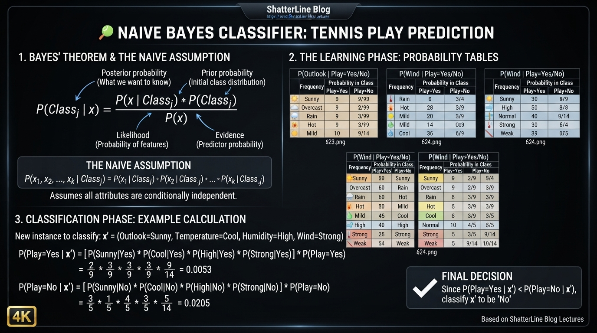  
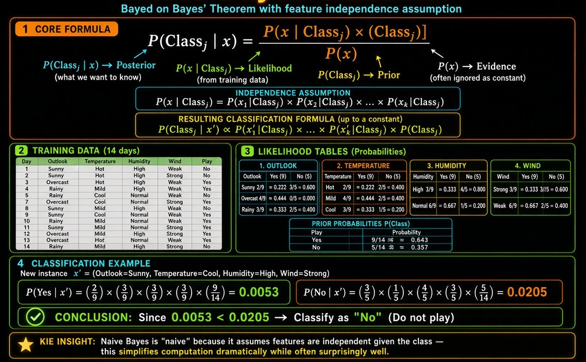

> ### [ShatterLine Blog](https://shatterline.com/blog)

### Introduction to Naive Bayes Classifiers

The Naive Bayes classifier is based on Bayes’ theorem with the independence assumptions between features.

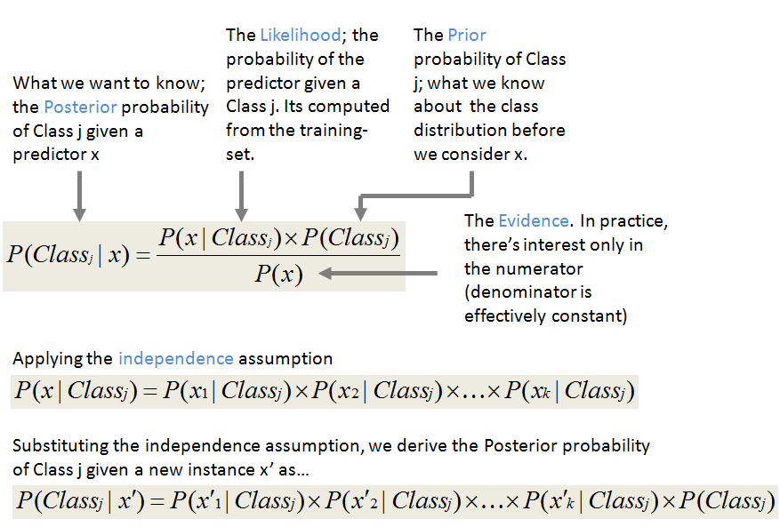

The Bayes’ rule plays a central role in probabilistic reasoning since it helps us 'invert' probabilistic relationships between $P(\text{Class}_j \mid x)$ and $P(x \mid \text{Class}_j)$.

### So what’s naive about Naive Bayes?

It naively assumes that the attributes of any instance of the training-set are conditionally _independent_ of each other (e.g., cool temperatures are completely independent of the sunny outlook). We represent this independence as:

$$P(x_1, x_2, \dots, x_k \mid \text{Class}_j) = \prod_{i} P(x_i \mid \text{Class}_j)$$

or

$$P(x_1, x_2, \dots, x_k \mid \text{Class}_j) = P(x_1 \mid \text{Class}_j) \times P(x_2 \mid \text{Class}_j) \times \dots \times P(x_k \mid \text{Class}_j)$$

In plain English, if each feature (predictor) $x$ is independent of every other feature, then the probability a data-point $(x_1, x_2, \dots, x_k)$ is in $\text{Class}_j$ is simply the _product_ of all the individual probabilities of feature $x_i$ in $\text{Class}_j$.

### Example

Let’s build a classifier that predicts whether I should play tennis given the forecast. It takes four attributes to describe the forecast: outlook, temperature, humidity, and the presence or absence of wind.

- **Outlook** $\in$ [Sunny, Overcast, Rainy]
- **Temperature** $\in$ [Hot, Mild, Cool]
- **Humidity** $\in$ [High, Normal]
- **Windy** $\in$ [Weak, Strong]
- **Play** $\in$ [Yes, No]

The class label is the variable, Play and takes the values yes or no.

Play ∈ [Yes, No]

We read-in training data below that has been collected over 14 days.

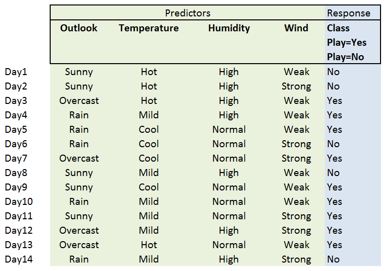

### The Learning Phase

In the learning phase, we compute the table of likelihoods (probabilities) from the training data. They are:

$$P(\text{Outlook}=o \mid \text{Class}_{\text{Play}}=b), \quad \text{where } o \in [\text{Sunny}, \text{Overcast}, \text{Rainy}] \text{ and } b \in [\text{yes}, \text{no}]$$

$$P(\text{Temperature}=t \mid \text{Class}_{\text{Play}}=b), \quad \text{where } t \in [\text{Hot}, \text{Mild}, \text{Cool}] \text{ and } b \in [\text{yes}, \text{no}]$$

$$P(\text{Humidity}=h \mid \text{Class}_{\text{Play}}=b), \quad \text{where } h \in [\text{High}, \text{Normal}] \text{ and } b \in [\text{yes}, \text{no}]$$

$$P(\text{Wind}=w \mid \text{Class}_{\text{Play}}=b), \quad \text{where } w \in [\text{Weak}, \text{Strong}] \text{ and } b \in [\text{yes}, \text{no}]$$

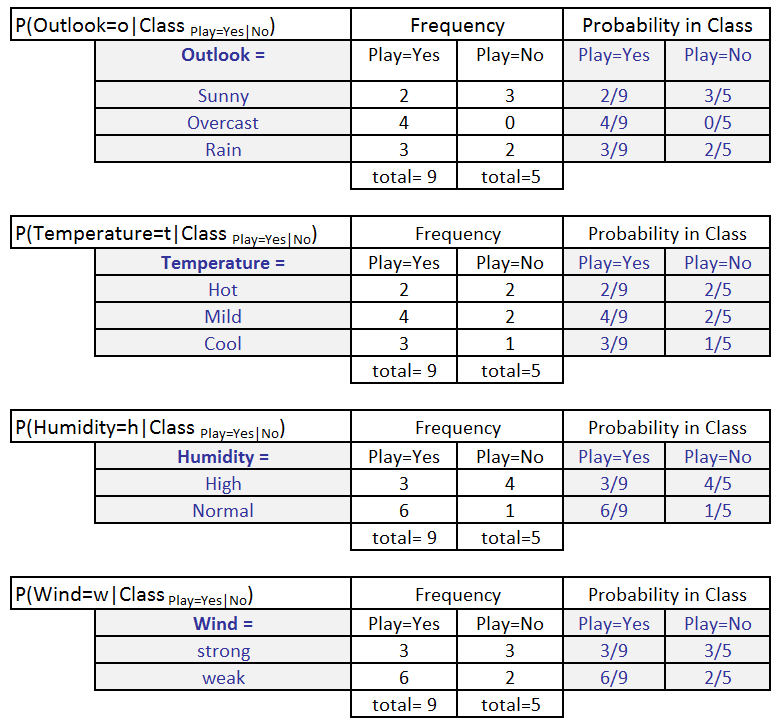

We also calculate $P(\text{Class}_{\text{Play}}=\text{Yes})$ and $P(\text{Class}_{\text{Play}}=\text{No})$

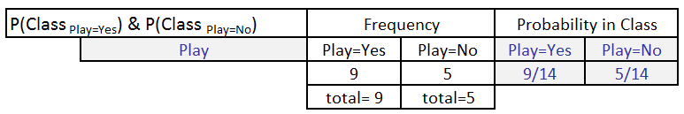

### Classification Phase

Let’s say, we get a new instance of the weather condition, $x' = (\text{Outlook}=\text{Sunny}, \text{Temperature}=\text{Cool}, \text{Humidity}=\text{High}, \text{Wind}=\text{Strong})$ that will have to be classified (i.e., are we going to play tennis under the conditions specified by $x'$).

With the MAP rule, we compute the posterior probabilities. This is easily done by looking up the tables we built in the learning phase.

$$\begin{aligned} P(\text{Class}_{\text{Play}}=\text{Yes} \mid x') &= \Big[ P(\text{Sunny} \mid \text{Class}_{\text{Play}}=\text{Yes}) \times P(\text{Cool} \mid \text{Class}_{\text{Play}}=\text{Yes}) \times \\ &\quad P(\text{High} \mid \text{Class}_{\text{Play}}=\text{Yes}) \times P(\text{Strong} \mid \text{Class}_{\text{Play}}=\text{Yes}) \Big] \times \\ &\quad  P(\text{Class}_{\text{Play}}=\text{Yes}) \\ &= \frac{2}{9} \times \frac{3}{9} \times \frac{3}{9} \times \frac{3}{9} \times \frac{9}{14} \\ & = 0.0053 \end{aligned}$$

$$\begin{aligned} P(\text{Class}_{\text{Play}}=\text{No} \mid x') &= \Big[ P(\text{Sunny} \mid \text{Class}_{\text{Play}}=\text{No}) \times P(\text{Cool} \mid \text{Class}_{\text{Play}}=\text{No}) \times \\ &\quad  P(\text{High} \mid \text{Class}_{\text{Play}}=\text{No}) \times P(\text{Strong} \mid \text{Class}_{\text{Play}}=\text{No}) \Big] \times \\ &\quad  P(\text{Class}_{\text{Play}}=\text{No}) \\ &= \frac{3}{5} \times \frac{1}{5} \times \frac{4}{5} \times \frac{3}{5} \times \frac{5}{14} \\ & = 0.0205 \end{aligned}$$

$$= \frac{3}{5} \times \frac{1}{5} \times \frac{4}{5} \times \frac{3}{5} \times \frac{5}{14} = 0.0205$$

Since $P(\text{Class}_{\text{Play}}=\text{Yes} \mid x')$ is less than $P(\text{Class}_{\text{Play}}=\text{No} \mid x')$, we classify the new instance $x'$ to be "No".

## 07. Naive Bayes on Text Data

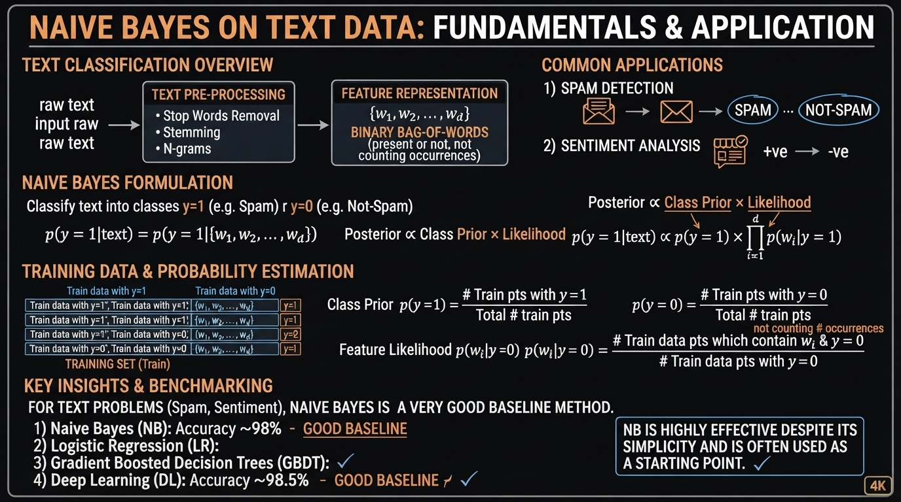   
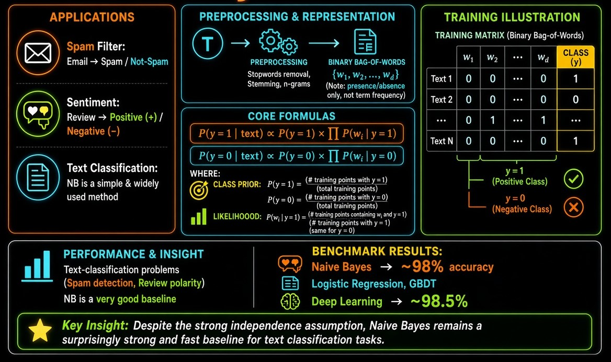

Naive Bayes is a simple and widely used method for **text classification**.

### Common Applications

- **Spam Filter**: Classify an email as Spam or Not-Spam
- **Sentiment Analysis**: Classify a review as Positive (+) or Negative (−)

### Task

Given a text query, we want:

$$
P(y = 1 \mid \text{text}_q) \quad \text{and} \quad P(y = 0 \mid \text{text}_q)
$$

### Preprocessing

Text is converted into a set of words (features):

$$
\text{text} \;\xrightarrow{\text{preprocessing}}\; \{w_1, w_2, \dots, w_d\}
$$

Common preprocessing steps:
- Remove stopwords
- Stemming
- n-grams

Often we use **Binary Bag-of-Words** (presence or absence of a word, not the count).

### Naive Bayes Formulation

$$
P(y = 1 \mid \text{text}) = P(y = 1 \mid w_1, w_2, \dots, w_d)
$$

Using Bayes’ theorem and the Naive assumption (features are independent given the class):

$$
P(y = 1 \mid \text{text}) \propto P(y = 1) \times \prod_{i=1}^{d} P(w_i \mid y = 1)
$$

Similarly:

$$
P(y = 0 \mid \text{text}) \propto P(y = 0) \times \prod_{i=1}^{d} P(w_i \mid y = 0)
$$

- $P(y = 1)$ and $P(y = 0)$ → **Class priors**
- $P(w_i \mid y)$ → **Likelihoods**

### Estimating the Probabilities from Training Data

**Class Priors:**

$$
P(y = 1) = \dfrac{\text{# training points with } y = 1}{\text{Total # training points}}
$$

$$
P(y = 0) = \dfrac{\text{# training points with } y = 0}{\text{Total # training points}}
$$

**Likelihoods:**

$$
P(w_i \mid y = 1) = \dfrac{\text{# training points that contain } w_i \text{ and have } y = 1}{\text{# training points with } y = 1}
$$

$$
P(w_i \mid y = 0) = \dfrac{\text{# training points that contain } w_i \text{ and have } y = 0}{\text{# training points with } y = 0}
$$

### Why Naive Bayes is Popular for Text

- Extremely simple and fast
- Works surprisingly well as a strong **baseline**
- Especially effective for:
  - Spam detection
  - Sentiment / polarity of reviews

### Typical Benchmark Results (Text Classification)

| Model              | Accuracy     |
|--------------------|--------------|
| Naive Bayes        | ~98%         |
| Logistic Regression| —            |
| GBDT               | —            |
| Deep Learning      | 98.5%        |

Naive Bayes often comes very close to much more complex models, making it an excellent baseline.

## 08. Laplace/Additive Smoothing

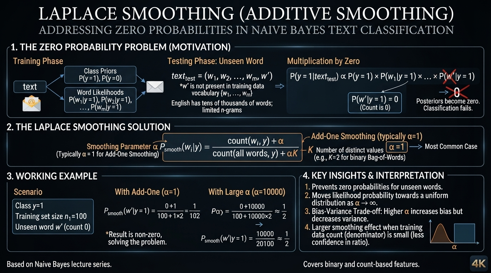  
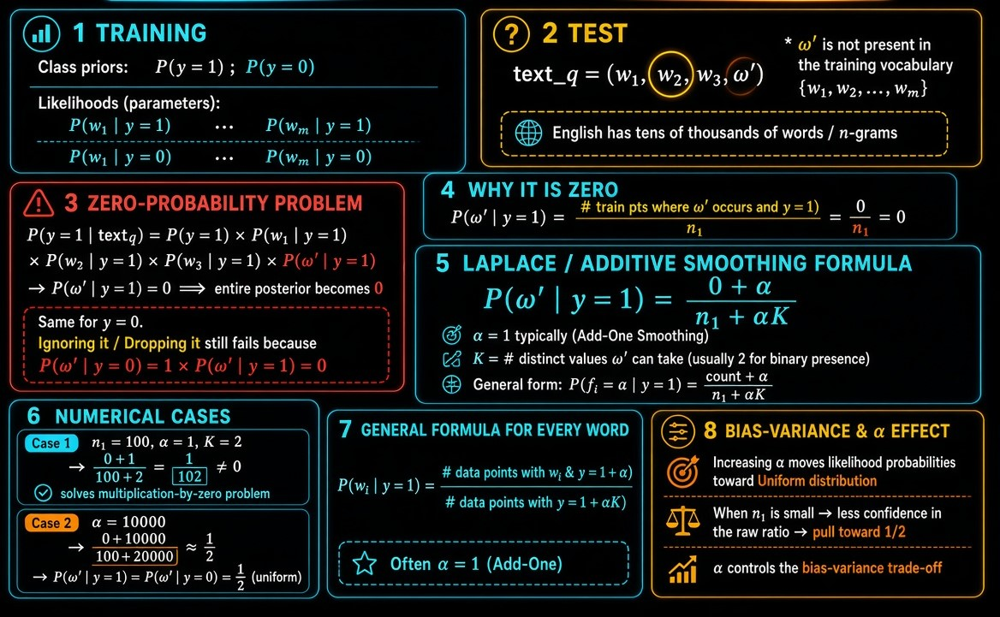

### The Problem: Zero Probability

During training we estimate:

- Class priors: $P(y=1)$, $P(y=0)$
- Likelihoods: $P(w_i \mid y=1)$, $P(w_i \mid y=0)$ for every word $w_i$ in the training vocabulary

At test time, a query text may contain a word $w'$ that **never appeared** in the training data.

$$
\text{text}_q = \{w_1, w_2, w_3, w'\}
$$

Then:

$$
P(w' \mid y=1) = \dfrac{\text{# training points containing } w' \text{ and } y=1}{\text{# training points with } y=1} = \dfrac{0}{n_1} = 0
$$

Because of the product in Naive Bayes:

$$
P(y=1 \mid \text{text}_q) \propto P(y=1) \prod P(w_i \mid y=1) = 0
$$

The same happens for $y=0$.  
Both posterior probabilities become zero → the model breaks (multiplication-by-zero problem).

Simply ignoring / dropping the unknown word is also not ideal.

### Solution: Laplace / Additive Smoothing

We add a small positive value $\alpha$ (usually $\alpha = 1$) to the counts.

**General formula:**

$$
P(w' \mid y=1) = \dfrac{0 + \alpha}{n_1 + \alpha K}
$$

Where:
- $n_1$ = number of training points with $y=1$
- $K$ = number of distinct values the feature can take  
  (for binary presence/absence, $K=2$)

For a general feature $f_i$ that can take value $a$:

$$
P(f_i = a \mid y=1) = \dfrac{\text{count}(f_i=a, y=1) + \alpha}{n_1 + \alpha K}
$$

### Effect of $\alpha$

**Example** (assume $n_1 = 100$, $K=2$):

| $\alpha$   | $P(w' \mid y=1)$          | Interpretation                          |
|------------|---------------------------|-----------------------------------------|
| 1          | $\dfrac{1}{102} \approx 0.01$ | Mild smoothing (Add-one smoothing)     |
| 10         | $\dfrac{10}{120} \approx 0.083$ | Stronger smoothing                     |
| 100        | $\dfrac{100}{300} \approx 0.33$ | Even stronger                          |
| 10000      | $\dfrac{10000}{20100} \approx 0.5$ | Almost uniform (maximum smoothing)    |

When $\alpha$ becomes very large, the likelihood is pushed toward the **uniform distribution** ($1/K$).

### Applying Smoothing to All Words

For every word $w_i$ (even those that appear in training):

$$
P(w_i \mid y=1)
=
\dfrac{
\text{\# data points containing } w_i \text{ and } y=1 + \alpha
}{
\text{\# data points with } y=1 + \alpha K
}
$$

Most common choice: **$\alpha = 1$** (Add-one / Laplace smoothing).

### Bias-Variance Interpretation of $\alpha$

- Small $\alpha$ → trusts the training counts more (low bias, higher variance)
- Large $\alpha$ → moves probabilities toward uniform (higher bias, lower variance)
- When the number of training examples for a class ($n_1$) is small, we have less confidence in the raw ratio, so a larger $\alpha$ is safer.

**Key Insight:**  
Laplace smoothing prevents zero probabilities for unseen words and makes Naive Bayes robust on real text data where the vocabulary is huge and many words appear only at test time.

## 09. Log-Probabilities for Numerical Stability

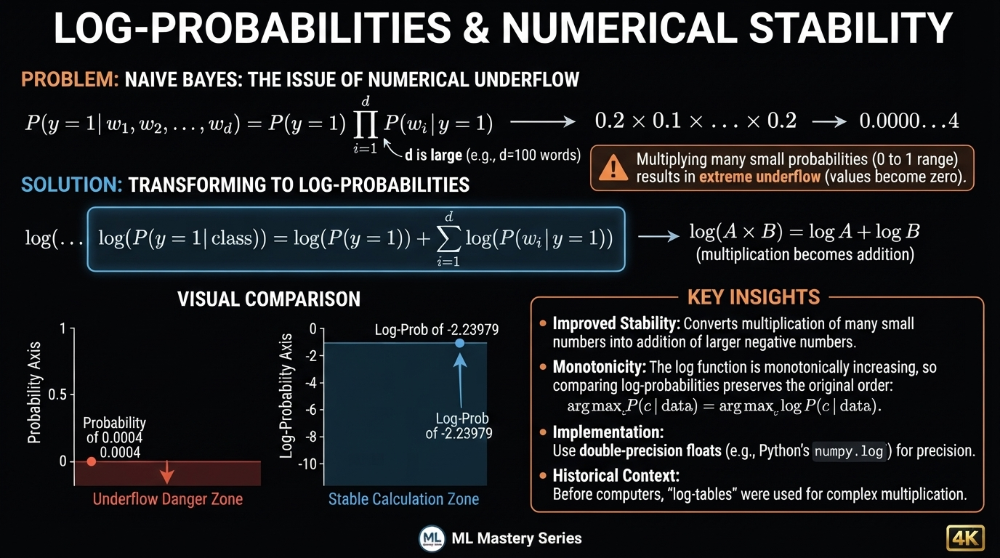  
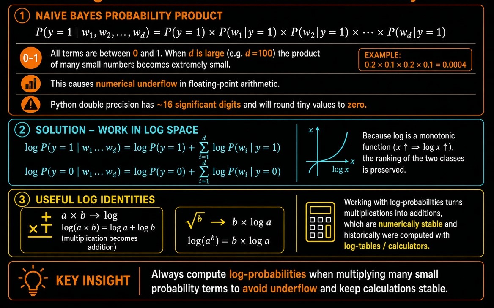

### The Problem

In Naive Bayes we compute:

$$
P(y=1 \mid w_1, w_2, \dots, w_d) \propto P(y=1) \times \prod_{i=1}^{d} P(w_i \mid y=1)
$$

When the number of features $d$ is large (e.g. $d = 100$), we multiply many numbers that lie between 0 and 1.

**Example:**

$$
0.2 \times 0.1 \times 0.2 \times 0.1 = 0.0004
$$

With 100 such multiplications the product becomes extremely small → **numerical underflow**.

Even with double-precision floating point (about 16 significant digits), the value can become 0 due to rounding.

### Solution: Work in Log-Space

Instead of multiplying probabilities, we take the **logarithm**:

$$
\log\Big(P(y=1 \mid w_1,\dots,w_d)\Big) = \log\big(P(y=1)\big) + \sum_{i=1}^{d} \log\big(P(w_i \mid y=1)\big)
$$

$$
\log\Big(P(y=0 \mid w_1,\dots,w_d)\Big) = \log\big(P(y=0)\big) + \sum_{i=1}^{d} \log\big(P(w_i \mid y=0)\big)
$$

### Why This Works

- $\log$ is a **monotonic** function: if $x_1 > x_2$ then $\log x_1 > \log x_2$
- Therefore the class that has the larger log-probability is still the class with the larger probability
- Multiplication turns into addition:

$$
\log(a \times b) = \log a + \log b
$$

- Addition of log-values is numerically stable

### Historical Note

Before electronic calculators, people used **log-tables** exactly for this reason:  
to convert difficult multiplications into easier additions.

### Practical Rule

In code, always compute:

```text
score_class_1 = log(P(y=1)) + sum( log(P(w_i | y=1)) )
score_class_0 = log(P(y=0)) + sum( log(P(w_i | y=0)) )
```

Then predict the class with the higher score.

**Key Insight:**  
Using log-probabilities converts a product of many small numbers into a sum, completely avoiding numerical underflow while preserving the correct ranking of the classes.

## 10. Bias and Variance Tradeoff

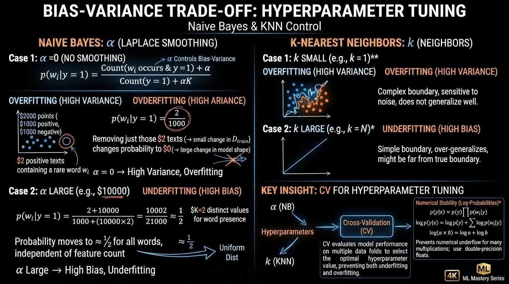  
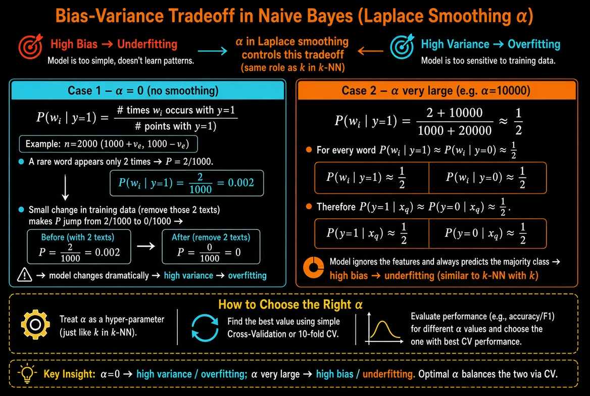

In Naive Bayes, the Laplace smoothing parameter $\alpha$ controls the **bias-variance tradeoff**.

- High Bias → Underfitting  
- High Variance → Overfitting  

**Definition of high variance:**  
Small changes in the training data result in dramatic changes in the model.

### Case 1: $\alpha = 0$ (No Smoothing)

$$
P(w_i \mid y=1) = \dfrac{\text{# training points containing } w_i \text{ and } y=1}{\text{# training points with } y=1}
$$

**Example:**  
Training set has 2000 points (1000 positive, 1000 negative).  
A rare word $w_i$ appears only **2 times** in the positive class.

$$
P(w_i \mid y=1) = \dfrac{2}{1000}
$$

If we remove those 2 points from the training data, the probability suddenly becomes:

$$
P(w_i \mid y=1) = \dfrac{0}{1000} = 0
$$

→ A very small change in training data causes a large change in the model.  
→ **High variance → Overfitting** (especially on rare words).

### Case 2: $\alpha$ is Very Large (e.g. $\alpha = 10000$)

$$
P(w_i \mid y=1) = \dfrac{2 + 10000}{1000 + 2\times 10000} \approx \dfrac{1}{2}
$$

For **every** word we get approximately the same probability ($\approx 1/2$).

Therefore:

$$
P(y=1 \mid x_q) \approx P(y=0 \mid x_q) \approx \dfrac{1}{2}
$$

The model almost always predicts according to the class prior only (or becomes almost random).  

→ **High bias → Underfitting**

(This is similar to K-NN with $K = n$, where the model always predicts the majority class.)

### Summary of the Two Extremes

| Value of $\alpha$ | Effect on Model          | Bias / Variance      | Result        |
|-------------------|--------------------------|----------------------|---------------|
| $\alpha = 0$      | Trusts rare words a lot  | High Variance        | Overfitting   |
| $\alpha$ very large | All words look similar | High Bias            | Underfitting  |

### How to Choose the Right $\alpha$

$\alpha$ is a **hyperparameter** (just like $K$ in K-NN).

We find the best value using:

- Simple Cross Validation
- 10-Fold Cross Validation

**Key Insight:**  
- Small $\alpha$ → model is sensitive to rare words (overfits)  
- Large $\alpha$ → model ignores the actual word frequencies (underfits)  
- Cross-validation helps us pick the sweet spot that balances bias and variance.

## 11. Feature Importance and Interpretability

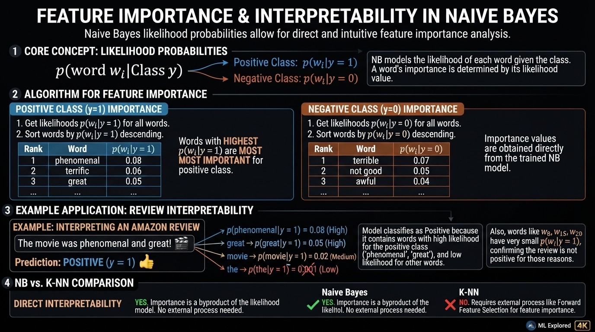  
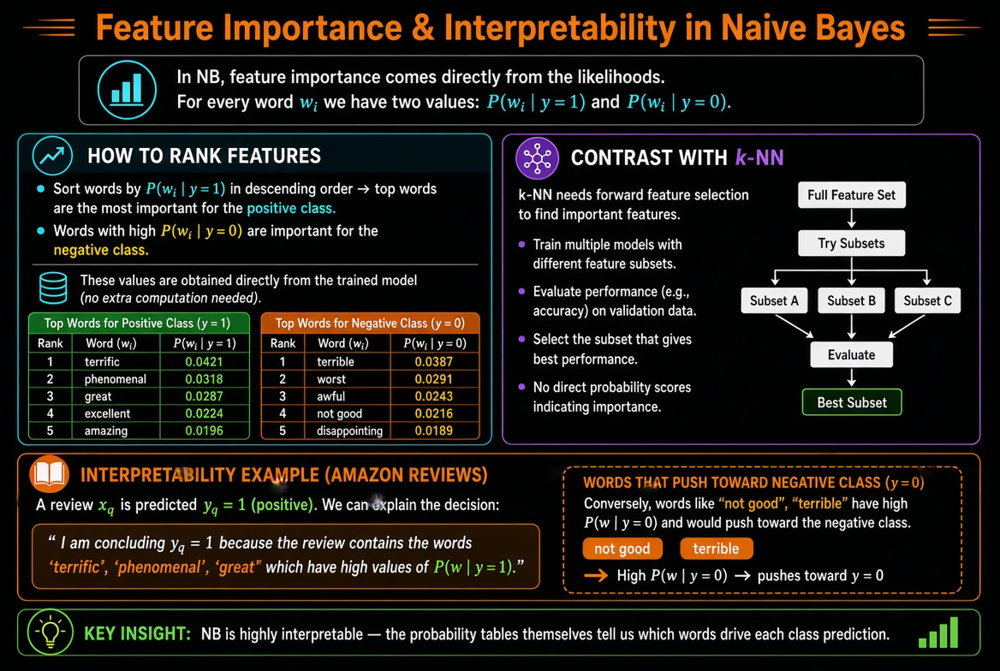

### Feature Importance in Naive Bayes

Naive Bayes stores the likelihoods for every word:

- $P(w_i \mid y=1)$ for all words $w_i$
- $P(w_i \mid y=0)$ for all words $w_i$

**How to find important features:**

1. Sort all words in **decreasing order** of $P(w_i \mid y=1)$
2. The top words are the most important features for the **positive class**

Similarly:

- Words with high $P(w_i \mid y=0)$ are important for the **negative class**

| Class       | How to find important words                          |
|-------------|------------------------------------------------------|
| Positive (+)| Words with highest $P(w_i \mid y=1)$                 |
| Negative (−)| Words with highest $P(w_i \mid y=0)$                 |

These values are obtained **directly from the trained model** (no extra computation needed).

**Contrast with K-NN:**  
In K-NN we usually need techniques like Forward Feature Selection to determine feature importance.

### Interpretability

Naive Bayes is highly interpretable.

**Example (Amazon reviews):**

A review $x_q$ is predicted as positive ($y_q = 1$).

We can explain the decision:

> “I am concluding $y_q = 1$ because the review contains the words  
> $w_3$, $w_6$, $w_{10}$  
> which have high values of  
> $P(w_3 \mid y=1)$, $P(w_6 \mid y=1)$, $P(w_{10} \mid y=1)$.”

Typical positive words: *terrific*, *phenomenal*, *great*  
Typical negative words: *not good*, *terrible*

If a word has a very small probability under the opposite class (e.g. $P(w_8 \mid y=0)$ is very small), it further strengthens the evidence for the predicted class.

### Key Insight

- Feature importance in Naive Bayes comes for free from the likelihood tables.
- We can directly point to the words that pushed the model toward a particular class.
- This makes Naive Bayes one of the most interpretable classification algorithms, especially for text data.

## 12. Imbalanced Data

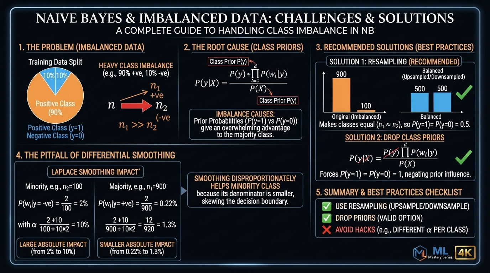  
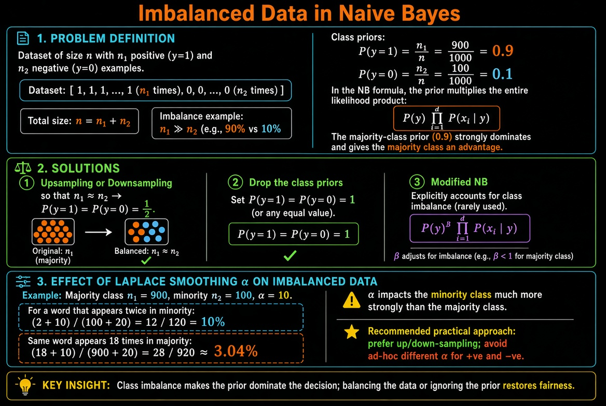

### The Problem

Suppose we have an imbalanced training set:

$$
n = n_1 + n_2
$$

- $n_1$ = number of positive points  
- $n_2$ = number of negative points  

Example:

$$
\frac{n_1}{n} = 0.9 \quad (90\% \text{ positive})
$$
$$
\frac{n_2}{n} = 0.1 \quad (10\% \text{ negative})
$$

In Naive Bayes the posterior is:

$$
P(y=1 \mid w_1,\dots,w_d) \propto P(y=1) \prod_{i=1}^{d} P(w_i \mid y=1)
$$

$$
P(y=0 \mid w_1,\dots,w_d) \propto P(y=0) \prod_{i=1}^{d} P(w_i \mid y=0)
$$

Because the **class prior** $P(y=1) = 0.9$ is much larger than $P(y=0) = 0.1$, the majority class has a strong advantage.

### Solutions

**1. Upsampling or Downsampling (Most Common)**

Make the two classes roughly equal in size:

$$
n_1 \approx n_2 \quad \Rightarrow \quad P(y=1) = P(y=0) = \dfrac{1}{2}
$$

**2. Drop the Class Priors**

Ignore $P(y=1)$ and $P(y=0)$ completely and set them both to 1.  
(Only the likelihood terms remain.)

**3. Modified Naive Bayes**

Design a special version of NB that explicitly accounts for class imbalance.  
(This is rarely used in practice.)

### Effect of Laplace Smoothing on Imbalanced Data

When we apply the same $\alpha$ to both classes, the minority class is affected more.

**Example:**

- Majority (positive): $n_1 = 900$
- Minority (negative): $n_2 = 100$
- $\alpha = 10$

For a word that appears 2 times in the minority class:

$$
P(w_i \mid y=0) = \dfrac{2+10}{100+20} = \dfrac{12}{120} = 10\%
$$

For the same word appearing 18 times in the majority class:

$$
P(w_i \mid y=1) = \dfrac{18+10}{900+20} = \dfrac{28}{920} \approx 3.04\%
$$

→ The relative impact of $\alpha$ is much larger on the minority class.

### Practical Recommendations

| Technique                        | Recommendation          |
|----------------------------------|-------------------------|
| Upsampling / Downsampling        | Preferred               |
| Different $\alpha$ per class     | Possible hack           |
| Modified NB for imbalance        | Rarely used             |

**Key Insight:**  
In imbalanced data the class prior gives a big advantage to the majority class. The simplest and most effective fix is to balance the training set (upsample the minority class or downsample the majority class) so that the priors become equal.

## 13. Outliers

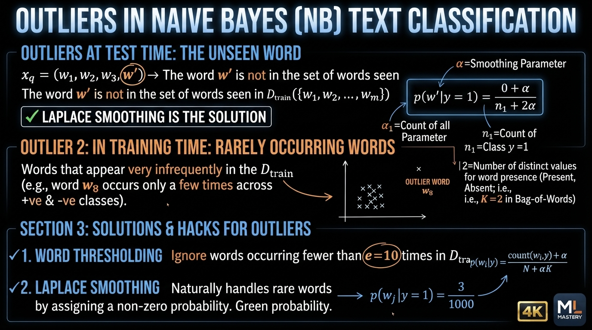  
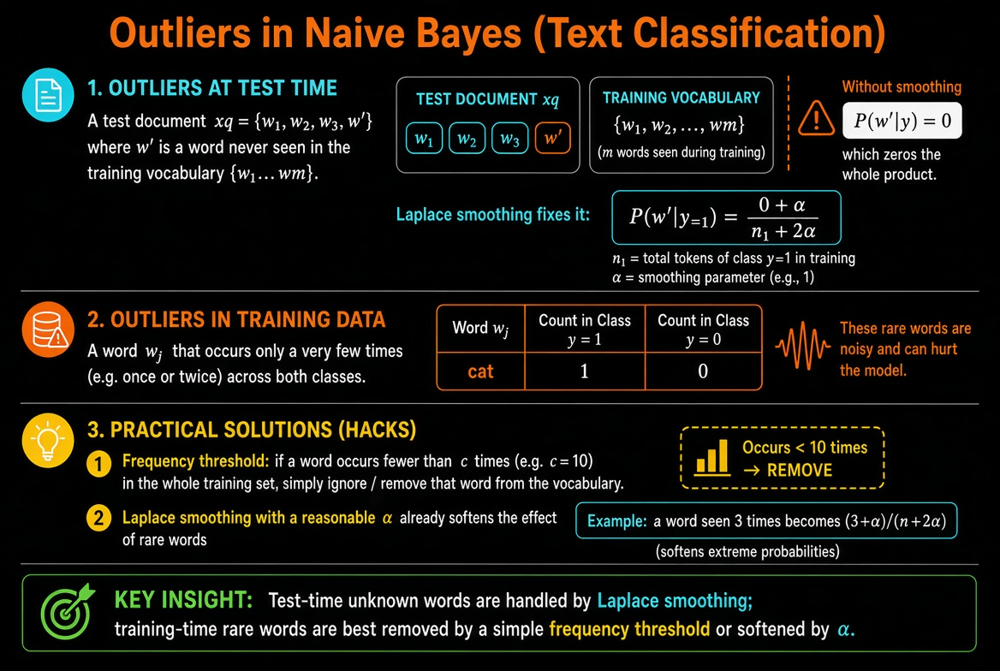

### 1. Outliers at Test Time

In text classification, a test document may contain a word $w'$ that **never appeared** in the training data:

$$
x_q = \{w_1, w_2, w_3, w'\}
$$

where

$$
w' \notin \{w_1, w_2, \dots, w_m\}
$$

(the vocabulary seen during training).

Without any protection this would make the probability zero.  
**Laplace Smoothing** solves the problem:

$$
P(w' \mid y=1) = \dfrac{0 + \alpha}{n_1 + 2\alpha}
$$

So unseen words at test time are handled gracefully by Laplace smoothing.

### 2. Outliers in Training Data

A word $w_8$ that occurs only a **very few times** (in either the positive or the negative class) can be considered an outlier / rare word.

These rare words can make the model unstable (high variance), especially when $\alpha = 0$.

### Practical Hacks / Solutions

**Hack 1 – Frequency Thresholding**

If a word $w_j$ occurs fewer than a threshold $c$ times (e.g. $c = 10$) in the whole training set, simply **ignore** that word (remove it from the vocabulary).

$$
\text{if count}(w_j) < c \quad \Rightarrow \quad \text{drop } w_j
$$

**Hack 2 – Laplace Smoothing**

Even if the word is kept, Laplace smoothing reduces the impact of extremely rare words:

$$
P(w_j \mid y=1) = \dfrac{\text{count}(w_j, y=1) + \alpha}{n_1 + \alpha K}
$$

### Summary

| Type of Outlier              | Solution                          |
|------------------------------|-----------------------------------|
| Unseen word at test time     | Laplace Smoothing                 |
| Very rare word in training   | Frequency threshold (ignore it) + Laplace Smoothing |

**Key Insight:**  
Laplace smoothing protects Naive Bayes from both unseen words at test time and very rare words in the training data, making the model more robust to outliers.

## 14. Missing Values

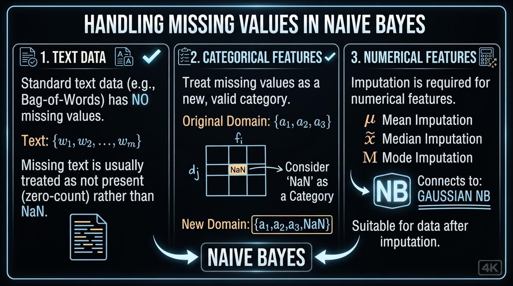  
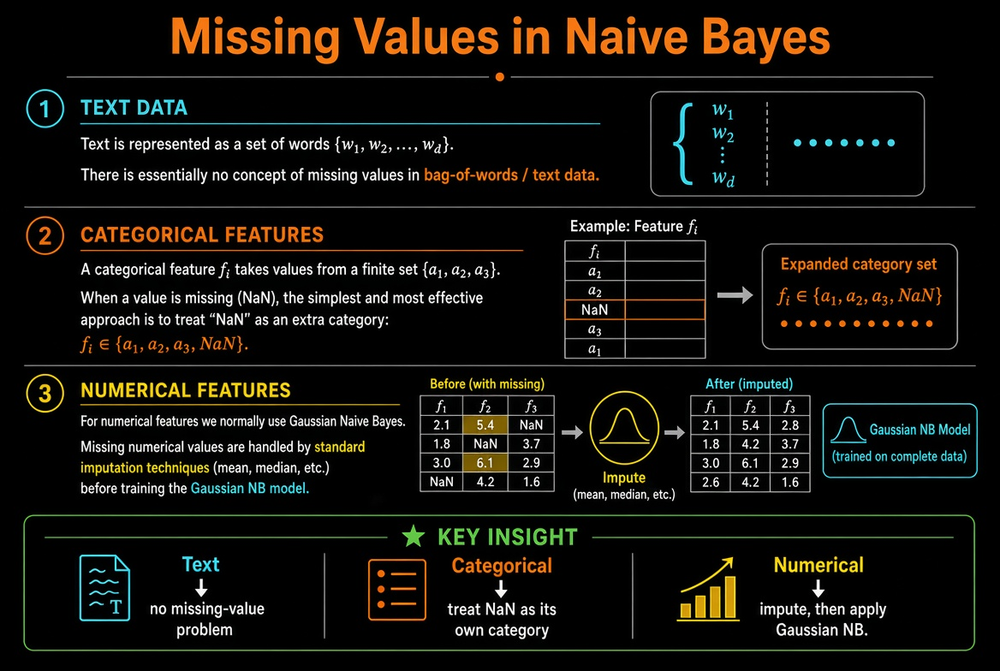

### 1. Text Data

In pure text data (Bag-of-Words / Binary BoW):

$$
\text{text} = \{w_1, w_2, \dots, w_d\}
$$

There is **no notion of missing values**.  
A word is either present or absent.

### 2. Categorical Features

When we have categorical features:

$$
f_i \in \{a_1, a_2, a_3\}
$$

A missing entry appears as `NaN` in the data matrix.

**Simple & effective solution:**

Treat `NaN` as just another category:

$$
f_i \in \{a_1, a_2, a_3, \text{NaN}\}
$$

Naive Bayes can handle this naturally because it only needs the probability of each category given the class.

### 3. Numerical Features

For numerical features we usually use **Gaussian Naive Bayes**.

In the presence of missing values we have two common options:

- Perform **imputation** first (mean / median / model-based, etc.)
- Or use a variant of Gaussian NB that can handle missing values directly (less common)

### Summary

| Data Type          | How Missing Values are Handled                     |
|--------------------|----------------------------------------------------|
| Text (BoW)         | No missing values                                  |
| Categorical        | Treat `NaN` as an extra category                   |
| Numerical          | Imputation (then Gaussian NB)                      |

**Key Insight:**  
For categorical features, the cleanest approach in Naive Bayes is to treat the missing value itself as a valid category. This requires no imputation and works very well in practice.

## 15. Handling Numerical Features (Gaussian NB)

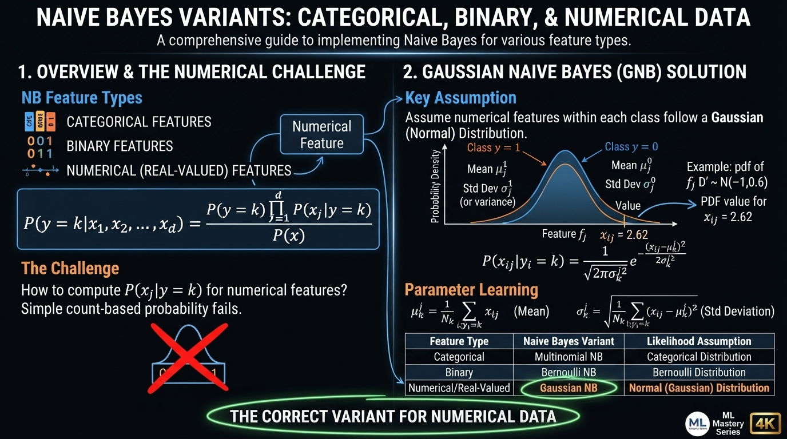  
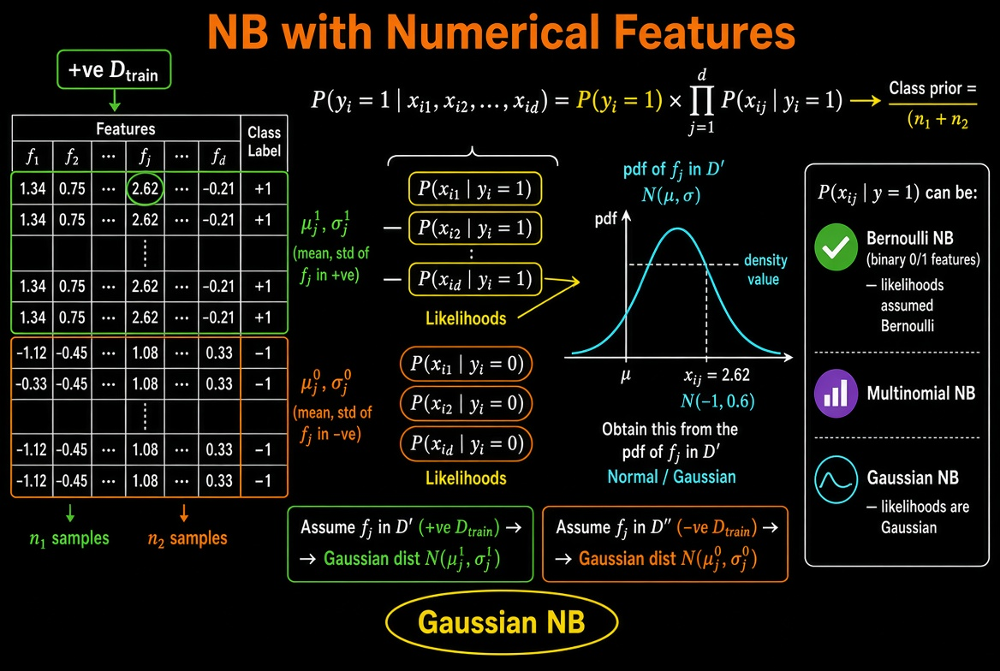

### Types of Naive Bayes

| Type of Features              | Name of NB              | Likelihood Assumption          |
|-------------------------------|-------------------------|--------------------------------|
| Binary (0/1)                  | Bernoulli NB            | Bernoulli                      |
| Categorical / Counts          | Multinomial NB          | Multinomial                    |
| Numerical / Real-valued       | **Gaussian NB**         | Gaussian (Normal)              |

### Gaussian Naive Bayes – Setup

We have a dataset with real-valued features $f_1, f_2, \dots, f_d$.

For a point $x_i = (x_{i1}, x_{i2}, \dots, x_{id})$ the posterior is still:

$$
P(y_i=1 \mid x_{i1},\dots,x_{id}) \propto P(y_i=1) \prod_{j=1}^{d} P(x_{ij} \mid y_i=1)
$$

$$
P(y_i=0 \mid x_{i1},\dots,x_{id}) \propto P(y_i=0) \prod_{j=1}^{d} P(x_{ij} \mid y_i=0)
$$

Class prior:

$$
P(y=1) = \dfrac{n_1}{n_1 + n_2}
$$

### Modelling the Likelihoods

We assume that each feature, **conditioned on the class**, follows a Gaussian distribution.

- For the positive class ($D'$ = all training points with $y=1$):

$$
f_j \;\big|\; y=1 \;\sim\; \mathcal{N}(\mu_j^1, \sigma_j^1)
$$

- For the negative class ($D''$ = all training points with $y=0$):

$$
f_j \;\big|\; y=0 \;\sim\; \mathcal{N}(\mu_j^0, \sigma_j^0)
$$

So the likelihood is simply the value of the Gaussian PDF:

$$
P(x_{ij} \mid y=1) = \text{PDF of }\mathcal{N}(\mu_j^1, \sigma_j^1)\text{ evaluated at }x_{ij}
$$

### Geometric Intuition

For a feature $f_j$ in the positive class we fit a Normal curve $\mathcal{N}(\mu_j^1, \sigma_j^1)$.  
When a test point has value $x_{ij} = 2.62$, we read the height of the PDF at that point — that height is the likelihood $P(x_{ij} \mid y=1)$.

### Summary

- Bernoulli NB → binary features  
- Multinomial NB → count / categorical features  
- **Gaussian NB** → real-valued features (assumes each feature is Gaussian given the class)

**Key Insight:**  
Gaussian Naive Bayes is just the same Naive Bayes idea, but the likelihood $P(x_j \mid y)$ is obtained from a Normal distribution fitted to the feature values of each class.

## 16. Multiclass Classification

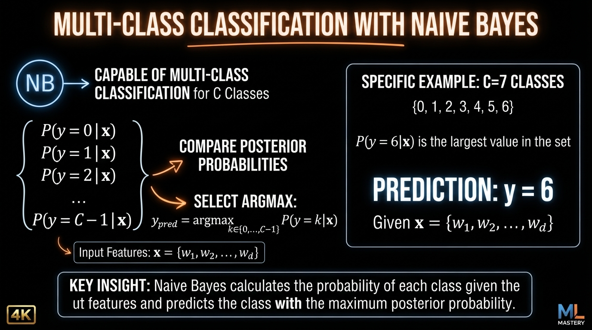  
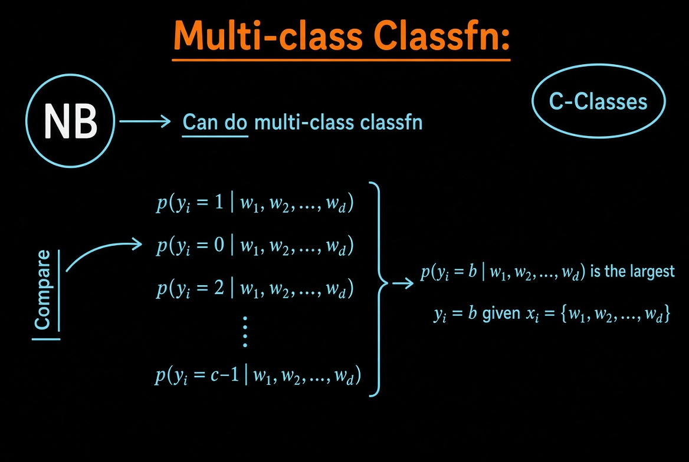

Naive Bayes can naturally handle **multi-class classification** (more than two classes).

Suppose we have $C$ classes:

$$
y \in \{0, 1, 2, \dots, C-1\}
$$

For a given text (or feature vector) $\{w_1, w_2, \dots, w_d\}$ we compute the posterior probability for **every** class:

$$
\begin{align*}
P(y=0 \mid w_1,w_2,\dots,w_d) \\
P(y=1 \mid w_1,w_2,\dots,w_d) \\
P(y=2 \mid w_1,w_2,\dots,w_d) \\
\vdots \\
P(y=C-1 \mid w_1,w_2,\dots,w_d)
\end{align*}
$$

### Decision Rule

We simply choose the class that has the **largest** posterior probability:

$$
\hat{y} = \arg\max_{c} \; P(y=c \mid w_1,w_2,\dots,w_d)
$$

**Example:**  
If $P(y=6 \mid w_1,\dots,w_d)$ is the largest among all classes, then we predict $y=6$.

### Key Point

- No special modification is required.
- The same Naive Bayes formula (class prior × product of likelihoods) is used for every class.
- The class with the highest score wins.

**Key Insight:**  
Naive Bayes extends to multi-class problems in the most straightforward way — just compute the posterior for each of the $C$ classes and pick the maximum.

## 17. Similarity or Distance Matrix

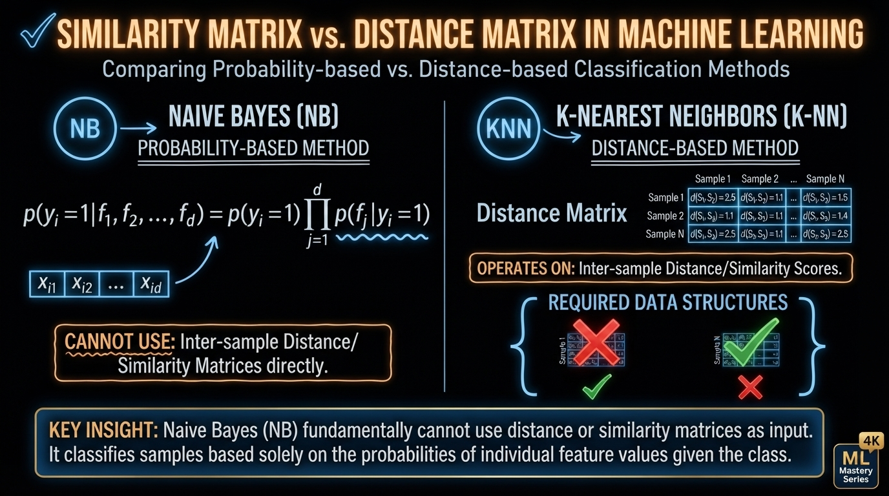  

### Naive Bayes vs Distance-based Methods

| Method       | Type of Method              | Uses Distance / Similarity Matrix? |
|--------------|-----------------------------|------------------------------------|
| **K-NN**     | Distance-based              | Yes                                |
| **Naive Bayes** | Probability-based        | **No**                             |

### Why Naive Bayes Cannot Use Distance/Similarity Matrices

Naive Bayes computes the posterior as:

$$
P(y_i=1 \mid f_1, f_2, \dots, f_d) = P(y_i=1) \prod_{i=1}^{d} P(f_i \mid y_i=1)
$$

It only needs:
- Class priors
- Likelihood of each feature given the class

It does **not** look at distances or similarities between data points.

Therefore:

> Naive Bayes **cannot** use a precomputed Distance matrix or Similarity matrix.

### Contrast with K-NN

K-NN is fundamentally a distance-based method.  
It needs the distance (or similarity) between the query point and all training points, so a Distance / Similarity matrix is naturally useful for K-NN.

**Key Insight:**  
- K-NN → Distance / Similarity based  
- Naive Bayes → Purely probability based (priors × likelihoods)  
→ Distance or Similarity matrices are irrelevant for Naive Bayes.

## 18. Large Dimensionality

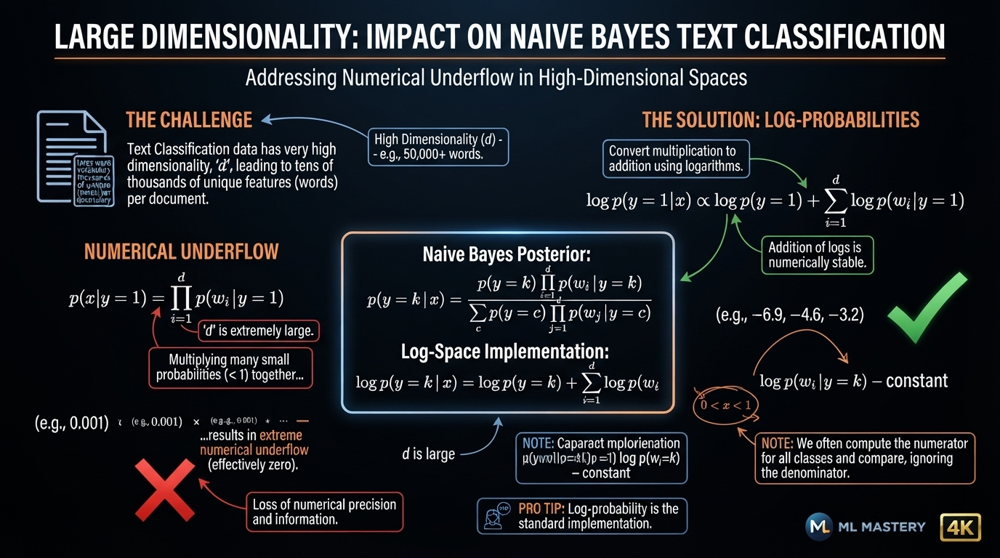  

### Naive Bayes and High-Dimensional Data

Naive Bayes is very commonly used for **text classification**, which is a classic high-dimensional problem (the vocabulary size $d$ can be tens of thousands).

$$
P(y=1 \mid w_1, w_2, \dots, w_d) = P(y=1) \prod_{i=1}^{d} P(w_i \mid y=1)
$$

When $d$ is large we multiply many numbers that lie between 0 and 1.  
This quickly leads to **numerical underflow**.

### Solution: Log-Probabilities

We switch to log-space for numerical stability:

$$
\log P(y=1 \mid w_1,\dots,w_d) = \log P(y=1) + \sum_{i=1}^{d} \log P(w_i \mid y=1)
$$

- Multiplication of small numbers → Addition of log-values  
- Avoids underflow  
- Preserves the correct ranking of classes (because $\log$ is monotonic)

### Summary

| Issue                        | Solution in Naive Bayes          |
|-----------------------------|----------------------------------|
| High dimensionality (large $d$) | Use **log-probabilities**       |
| Product of many small numbers | Convert product → sum of logs   |
| Numerical underflow         | Solved by working in log-space  |

**Key Insight:**  
Naive Bayes handles high-dimensional text data well, provided we compute everything in log-space to maintain numerical stability.

## 19. Best and Worst Cases

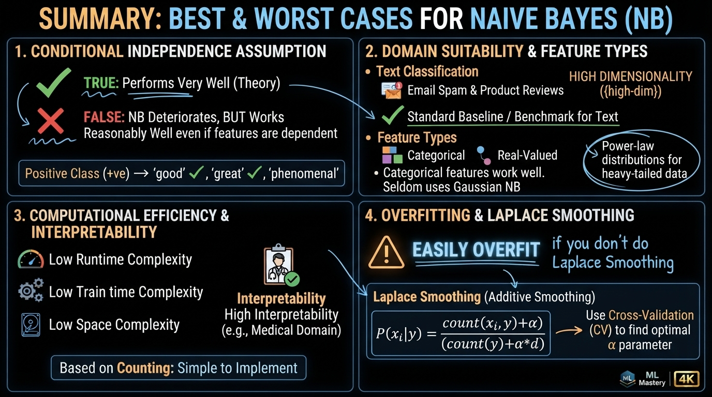  

### 1. Conditional Independence Assumption

Naive Bayes assumes that features are **conditionally independent** given the class.

- **When the assumption is true** → NB performs very well (theoretically optimal under this assumption).
- **When the assumption is false** (features are dependent) → performance deteriorates / degrades.
- In practice, even when some features are dependent, NB often still works **reasonably well**.

**Example of dependent features (text):**  
Words such as *good*, *great*, *phenomenal* are clearly dependent, yet NB remains a strong baseline.

### 2. Text Classification (Best Domain)

Naive Bayes is especially strong for:

- Email spam detection
- Review polarity / sentiment analysis

These are high-dimensional problems.  
NB is widely used as a **strong baseline / benchmark**.

### 3. Feature Types

| Feature Type              | Suitable NB Variant      | Notes                          |
|---------------------------|--------------------------|--------------------------------|
| Categorical / Binary      | Bernoulli / Multinomial  | Very natural fit               |
| Real-valued               | Gaussian NB              | Assumes Gaussian distribution  |
| Power-law / skewed        | Seldom used              | Gaussian assumption fails      |

### 4. Strengths of Naive Bayes

- Highly **interpretable**
- Easy to obtain **feature importance** (from likelihoods)
- Very useful in medical / high-stakes domains where explanations matter
- Low run-time complexity
- Low training-time complexity
- Low run-time space
- Extremely simple to implement (mostly just counting)

Training = estimating priors + likelihoods (simple counting).

### 5. Weakness – Overfitting

Naive Bayes can **easily overfit** if we do **not** apply Laplace / Additive smoothing.

- Solution: use Laplace smoothing with hyper-parameter $\alpha$
- Choose the best $\alpha$ using Cross-Validation

### Summary Table

| Aspect                        | Best Case                              | Worst Case                              |
|-------------------------------|----------------------------------------|-----------------------------------------|
| Feature Independence          | Features truly independent             | Strong dependencies                     |
| Domain                        | Text (spam, sentiment)                 | Highly correlated real-valued data      |
| Smoothing                     | Proper Laplace smoothing + CV          | No smoothing ($\alpha=0$)               |
| Interpretability              | Excellent                              | —                                       |
| Speed & Simplicity            | Excellent                              | —                                       |

**Key Insight:**  
Naive Bayes shines on high-dimensional text data, is extremely fast and interpretable, but relies on the conditional independence assumption and needs proper smoothing to avoid overfitting.

## 20. Code Example

https://scikit-learn.org/stable/api/sklearn.naive_bayes.htm

## 21. Assignment-4: Apply Naive Bayes

> ### Amazon Assignment

## 22. Revision Questions

**Questions**

[1. What is Conditional probability?](#1-what-is-conditional-probability)  
[2. Define Independent vs Mutually exclusive events?](#2-define-independent-vs-mutually-exclusive-events)  
[3. Explain Bayes Theorem with example?](#3-explain-bayes-theorem-with-example)  
[4. How to apply Naive Bayes on Text data?](#4-how-to-apply-naive-bayes-on-text-data)  
[5. What is Laplace/Additive Smoothing?](#5-what-is-laplaceadditive-smoothing)  
[6. Explain Log-probabilities for numerical stability?](#6-explain-log-probabilities-for-numerical-stability)  
[7. In Naive Bayes how to handle Bias and Variance tradeoff?](#7-in-naive-bayes-how-to-handle-bias-and-variance-tradeoff)  
[8. What is Imbalanced data?](#8-what-is-imbalanced-data)  
[9. What is Outliers and how to handle outliers?](#9-what-is-outliers-and-how-to-handle-outliers)  
[10. How to handle Missing values?](#10-how-to-handle-missing-values)  
[11. How to Handling Numerical features (GaussianNB)?](#11-how-to-handling-numerical-features-gaussiannb)  
[12. Define Multiclass classification?](#12-define-multiclass-classification)  

### 1. What is Conditional probability?

**Conditional probability** is the probability of an event occurring given that another event has already occurred.

It is written as $ P(A|B) $ and defined as:

$ P(A|B) = \frac{P(A \cap B)}{P(B)} $

where $ P(B) > 0 $.

**Intuition**: It answers “What is the probability of A happening, given that we already know B has happened?”

**Example**: Probability that a person has a disease given that they tested positive.

### 2. Define Independent vs Mutually exclusive events?

**Independent Events**:
- Two events A and B are independent if the occurrence of one does not affect the probability of the other.
- Mathematically: $ P(A \cap B) = P(A) \cdot P(B) $
- Also: $ P(A|B) = P(A) $ and $ P(B|A) = P(B) $

**Mutually Exclusive Events**:
- Two events cannot occur at the same time.
- $ P(A \cap B) = 0 $
- If one happens, the other cannot happen.

**Key Difference**:
- Independent events can happen together; mutually exclusive events cannot.
- Independent ≠ Mutually exclusive (except in trivial cases where probabilities are 0).

### 3. Explain Bayes Theorem with example?

**Bayes’ Theorem** describes how to update the probability of a hypothesis based on new evidence.

$ P(A|B) = \frac{P(B|A) \cdot P(A)}{P(B)} $

Where:
- $ P(A|B) $ = Posterior probability
- $ P(B|A) $ = Likelihood
- $ P(A) $ = Prior probability
- $ P(B) $ = Marginal probability (evidence)

**Example (Medical Test)**:
- Disease prevalence $ P(D) = 0.01 $ (1%)
- Test sensitivity $ P(+|D) = 0.99 $
- False positive rate $ P(+|\neg D) = 0.05 $

What is the probability that a person actually has the disease given a positive test?

$ P(D|+) = \frac{0.99 \times 0.01}{0.99 \times 0.01 + 0.05 \times 0.99} \approx 0.167 $ (only about 16.7%)

This shows why false positives matter a lot when the disease is rare.

### 4. How to apply Naive Bayes on Text data?

Naive Bayes is widely used for text classification (spam detection, sentiment analysis, document categorization).

**Steps**:

1. **Convert text to features** using Bag-of-Words or TF-IDF (each word becomes a feature).
2. **Assume conditional independence** of words given the class (the “Naive” assumption).
3. **Estimate probabilities**:
   - Prior: $ P(c) = \frac{\text{number of documents of class } c}{\text{total documents}} $
   - Likelihood: $ P(w_i|c) = \frac{\text{count of word } w_i \text{ in class } c}{\text{total words in class } c} $
4. **For a new document** $ d = \{w_1, w_2, \dots, w_n\} $:
   $ P(c|d) \propto P(c) \prod_{i=1}^{n} P(w_i|c) $
5. Choose the class with highest posterior probability.

**Multinomial Naive Bayes** is the most common variant for text data (works with word counts or TF-IDF).

### 5. What is Laplace/Additive Smoothing?

**Laplace Smoothing** (also called Additive Smoothing) is a technique to handle the **zero-probability problem** in Naive Bayes.

If a word never appeared in a particular class during training, its likelihood becomes zero, making the entire product zero.

**Formula** (for Multinomial NB):

$ P(w_i|c) = \frac{\text{count}(w_i, c) + \alpha}{\sum_w \text{count}(w, c) + \alpha \cdot V} $

where:
- $ \alpha $ is the smoothing parameter (usually $ \alpha = 1 $ for Laplace)
- $ V $ is the vocabulary size

This ensures no probability is exactly zero and makes the model more robust.

### 6. Explain Log-probabilities for numerical stability?

When multiplying many small probabilities (common in text classification with long documents), the product can become extremely small and cause **underflow** (become zero in floating-point arithmetic).

**Solution**: Work in log-space.

Instead of:
$ P(c|d) \propto P(c) \prod P(w_i|c) $

We compute:
$ \log P(c|d) \propto \log P(c) + \sum \log P(w_i|c) $

**Advantages**:
- Avoids numerical underflow
- Addition is more stable than multiplication of tiny numbers
- Still allows correct comparison between classes (since log is monotonic)

This is standard practice in almost all practical Naive Bayes implementations.

### 7. In Naive Bayes how to handle Bias and Variance tradeoff?

Naive Bayes has a strong **independence assumption**, which usually leads to:

- **High Bias**: The model is constrained and may underfit complex relationships.
- **Low Variance**: Because of the strong assumptions, it is relatively stable and less prone to overfitting, especially with small datasets.

**Ways to control the tradeoff**:

- **Laplace smoothing strength ($ \alpha $)**: Larger $ \alpha $ → more smoothing → higher bias, lower variance.
- **Feature selection / vocabulary size**: Reducing features can lower variance.
- **Using different variants**: Gaussian NB, Multinomial NB, Bernoulli NB have different bias-variance characteristics.
- **Ensemble methods** or switching to more flexible models (Logistic Regression, SVM, etc.) when data is abundant.

Naive Bayes often performs surprisingly well despite high bias because of its low variance.

### 8. What is Imbalanced data?

**Imbalanced data** refers to a classification dataset where the number of examples in one class (or classes) is significantly higher than in the other class(es).

Example: Fraud detection (0.1% fraud cases), disease diagnosis, rare event prediction.

**Problems caused**:
- Models become biased toward the majority class
- High accuracy but poor recall on the minority class
- Standard metrics like accuracy become misleading

**Common solutions**:
- Resampling (oversampling minority / undersampling majority)
- SMOTE and its variants
- Class weights
- Anomaly detection approaches
- Different evaluation metrics (Precision, Recall, F1, AUC-PR)

### 9. What is Outliers and how to handle outliers?

**Outliers** are data points that differ significantly from other observations.

**Impact on Naive Bayes**:
- In Gaussian Naive Bayes, outliers can heavily distort the estimated mean and variance of a feature.
- Can lead to poor probability estimates.

**How to handle**:
- Detection: Z-score, IQR method, Isolation Forest, Local Outlier Factor (LOF)
- Removal (if they are errors)
- Capping / Winsorizing
- Transformation (log, Box-Cox)
- Use robust estimators of location and scale
- For text data, rare words can sometimes act like outliers — handled partly by smoothing

### 10. How to handle Missing values?

**Strategies for missing values**:

1. **Deletion**: Remove rows or columns with missing values (only if missingness is small).
2. **Imputation**:
   - Mean / Median / Mode imputation
   - KNN imputation
   - Model-based imputation (MICE)
3. **Indicator variable**: Create a binary feature that indicates whether the value was missing (useful when missingness is informative).
4. **For Naive Bayes specifically**:
   - Some implementations can ignore missing features during probability calculation.
   - Impute before training, or treat “missing” as a separate category for categorical features.

Always fit imputation parameters only on the training set.

### 11. How to Handling Numerical features (GaussianNB)?

When features are continuous, we use **Gaussian Naive Bayes**.

**Assumption**: Each numerical feature follows a normal (Gaussian) distribution within each class.

For a feature $ x $ and class $ c $:

$ P(x|c) = \frac{1}{\sqrt{2\pi\sigma_c^2}} \exp\left( -\frac{(x - \mu_c)^2}{2\sigma_c^2} \right) $

where $ \mu_c $ and $ \sigma_c $ are the mean and standard deviation of the feature in class $ c $ (estimated from training data).

**Practical tips**:
- Outliers strongly affect $ \mu $ and $ \sigma $ → consider robust estimates or outlier removal.
- If the feature is clearly non-Gaussian, consider transformation (log, Box-Cox) or discretization, or switch to a different model.
- Scikit-learn’s `GaussianNB` implements this directly.

### 12. Define Multiclass classification?

**Multiclass classification** is the problem of classifying instances into one of three or more classes.

Examples:
- Digit recognition (0–9)
- News categorization (politics, sports, technology, entertainment…)
- Image classification with many categories

**How Naive Bayes handles it**:
- Naturally supports multiclass.
- Computes the posterior for every class and picks the class with the highest probability:
  $ \hat{c} = \arg\max_c P(c) \prod_i P(x_i|c) $

No special one-vs-rest or one-vs-one strategy is required (unlike some other algorithms).