

# Logistic Regression

## Table of Contents

[01. Geometric Intuition of Logistic Regression](#01-geometric-intuition-of-logistic-regression)

[02. Sigmoid Function: Squashing](#02-sigmoid-function-squashing)

[03. Mathematical Formulation of Objective Function](#03-mathematical-formulation-of-objective-function)

[04. Weight Vector](#04-weight-vector)

[05. L2 Regularization: Overfitting and Underfitting](#05-l2-regularization-overfitting-and-underfitting)

[06. L1 Regularization and Sparsity](#06-l1-regularization-and-sparsity)

[07. Probabilistic Interpretation: Gaussian Naive Bayes](#07-probabilistic-interpretation-gaussian-naive-bayes)

[08. Loss Minimization Interpretation](#08-loss-minimization-interpretation)

[09. Hyperparameters and Random Search](#09-hyperparameters-and-random-search)

[10 - Column Standardization](#10-column-standardization)

[11. Feature Importance and Model Interpretability](#11-feature-importance-and-model-interpretability)

[12. Collinearity of Features](#12-collinearity-of-features)

[13. Test Run, Time, Space and Time Complexity](#13-test-run-time-space-and-time-complexity)

[14. Real-World Cases](#14-real-world-cases)

[15. Logistic Regression with Imbalanced Data - A Geometric View](#15-logistic-regression-with-imbalanced-data---a-geometric-view)

[16. Non-Linearly Separable Data & Feature Engineering](#16-non-linearly-separable-data--feature-engineering)

[17. Code Sample: Logistic Regression, GridSearchCV, RandomSearchCV](#17-code-sample-logistic-regression-gridsearchcv-randomsearchcv)

[18. Assignment-5: Apply Logistic Regression](#18-assignment-5-apply-logistic-regression)

[19. Extensions to Generalized Linear Models](#19-extensions-to-generalized-linear-models)

# Logistic Regression

## 01. Geometric Intuition of Logistic Regression

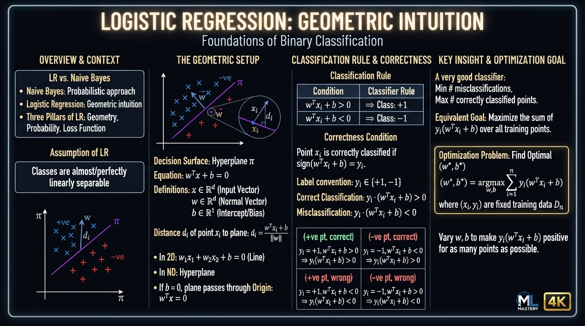  
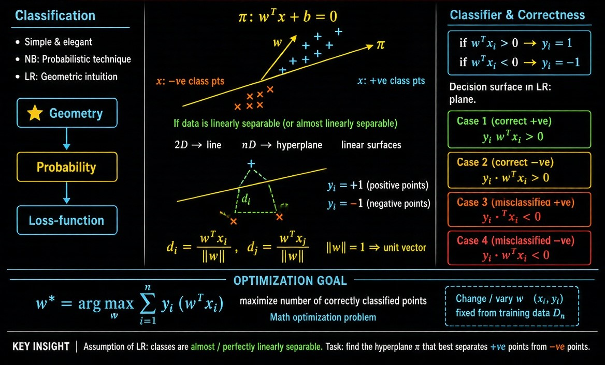

> **Logistic Regression (Geometric Intuition)**

Logistic Regression is a simple and elegant **classification** algorithm.

- Naive Bayes → Probabilistic technique
- Logistic Regression → Geometric intuition

LR can be understood from three angles:

- Geometry
- Probability
- Loss function

### The Decision Surface (Hyperplane)

The decision surface is a hyperplane:

$$
\pi: \quad \mathbf{w}^\top \mathbf{x} + b = 0
$$

- $\mathbf{w}$ = normal vector to the plane
- $b$ = intercept

**Geometry:**

- In 2D → a line
- In $n$-D → a hyperplane

These are **linear surfaces**.  
(Circle, parabola, etc. are quadratic surfaces.)

If the hyperplane passes through the origin:

$$
b = 0 \quad \Rightarrow \quad \mathbf{w}^\top \mathbf{x} = 0
$$

Where:

- $\mathbf{x} \in \mathbb{R}^d$ (data point)
- $\mathbf{w} \in \mathbb{R}^d$ (weight vector)
- $b \in \mathbb{R}$ (scalar)

### Assumption of Logistic Regression

**Core assumption:**  
The two classes are **almost / perfectly linearly separable**.

**Given:**  
Training data $D_n = \{+\text{ve points}, -\text{ve points}\}$

**Task:**  
Find the best $\mathbf{w}$ and $b$ such that the hyperplane $\pi$ separates the positive points from the negative points as well as possible.

**Comparison of assumptions:**

- Naive Bayes → Conditional independence of features
- k-NN → Neighborhood
- Logistic Regression → Linear separability

### Signed Distance & Classifier Rule

Let the labels be coded as:

$$
y_i =
\begin{cases}
+1 & \text{positive point} \\
-1 & \text{negative point}
\end{cases}
$$

The signed distance of a point $\mathbf{x}_i$ from the plane (when $\|\mathbf{w}\|=1$) is:

$$
d_i = \mathbf{w}^\top \mathbf{x}_i
$$

**Classifier rule:**

$$
\begin{align*}
\text{if } \mathbf{w}^\top \mathbf{x}_i > 0 &\quad \Rightarrow \quad \hat{y}_i = +1 \\
\text{if } \mathbf{w}^\top \mathbf{x}_i < 0 &\quad \Rightarrow \quad \hat{y}_i = -1
\end{align*}
$$

The decision surface in Logistic Regression is a **line / plane** (linear).

### Correct Classification Condition

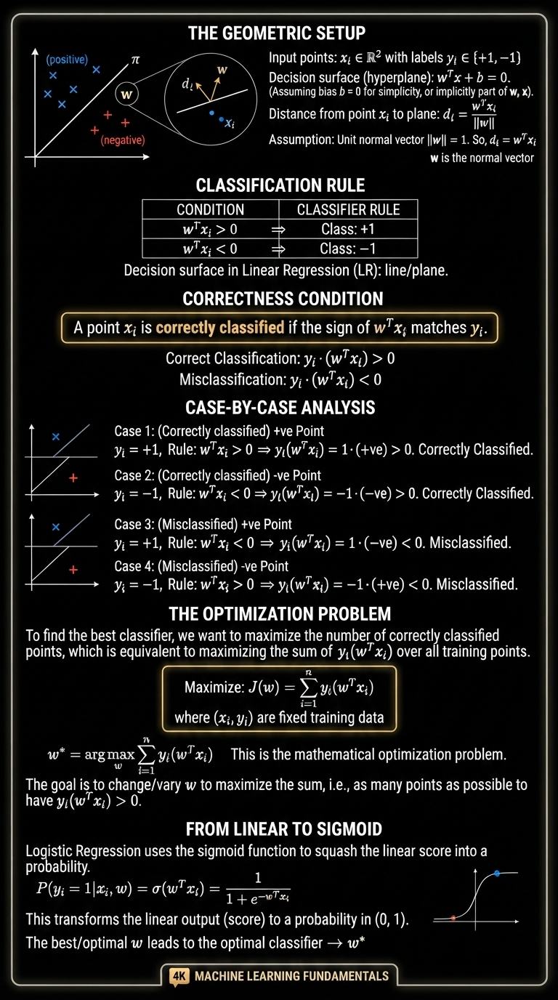

A point is **correctly classified** if and only if:

$$
y_i \, (\mathbf{w}^\top \mathbf{x}_i) > 0
$$

**Cases:**

| Case | True label $y_i$ | $\mathbf{w}^\top \mathbf{x}_i$ | $y_i (\mathbf{w}^\top \mathbf{x}_i)$ | Result        |
| ---- | ---------------- | ------------------------------ | ------------------------------------ | ------------- |
| 1    | $+1$             | $> 0$                          | $> 0$                                | Correct       |
| 2    | $-1$             | $< 0$                          | $> 0$                                | Correct       |
| 3    | $+1$             | $< 0$                          | $< 0$                                | Misclassified |
| 4    | $-1$             | $> 0$                          | $< 0$                                | Misclassified |

### Optimization Goal

To make the classifier as good as possible we want:

- Minimize the number of misclassifications
- **or** Maximize the number of correctly classified points

This is equivalent to maximizing:

$$
\sum_{i=1}^{n} y_i \, (\mathbf{w}^\top \mathbf{x}_i)
$$

**Mathematical formulation (optimization problem):**

$$
\mathbf{w}^* = \arg\max_{\mathbf{w}} \sum_{i=1}^{n} y_i \, (\mathbf{w}^\top \mathbf{x}_i)
$$

- $(x_i, y_i)$ are fixed (training data)
- $\mathbf{w}$ is the variable we optimize

**Key Insight:**  
Logistic Regression finds a hyperplane that best separates the two classes in a linear sense. The simple geometric condition $y_i (\mathbf{w}^\top \mathbf{x}_i) > 0$ tells us whether a point is correctly classified, and maximizing the sum of these terms gives the optimal weight vector.

## 02. Sigmoid Function: Squashing

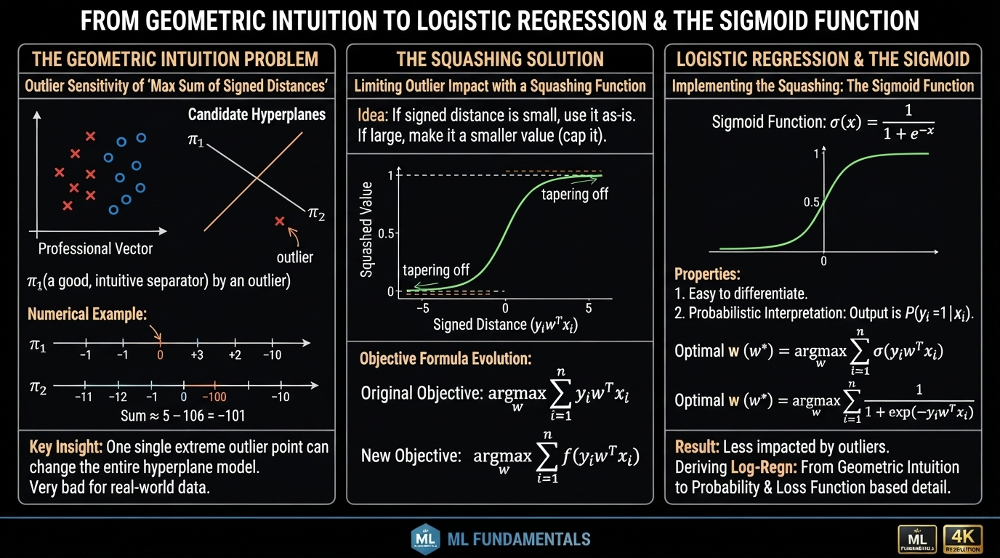  
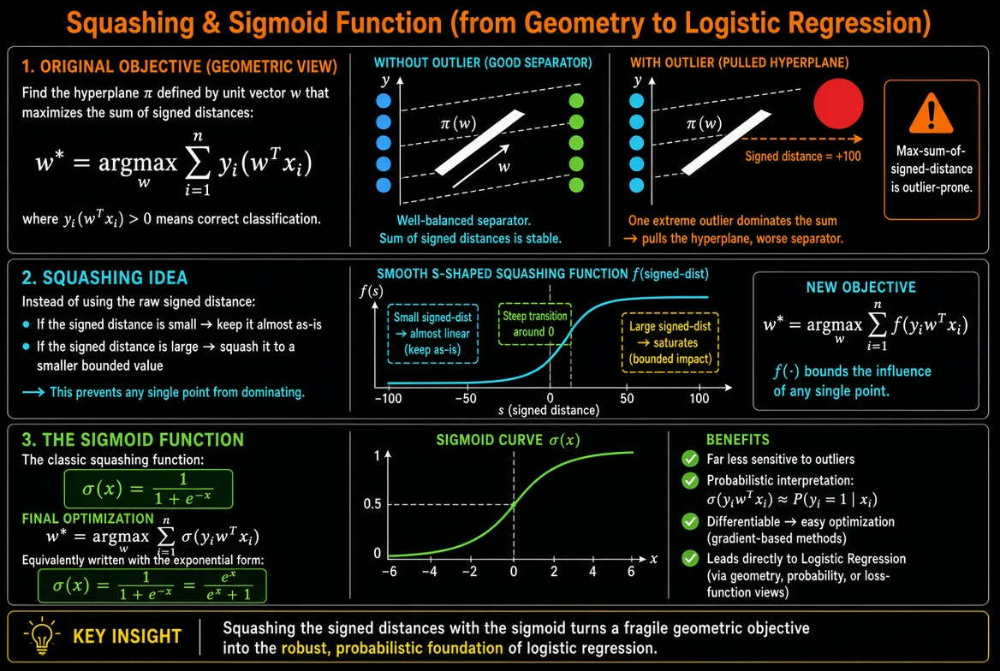

> **Squashing & Sigmoid Function**

### Recap: The Optimization Problem

We want the best hyperplane defined by $\mathbf{w}$:

$$
\mathbf{w}^* = \arg\max_{\mathbf{w}} \sum_{i=1}^{n} y_i \, (\mathbf{w}^\top \mathbf{x}_i)
$$

- $y_i (\mathbf{w}^\top \mathbf{x}_i)$ is the **signed distance** of point $\mathbf{x}_i$ from the plane (when $\|\mathbf{w}\| = 1$).
- Positive value $\rightarrow$ correctly classified
- Negative value $\rightarrow$ misclassified

### Problem with Maximizing Sum of Signed Distances

Maximizing the raw sum of signed distances is **very sensitive to outliers**.

**Example illustration:**

- Most points are well separated by a good plane $\pi_1$.
- One extreme outlier (signed distance $= +100$ or $-100$) can pull the hyperplane dramatically.
- A worse-looking plane $\pi_2$ can end up with a higher total sum just because of that single outlier.

**Conclusion:**  
One single extreme/outlier point can completely change the model (hyperplane).  
Maximizing the sum of signed distances is **not outlier-robust**.

### Solution: Squashing

**Idea of Squashing:**

- If the signed distance is **small** → keep it almost as is.
- If the signed distance is **large** → compress it to a smaller value (taper it off).

We replace the raw signed distance with a **squashing function** $f(\cdot)$:

$$
\mathbf{w}^* = \arg\max_{\mathbf{w}} \sum_{i=1}^{n} f\big(y_i \, (\mathbf{w}^\top \mathbf{x}_i)\big)
$$

The function $f$ should:

- Be monotonically increasing
- Saturate (taper off) for large positive/negative values

### The Sigmoid Function

The classic choice for squashing is the **Sigmoid** (Logistic) function:

$$
\sigma(z) = \dfrac{1}{1 + e^{-z}}
$$

Properties:

- Range: $(0, 1)$
- $\sigma(0) = 0.5$
- As $z \to +\infty$, $\sigma(z) \to 1$
- As $z \to -\infty$, $\sigma(z) \to 0$
- Smooth and differentiable
- Gives a natural **probabilistic interpretation**

Now the optimization becomes:

$$
\mathbf{w}^* = \arg\max_{\mathbf{w}} \sum_{i=1}^{n} \sigma\big(y_i \, (\mathbf{w}^\top \mathbf{x}_i)\big)
$$

or explicitly:

$$
\mathbf{w}^* = \arg\max_{\mathbf{w}} \sum_{i=1}^{n} \dfrac{1}{1 + \exp\big(-y_i \, (\mathbf{w}^\top \mathbf{x}_i)\big)}
$$

### Benefits of Using Sigmoid

| Aspect                       | Benefit                                                                |
| ---------------------------- | ---------------------------------------------------------------------- |
| Outlier sensitivity          | Greatly reduced (large distances are squashed)                         |
| Differentiability            | Easy to optimize with gradient-based methods                           |
| Probabilistic interpretation | $\sigma(y_i \mathbf{w}^\top \mathbf{x}_i)$ can be read as $P(y_i = 1)$ |
| Geometric meaning retained   | Still based on signed distance to the plane                            |

### Summary of the Geometric Path to Logistic Regression

1. Start with maximizing sum of signed distances (geometric).
2. Observe that it is outlier-prone.
3. Apply a squashing function (Sigmoid).
4. Obtain a robust, differentiable, probabilistically interpretable objective.

This is the **geometric derivation** of Logistic Regression.  
(We can also derive it from a probabilistic view or from a loss-function view — those will be covered next.)

**Key Insight:**  
Raw maximization of signed distances is unstable because of outliers.  
Squashing the signed distances with the Sigmoid function makes the objective robust, smooth, and probabilistically meaningful — this is the heart of Logistic Regression.

## 03. Mathematical Formulation of Objective Function

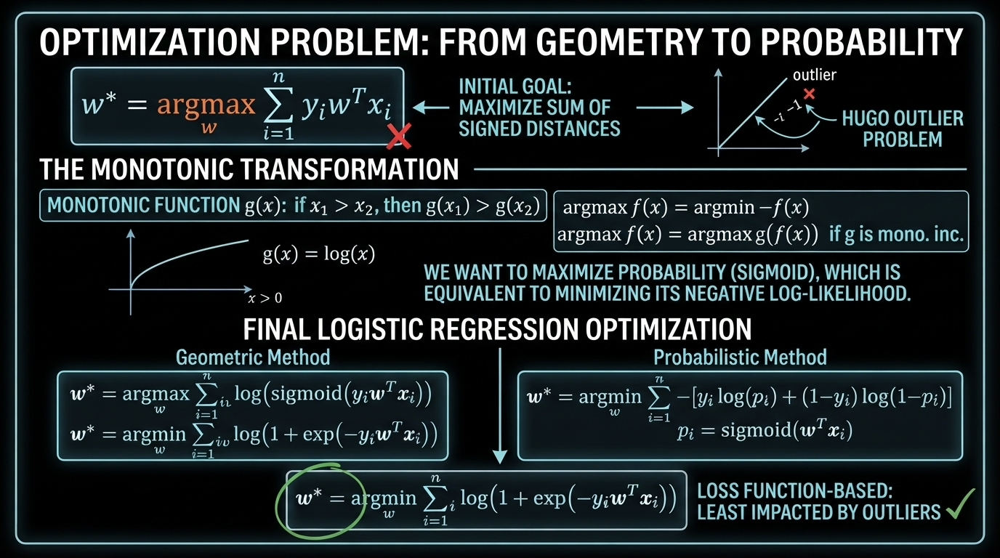  
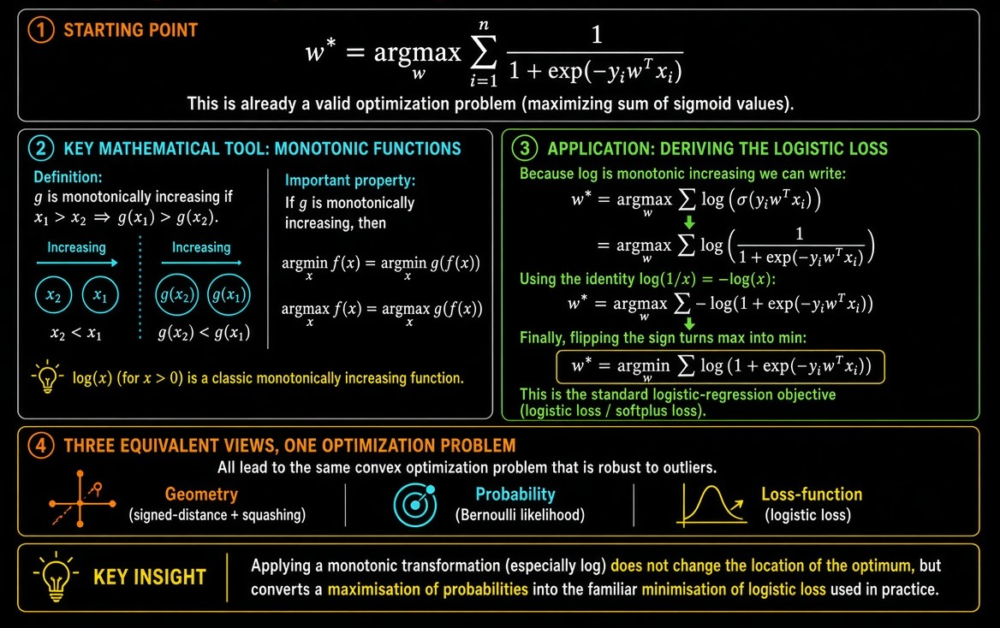

> **Optimization Problem & Monotonic Transformations**

### Current Optimization Problem

After introducing the sigmoid, we have:

$$
\mathbf{w}^* = \arg\max_{\mathbf{w}} \sum_{i=1}^{n} \dfrac{1}{1 + \exp(-y_i \mathbf{w}^\top \mathbf{x}_i)}
$$

This is still a valid optimization problem.

### Monotonic Functions

A function $g(x)$ is **monotonically increasing** if:

$$
x_1 > x_2 \quad \Rightarrow \quad g(x_1) > g(x_2)
$$

(or non-decreasing: $g(x_1) \ge g(x_2)$).

**Important property:**

If $g$ is a monotonically increasing function, then:

$$
\arg\min_x f(x) = \arg\min_x g\big(f(x)\big)
$$

$$
\arg\max_x f(x) = \arg\max_x g\big(f(x)\big)
$$

The location of the optimum does **not** change.

### Applying Log (a Monotonic Function)

The logarithm $g(x) = \log(x)$ (for $x > 0$) is monotonically increasing.

Therefore we can safely take log inside the sum:

$$
\mathbf{w}^* = \arg\max_{\mathbf{w}} \sum_{i=1}^{n} \dfrac{1}{1 + \exp(-y_i \mathbf{w}^\top \mathbf{x}_i)}
$$

$$
\mathbf{w}^* = \arg\max_{\mathbf{w}} \sum_{i=1}^{n} \log\left( \sigma(y_i \mathbf{w}^\top \mathbf{x}_i) \right)
$$

Since

$$
\sigma(z) = \dfrac{1}{1 + e^{-z}}
$$

we get:

$$
\mathbf{w}^* = \arg\max_{\mathbf{w}} \sum_{i=1}^{n} \log\left( \dfrac{1}{1 + \exp(-y_i \mathbf{w}^\top \mathbf{x}_i)} \right)
$$

### Turning Max into Min

We currently have:

$$
\mathbf{w}^* = \arg\max_{\mathbf{w}} \sum_{i=1}^{n} \log\left( \dfrac{1}{1 + \exp(-y_i \mathbf{w}^\top \mathbf{x}_i)} \right)
$$

Using the property:

$$
\log\left(\dfrac{1}{x}\right) = \log(x^{-1}) = -\log(x)
$$

we can rewrite it as:

$$
\mathbf{w}^* = \arg\max_{\mathbf{w}} \sum_{i=1}^{n} -\log\big(1 + \exp(-y_i \mathbf{w}^\top \mathbf{x}_i)\big)
$$

Now apply the general rule:

$$
\arg\max_{x} f(x) = \arg\min_{x} \big(-f(x)\big)
$$

This immediately gives the standard optimization problem of Logistic Regression:

$$
\mathbf{w}^* = \arg\min_{\mathbf{w}} \sum_{i=1}^{n} \log\big(1 + \exp(-y_i \mathbf{w}^\top \mathbf{x}_i)\big)
$$

This is the final form obtained from the geometric view.

This is the **optimization problem of Logistic Regression** (geometric view).

### Comparison of Objectives

| Objective                          | Form                                                              | Outlier Behavior | Notes                   |
| ---------------------------------- | ----------------------------------------------------------------- | ---------------- | ----------------------- |
| Sum of signed distances            | $\arg\max \sum y_i \mathbf{w}^\top \mathbf{x}_i$                  | Very sensitive   | Original geometric idea |
| Sum of sigmoid                     | $\arg\max \sum \sigma(y_i \mathbf{w}^\top \mathbf{x}_i)$          | Better           | Squashing applied       |
| Sum of log-sigmoid (Logistic loss) | $\arg\min \sum \log(1 + \exp(-y_i \mathbf{w}^\top \mathbf{x}_i))$ | Robust           | Final practical form    |

**Three Equivalent Views of Logistic Regression**

> ### 1. Geometry (soft-margin / linear separator view)
With labels $y_i\in\{-1,+1\}$ we solve
$$
\mathbf{w}^*
=\arg\min_{\mathbf{w}}
\sum_{i=1}^n
\log\bigl(1+\exp(-y_i\mathbf{w}^\top\mathbf{x}_i)\bigr)
$$
(the sum of logistic losses).  
This is the natural “soft” analogue of the hard-margin geometric objective $\sum\max(0,1-y_i\mathbf{w}^\top\mathbf{x}_i)$.

> ### 2. Probability (maximum-likelihood / Bernoulli view)
With labels $y_i\in\{0,1\}$ and the logistic (sigmoid) link
$$
p_i=\sigma(\mathbf{w}^\top\mathbf{x}_i)=\frac{1}{1+e^{-\mathbf{w}^\top\mathbf{x}_i}}
$$
we maximise the Bernoulli likelihood, or equivalently minimise the binary cross-entropy:
$$
\mathbf{w}^*
=\arg\min_{\mathbf{w}}
\sum_{i=1}^n
\Bigl[
-y_i\log p_i
-(1-y_i)\log(1-p_i)
\Bigr].
$$

> ### 3. Loss-function view (will learn later)
Both of the above are exactly the same optimisation problem once the labels are mapped
$$
y_{\pm1}\;=\;2y_{0/1}-1.
$$
The common training criterion is therefore simply called the **logistic loss** (or log-loss):
$$
\ell(z)=\log(1+e^{-z}),
\qquad
z=y\,\mathbf{w}^\top\mathbf{x}.
$$
Minimising the sum of logistic losses is simultaneously
- a geometric soft-margin problem,
- maximum-likelihood estimation of a logistic model, and
- empirical risk minimisation with the logistic surrogate loss.

Hence the three descriptions are mathematically identical.

**Key Insight:**  
Because $\log$ is monotonically increasing, taking the log (and then flipping the sign) does not change the optimal $\mathbf{w}$. This transformation gives us a smooth, convex, outlier-robust objective that is easy to optimize and has a clear probabilistic interpretation — the logistic loss.

## 04. Weight Vector

  
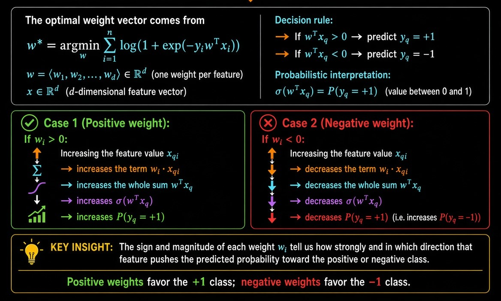

**Weight-Vector**

We have the optimization problem:

$$
\mathbf{w}^* = \arg\min_{\mathbf{w}} \sum_{i=1}^{n} \log\big(1 + \exp(-y_i \mathbf{w}^\top \mathbf{x}_i)\big)
$$

$\mathbf{w}^*$ is the **weight-vector**.

$$
\mathbf{w} = \langle w_1, w_2, w_3, \dots, w_d \rangle
$$

- $\mathbf{w} \in \mathbb{R}^d$
- $\mathbf{x}_i \in \mathbb{R}^d$  (d-features)

### Decision

For a query point $\mathbf{x}_q$:

$$
\begin{align*}
\text{if } \mathbf{w}^\top \mathbf{x}_q > 0 &\quad \Rightarrow \quad y_q = +1 \\
\text{if } \mathbf{w}^\top \mathbf{x}_q < 0 &\quad \Rightarrow \quad y_q = -1
\end{align*}
$$

### Probabilistic Interpretation

$$
\sigma(\mathbf{w}^\top \mathbf{x}_q) = P(y_q = +1)
$$

(value lies between 0 and 1)

### Interpretation of $\mathbf{w}$

**Case 1:** If $w_i$ is **positive**

- Feature $f_i$ ⬆  
- $\Rightarrow$ $w_i x_{qi}$ ⬆  
- $\Rightarrow$ $\sum w_i x_{qi}$ ⬆  
- $\Rightarrow$ $\sigma(\mathbf{w}^\top \mathbf{x}_q)$ ⬆  
- $\Rightarrow$ $P(y_q = +1)$ ⬆  

**Case 2:** If $w_i$ is **negative**

- Feature $f_i$ ⬆  
- $\Rightarrow$ $w_i x_{qi}$ ⬇  
- $\Rightarrow$ $\sum w_i x_{qi}$ ⬇  
- $\Rightarrow$ $\sigma(\mathbf{w}^\top \mathbf{x}_q)$ ⬇  
- $\Rightarrow$ $P(y_q = +1)$ ⬇  
- $\Rightarrow$ $P(y_q = -1)$ ⬆  

(Note: $P(y_q = +1) = 1 - P(y_q = -1)$)

## 05. L2 Regularization: Overfitting and Underfitting

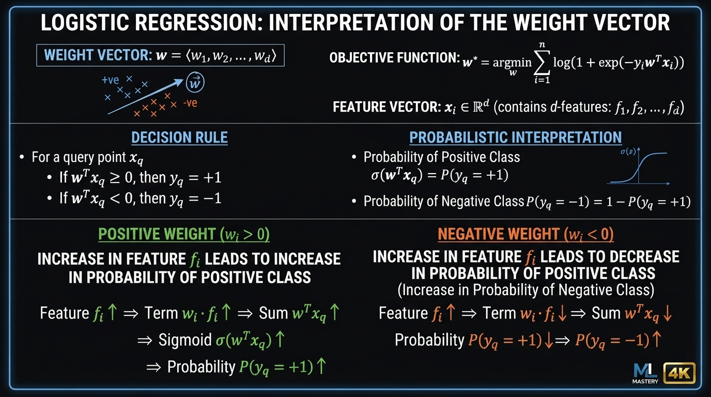  
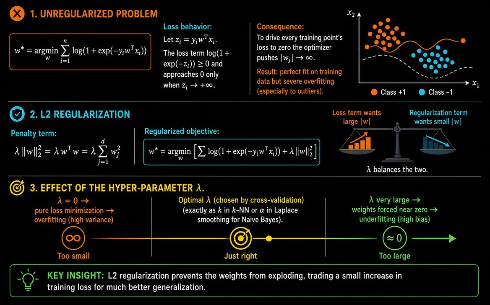

> **L2 Regularization: Overfitting vs Underfitting**

We have:

$$
\mathbf{w}^* = \arg\min_{\mathbf{w}} \sum_{i=1}^{n} \log\big(1 + \exp(-y_i \mathbf{w}^\top \mathbf{x}_i)\big)
$$

Let $z_i = y_i \mathbf{w}^\top \mathbf{x}_i$

Then the problem becomes:

$$
\mathbf{w}^* = \arg\min_{\mathbf{w}} \sum_{i=1}^{n} \log\big(1 + \exp(-z_i)\big)
$$

### Observation

$\log(1 + \exp(-z_i)) \ge 0$ always.

The **minimal value** of the sum is 0.  
It occurs when $z_i \to +\infty$ for all $i$.

If $z_i$ is positive and $z_i \to +\infty$:

- $\exp(-z_i) \to 0$
- $\log(1 + \exp(-z_i)) \to 0$

### What does $z_i \to +\infty$ mean?

$z_i = y_i \mathbf{w}^\top \mathbf{x}_i \to +\infty$ means:

1. The point $\mathbf{x}_i$ is correctly classified by $\mathbf{w}$.
2. The signed distance is becoming extremely large.

If we pick $\mathbf{w}$ such that:
- All training points are correctly classified, and
- $z_i \to +\infty$ for every point,

then this $\mathbf{w}$ becomes the “best” according to the loss.  
But this leads to **overfitting** (perfect job on training data, especially driven by outliers).  
In this situation the individual weights $w_j \to +\infty$ or $w_j \to -\infty$.

### Regularization

To control this, we add a regularization term:

$$
\mathbf{w}^* = \arg\min_{\mathbf{w}} \Bigg( \sum_{i=1}^{n} \log\big(1 + \exp(-y_i \mathbf{w}^\top \mathbf{x}_i)\big) + \lambda \, \mathbf{w}^\top \mathbf{w} \Bigg)
$$

- First term → **loss term**
- Second term → **regularization term**

$$
\lambda \, \mathbf{w}^\top \mathbf{w} = \lambda \|\mathbf{w}\|_2^2 = \lambda \sum_{j=1}^{d} w_j^2
$$

(This is the square of the L2-norm of $\mathbf{w}$.)

### Effect of $\lambda$

- $\lambda = 0$ → no regularization → **overfitting** (high variance)
- $\lambda$ very large → **underfitting** (high bias)

$\lambda$ is the **hyper-parameter** of Logistic Regression  
(similar to $K$ in k-NN or $\alpha$ in Laplace smoothing of Naive Bayes).

We choose the best $\lambda$ using **Cross-Validation**.

**Final form:**

Minimize (loss function on training data + regularization term).

## 06. L1 Regularization and Sparsity

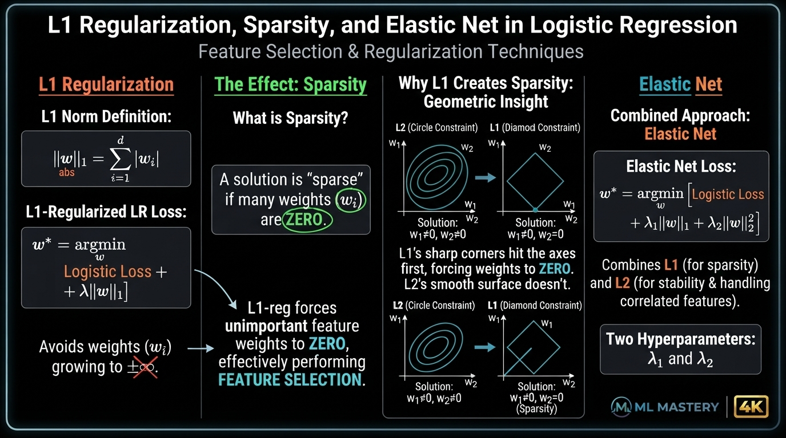  
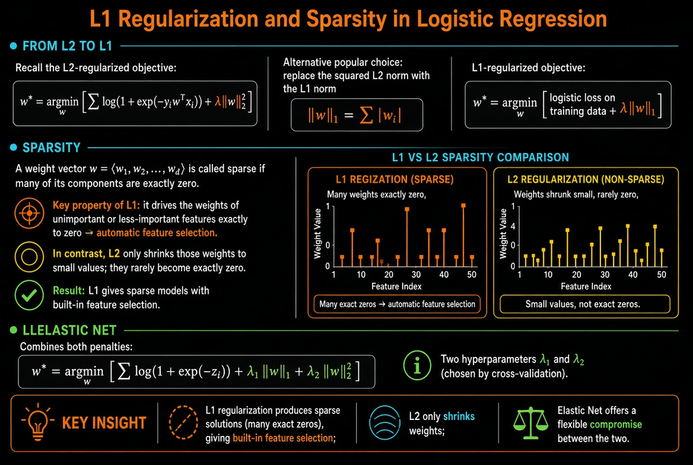

> **L1 Regularization and Sparsity**

We had (with L2 regularization):

$$
\mathbf{w}^* = \arg\min_{\mathbf{w}} \sum_{i=1}^{n} \log\big(1 + \exp(-y_i \mathbf{w}^\top \mathbf{x}_i)\big) + \lambda \|\mathbf{w}\|_2^2
$$

- First term → logistic loss  
- Second term → L2-regularization  

When $z_i \to +\infty$, the weights $w_i \to +\infty$ or $w_i \to -\infty$ (overfitting).

### Question: Alternatives to L2-regularization?

Popular alternative: **L1-regularization**

Instead of $\|\mathbf{w}\|_2^2$ we use $\|\mathbf{w}\|_1$:

$$
\|\mathbf{w}\|_1 = \sum_{i=1}^{d} |w_i|
$$

So the new problem becomes:

$$
\mathbf{w}^* = \arg\min_{\mathbf{w}} \Big( \text{logistic loss on training data} \Big) + \lambda \|\mathbf{w}\|_1
$$

This is called **L1-regularization**.  
It also prevents $w_i \to +\infty$ or $w_i \to -\infty$.

### Sparsity

A solution $\mathbf{w}^* = \langle w_1, w_2, \dots, w_d \rangle$ is said to be **sparse** if many of the $w_i$’s are exactly zero.

If we use L1-regularization in Logistic Regression, all the unimportant / less-important features get $w_i = 0$.

- L1-reg → many $w_i$ become exactly zero  
- L2-reg → $w_i$ become small but not necessarily zero

### Why does L1-reg create sparsity (compared to L2-reg)?

(This is left as a question to prove / understand from the optimization geometry.)

### Elastic-Net

We can also combine both:

$$
\mathbf{w}^* = \arg\min_{\mathbf{w}} \sum_{i=1}^{n} \log\big(1 + \exp(-z_i)\big) + \lambda_1 \|\mathbf{w}\|_1 + \lambda_2 \|\mathbf{w}\|_2^2
$$

This is called **Elastic-Net**.  
It has two hyper-parameters: $\lambda_1$ and $\lambda_2$.

## 07. Probabilistic Interpretation: Gaussian Naive Bayes

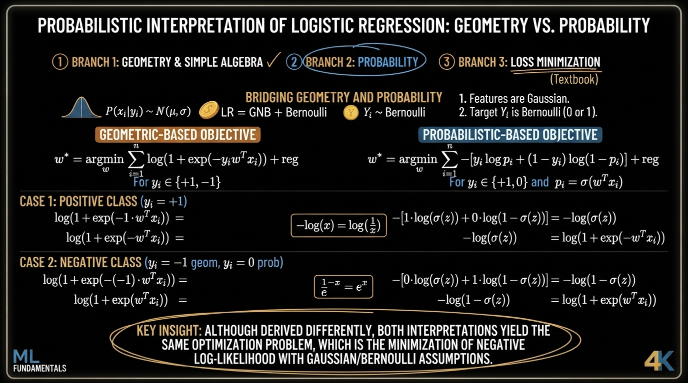  
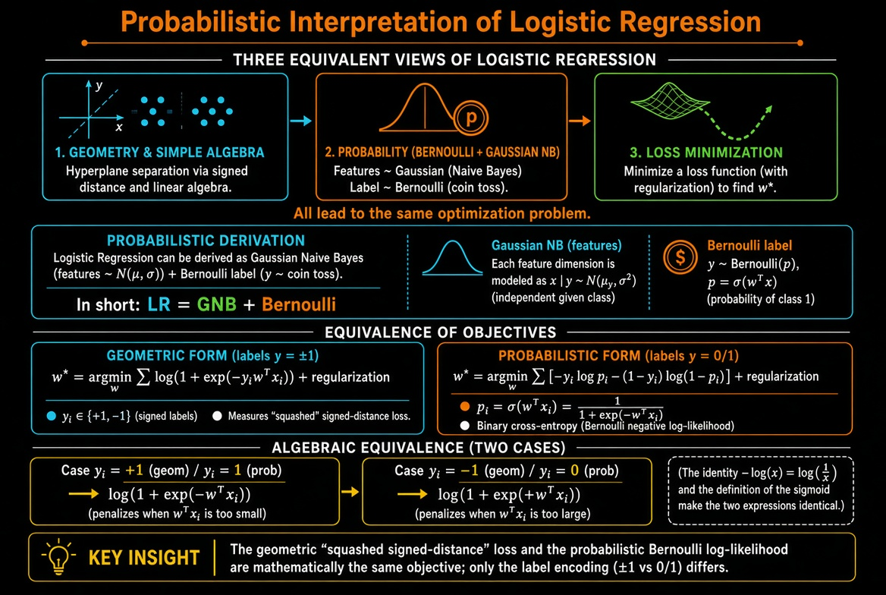

> **Probabilistic Interpretation of Logistic Regression**

Logistic Regression can be understood in three ways:

1. Geometry & Simple algebra  
2. Probability  
3. Loss minimization  

(Textbook mainly follows the probabilistic view.)

### Probabilistic Derivation of LR

Naive Bayes assumptions:

1. Features are real-valued → Gaussian distribution  
   $$
   P(\mathbf{x}_i \mid y_i) \sim \mathcal{N}(\mu_i, \sigma)
   $$

2. $y_i = +1$ or $0$ → Bernoulli random variable (coin-toss)

**Key statement:**

$$
\text{LR} = \text{Gaussian Naive Bayes} + \text{Bernoulli}
$$

- $P(\mathbf{x}_i \mid y_i)$ comes from Gaussian NB  
- $y_i$ is Bernoulli

### Two Forms of the Optimization Problem

**Geometric form** (labels $+1$ or $-1$):

$$
\mathbf{w}^* = \arg\min_{\mathbf{w}} \sum_{i=1}^{n} \log\big(1 + \exp(-y_i \mathbf{w}^\top \mathbf{x}_i)\big) + \text{reg}
$$

**Probabilistic form** (labels $+1$ or $0$):

$$
\mathbf{w}^* = \arg\min_{\mathbf{w}} \sum_{i=1}^{n} \Big[ -y_i \log p_i - (1-y_i)\log(1-p_i) \Big] + \text{reg}
$$

where

$$
p_i = \sigma(\mathbf{w}^\top \mathbf{x}_i)
$$

### Showing the Two Forms are Equivalent

**Case 1:** $y_i$ is positive  
- Geometry: $y_i = +1$  
- Probability: $y_i = +1$

Geometry term:

$$
\log\big(1 + \exp(-\mathbf{w}^\top \mathbf{x}_i)\big)
$$

Probability term:

$$
-\log\left( \dfrac{1}{1+\exp(-\mathbf{w}^\top \mathbf{x}_i)} \right) = \log\big(1 + \exp(-\mathbf{w}^\top \mathbf{x}_i)\big)
$$

(They match.)

**Case 2:** $y_i$ is negative  
- Geometry: $y_i = -1$  
- Probability: $y_i = 0$

Geometry term:

$$
\log\big(1 + \exp(\mathbf{w}^\top \mathbf{x}_i)\big)
$$

Probability term:

$$
-\log\big(1 - \sigma(\mathbf{w}^\top \mathbf{x}_i)\big) = -\log\left( \dfrac{\exp(-\mathbf{w}^\top \mathbf{x}_i)}{1+\exp(-\mathbf{w}^\top \mathbf{x}_i)} \right)
$$

After simplification (divide numerator & denominator by $\exp(-\mathbf{w}^\top \mathbf{x}_i)$):

$$
= \log\big(1 + \exp(\mathbf{w}^\top \mathbf{x}_i)\big)
$$

(They match.)

Thus both formulations are equivalent.

## 08. Loss Minimization Interpretation

  
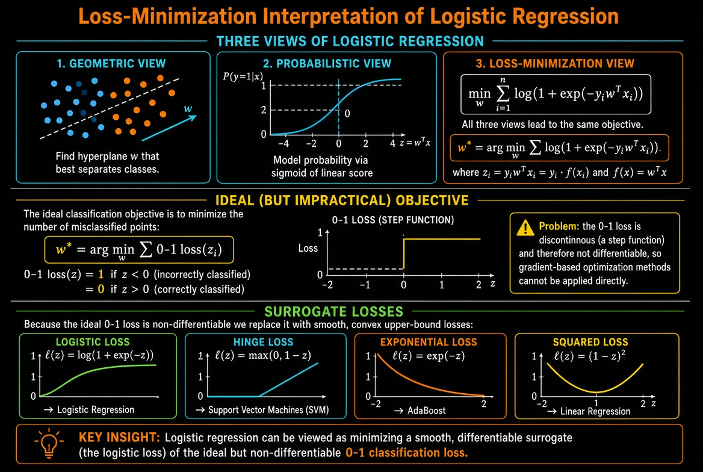

> **Loss Minimization Interpretation of LR**

We already have the geometric and probabilistic interpretations.  
Now we look at the **loss-minimization** view.

$$
\mathbf{w}^* = \arg\min_{\mathbf{w}} \sum_{i=1}^{n} \log\big(1 + \exp(-y_i \mathbf{w}^\top \mathbf{x}_i)\big)
$$

Here  
$$
f(\mathbf{x}_i) = \mathbf{w}^\top \mathbf{x}_i
$$  
and  
$$
z_i = y_i \mathbf{w}^\top \mathbf{x}_i = y_i \cdot f(\mathbf{x}_i)
$$

### Ideal Optimization Model (Classification)

The ideal goal is:

$$
\mathbf{w}^* = \arg\min_{\mathbf{w}} \big( \text{number of incorrectly classified points} \big)
$$

This corresponds to the **0-1 loss function**:

- Loss = 1 if the point is incorrectly classified  
- Loss = 0 if the point is correctly classified  

Graphically (with $z_i = y_i \mathbf{w}^\top \mathbf{x}_i$ on the x-axis):

- When $z_i < 0$ → loss = 1  
- When $z_i > 0$ → loss = 0  

Minimizing 0-1 loss = maximizing profit (correct classifications).

### Ideal Form

$$
\mathbf{w}^* = \arg\min_{\mathbf{w}} \sum_{i=1}^{n} \, 0\text{-}1\text{ loss}(z_i)
$$

where

$$
0\text{-}1\text{ loss}(z_i) =
\begin{cases}
1 & \text{if } z_i < 0 \\
0 & \text{if } z_i > 0
\end{cases}
$$

### Problem with 0-1 Loss

To solve optimization problems in Machine Learning we need **differentiation** (from calculus).  

The 0-1 loss is **not continuous** (and therefore not differentiable) at $z_i = 0$.  
Hence we cannot directly optimize it with gradient-based methods.

### Loss-Minimization Interpretation

Different loss functions lead to different algorithms:

- Logistic loss → Logistic Regression  
- Hinge loss → SVM  
- Exponential loss → AdaBoost  
- Squared loss → Linear Regression  

So Logistic Regression can also be viewed simply as:

> Minimize the logistic loss on the training data.

## 09. Hyperparameters and Random Search

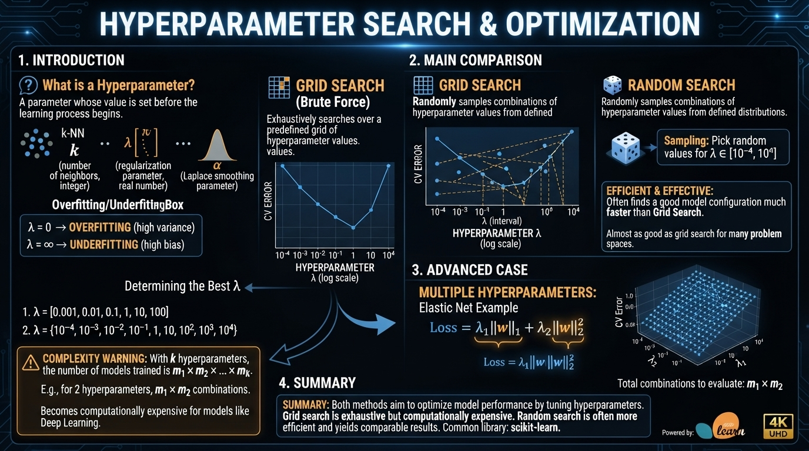  
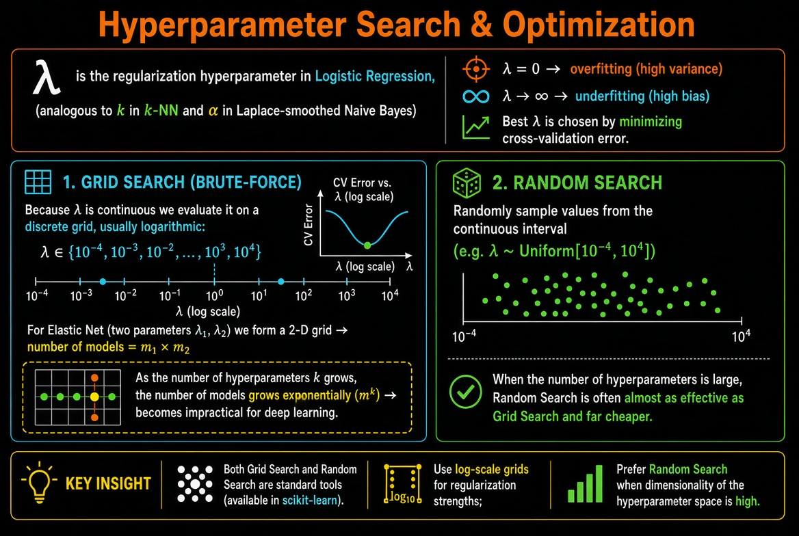

https://scikit-learn.org/stable/modules/grid_search.html

> **`Hyperparameter Search / Optimization`**

$\lambda$ is the hyper-parameter of Logistic Regression.

- $\lambda = 0$ → Overfitting  
- $\lambda = \infty$ → Underfitting  

**Question:** How do we determine the best $\lambda$?

We use **Cross-Validation** (look at CV-error).

Similar hyper-parameters in other algorithms:
- $\lambda$ → Logistic Regression  
- $K$ → k-NN  
- $\alpha$ → Naive Bayes (Laplace smoothing)

### Nature of the Hyper-parameter

- $K$ in k-NN is an **integer** $\{1, 2, 3, \dots, n\}$  
- $\lambda$ in LR is a **real number** ($\lambda \in \mathbb{R}$)  
  Examples: $\lambda = 0.1234$, $\lambda = 0.2386$, etc.

### Grid Search (Brute Force)

We try a set of candidate values and pick the one with lowest CV-error.

Common grids:

1. $\lambda = [0.001,\ 0.01,\ 0.1,\ 1,\ 10,\ 100,\ 1000]$  
2. $\lambda = [1, 2, 3, 4, 5, 6, 7, 8, 9, 10]$  
3. Logarithmic scale (recommended):

$$
\lambda = \{10^{-4},\ 10^{-3},\ 10^{-2},\ 10^{-1},\ 1,\ 10,\ 10^{2},\ 10^{3},\ 10^{4}\}
$$

### Elastic-Net (two hyper-parameters)

When we have $\lambda_1 \|\mathbf{w}\|_1 + \lambda_2 \|\mathbf{w}\|_2^2$, we must search in 2-D:

$$
\lambda_1 = \{10^{-3},\ 10^{-2},\ \dots,\ 10^{3}\}
$$
$$
\lambda_2 = \{10^{-3},\ 10^{-2},\ \dots,\ 10^{3}\}
$$

Total combinations = $m_1 \times m_2$.

### Computational Cost of Grid Search

- 1 hyper-parameter → train the model $m$ times  
- 2 hyper-parameters → train $m_1 \times m_2$ times  
- $k$ hyper-parameters → train $m^k$ times  

As the number of hyper-parameters increases, the number of times the model needs to be trained increases **exponentially**.  
(This becomes a serious issue in Deep Learning.)

### Random Search

Random Search is almost as good as Grid Search when the number of hyper-parameters is large.

We randomly pick values of $\lambda$ from an interval, e.g.

$$
\lambda \in [10^{-4},\ 10^{4}]
$$

and evaluate CV-error on those randomly chosen points.

Both **Grid Search** and **Random Search** are available in **sklearn**.

## 10. Column Standardization

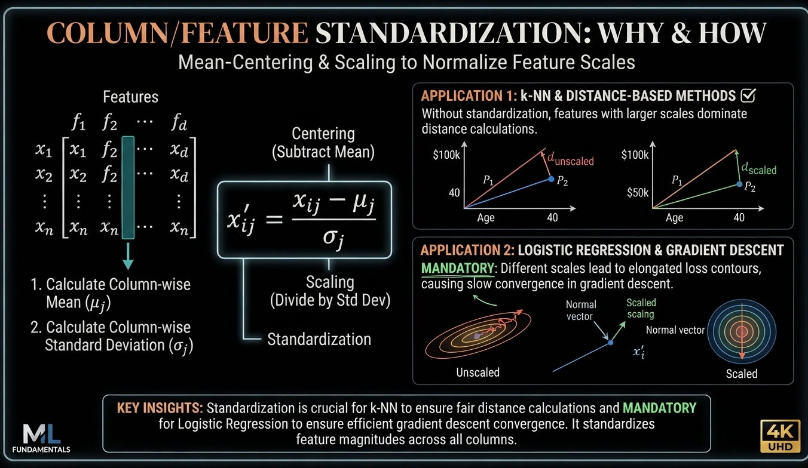  
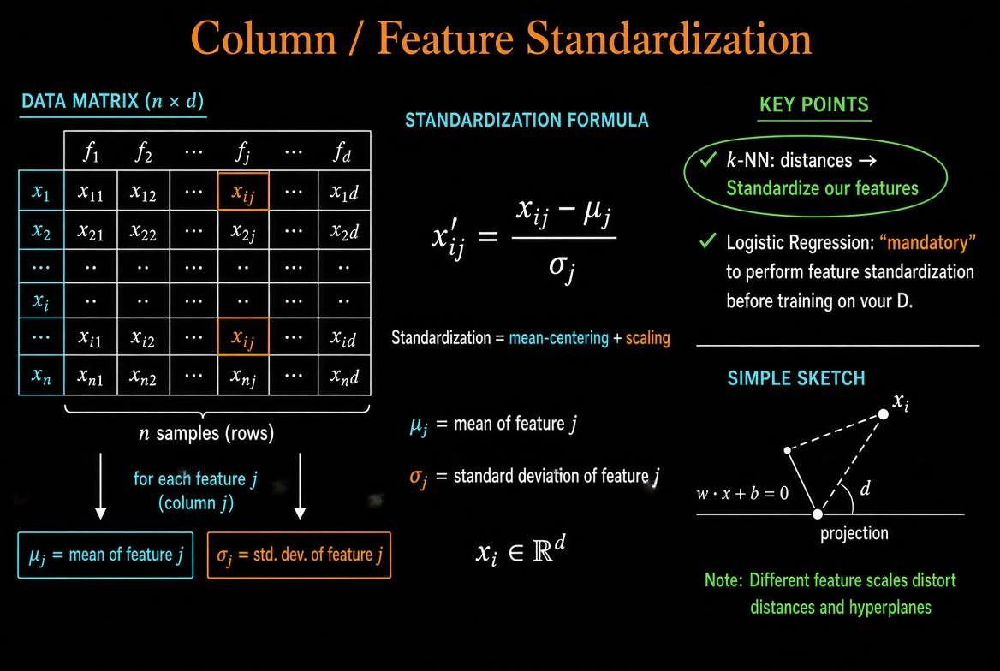

> **`Column / Feature Standardization`**

We have the data matrix with features $f_1, f_2, \dots, f_j, \dots, f_d$.

Each data point $\mathbf{x}_i \in \mathbb{R}^d$.

For every feature $j$:

- Compute mean $\mu_j$
- Compute standard deviation $\sigma_j$

Standardization (mean-centering + scaling):

$$
x_{ij}' = \dfrac{x_{ij} - \mu_j}{\sigma_j}
$$

- Centering → subtract $\mu_j$
- Scaling → divide by $\sigma_j$

This is exactly the same standardization we do for k-NN (because k-NN is distance-based).

### Importance for Logistic Regression

For Logistic Regression it is **mandatory** to perform feature standardization **before** training on your data $\mathcal{D}$.

Why?

The decision boundary is determined by the weight vector $\mathbf{w}$ and the hyperplane $\pi$.  
If features are on very different scales, the optimization and the resulting $\mathbf{w}$ get distorted by the feature scales.

Therefore:

> Always standardize the features before training a Logistic Regression model.

## 11. Feature Importance and Model Interpretability

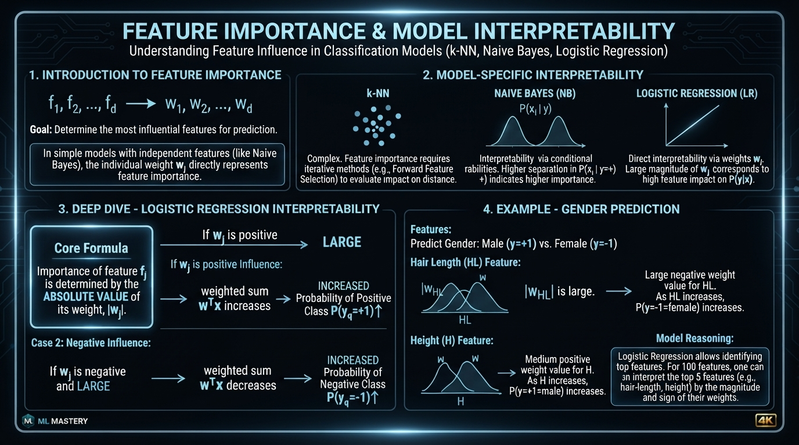  
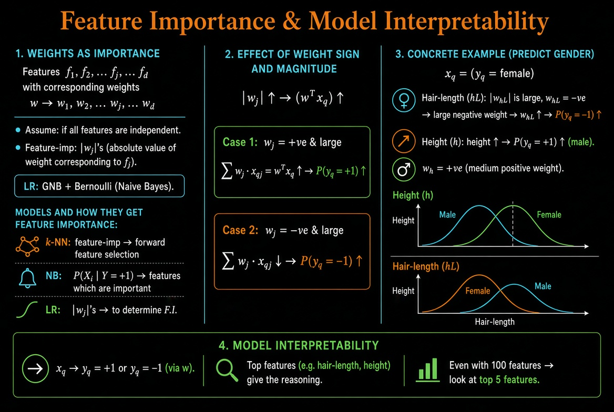

> **`Feature Importance & Model Interpretability`**

We have features $f_1, f_2, \dots, f_j, \dots, f_d$  
and the corresponding weights $w_1, w_2, \dots, w_j, \dots, w_d$.

Recall: Logistic Regression = Gaussian Naive Bayes + Bernoulli  
(under the assumption that all features are independent — same assumption as Naive Bayes).

**Feature importance** comes from the $w_j$’s.

### Comparison with other models

- **k-NN**: Feature importance → Forward Feature Selection  
- **Naive Bayes**: $P(x_i \mid y=+1)$ → features which are important  
- **Logistic Regression**: $w_j$’s → to determine feature importance

### How to read the weights

$|w_j|$ = absolute value of the weight corresponding to feature $f_j$

**Case 1:** $w_j$ is positive and large  
→ $\mathbf{w}^\top \mathbf{x}_q$ increases  
→ $P(y_q = +1)$ increases  

**Case 2:** $w_j$ is negative and large  
→ $\sum w_j x_{qj}$ decreases  
→ $P(y_q = -1)$ increases  

### Example: Predict gender (male = +1, female = −1)

- Feature: hair-length ($hL$)  
  $|w_{hL}|$ is large and $w_{hL}$ is negative  
  → as hair-length increases, $P(y_q = -1)$ increases (more likely female)

- Feature: height ($h$)  
  $w_h$ is positive (medium positive weight)  
  → as height increases, $P(y_q = +1)$ increases (more likely male)

### Model Interpretability

Given a query point $\mathbf{x}_q$:

- If the model predicts $y_q = +1$ → look at the top features that pushed the decision toward +1  
- If the model predicts $y_q = -1$ → look at the top features that pushed the decision toward −1  

Even if we have 100 features, we can look at the **top 5 features** (by $|w_j|$) to give a clear reasoning for the prediction.

## 12. Collinearity of Features

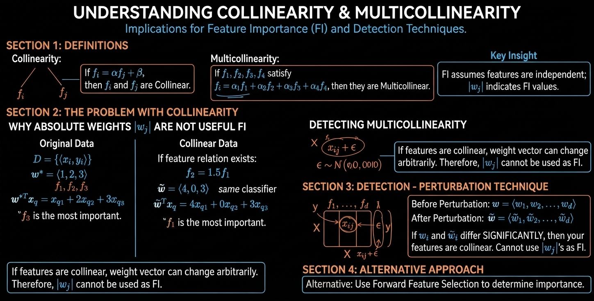  
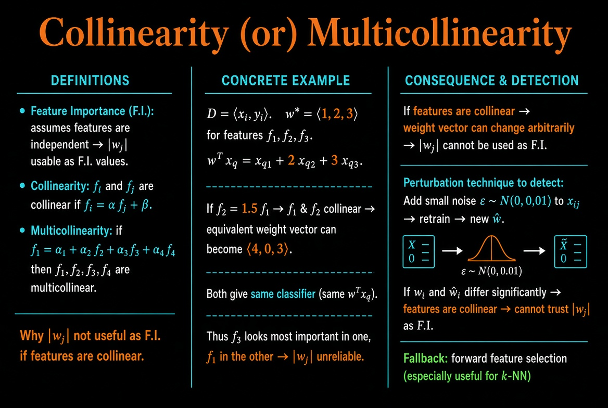

> **`Collinearity (or) Multicollinearity`**

In feature importance we assumed that features are independent, so that $|w_j|$ can be used as a feature-importance value.

### Collinearity

Two features $f_i$ and $f_j$ are said to be **collinear** if

$$
f_i = \alpha f_j + \beta
$$

for some constants $\alpha, \beta$.

### Multicollinearity

If several features satisfy a linear relation, for example

$$
f_1 = \alpha_1 + \alpha_2 f_2 + \alpha_3 f_3 + \alpha_4 f_4
$$

then $f_1, f_2, f_3, f_4$ are said to be **multicollinear**.

### Why $|w_j|$ is not useful when features are collinear

**Example**

Dataset $\mathcal{D} = \{(\mathbf{x}_i, y_i)\}_{i=1}^n$

Learned weight vector:

$$
\mathbf{w}^* = \langle 1,\ 2,\ 3 \rangle
$$

corresponding to features $f_1, f_2, f_3$.

For a query point $\mathbf{x}_q = \langle x_{q1}, x_{q2}, x_{q3} \rangle$

$$
\mathbf{w}^\top \mathbf{x}_q = x_{q1} + 2 x_{q2} + 3 x_{q3}
$$

Now suppose $f_2 = 1.5\, f_1$ (i.e., $f_1$ and $f_2$ are collinear).

Then we can rewrite:

$$
\mathbf{w}^\top \mathbf{x}_q = x_{q1} + 2(1.5 x_{q1}) + 3 x_{q3} = 4 x_{q1} + 3 x_{q3}
$$

which is the same as the weight vector

$$
\tilde{\mathbf{w}} = \langle 4,\ 0,\ 3 \rangle
$$

Both $\mathbf{w}^*$ and $\tilde{\mathbf{w}}$ give the **same classification**, but:

- In $\mathbf{w}^*$ → $f_3$ looks most important  
- In $\tilde{\mathbf{w}}$ → $f_1$ looks most important  

**Conclusion**

If features are collinear, the weight vector can change arbitrarily.  
Therefore $|w_j|$ **cannot** be used as a reliable feature-importance measure.

### How to detect multicollinearity (Perturbation technique)

1. Take the original data matrix.  
2. Add a small amount of noise to each feature:

$$
x_{ij}' = x_{ij} + \varepsilon, \quad \varepsilon \sim \mathcal{N}(0, 0.01)
$$

3. Retrain the model and obtain a new weight vector $\tilde{\mathbf{w}}$.

**Before perturbation:** $\mathbf{w} = \langle w_1, w_2, \dots, w_j, \dots, w_d \rangle$  
**After perturbation:** $\tilde{\mathbf{w}} = \langle \tilde{w}_1, \tilde{w}_2, \dots, \tilde{w}_j, \dots, \tilde{w}_d \rangle$

If $w_j$ and $\tilde{w}_j$ differ significantly, the features are collinear → we cannot trust $|w_j|$ as feature importance.

In such cases we fall back to methods like **Forward Feature Selection** (the same technique used for k-NN).

## 13. Test Run, Time, Space and Time Complexity

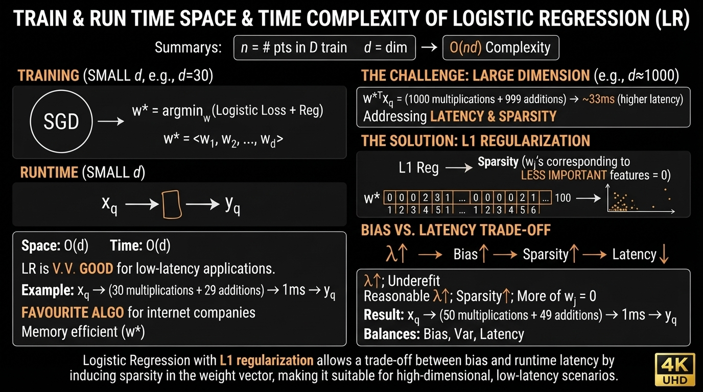  
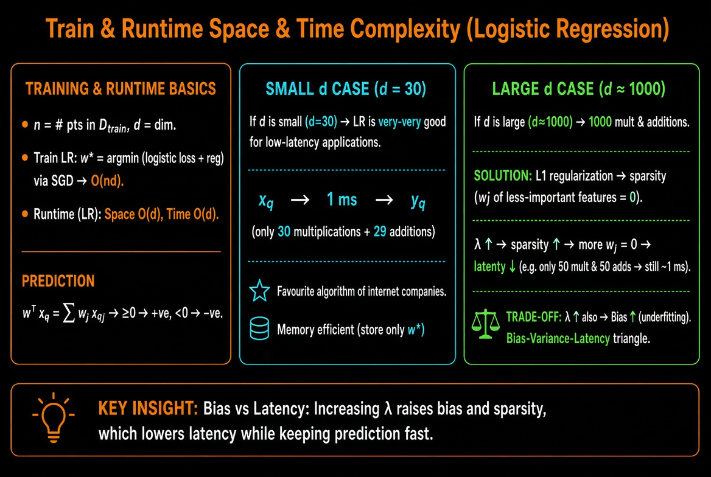

> **`Train & Runtime Space & Time Complexity`**

- $n$ = number of points in $D_{\text{train}}$
- $d$ = dimensionality

### Training Logistic Regression

We solve

$$
\mathbf{w}^* = \arg\min_{\mathbf{w}} \big( \text{logistic loss} + \text{regularization} \big)
$$

This is an optimization problem (will be discussed in the next chapter).  
In practice we use **SGD** (Stochastic Gradient Descent).

Training complexity: $O(nd)$

The final model is simply the weight vector:

$$
\mathbf{w}^* = \langle w_1, w_2, \dots, w_d \rangle
$$

### Runtime (Prediction)

For a query point $\mathbf{x}_q$:

$$
\mathbf{w}^\top \mathbf{x}_q = \sum_{j=1}^{d} w_j x_{qj}
$$

- If $\mathbf{w}^\top \mathbf{x}_q > 0$ → predict $+1$
- If $\mathbf{w}^\top \mathbf{x}_q < 0$ → predict $-1$

**Space complexity:** $O(d)$  
**Time complexity:** $O(d)$

### When $d$ is small (e.g. $d = 30$)

- Logistic Regression is **very very good** for low-latency applications.
- Only 30 multiplications + 29 additions → can easily finish in ~1 ms.
- Memory efficient (only need to store $\mathbf{w}^*$).
- Favourite algorithm of many internet companies for real-time systems.

### When $d$ is large (e.g. $d \approx 1000$)

- $\mathbf{w}^\top \mathbf{x}_q$ needs 1000 multiplications & additions → higher latency.
- Solution: use **L1 regularization** to obtain sparsity.
  - Many $w_j$ corresponding to less important features become exactly 0.
  - If only 50 weights remain non-zero → only 50 multiplications & 50 additions → still ~1 ms latency.

**Trade-off (Bias vs Latency)**

- Increasing $\lambda$ → more sparsity → lower latency  
- But also → higher bias (more underfitting)

We can control this trade-off using the regularization hyper-parameter $\lambda$.

## 14. Real-World Cases

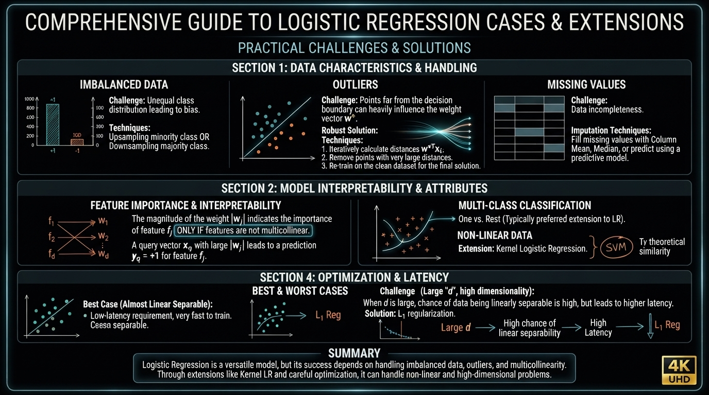  
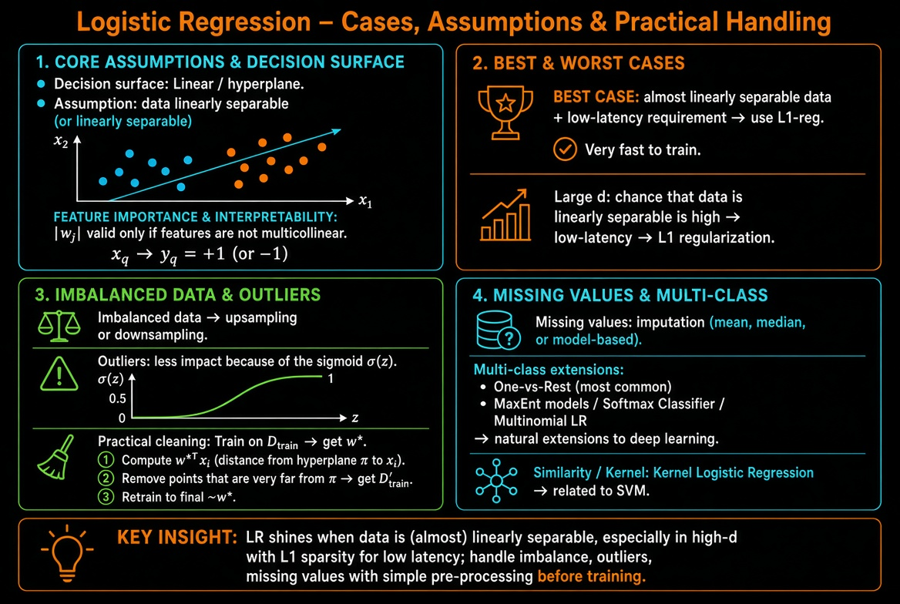

> **`Cases & Practical Aspects of Logistic Regression`**

### Decision Surface
- Linear / Hyperplane

### Assumption
- Data is linearly separable (or almost linearly separable)

### Feature Importance & Interpretability
- Use $|w_j|$ **only if** features are **not** multicollinear
- Given $\mathbf{x}_q$, we can explain why the model predicted $y_q = +1$ (or $-1$)

### Imbalanced Data
- Handle by **upsampling** or **downsampling**

### Outliers
- Less impact because of the squashing nature of $\sigma(\cdot)$
- Procedure:
  1. Train on $D_{\text{train}}$ → obtain $\mathbf{w}^*$
  2. Compute $\mathbf{w}^{*\top} \mathbf{x}_i$ (signed distance from the hyperplane $\pi$ to each point)
  3. Remove points that are very far away from $\pi$
  4. Retrain on the cleaned $D'_{\text{train}}$ → get final $\tilde{\mathbf{w}}^*$

### Missing Values
- Imputation (mean, median, or model-based)

### Multi-class Classification
- **One-vs-Rest** (most common)
- Other extensions of Logistic Regression:
  - MaxEnt models
  - Softmax Classifier
  - Multinomial Logistic Regression  
  (these lead into Deep Learning)

### Similarity Matrix
- Not directly used by Logistic Regression
- Kernel Logistic Regression is an extension (related to SVM)

### Best Cases
- Data is (almost) linearly separable
- Low-latency requirement → use L1-regularization for sparsity
- Very fast to train

### Large $d$
- When dimensionality is large, the chance that data is linearly separable is high
- For low-latency applications → prefer **L1-regularization** (to obtain sparsity)

## 15. Logistic Regression with Imbalanced Data - A Geometric View

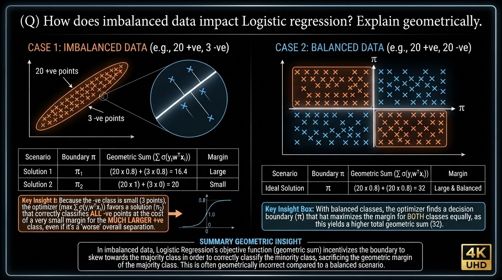
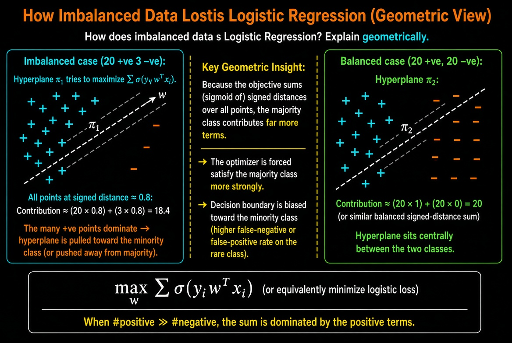

> **`How does imbalanced data impact Logistic Regression? (Geometric Explanation)`**

### Setup
Suppose we have a highly imbalanced dataset:
- 20 positive points ($+1$)
- 3 negative points ($-1$)

We compare two candidate hyperplanes $\pi_1$ and $\pi_2$.

### Case 1: Hyperplane $\pi_1$ (passes closer to the minority class)

Signed distances are approximately $0.8$ for most points.

Contribution to the objective (using sigmoid):

$$
\pi_1:\ (20 \times 0.8) + (3 \times 0.8) = 18.4
$$

### Case 2: Hyperplane $\pi_2$ (pushed towards the minority class)

- All 20 positive points get large positive signed distance ($\approx 1$)
- The 3 negative points get signed distance $\approx 0$

Contribution:

$$
\pi_2:\ (20 \times 1) + (3 \times 0) = 20
$$

### Observation

Even though $\pi_2$ completely ignores the minority class (the 3 negative points lie on or very close to the hyperplane), its total score ($20$) is **higher** than that of $\pi_1$ ($18.4$).

Because the objective is essentially

$$
\max_{\mathbf{w}} \sum_{i=1}^{n} \sigma(y_i \mathbf{w}^\top \mathbf{x}_i)
$$

the majority class dominates the sum. The optimizer prefers a hyperplane that correctly classifies (and pushes far) the large number of majority points, even if it sacrifices the minority class.

### Balanced case (for comparison)

If we have 20 positive and 20 negative points:

$$
\pi_1:\ (20 \times 0.8) + (20 \times 0.8) = 32
$$

$$
\pi_2:\ (20 \times 1) + (20 \times 0) = 20
$$

Now $\pi_1$ is clearly better. The balanced data forces the hyperplane to respect both classes.

### Key Takeaway

In imbalanced data, Logistic Regression (without any correction) tends to shift the decision boundary towards the minority class, because the majority class contributes much more to the total loss/objective. This is why we use techniques such as **upsampling**, **downsampling**, or class-weighted loss when the data is imbalanced.

## 16. Non-Linearly Separable Data & Feature Engineering

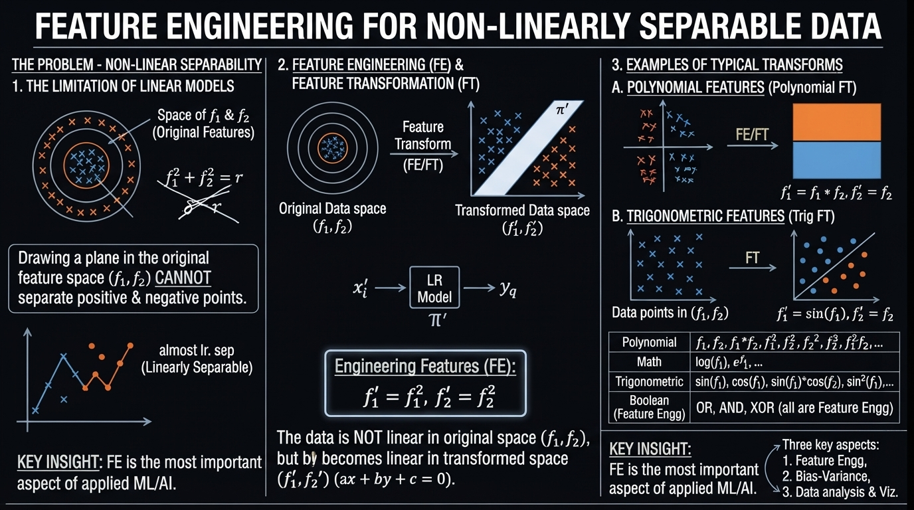  
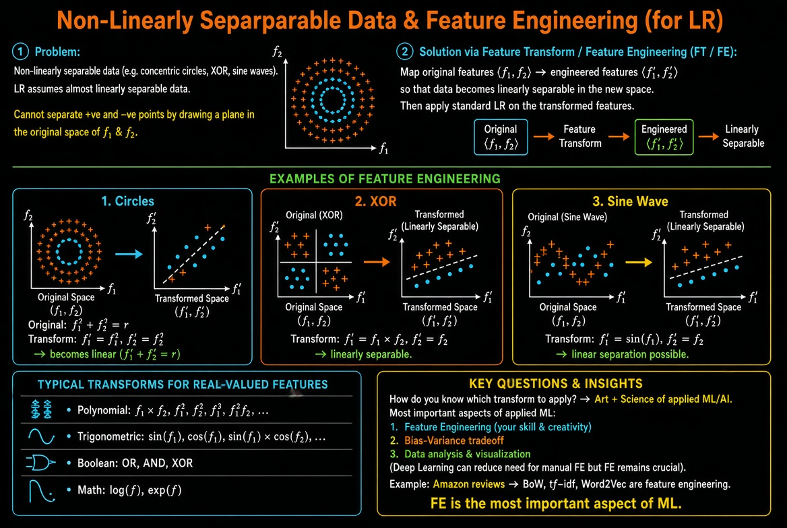

> **`Non-linearly Separable Data`**

Logistic Regression assumes the data is **almost linearly separable**.

### Can we use Logistic Regression to separate the classes?

If the positive and negative points form concentric circles (or any non-linear pattern) in the space of $f_1$ and $f_2$, then **drawing a plane** in that space **cannot** separate the two classes.

### Solution: Feature Transformation / Feature Engineering (FT / FE)

**Original features:** $\mathbf{x}_i = \langle x_{i1}, x_{i2} \rangle$ (space of $f_1$ & $f_2$)

The decision boundary in original space is a circle:

$$
f_1^2 + f_2^2 = \gamma
$$

**Transform the features:**

$$
\begin{align*}
f_1' &= f_1^2 \\
f_2' &= f_2^2
\end{align*}
$$

Now in the new space of $f_1'$ and $f_2'$ the same boundary becomes

$$
f_1' + f_2' = \gamma
$$

which is a **straight line** (linearly separable).  
We can now apply ordinary Logistic Regression in the transformed space.

**Pipeline for a query point:**

$$
\mathbf{x}_q = \langle x_{q1}, x_{q2} \rangle 
\xrightarrow{\text{FT / FE}} 
\mathbf{x}_q' = \langle x_{q1}^2,\ x_{q2}^2 \rangle 
\xrightarrow{\text{LR model}} 
y_q
$$

### How do we know which transform to apply?

This is one of the **most important aspects of applied ML / AI**:

1. **Feature Engineering** (your skill + creativity)
2. Bias-Variance trade-off
3. Data Analysis & Visualization

Only 2–3 techniques are usually needed; Deep Learning is **not** always required.

### More Examples

**1. XOR problem** (classic non-linearly separable case)

Original space of $f_1, f_2$ is not linearly separable.  
After the transform

$$
\begin{align*}
f_1' &= f_1 \times f_2 \\
f_2' &= f_2
\end{align*}
$$

the classes become linearly separable.

**2. Sinusoidal pattern**

When the decision boundary looks like a sine wave, use

$$
\begin{align*}
f_1' &= \sin(f_1) \\
f_2' &= f_2
\end{align*}
$$

### Typical Transforms for Real-valued Features

1. **Polynomial features**  
   $f_1 f_2,\ f_1^2,\ f_2^2,\ f_1^3,\ f_2^3,\ f_1^2 f_2,\ \dots$

2. **Trigonometric**  
   $\sin(f_1),\ \cos(f_1),\ \sin(f_1)\cos(f_2),\ (\sin(f_1))^2,\ \dots$

3. **Boolean feature engineering**  
   OR, AND, XOR combinations

(Also useful: $\log(f_i),\ e^{f_i}$, etc.)

**Example from practice:**  
Amazon reviews dataset → BoW, tf-idf, Word2Vec are all forms of feature engineering.

> **Feature Engineering is the most important aspect of Machine Learning.**

## 17. Code Sample: Logistic Regression, GridSearchCV, RandomSearchCV

> ### [`LogisticRegression.ipynb`](./LogisticRegression.ipynb)

## 18. Assignment-5: Apply Logistic Regression

## 19. Extensions to Generalized Linear Models

Refer to Part III 
> ### [`Generalized Linear Models.pdf`](./assets/cs229-notes1.pdf)

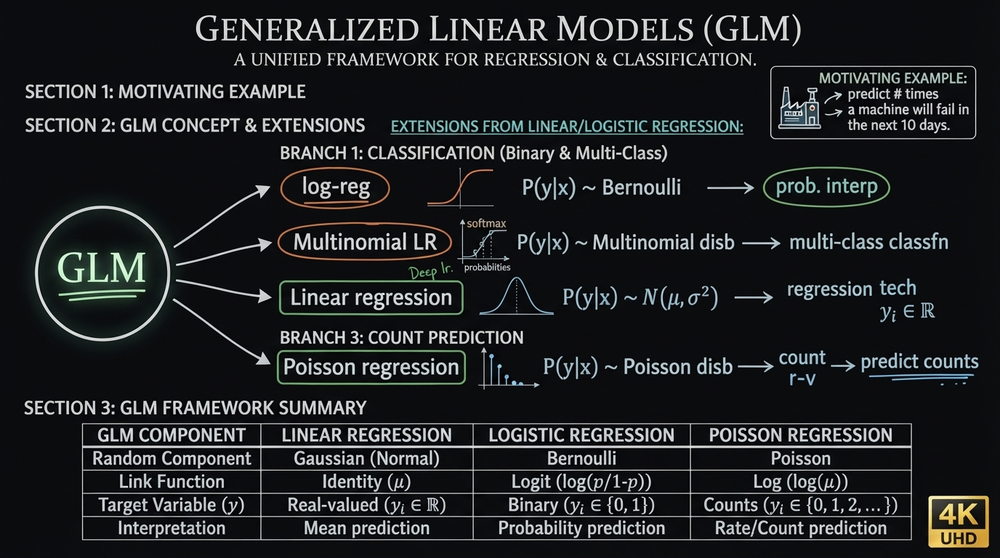  
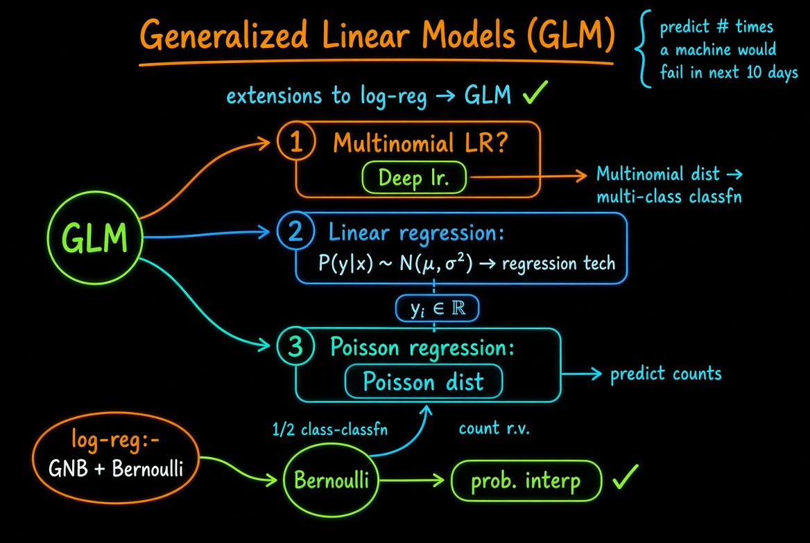

> **`Generalized Linear Models (GLM)`**

Logistic Regression is a special case of a much broader family called **Generalized Linear Models (GLM)**.

### Logistic Regression (recap)
- Binary classification
- Logistic Regression = Gaussian Naive Bayes + **Bernoulli**
- Probabilistic interpretation

### Extensions of Logistic Regression → GLM

GLM lets us change the distribution of the target variable while keeping the linear structure.

1. **Multinomial Logistic Regression**
   - Uses **Multinomial** distribution
   - Used for **multi-class classification**
   - Leads into Deep Learning (Softmax Classifier, etc.)

2. **Linear Regression**
   - Assumes $P(y \mid \mathbf{x}) \sim \mathcal{N}(\mu, \sigma^2)$
   - Target $y_i \in \mathbb{R}$
   - Classic regression technique

3. **Poisson Regression**
   - Uses **Poisson** distribution
   - Used when the target is a **count** random variable
   - Example: Predict the number of times a machine will fail in the next 60 days

### Summary

| Model                      | Distribution of $y$ | Task                        |
|---------------------------|---------------------|-----------------------------|
| Logistic Regression       | Bernoulli           | Binary classification       |
| Multinomial LR            | Multinomial         | Multi-class classification  |
| Linear Regression         | Gaussian            | Real-valued regression      |
| Poisson Regression        | Poisson             | Count data prediction       |

All of these are members of the **Generalized Linear Models** family.