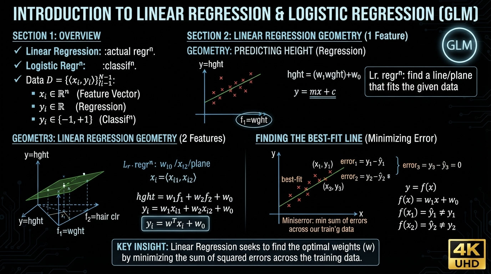
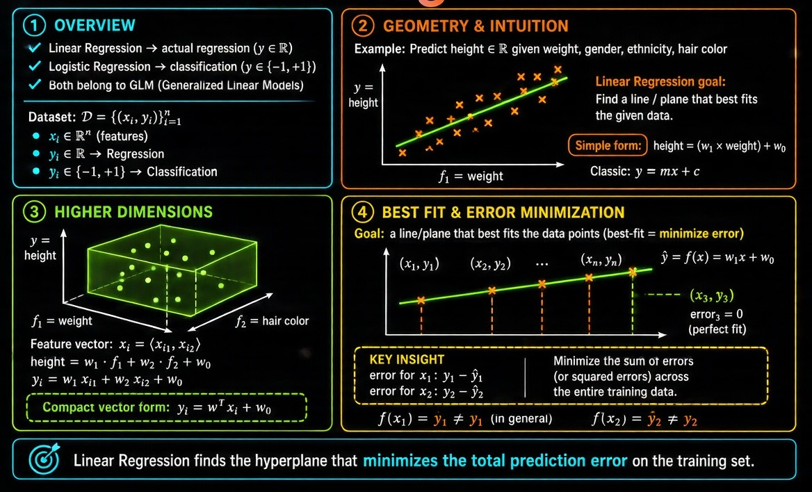
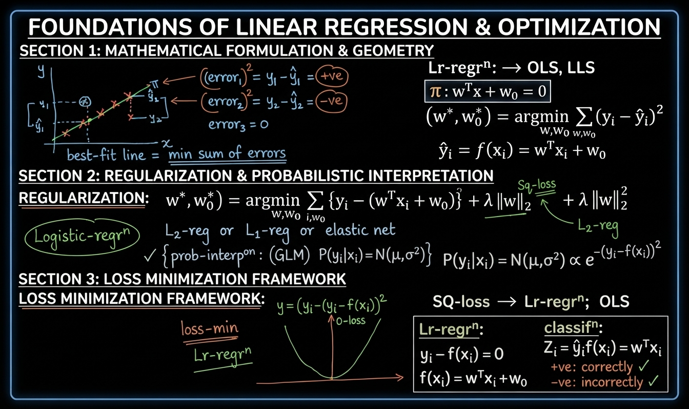
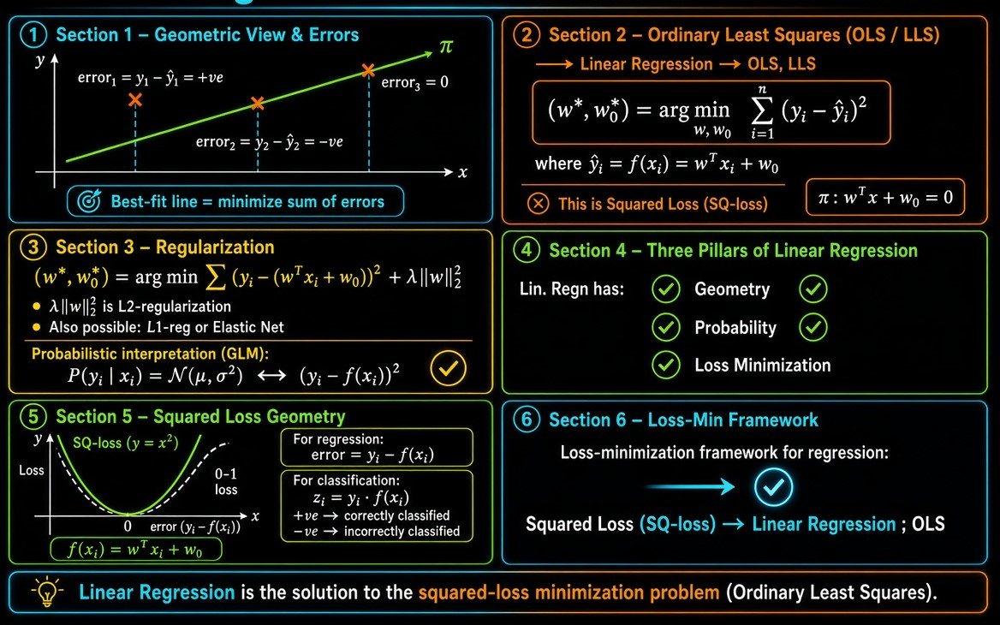
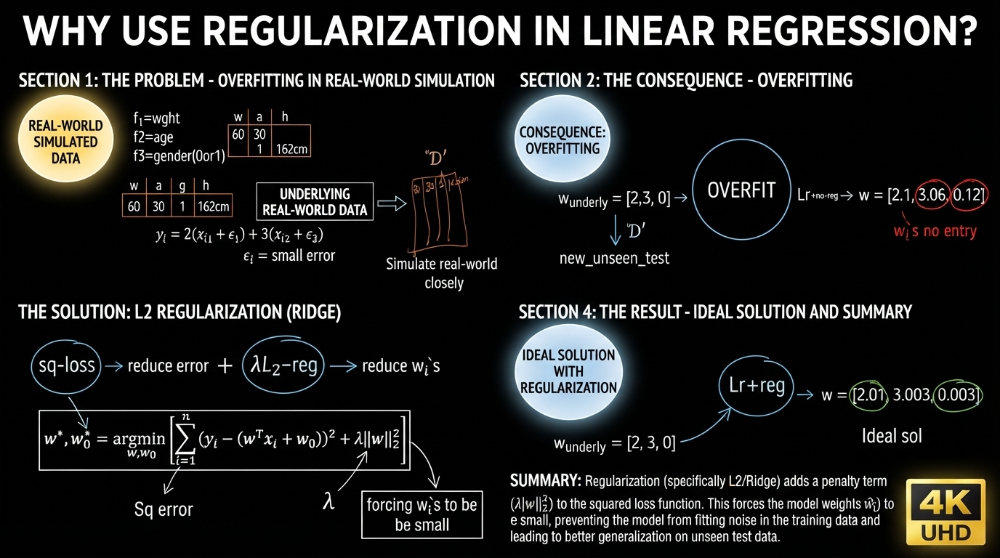
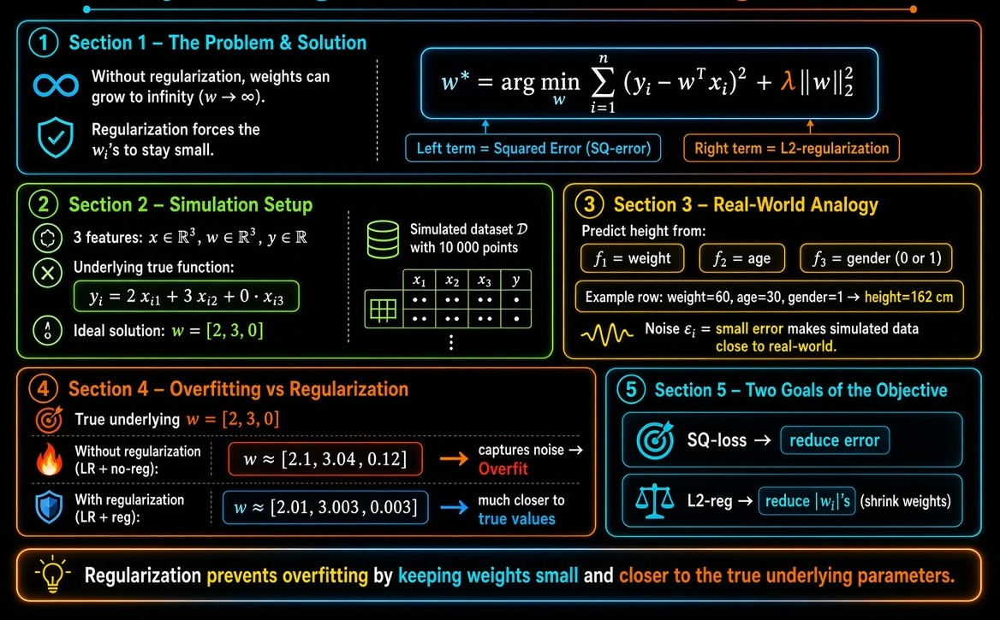
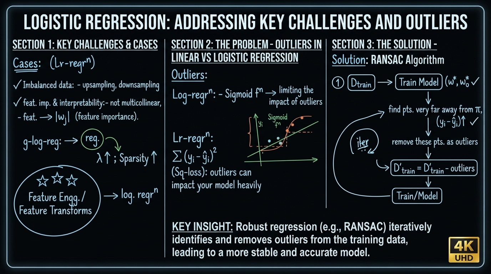
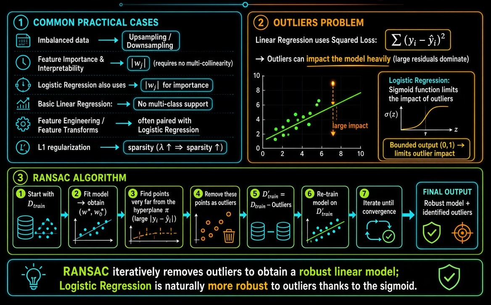

# Linear Regression

## Table of Contents

[01. Geometric Intuition of Linear Regression](#01-geometric-intuition-of-linear-regression)

[02. Mathematical Formulation](#02-mathematical-formulation)

[03. Need for Regularization in Linear Regression](#03-need-for-regularization-in-linear-regression)

[04. Real-World Cases](#04-real-world-cases)

[05. Code Sample for Linear Regression](#05-code-sample-for-linear-regression)

# Linear Regression

## 01. Geometric Intuition of Linear Regression

> **Linear Regression**

- Linear Regression → **actual regression**
- Logistic Regression → classification

Both belong to the family of **Generalized Linear Models (GLM)**.

Dataset:

$$
\mathcal{D} = \{(\mathbf{x}_i, y_i)\}_{i=1}^n
$$

- $\mathbf{x}_i \in \mathbb{R}^d$
- For **regression**: $y_i \in \mathbb{R}$
- For **classification**: $y_i \in \{-1, +1\}$

### Geometry of Linear Regression

**Example:** Predict height ($y \in \mathbb{R}$) given weight, gender, ethnicity, hair color, etc.

Linear Regression finds a **line / plane** that best fits the given data.

In 1-D (only weight as feature):

$$
\text{height} = w_1 \cdot \text{weight} + w_0
$$

which is the familiar equation of a straight line:

$$
y = mx + c
$$

In 2-D (weight and hair color):

$$
\mathbf{x}_i = \langle x_{i1}, x_{i2} \rangle
$$

$$
\text{height} = w_1 f_1 + w_2 f_2 + w_0
$$

$$
y_i = w_1 x_{i1} + w_2 x_{i2} + w_0
$$

In vector form:

$$
y_i = \mathbf{w}^\top \mathbf{x}_i + w_0
$$

### Goal

Find a line / plane that **best fits** the data points.

“Best fit” means **minimize the error**.

For a point $(x_1, y_1)$:

- Predicted value: $\hat{y}_1 = f(x_1) = w_1 x_1 + w_0$
- Error: $y_1 - \hat{y}_1$

We want to **minimize the sum of errors** across all training points.

## 02. Mathematical Formulation

> **Mathematical Formulation of Linear Regression**

Errors can be positive or negative:

- $\text{error}_1 = y_1 - \hat{y}_1 = +ve$
- $\text{error}_2 = y_2 - \hat{y}_2 = -ve$
- $\text{error}_3 = 0$ (point lies on the line)

Best-fit line = minimize the **sum of errors**.

### Ordinary Least Squares (OLS) / Linear Least Squares (LLS)

Linear Regression is also called **OLS** or **LLS**.

The hyperplane is:

$$
\pi:\ \mathbf{w}^\top \mathbf{x} + w_0 = 0
$$

**Optimization problem:**

$$
(\mathbf{w}^*, w_0^*) = \arg\min_{\mathbf{w}, w_0} \sum_{i=1}^{n} (y_i - \hat{y}_i)^2
$$

where

$$
\hat{y}_i = f(\mathbf{x}_i) = \mathbf{w}^\top \mathbf{x}_i + w_0
$$

This is the **squared loss** (Sq-loss).

Expanded form:

$$
(\mathbf{w}^*, w_0^*) = \arg\min_{\mathbf{w}, w_0} \sum_{i=1}^{n} \Big\{ y_i - (\mathbf{w}^\top \mathbf{x}_i + w_0) \Big\}^2
$$

### Regularization

Just like Logistic Regression, we can add regularization:

$$
(\mathbf{w}^*, w_0^*) = \arg\min_{\mathbf{w}, w_0} \sum_{i=1}^{n} \Big\{ y_i - (\mathbf{w}^\top \mathbf{x}_i + w_0) \Big\}^2 + \lambda \|\mathbf{w}\|_2^2
$$

- L2-regularization is the most common.
- We can also use L1-regularization or Elastic-Net (same as in Logistic Regression).

### Probabilistic Interpretation (GLM)

Linear Regression assumes:

$$
P(y_i \mid \mathbf{x}_i) = \mathcal{N}(\mu, \sigma^2)
$$

The squared loss term $(y_i - f(\mathbf{x}_i))^2$ comes naturally from the Gaussian assumption.

### Three Interpretations of Linear Regression

Same as Logistic Regression:

1. **Geometric** interpretation
2. **Probabilistic** interpretation (GLM)
3. **Loss-minimization** interpretation

### Loss-Minimization View

- Squared loss $\rightarrow$ parabola ($y = x^2$)
- 0-1 loss is for classification; squared loss is for regression.

For regression the residual is:

$$
y_i - f(\mathbf{x}_i)
$$

For classification we used:

$$
z_i = y_i \cdot f(\mathbf{x}_i)
$$

**Summary of Loss-Min Framework for Regression**

$$
\text{Squared Loss} \;\longrightarrow\; \text{Linear Regression (OLS)}
$$

## 03. Need for Regularization in Linear Regression

> **Why use Regularization in Linear Regression?**

The regularized objective is:

$$
\mathbf{w}^* = \arg\min_{\mathbf{w}} \sum_{i=1}^{n} \big(y_i - \mathbf{w}^\top \mathbf{x}_i\big)^2 + \lambda \|\mathbf{w}\|_2^2
$$

- First term → Squared error (wants to fit the data)
- Second term → L2-regularization (forces the $w_i$’s to be **small**)

Without regularization, weights can become very large ($\mathbf{w} \to \infty$).

### Simulation Example

Suppose the true underlying relationship uses only 2 features:

$$
y_i = 2x_{i1} + 3x_{i2} + 0\cdot x_{i3}
$$

Ideal solution:

$$
\mathbf{w} = [2,\ 3,\ 0]
$$

We generate a simulated dataset $\mathcal{D}$ with 10 000 points and 3 features.

**Real-world analogy**

- $y$ = height
- $f_1$ = weight
- $f_2$ = age
- $f_3$ = gender (0 or 1)

In real data there is always small noise $\varepsilon_i$:

$$
y_i = 2x_{i1} + 3x_{i2} + 0\cdot x_{i3} + \varepsilon_i
$$

### What happens when we train

**Without regularization (Linear Regression + no-reg):**

$$
\mathbf{w} \approx [2.1,\ 3.06,\ 0.12]
$$

The model tries to fit the noise and gives a non-zero weight to the irrelevant feature → **overfitting**.

**With regularization (Linear Regression + reg):**

$$
\mathbf{w} \approx [2.01,\ 3.003,\ 0.003]
$$

The weights stay very close to the true underlying values $[2,\ 3,\ 0]$.

### Summary

- Squared loss → tries to **reduce error**
- L2-regularization → tries to **reduce the $w_i$’s**

Regularization prevents the model from fitting noise and keeps the weights small, which improves generalization to unseen test data.

## 04. Real-World Cases

> **Cases for Linear Regression**

### Imbalanced Data
- Same as Logistic Regression → use **Upsampling** or **Downsampling**

### Feature Importance & Interpretability
- Same condition as Logistic Regression: features should **not** be multicollinear
- Feature importance comes from $|w_j|$
- Regularization:
  - L1-regularization → sparsity
  - As $\lambda$ increases → sparsity increases

### Multi-class
- Linear Regression has **no direct multi-class** capability (unlike Logistic Regression)

### Feature Engineering / Feature Transforms
- Extremely important (same as in Logistic Regression)
- After good feature transforms we can apply Linear Regression

### Outliers

**Logistic Regression**  
- Sigmoid function limits the impact of outliers

**Linear Regression**  
- Uses **Squared Loss**:
  $$
  \sum_{i=1}^{n} (y_i - \hat{y}_i)^2
  $$
- Outliers can impact the model **heavily** (large residuals get squared)

### Handling Outliers in Linear Regression → RANSAC

1. Train on $D_{\text{train}}$ → obtain $\mathbf{w}^*, w_0^*$
2. Find points that are very far away from the hyperplane $\pi$  
   (i.e., points with large $|y_i - \hat{y}_i|$)
3. Remove these points as outliers
4. Form cleaned dataset:
   $$
   D'_{\text{train}} = D_{\text{train}} - \text{Outliers}
   $$
5. Retrain the model on $D'_{\text{train}}$
6. Iterate if needed

This procedure is known as **RANSAC** (Random Sample Consensus).

## 05. Code Sample for Linear Regression

> ### [`LinearRegression.ipynb`](./LinearRegression.ipynb)
