

# Solving Optimization Problems

# Optimization & Gradient Descent

## Table of Contents

[01. Differentiation](#01-differentiation)

[02. Online Differentiation Tools](#02-online-differentiation-tools)

[03. Maxima and Minima](#03-maxima-and-minima)

[04. Vector Calculus Grad](#04-vector-calculus-grad)

[05. Gradient Descent Geometric Intuition](#05-gradient-descent-geometric-intuition)

[06. Learning Rate](#06-learning-rate)

[07. Gradient Descent for Linear Regression](#07-gradient-descent-for-linear-regression)

[08. SGD Algorithm](#08-sgd-algorithm)

[09. Constrained Optimization & PCA](#09-constrained-optimization-pca)

[10. Logistic Regression Formulation Revisited](#10-logistic-regression-formulation-revisited)

[11. Why L1 Regularization Creates Sparsity](#11-why-l1-regularization-creates-sparsity)

[12. Assignment 6: Implement SGD for Linear Regression](#12-assignment-6-implement-sgd-for-linear-regression)

[13. Revision Questions](#13-revision-questions)

# Optimization & Gradient Descent

## 01. Differentiation

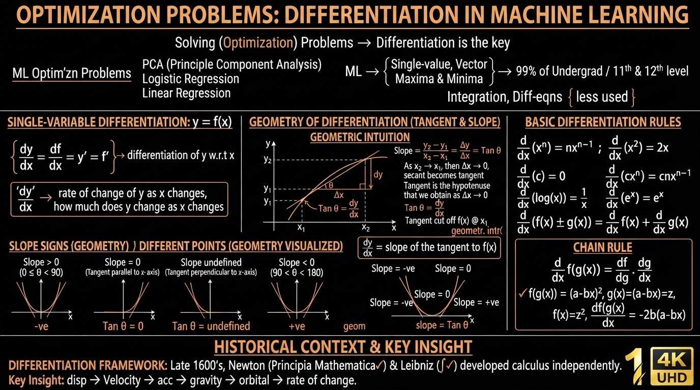

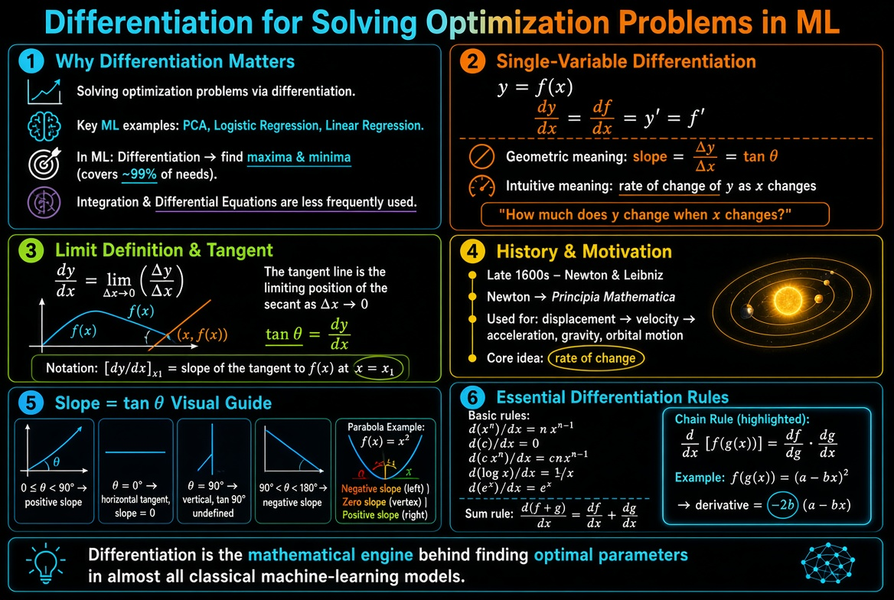

**Solving Optimization Problems: Differentiation**

Many core ML algorithms are optimization problems:

- PCA
- Logistic Regression
- Linear Regression

In Machine Learning we mainly use:

- Differentiation (single-variable and vector)
- Finding maxima and minima

(11th & 12th standard + undergraduate calculus covers ~99% of what we need)

Integration and differential equations are used much less frequently.

### Single-Variable Differentiation

Given $y = f(x)$

$$
\frac{dy}{dx} = \frac{df}{dx} = y' = f'
$$

This is the differentiation of $y$ with respect to $x$.

**Intuitive meaning:**

$$
\frac{dy}{dx} = \text{rate of change of } y \text{ as } x \text{ changes}
$$

(How much does $y$ change when $x$ changes)

### Geometric Interpretation

$$
\frac{dy}{dx} = \lim_{\Delta x \to 0} \frac{\Delta y}{\Delta x}
$$

- The tangent is the line we obtain as $\Delta x \to 0$
- $\tan\theta = \dfrac{dy}{dx}$

As $x_2 \to x_1$, we have $\Delta x \to 0$, and

$$
\frac{\Delta y}{\Delta x} \to \frac{dy}{dx}
$$

**Important statements:**

- $\dfrac{dy}{dx}$ = slope of the tangent to $f(x)$
- $\left.\dfrac{dy}{dx}\right|_{x_1}$ = slope of the tangent to $f(x)$ at $x = x_1$

### Historical Note

Differentiation was developed in the late 1600s by:

- **Newton** → _Principia Mathematica_
- **Leibniz**

Originally used for displacement, velocity, acceleration, gravity, orbital motion (rate of change).

### Geometric Meaning of Slope ($\tan\theta$)

- $0 \leq \theta < 90^\circ$ → positive slope
- $\theta = 0$ (tangent parallel to x-axis) → $\tan\theta = 0$
- $\theta = 90^\circ$ → $\tan 90^\circ$ is undefined
- $90^\circ < \theta < 180^\circ$ → negative slope

### Basic Differentiation Rules

$$
\begin{align*}
\frac{d}{dx}(x^n) &= n x^{n-1} \\
\frac{d}{dx}(x^2) &= 2x \\
\frac{d}{dx}(3x) &= 3 \\
\frac{d}{dx}(c) &= 0 \\
\frac{d}{dx}(c x^n) &= c\, n x^{n-1} \\
\frac{d}{dx}\log(x) &= \frac{1}{x} \\
\frac{d}{dx}e^x &= e^x \\
\frac{d}{dx}\big(f(x) + g(x)\big) &= \frac{d}{dx}f(x) + \frac{d}{dx}g(x)
\end{align*}
$$

### Chain Rule

$$
\frac{d}{dx}f\big(g(x)\big) = \frac{df}{dg} \cdot \frac{dg}{dx}
$$

**Example:**

Let $f(g(x)) = (a - bx)^2$

- Let $g(x) = a - bx = z$
- $f(z) = z^2$

Then

$$
\frac{d}{dx}f(g(x)) = \frac{df}{dg} \cdot \frac{dg}{dx} = 2(a - bx) \cdot (-b) = -2b(a - bx)
$$

## 02. Online Differentiation Tools

> **`Watch Lecture Video`**

## 03. Maxima and Minima

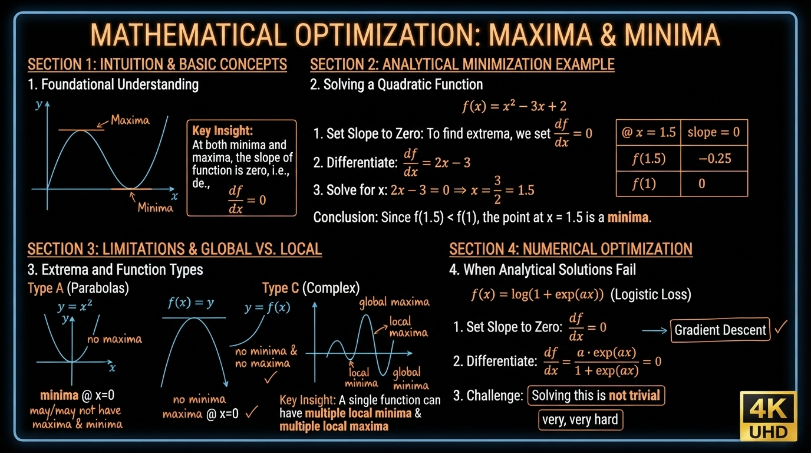

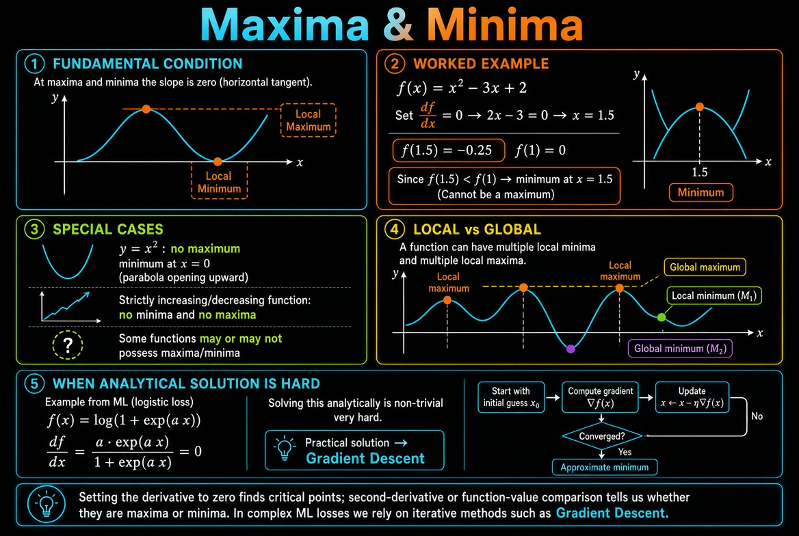

> **Maxima & Minima**

At both maxima and minima the **slope = 0**.

### Finding Maxima / Minima

Set the derivative to zero:

$$
\frac{df}{dx} = 0 \quad \Rightarrow \quad \text{slope} = 0
$$

**Example:**

$$
f(x) = x^2 - 3x + 2
$$

$$
\frac{df}{dx} = 2x - 3 = 0 \quad \Rightarrow \quad x = \frac{3}{2} = 1.5
$$

At $x = 1.5$, slope = 0.

Check values:

- $f(1.5) = -0.25$
- $f(1) = 0$

Since $f(1.5) < f(1)$, the point $x = 1.5$ is a **minimum**.

### Important Observations

- A function **may or may not** have maxima and minima.
- Example $y = x^2$:
  - No maxima
  - Minima at $x = 0$

- Some functions have **neither** minima nor maxima (strictly increasing/decreasing curves).

### Global vs Local

A function can have:

- Multiple **local minima**
- Multiple **local maxima**
- One **global minimum**
- One **global maximum**

### Connection to Machine Learning

Many loss functions (e.g. logistic loss) look like:

$$
f(x) = \log\big(1 + \exp(ax)\big)
$$

Setting the derivative to zero:

$$
\frac{df}{dx} = \frac{a\exp(ax)}{1 + \exp(ax)} = 0
$$

Solving this analytically is **not trivial** (very hard).

Therefore in practice we use:

$$
\frac{df}{dx} = 0 \quad \xrightarrow{\text{solved by}} \quad \textbf{Gradient Descent}
$$

## 04. Vector Calculus Grad

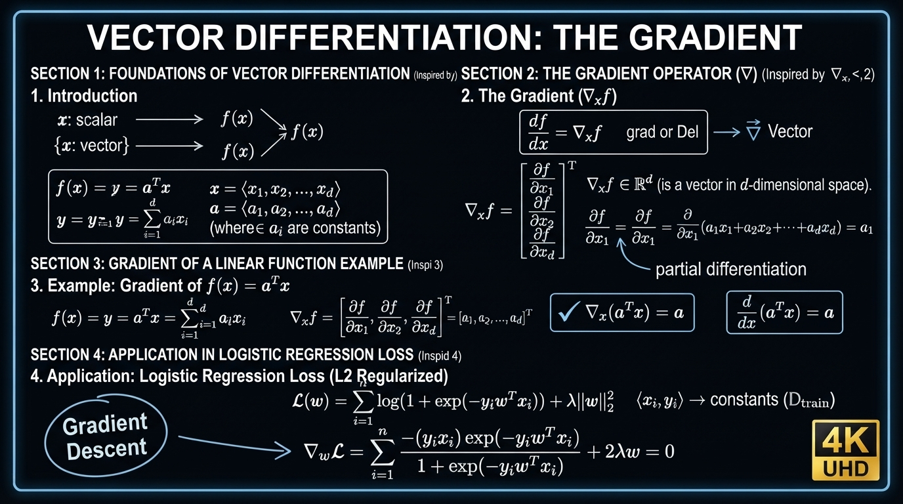

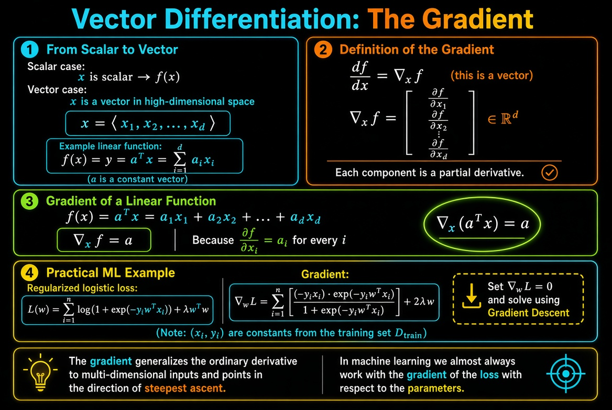

> **Vector Differentiation: Gradient**

So far we treated $x$ as a **scalar**.

In high-dimensional space $x$ is a **vector**:

$$
\mathbf{x} = \langle x_1, x_2, \dots, x_d \rangle
$$

Example linear function:

$$
f(\mathbf{x}) = y = \mathbf{a}^\top \mathbf{x} = \sum_{i=1}^{d} a_i x_i
$$

where $\mathbf{a} = \langle a_1, a_2, \dots, a_d \rangle$ are constants.

### Definition of Gradient

When $\mathbf{x}$ is a vector, the derivative becomes the **gradient**:

$$
\frac{df}{d\mathbf{x}} = \nabla_{\mathbf{x}} f
$$

The gradient is itself a vector in $\mathbb{R}^d$:

$$
\nabla_{\mathbf{x}} f =
\begin{bmatrix}
\dfrac{\partial f}{\partial x_1} \\
\dfrac{\partial f}{\partial x_2} \\
\vdots \\
\dfrac{\partial f}{\partial x_d}
\end{bmatrix}
\in \mathbb{R}^d
$$

Each component is a **partial derivative**.

### Important Result

For the linear function $f(\mathbf{x}) = \mathbf{a}^\top \mathbf{x}$:

$$
\nabla_{\mathbf{x}} (\mathbf{a}^\top \mathbf{x}) = \mathbf{a}
$$

(Compare with the scalar case: $\dfrac{d}{dx}(ax) = a$)

### Application to Logistic Regression Loss

The regularized logistic loss is:

$$
\mathcal{L}(\mathbf{w}) = \sum_{i=1}^{n} \log\Big(1 + \exp(-y_i \mathbf{w}^\top \mathbf{x}_i)\Big) + \lambda \mathbf{w}^\top \mathbf{w}
$$

Here $\langle \mathbf{x}_i, y_i \rangle$ are constants (training data).

Taking the gradient with respect to $\mathbf{w}$ and setting it to zero:

$$
\nabla_{\mathbf{w}} \mathcal{L} =
\frac{(-y_i \mathbf{x}_i)\exp(-y_i \mathbf{w}^\top \mathbf{x}_i)}{1 + \exp(-y_i \mathbf{w}^\top \mathbf{x}_i)}
+ 2\lambda \mathbf{w}
= \mathbf{0}
$$

Solving $\nabla_{\mathbf{w}} \mathcal{L} = \mathbf{0}$ analytically is hard → we use **Gradient Descent**.

## 05. Gradient Descent Geometric Intuition

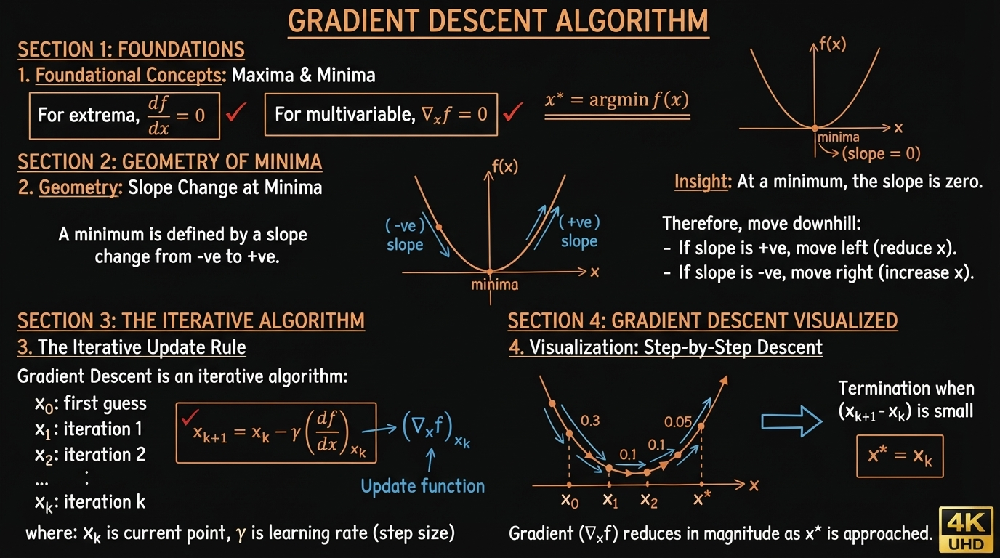

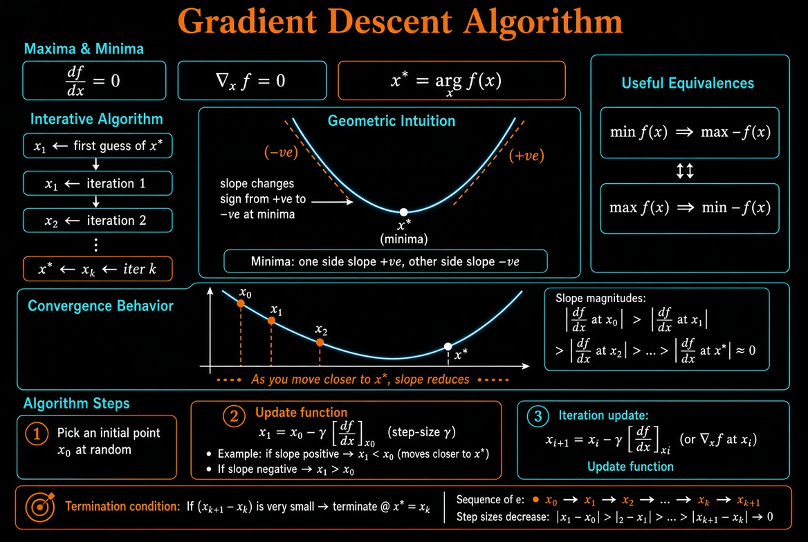

> **Gradient Descent Algorithm**

We want to solve:

$$
\mathbf{x}^* = \arg\min_{\mathbf{x}} f(\mathbf{x})
$$

At maxima and minima we have:

$$
\frac{df}{dx} = 0 \qquad \text{or} \qquad \nabla_{\mathbf{x}} f = \mathbf{0}
$$

Gradient Descent is an **iterative algorithm**:

- Start with an initial guess $x_0$
- Produce $x_1$ (iteration 1)
- Produce $x_2$ (iteration 2)
- …
- After $K$ iterations we get $x_K \approx x^*$

### Geometric Intuition

At a minimum the slope changes sign (from negative to positive).

- One side of the minimum → slope is negative
- Other side of the minimum → slope is positive

Also note the useful identities:

$$
\min f(x) \;=\; \max \big(-f(x)\big)
$$

$$
\max f(x) \;=\; \min \big(-f(x)\big)
$$

As we move closer to $x^*$, the **slope reduces**.

### Gradient Descent Update Rule

1. Pick an initial point $x_0$ (usually at random)

2. Update:

$$
x_1 = x_0 - \gamma \left.\frac{df}{dx}\right|_{x_0}
$$

where $\gamma$ is the **step-size** (learning rate).

**Case when slope is positive** (point is to the right of the minimum):

$$
x_1 = x_0 - \gamma \cdot (+ve) \quad \Rightarrow \quad x_1 < x_0
$$

→ we move left, closer to $x^*$.

**Case when slope is negative** (point is to the left of the minimum):

$$
x_1 = x_0 - \gamma \cdot (-ve) \quad \Rightarrow \quad x_1 > x_0
$$

→ we move right, closer to $x^*$.

3. General iterative update:

$$
x_{i+1} = x_i - \gamma \left.\frac{df}{dx}\right|_{x_i}
$$

(or in vector form using the gradient $\nabla_{\mathbf{x}} f$)

### Termination

Keep iterating:

$$
x_0,\; x_1,\; x_2,\; \dots,\; x_k,\; x_{k+1}
$$

If the change $(x_{k+1} - x_k)$ becomes very small, stop and declare:

$$
x^* = x_k
$$

## 06. Learning Rate

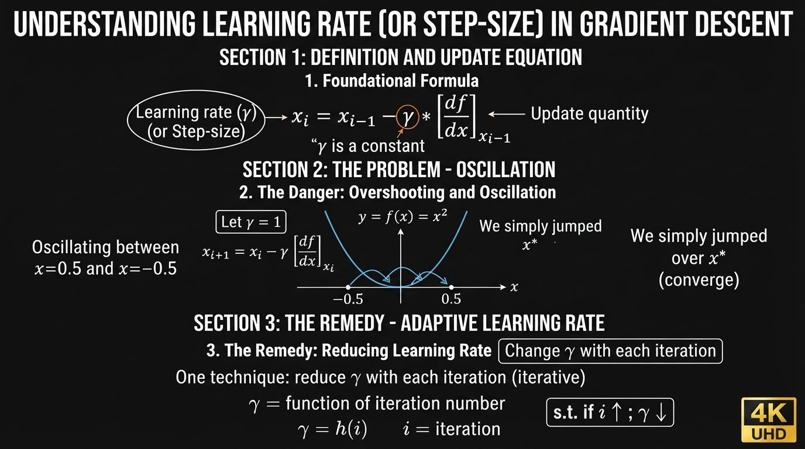

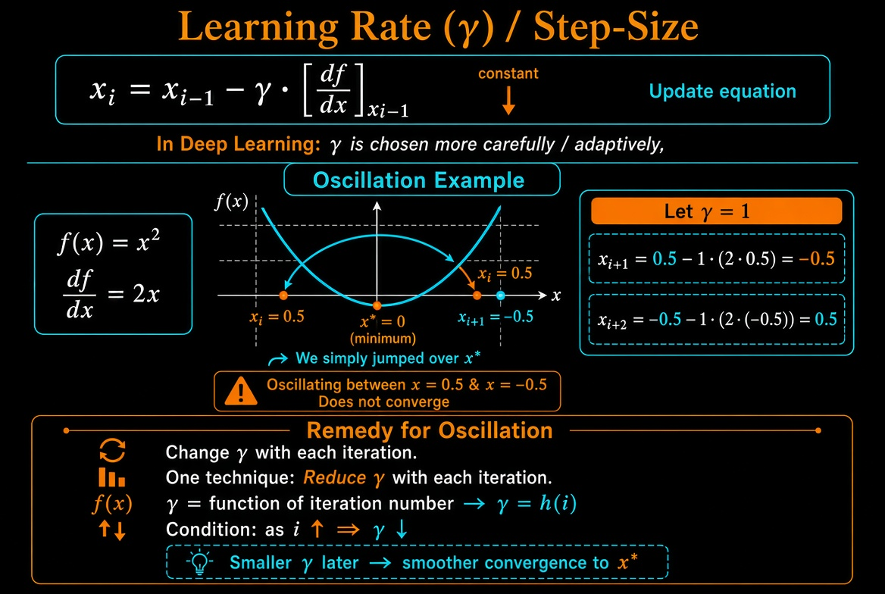

> **Learning Rate (or) Step-size ($\gamma$)**

In the Gradient Descent update equation:

$$
x_i = x_{i-1} - \gamma \left.\frac{df}{dx}\right|_{x_{i-1}}
$$

$\gamma$ is a **constant** called the learning rate (or step-size).

In Deep Learning we choose $\gamma$ more carefully / effectively.

### Problem of Oscillation (when $\gamma$ is too large)

Take the simple function $f(x) = x^2$.

$$
\frac{df}{dx} = 2x
$$

Let $\gamma = 1$ and start at $x_i = 0.5$:

$$
\begin{align*}
x_{i+1} &= 0.5 - 1 \cdot (2 \times 0.5) = 0.5 - 1 = -0.5 \\
x_{i+2} &= -0.5 - 1 \cdot (2 \times (-0.5)) = -0.5 - 1 \cdot (-1) = 0.5
\end{align*}
$$

The algorithm keeps oscillating between $x = 0.5$ and $x = -0.5$ and **never converges** to $x^* = 0$.  
We simply jumped over the minimum.

### Remedy for Oscillation

**Change $\gamma$ with each iteration.**

One common technique: **reduce $\gamma$ with each iteration**.

$$
\gamma = h(i)
$$

where $i$ is the iteration number.

As the iteration number increases ($i \uparrow$), the learning rate decreases ($\gamma \downarrow$).

## 07. Gradient Descent for Linear Regression

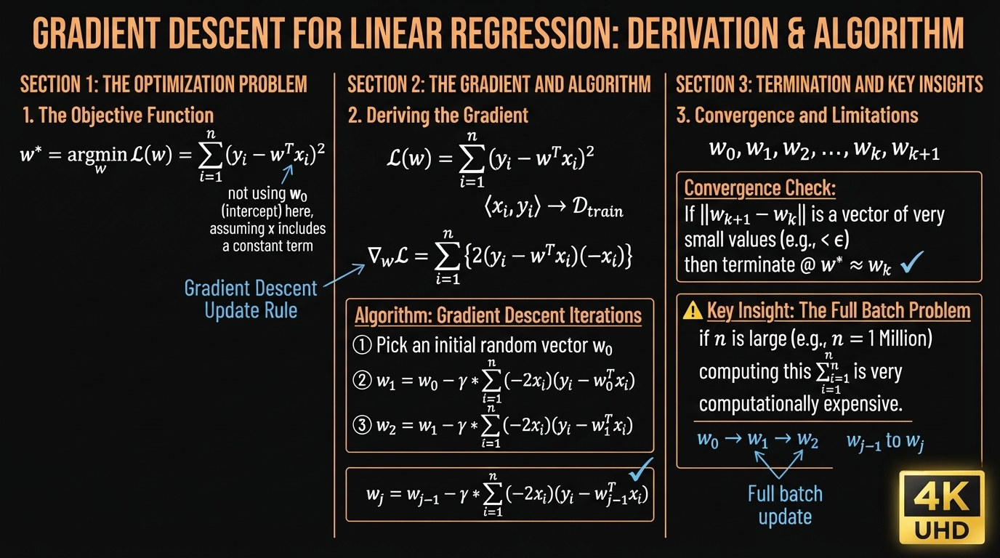

> **Gradient Descent for Linear Regression**

We want to solve (no regularization, and ignoring the intercept $w_0$ for simplicity):

$$
\mathbf{w}^* = \arg\min_{\mathbf{w}} \sum_{i=1}^{n} \big(y_i - \mathbf{w}^\top \mathbf{x}_i\big)^2
$$

### Loss and Gradient

$$
\mathcal{L}(\mathbf{w}) = \sum_{i=1}^{n} \big(y_i - \mathbf{w}^\top \mathbf{x}_i\big)^2
$$

$$
\nabla_{\mathbf{w}} \mathcal{L} = \sum_{i=1}^{n} \Big\{ 2\big(y_i - \mathbf{w}^\top \mathbf{x}_i\big)(-\mathbf{x}_i) \Big\}
$$

### Gradient Descent Steps

1. Pick a random vector $\mathbf{w}_0 = \langle \dots \rangle$

2. Update:

$$
\mathbf{w}_1 = \mathbf{w}_0 - \gamma \sum_{i=1}^{n} (-2\mathbf{x}_i)\big(y_i - \mathbf{w}_0^\top \mathbf{x}_i\big)
$$

3. Next iteration:

$$
\mathbf{w}_2 = \mathbf{w}_1 - \gamma \sum_{i=1}^{n} (-2\mathbf{x}_i)\big(y_i - \mathbf{w}_1^\top \mathbf{x}_i\big)
$$

Continue:

$$
\mathbf{w}_0,\; \mathbf{w}_1,\; \mathbf{w}_2,\; \dots,\; \mathbf{w}_k,\; \mathbf{w}_{k+1}
$$

When $\mathbf{w}_{k+1} - \mathbf{w}_k$ becomes a vector of very small values, stop and set:

$$
\mathbf{w}^* = \mathbf{w}_k
$$

### General Update Rule

$$
\mathbf{w}_j = \mathbf{w}_{j-1} - \gamma \sum_{i=1}^{n} (-2\mathbf{x}_i)\big(y_i - \mathbf{w}_{j-1}^\top \mathbf{x}_i\big)
$$

### Problem with Batch Gradient Descent

When $n$ is large (e.g. $n = 1$ million), computing the full sum $\sum_{i=1}^{n}$ at every iteration is **very expensive**.

This is the main motivation for moving to **Stochastic Gradient Descent (SGD)**.

## 08. SGD Algorithm

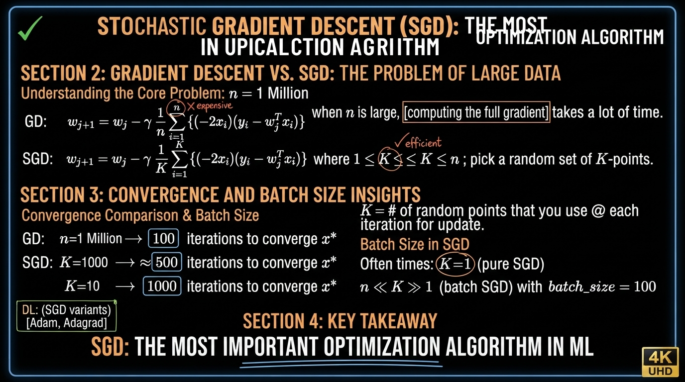

> **Stochastic Gradient Descent (SGD)**

SGD is the **most important optimization algorithm** in Machine Learning.

### Problem with Batch Gradient Descent

For Linear Regression the full (batch) update is:

$$
\mathbf{w}_{j+1} = \mathbf{w}_j - \gamma \sum_{i=1}^{n} (-2\mathbf{x}_i)\big(y_i - \mathbf{w}_j^\top \mathbf{x}_i\big)
$$

When $n$ is large (e.g. $n = 1$ million), computing the full sum at every iteration takes a lot of time.

### Stochastic Gradient Descent

Instead of using all $n$ points, we use only a small random subset of $K$ points:

$$
\mathbf{w}_{j+1} = \mathbf{w}_j - \gamma \sum_{i=1}^{K} (-2\mathbf{x}_i)\big(y_i - \mathbf{w}_j^\top \mathbf{x}_i\big)
$$

where $1 \leq K \leq n$ and we pick a **random set of $K$ points** at each iteration.

- $\mathbf{w}^*_{\text{GD}} = \mathbf{w}^*_{\text{SGD}}$ (both converge to the same solution)

### How many iterations are needed?

- Batch GD ($n = 1$ million): roughly **100 iterations** to converge to $\mathbf{x}^*$
- SGD with $K = 1000$: needs more than 100 iterations (≈ 500)
- SGD with $K = 10$: needs even more iterations (≈ 1000)

$K$ = number of random points that you use at each iteration for updating.

### Batch-size in SGD

- $K$ is called the **batch-size**
- Often $K = 1$ → pure Stochastic Gradient Descent
- When $1 < K < n$ (e.g. $K = 10$ or $K = 100$) → **Mini-batch SGD**

**SGD is the most important optimization algorithm in Machine Learning.**  
(In Deep Learning we also use improved versions such as Adam, Adagrad, etc.)

## 09. Constrained Optimization & PCA

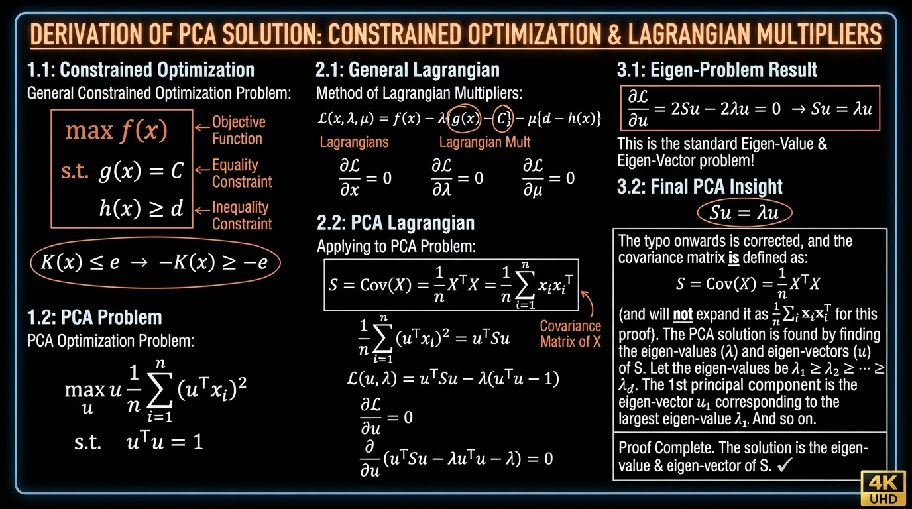

## 10. Logistic Regression Formulation Revisited

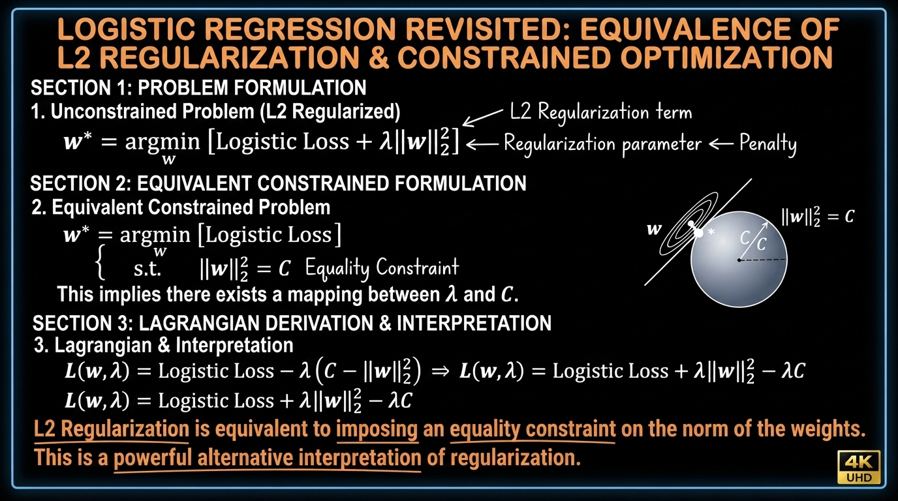

## 11. Why L1 Regularization Creates Sparsity

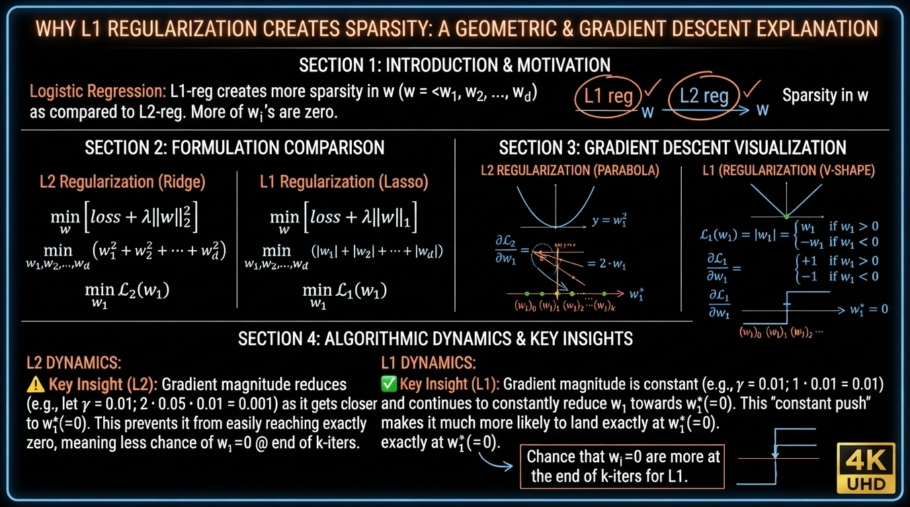

## 12. Assignment 6: Implement SGD for Linear Regression

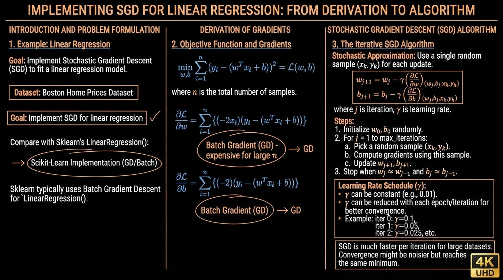

## 13. Revision Questions
